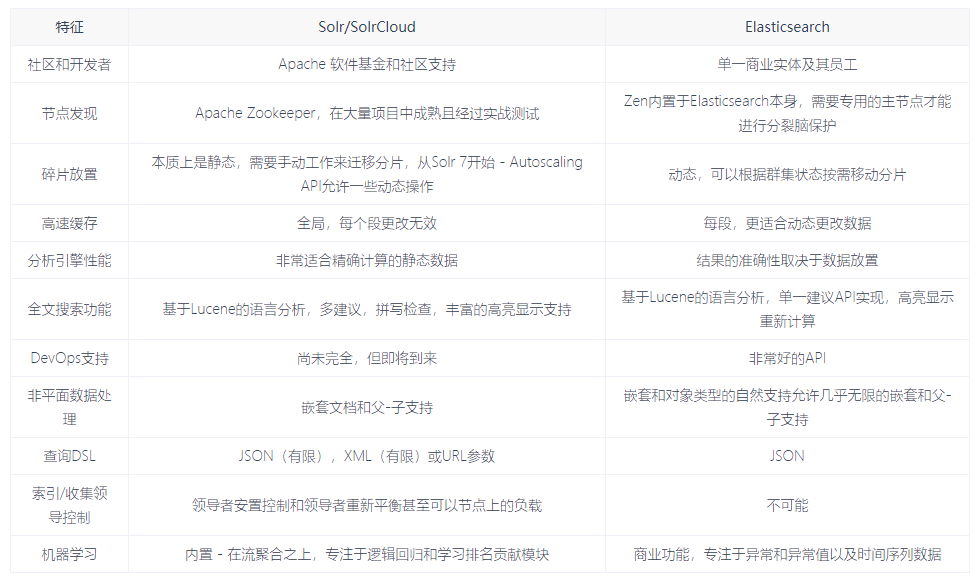
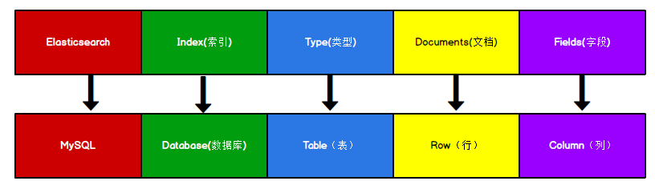

# Elasticsearch

## 概述


The Elastic Stack, 包括 Elasticsearch、Kibana、Beats 和 Logstash（也称为 ELK Stack）。能够安全可靠地获取任何来源、任何格式的数据，然后实时地对数据进行搜索、分析和可视化。Elaticsearch，简称为 ES， ES 是一个， 开源的高扩展的分布式全文搜索引擎，是整个 ElasticStack 技术栈的核心。它可以近乎实时的存储、检索数据；本身扩展性很好，可以扩展到上百台服务器，处理 PB 级别的数据


### 全文搜索引擎

Google，百度类的网站搜索，它们都是根据网页中的关键字生成索引，我们在搜索的时候输入关键字，它们会将该关键字即索引匹配到的所有网页返回；还有常见的项目中应用日志的搜索等等。对于这些非结构化的数据文本，关系型数据库搜索不是能很好的支持。

一般传统数据库，全文检索都实现的很鸡肋，因为一般也没人用数据库存文本字段。进行全文检索需要扫描整个表，如果数据量大的话即使对 SQL 的语法优化，也收效甚微。建立了索引，但是维护起来也很麻烦，对于 insert 和 update 操作都会重新构建索引。基于以上原因可以分析得出，在一些生产环境中，使用常规的搜索方式，性能是非常差的：

- 搜索的数据对象是大量的非结构化的文本数据。
- 文件记录量达到数十万或数百万个甚至更多。
- 支持大量基于交互式文本的查询。
- 需求非常灵活的全文搜索查询。
- 对高度相关的搜索结果的有特殊需求，但是没有可用的关系数据库可以满足。
- 对不同记录类型、非文本数据操作或安全事务处理的需求相对较少的情况。


为了解决结构化数据搜索和非结构化数据搜索性能问题，我们就需要专业，健壮，强大的全文搜索引擎

这里说到的全文搜索引擎指的是目前广泛应用的主流搜索引擎。

它的工作原理是计算机索引程序通过扫描文章中的每一个词，对每一个词建立一个索引，指明该词在文章中出现的次数和位置，当用户查询时，检索程序就根据事先建立的索引进行查找，并将查找的结果反馈给用户的检索方式。这个过程类似于通过字典中的检索字表查字的过程。


### Elasticsearch And Solr

Lucene 是 Apache 软件基金会 Jakarta 项目组的一个子项目，提供了一个简单却强大的应用程式接口，能够做全文索引和搜寻。在 Java 开发环境里 Lucene 是一个成熟的免费开源工具。就其本身而言，Lucene 是当前以及最近几年最受欢迎的免费 Java 信息检索程序库。
但 Lucene 只是一个提供全文搜索功能类库的核心工具包，而真正使用它还需要一个完善的服务框架搭建起来进行应用。
目前市面上流行的搜索引擎软件，主流的就两款：Elasticsearch 和 Solr,这两款都是基于 Lucene 搭建的，可以独立部署启动的搜索引擎服务软件。由于内核相同，所以两者除了服务器安装、部署、管理、集群以外，对于数据的操作 修改、添加、保存、查询等等都十分类似。

在使用过程中，一般都会将 Elasticsearch 和 Solr 这两个软件对比，然后进行选型。这两个搜索引擎都是流行的，先进的的开源搜索引擎。




### 应用

- GitHub: 2013 年初，抛弃了 Solr，采取 Elasticsearch 来做 PB 级的搜索。“GitHub 使用Elasticsearch 搜索 20TB 的数据，包括 13 亿文件和 1300 亿行代码”。
- 维基百科：启动以 Elasticsearch 为基础的核心搜索架构
- SoundCloud：“SoundCloud 使用 Elasticsearch 为 1.8 亿用户提供即时而精准的音乐搜索
  服务”。
- 百度：目前广泛使用 Elasticsearch 作为文本数据分析，采集百度所有服务器上的各类指
  标数据及用户自定义数据，通过对各种数据进行多维分析展示，辅助定位分析实例异常
  或业务层面异常。目前覆盖百度内部 20 多个业务线（包括云分析、网盟、预测、文库、
  直达号、钱包、风控等），单集群最大 100 台机器，200 个 ES 节点，每天导入 30TB+
  数据。
- 新浪：使用 Elasticsearch 分析处理 32 亿条实时日志。
- 阿里：使用 Elasticsearch 构建日志采集和分析体系。
- Stack Overflow：解决 Bug 问题的网站，全英文，编程人员交流的网站。


### 目录

| 目录    | 含义                      |
| ------- | ------------------------- |
| bin     | 可执行脚本                |
| config  | 配置                      |
| jdk     | 内置的JDK（一般用自己的） |
| lib     | 类库                      |
| logs    | 日志                      |
| modules | 模块                      |
| plugins | 插件                      |


注意：9300 端口为 Elasticsearch 集群间组件的通信端口，9200 端口为浏览器访问的 http议 协议 RESTful 端口


## 数据格式

Elasticsearch 是面向文档型数据库，一条数据在这里就是一个文档



> ES 里的 Index 可以看做一个库，而 Types 相当于表，Documents 则相当于表的行。
> 这里 Types 的概念已经被逐渐弱化，Elasticsearch 6.X 中，一个 index 下已经只能包含一个type，Elasticsearch 7.X 中, Type 的概念已经被删除了


## 索引操作

### 创建索引

向 ES 服务器发 PUT 请求 ：

```
http://127.0.0.1:9200/shopping
```

响应结果

```json
{
"acknowledged"【响应结果】: true, # true 操作成功
"shards_acknowledged"【分片结果】: true, # 分片操作成功
"index"【索引名称】: "shopping"
}
# 注意：创建索引库的分片数默认 1 片，在 7.0.0 之前的 Elasticsearch 版本中，默认 5 片
# 如果重复添加索引，会返回错误信息
```


### 查看所有索引

向 ES 服务器发 GET 请求 ：

```
http://127.0.0.1:9200/_cat/indices?v

// _cat 表示查看的意思，indices 表示索引
```


### 查看单个索引

向 ES 服务器发 GET 请求 ：

```
http://127.0.0.1:9200/shopping
```

响应结果

```json
{
    "shopping"【索引名】: {
        "aliases"【别名】: {},
        "mappings"【映射】: {},
        "settings"【设置】: {
        "index"【设置 - 索引】: {
            "creation_date"【设置 - 索引 - 创建时间】: "1614265373911",
            "number_of_shards"【设置 - 索引 - 主分片数量】: "1",
            "number_of_replicas"【设置 - 索引 - 副分片数量】: "1",
            "uuid"【设置 - 索引 - 唯一标识】: "eI5wemRERTumxGCc1bAk2A",
            "version"【设置 - 索引 - 版本】: {
            "created": "7080099"
            },
			"provided_name"【设置 - 索引 - 名称】: "shopping"
		}
	}
}
}
```


### 删除索引

向 ES 服务器发 DELETE 请求 ：

```
http://127.0.0.1:9200/shopping
```


## 文档操作

### 创建文档

向 ES 服务器发 POST 请求 ：

```
http://127.0.0.1:9200/shopping/_doc
// 需要携带json字符串的请求体
```

响应结果

```json
{
    "_index"【索引】: "shopping",
    "_type"【 类型-文档 】: "_doc",
    "_id"【唯一标识】: "Xhsa2ncBlvF_7lxyCE9G", #可以类比为 MySQL 中的主键，随机生成
    "_version"【版本】: 1,
    "result"【结果】: "created", #这里的 create 表示创建成功
    "_shards"【分片】: {
    "total"【分片 - 总数】: 2,
    "successful"【分片 - 成功】: 1,
    "failed"【分片 - 失败】: 0
},
"_seq_no": 0,
"_primary_term": 1
}
```

创建时指定唯一性标识ID：

```
http://127.0.0.1:9200/shopping/_doc/1
```

注意：如果增加数据时明确数据主键，那么请求方式也可以为 PUT


### 查看文档

向 ES 服务器发 GET 请求 ：

```
http://127.0.0.1:9200/shopping/_doc/1
```

### 修改文档

向 ES 服务器发 POST 请求 ：

```
http://127.0.0.1:9200/shopping/_doc/1
```

需要提供修改的json请求体


### 修改字段

向 ES 服务器发 POST 请求 ：

```
http://127.0.0.1:9200/shopping/_update/1
```

请求体为

```json
{
    "doc": {
        "price":3000.00
    }
}
```


### 删除文档

删除一个文档不会立即从磁盘上移除，它只是被标记成已删除（逻辑删除）。

向 ES 服务器发 DELETE 请求 ：

```
http://127.0.0.1:9200/shopping/_doc/1
```


### 条件删除文档

向 ES 服务器发 POST 请求 ：

```
http://127.0.0.1:9200/shopping/_delete_by_query
```

请求体

```json
{
    "query":{
        "match":{
            "price":4000.00 # 代表条件删除price为4000的文档
        }
    }
}
```


### 映射操作

向 ES 服务器发 PUT 请求 ：

```
http://127.0.0.1:9200/student/_mapping
```

请求体

```json
{
    "properties": {
        "name":{
            "type": "text",# 文档类型
            "index": true
        },
        "sex":{
            "type": "keyworld", # 关键字，必须要全部匹配
            "index": true
        },
        "age":{
            "type": "keyworld",
            "index": false # 代表不可以被查询
        }
    }
}
```


映射数据说明：

字段名：任意填写，下面指定许多属性，例如：title、subtitle、images、price

type：类型，Elasticsearch 中支持的数据类型非常丰富，说几个关键的：

String 类型，又分两种：

text：可分词

keyword：不可分词，数据会作为完整字段进行匹配

Numerical：数值类型，分两类

基本数据类型：long、integer、short、byte、double、float、half_float

浮点数的高精度类型：scaled_float

Date：日期类型

Array：数组类型

Object：对象

index：是否索引，默认为 true，也就是说你不进行任何配置，所有字段都会被索引。

true：字段会被索引，则可以用来进行搜索

false：字段不会被索引，不能用来搜索

store：是否将数据进行独立存储，默认为 false

> 原始的文本会存储在_source 里面，默认情况下其他提取出来的字段都不是独立存储
> 的，是从_source 里面提取出来的。当然你也可以独立的存储某个字段，只要设置
> "store": true 即可，获取独立存储的字段要比从_source 中解析快得多，但是也会占用
> 更多的空间，所以要根据实际业务需求来设置。

analyzer：分词器，这里的 ik_max_word 即使用 ik 分词器,后面会有专门的章节学习


#### 查看映射

向 ES 服务器发 GET 请求 ：

```
http://127.0.0.1:9200/student/_mapping
```

#### 索引映射关联

向 ES 服务器发 PUT 请求 ：

```
http://127.0.0.1:9200/student1
```


### 查询所有文档

向 ES 服务器发 GET 请求 ：

```
http://127.0.0.1:9200/student/_search
```

请求体

```json
{
    "query": {
        "match_all": {}
    }
}
```


### 匹配查询

向 ES 服务器发 GET 请求 ：

```
http://127.0.0.1:9200/student/_search
```

请求体

```json
{
    "query": {
        "match": {
            "name":"zhangsan"
        }
    }
}
```


### 字段匹配查询

向 ES 服务器发 GET 请求 ：

```
http://127.0.0.1:9200/student/_search
```

请求体

```json
{
    "query": {
        "multi_match": {
            "query": "zhangsan",
            "fields": ["name","nickname"]
        }
    }
}
```


### 关键字精确查询

向 ES 服务器发 GET 请求 ：

```
http://127.0.0.1:9200/student/_search
```

请求体

```json
{
    "query": {
        "term": {
            "name": {
                "value": "zhangsan"
            }
        }
    }
}
```


### 多关键字精确查询

向 ES 服务器发 GET 请求 ：

```
http://127.0.0.1:9200/student/_search
```

请求体

```json
{
    "query": {
        "terms": {
            "name": ["zhangsan","lisi"]
        }
    }
}
```


### 指定查询字段

向 ES 服务器发 GET 请求 ：

```
http://127.0.0.1:9200/student/_search
```

请求体

默认情况下，Elasticsearch 在搜索的结果中，会把文档中保存在_source 的所有字段都返回。
如果我们只想获取其中的部分字段，我们可以添加_source 的过滤

```json
{
    "_source": ["name","nickname"],
    "query": {
        "terms": {
            "nickname": ["zhangsan"]
        }
    }
}
```


### 过滤字段

includes：来指定想要显示的字段
excludes：来指定不想要显示的字段

```json
{
    "_source": {
        "includes": ["name","nickname"]
    },
    "query": {
        "terms": {
            "nickname": ["zhangsan"]
        }
    }
}
```


### 组合查询

向 ES 服务器发 GET 请求 ：

```
http://127.0.0.1:9200/student/_search
```

请求体

`bool`把各种其它查询通过`must`（必须 ）、`must_not`（必须不）、`should`（应该）的方式进行组合

```json
{
    "query": {
        "bool": {
            "must": [
                {
                    "match": {
                        "name": "zhangsan"
                    }
                }
            ],
            "must_not": [
                {
                    "match": {
                        "age": "40"
                    }
                }
            ],
            "should": [
                {
                    "match": {
                        "sex": "男"
                    }
                }
            ]
        }
    }
}
```


### 范围查询

1，gt 		大于>
2，gte 	大于等于>=
3，lt 		小于<
4，lte 	小于等于<=

请求体

```json
{
    "query": {
        "range": {
            "age": {
                "gte": 30,
                "lte": 35
            }
        }
    }
}
```


### 模糊查询

向 ES 服务器发 GET 请求 ：

```
http://127.0.0.1:9200/student/_search
```


```json
{
    "query": {
        "fuzzy": {
            "title": {
                "value": "zhangsan"
            }
        }
    }
}
```


### 单字段排序

请求体

```json
{
    "query": {
        "match": {
            "name":"zhangsan"
        }
    },
    "sort": [{
        "age": {
            "order":"desc"
        }
    }]
}
```


###  多字段排序

请求体

```json
{
    "query": {
        "match_all": {}
    },
    "sort": [
        {
            "age": {
                "order": "desc"
            }
        },
        {
            "_score":{
                "order": "desc"
            }
        }
    ]
}
```


### 分页查询

请求体

```json
{
    "query": {
        "match_all": {}
    },
    "sort": [
        {
            "age": {
                "order": "desc"
            }
        }
    ],
    "from": 0, # 当前页的起始索引，默认从 0 开始。 from = (pageNum - 1) * size
    "size": 2 # 每页显示多少条
}
```


### 聚合查询

聚合允许使用者对 es 文档进行统计分析，类似与关系型数据库中的 group by，当然还有很多其他的聚合，例如取最大值、平均值等等

请求体

```json
{
    "aggs":{
        "max_age":{ #可以随便取的操作名称
            "max":{"field":"age"} # 代表取最大值
        }
    },
    "size":0
}
```


### 桶聚合查询

桶聚和相当于 sql 中的 group by 语句

请求体

```json
{
    "aggs":{
        "age_groupby":{
            "terms":{"field":"age"} # terms 聚合，分组统计
        }
    },
    "size":0
}
```

