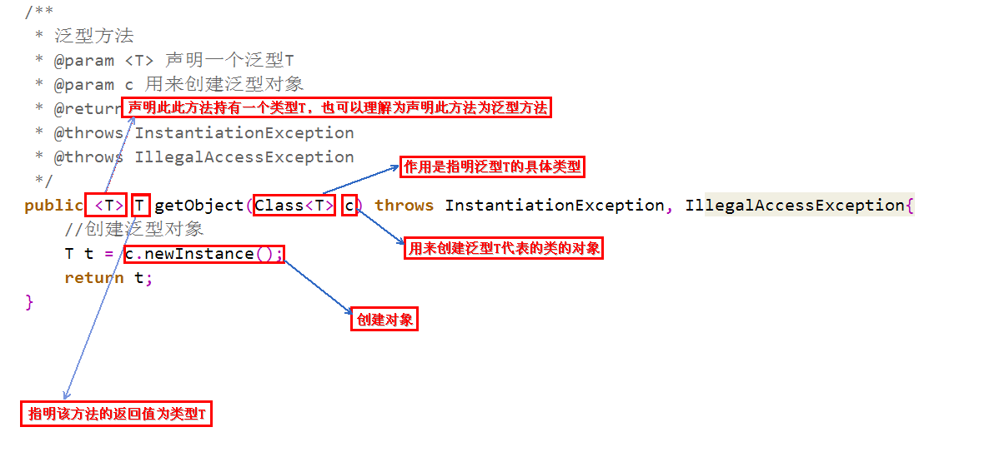
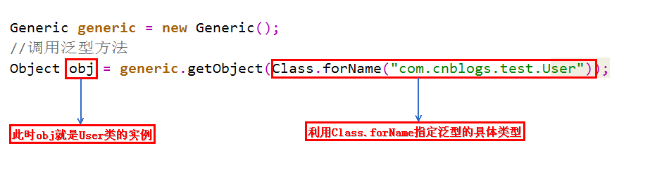

JAVA进阶

> 笔记来源于黑马视频，播客，书籍，以及个人理解
>
> 部分来源于[JavaGuide/IO模型.md at master · Snailclimb/JavaGuide (github.com)](https://github.com/Snailclimb/JavaGuide/blob/master/docs/java/basis/IO模型.md)

# IO


# 多线程

> 多线程往往是java的一个性能重点，所以需要单独一个笔记讲述多线程
>
> 需要我查阅更多的书籍后才能对其统计知识点


# 泛型

> JDK1.5(jdk5)出现了泛型的概念

### 概念

泛型在java中有很重要的地位，在面向对象编程及各种设计模式中有非常广泛的应用

泛型，即“参数化类型”

泛型的本质是为了参数化类型（在不创建新的类型的情况下，通过泛型指定的不同类型来控制形参具体限制的类型）

> 那么参数化类型怎么理解呢？
>
> 顾名思义，就是将类型由原来的具体的类型参数化，类似于方法中的变量参数，此时类型也定义成参数形式（可以称之为类型形参），然后在使用/调用时传入具体的类型（类型实参）。
>
> 也就是说，所操作的数据类型被指定为一个参数


### 类型擦除

 **Java 在编译期间**，所有的泛型信息都会被擦掉，这也就是通常所说类型擦除


泛型中类型擦除 Java泛型这个特性是从JDK 1.5才开始加入的，因此为了兼容之前的版本，Java泛型的实现采取了“伪泛型”的策略，即Java在语法上支持泛型，但是在编译阶段会进行所谓的“类型擦除”（Type Erasure），将所有的泛型表示（尖括号中的内容）都替换为具体的类型（其对应的原生态类型），就像完全没有泛型一样。


### 一个经典泛型例子

```java
List arrayList = new ArrayList();
arrayList.add("aaaa");
arrayList.add(100);

for(int i = 0; i< arrayList.size();i++){
    String item = (String)arrayList.get(i);
  	System.out.printf(item)
}
//程序就会报错

java.lang.ClassCastException: java.lang.Integer cannot be cast to java.lang.String
//ArrayList可以存放任意类型，例子中添加了一个String类型，添加了一个Integer类型，再使用时都以String的方式使用，因此程序崩溃了

//所以就有了泛型

List<String> arrayList = new ArrayList<String>();
```


### 特性

```java
List<String> stringArrayList = new ArrayList<String>();
List<Integer> integerArrayList = new ArrayList<Integer>();

Class classStringArrayList = stringArrayList.getClass();
Class classIntegerArrayList = integerArrayList.getClass();

if(classStringArrayList.equals(classIntegerArrayList)){
    Log.info("泛型测试","类型相同");
}
```

> 泛型类型在逻辑上看以看成是多个不同的类型，实际上都是相同的基本类型

注意

- 泛型的类型参数只能是类类型，不能是简单类型。
- 不能对确切的泛型类型使用instanceof操作，编译时会出错
- 泛型只在编译阶段有效


### 分类

#### 泛型类

泛型类型用于类的定义中，被称为泛型类

> 最典型的就是各种容器类，如：List、Set、Map

```java
//此处T可以随便写为任意标识，常见的如T、E、K、V等形式的参数常用于表示泛型
//在实例化泛型类时，必须指定T的具体类型
public class Generic<T>{ 
    //key这个成员变量的类型为T,T的类型由外部指定  
    private T key;

    public Generic(T key) { //泛型构造方法形参key的类型也为T，T的类型由外部指定
        this.key = key;
    }

    public T getKey(){ //泛型方法getKey的返回值类型为T，T的类型由外部指定
        return key;
    }
}
```

#### 泛型接口

泛型接口常被用在各种类的生产器中

```java
//定义一个泛型接口
public interface Generator<T> {
    public T next();
}
```

> 实现接口需要声明泛型类型，不然会报错


#### 泛型方法

声明此方法为泛型方法：public  <T>  T 

只有声明了<T>的方法才是泛型方法

```java
public <T> T genericMethod(){
        T instance = tClass.newInstance();
        return instance;
}
```


### 泛型通配符

```java
public void show(Generic<Number> obj){ }

Generic<Integer> gInteger = new Generic<Integer>(123);
Generic<Number> gNumber = new Generic<Number>(456);

show(gNumber);//程序报错

//	同一种泛型可以对应多个版本（因为参数类型是不确定的），不同版本的泛型类实例是不兼容的
//	因此我们需要一个在逻辑上可以表示同时是Generic<Integer>和Generic<Number>父类的引用类型。由此类型通配符应运而生

public void show(Generic<?> obj){ }
```


### 泛型上下边界

在使用泛型的时候，我们可以为传入的泛型类型实参进行上下边界的限制，如：类型实参只准传入某种类型的父类或某种类型的子类。

上界通配符

```
<? extends ClassType> 该通配符表示ClassType的所有子类型
```

下界通配符

```
<? super ClassTyep>  该通配符表示ClassType 的所有父类型
```

例子

```java
public static void fun(Info<? super String> temp){    // 只能接收String或Object类型的泛型，String类的父类只有Object类
    System.out.print(temp + ", ") ;
}
```


# 序列化

## 定义

将那些实现了Seralizable接口的对象转换成一个字节序列,并能够在以后将这个字节序列完全恢复为原来的对象,==序列化可以弥补不同操作系统之间的差异==

## 作用

 Java远程方法调用( RMI )

对JavaBeans进行序列化


## 如何实现序列化

实现序列化方法

（1）实现Serializable接口
该接口只是一个可序列化的标志,并没有包含实际的属性和方法。

如果不在改方法中添加readObj ect()和writeObject()方法,则采取默认的序列化机制。如果添加了这两个方法之后还想利用Java默认的序列

化机制，则在这两个方法中分别调用 defaultReadObject 和 defaultWriteObjec 两个方法。为了保证安全性，可以使用 `transient关键字` 

进行修饰不必序列化的属性。因为在反序列化时, private修饰的属性也能看到。

（2）实现ExternalSeri alizable方法

自己对要序列化的内容进行控制,控制那些属性能被序列化,那些不能被序列化。


## 如何实现反序列化

实现 Serializable接口 的对象在反序列化时不需要调用对象所在类的构造方法,完全基于字节。

实现 externalSerializable接口 的方法在反序列化时会调用构造方法。

> 注意事项
>
> 被static修饰的属性不会被序列化
>
> 对象的类名、属性都会被序列化,方法不会被序列化
>
> 要保证序列化对象所在类的属性也是可以被序列化的


## 原理

序列化是将对象编码成字节流以及从字节流中重新构建对象的操作
序列化实现原理:

serializable该接口没有方法，只是一种标记，序列化传输时使用writeobject和readobject并通过反射调用objectinputstream和objectoutputstream,如果没有设置serializable标志，则报错

序列化实现serializable接口

1，序列化只保存对象的状态，不保存对象的方法

2，父类实现序列化，子类自动实现序列化，不需要显式实现Serializable 接口

3，当一个对象的实例变量引用其他对象，序列化该对象时也把引用对象进行序列化;

4，并非所有的对象都可以序列，至于为什么不可以，有很多原因了

> 比如:
> 1.安全方面的原因，比如一个对象拥有private, public 等field,对于一个要传输的对象，比如写到文件，或者进行rmi传输等等，在序列化进行传输的过程中，这个对象的private等域是不受保护的。
>
> 2.资源分配方面的原因，比如socket, thread 类，如果可以序列化，进行传输或者保存，也无法对他们进行重新的资源分配，而且，也是没有必要这样实现。

5，序列化会忽略静态变量，即序列化不保存静态变量的状态，transient, 所以不能序列化静态成员属于类级别的，所以不能序列化。即序列化的是对象的状态不是类的状态。

6，序列化前和序列化后的对象的关系是"=="还是equal? or 是浅复制还是深复制? (深复制、equal)


## 常见的序列化协议

COM主要用于Windows平台 ,并没有真正实现跨平台，另外COM的序列化的原理利用了编译器中虚表,使得其学习成本巨大。

CORBA是早 期比较好的实现了跨平台，跨语言的序列化协议。COBRA的主 要问题是参与方过多带来的版本过多,版本之间兼容性较差,以及使用复杂晦涩。

XML&5OAP

- XML是一种常用的序列化和反序列化协议,具有跨机器,跨语言等优点。
- 5OAP ( Simple Object Access protocol)是一种被广 泛应用的，基于XML为序列化和反序列化协议的结构化消息传递协议。SOAP具有安全、可扩展、 跨语言、跨平台并支持多种传输层协议。

JSON

- 这种Associative array格式非常符合工程师对对象的理解。
- 它保持了XML的人眼可读( Human-readable )的优点。
- 相对于XML而言, 序列化后的数据更加简洁。
- 它具备Javascript的先天性支持,所以被广泛应用于Web browser的应用常景中,是Ajax的事实标准协议。
- 与XML相比，其协议比较简单，解析連度比较快。
- 松散的Associative array使得其具有良好的可扩展性和兼容性。

Thrift

是Facebook开源提供的一个高性能,轻量级RPC服务框架,其产生正是为了满足当前大数据量、分布式、跨语言、跨平台数据通讯的需求。Thrift在空间开销和解析性能上有了比较大的提升,对于对性能要求比较高的分布式系统，它是一一个优秀的RPC解决方案;但是由于Thrift的序列化被嵌入到Thrift框架里面，Thrift框架本身并没有透出序列化和反序列化接口,这导致其很难和其他传输层协议共同使用


## 注意事项


当通过网络、文件进行序列化时，必须按照写入的顺序读取对象。

反序列化时必须有序列化对象时的class文件

最好显示的声明serializablelD ,因为在不同的JVM之间，默认生成serializablelD可能不同,会造成反序列化失败。


# 网络编程

> 网络编程需要我去尝试一个聊天项目后再去整理


## 面试题

### 为什么需要泛型？

1，减少代码的编写

2，**泛型中的类型在使用时指定，不需要强制类型转换（类型安全，编译器会检查类型）**


### 泛型类如何定义使用？

```java
class Point<T>{         // 此处可以随便写标识符号，T是type的简称  
    private T var ;     // var的类型由T指定，即：由外部指定  
    public T getVar(){  // 返回值的类型由外部决定  
        return var ;  
    }  
    public void setVar(T var){  // 设置的类型也由外部决定  
        this.var = var ;  
    }  
}  
public class GenericsDemo06{  
    public static void main(String args[]){  
        Point<String> p = new Point<String>() ;     // 里面的var类型为String类型  
        p.setVar("it") ;                            // 设置字符串  
        System.out.println(p.getVar().length()) ;   // 取得字符串的长度  
    }  
}
```

### 泛型接口如何定义使用？

```java
interface Info<T>{        // 在接口上定义泛型  
    public T getVar() ; // 定义抽象方法，抽象方法的返回值就是泛型类型  
}  
class InfoImpl<T> implements Info<T>{   // 定义泛型接口的子类  
    private T var ;             // 定义属性  
    public InfoImpl(T var){     // 通过构造方法设置属性内容  
        this.setVar(var) ;    
    }  
    public void setVar(T var){  
        this.var = var ;  
    }  
    public T getVar(){  
        return this.var ;  
    }  
} 
public class GenericsDemo24{  
    public static void main(String arsg[]){  
        Info<String> i = null;        // 声明接口对象  
        i = new InfoImpl<String>("汤姆") ;  // 通过子类实例化对象  
        System.out.println("内容：" + i.getVar()) ;  
    }  
}  
```

###  泛型方法如何定义使用？



调用



定义泛型方法时，必须在返回值前边加一个`<T>`，来声明这是一个泛型方法，持有一个泛型`T`，然后才可以用泛型T作为方法的返回值。


### getName、getCanonicalName与getSimpleName的区别?

getSimpleName：只获取类名

getName：类的全限定名，jvm中Class的表示，可以用于动态加载Class对象，例如Class.forName。

getCanonicalName：返回更容易理解的表示，主要用于输出（toString）或log打印，大多数情况下和getName一样，但是在内部类、数组等类型的表示形式就不同了。