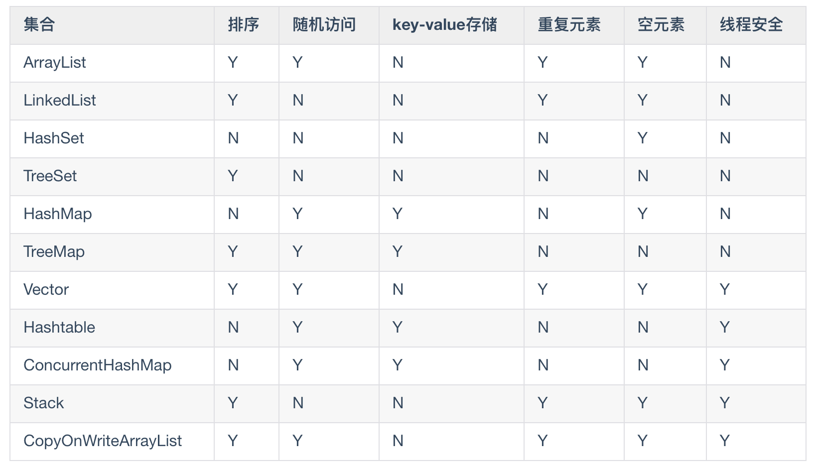

# 容器

> 待补充：红黑树，散列表
>
> 注意：容器不能持有基本类型
>
> 部分笔记来源于：https://github.com/Snailclimb/JavaGuide





# 一，Iterable接口

- 实现该接口的对象允许使用for-each循环

> 除此以外，数组也可以用增强for循环，即 增强 for 循环也是借助迭代器进行遍历。

```java
List<Object> list = new ArrayList();
for (Object obj: list){
}
```

- jdk1.8之前`Iterable`只有一个方法`iterator()` ----迭代器

实现次接口的方法能够创建一个轻量级的迭代器，用于安全的遍历元素，移除元素，添加元素

> 涉及`fail-fast`机制
>
> fail-fast 机制是java集合(Collection)中的一种错误机制。当多个线程对同一个集合的内容进行操作时，就可能会产生fail-fast事件。
>
> 例如：当某一个线程A通过iterator去遍历某集合的过程中，若该集合的内容被其他线程所改变了；那么线程A访问集合时，就会抛出
>
> ConcurrentModificationException异常，
>
> 产生fail-fast事件

-  主要是用来遍历集合，它的特点是更加安全，因为可以确保，在当前遍历的集合元素被更改的时候，就会抛出 `ConcurrentModificationException` 异常

```java
Iterator<Map.Entry<Integer, String>> iterator = map.entrySet().iterator();
while (iterator.hasNext()) {
  Map.Entry<Integer, String> entry = iterator.next();
  System.out.println(entry.getKey() + entry.getValue());
}
```


# 二，Collection接口

> Conllection的作用就是为集合框架提供功能实现
>
> 是所有有序列容器的共性根接口，这样就是能创建更通用的方法

分类

- List：按照顺序插入数据
- Set：不能有重复元素
- Queue：按照排队规则确定对象产生的顺序


> 以下待补充

同步包装

自动同步，六个核心集合接口（Collection、Set、List、Map、SortedSet 、SortedMap  ）都有一个静态方法

```java
public static Collection synchronizedCollection(Collection c);
public static Set synchronizedSet(Set s);
public static List synchronizedList(List list);
public static <K,V> Map<K,V> synchronizedMap(Map<K,V> m);
public static SortedSet synchronizedSortedSet(SortedSet s);
public static <K,V> SortedMap<K,V> synchronizedSortedMap(SortedMap<K,V> m);
```

不可修改的包装

不可修改的包装器通过拦截修改集合的操作并抛出`UnsupportedOperationException`


线程安全的Collection


## List

> 继承了Collection接口


### ArrayList

> 实现了List接口的可扩容数组（动态数组），`Object[]`数组
>
> 访问快，修改慢

特点

- ArrayList可实现所有的列表操作
- ArrayList提供了内部存储List的方法，能够完全替代Vector（已经淘汰）

> Vector类 是在 java 中可以实现自动增长的对象数组

- ArrayList线程不安全

- ArrayList扩容按照50%扩容


ArrayList 的扩容机制

> 待补充，查看源码


### Vector

> Vector和ArrayList一样，基于数组实现
>
> `Object[]`数组

特点

- Vector是线程安全的，它对内部的每个方法都是暴力上锁，避免安全问题，开销大，效率低于ArrayList
- Vector扩容按照100%扩容


#### Stack

> Stack继承了Vector类

第一次创建栈，不包含任何元素

一个更完善、可靠性更强的LIFO栈操作由Deque接口和他的实现提供，优先使用这个类

```java
Deque<Integer> stack = new ArrayDeque<Integer>()
```


### LinkedList

> LinkedList是一个双向链表，
>
> 双向链表 ( JDK1.6 之前为循环链表，JDK1.7 取消了循环 )
>
> 修改快，查询慢

- LinkedList线程不安全，要想安全使用同样需要进行外部加锁

```
List list = Collections.synchronizedList(new LinkedList(...))
```

- 允许存放任何元素（包括null）


#### Arraylist与LinkedList区别

- **线程安全：** `ArrayList` 和 `LinkedList` 都是不同步的，也就是不保证线程安全；

- **底层数据结构：**

  -  `Arraylist` 底层使用的是 **`Object` 数组**
  - `LinkedList` 底层使用的是 **双向链表** 数据结构

- **插入和删除是否受元素位置的影响：** 

  - ① **`ArrayList` 采用数组存储，所以插入和删除元素的时间复杂度受元素位置的影响。**

    > 比如：执行`add(E e)`方法的时候， `ArrayList` 会默认在将指定的元素追加到此列表的末尾，这种情况时间复杂度就是 O(1)。
    >
    > 但是如果要在指定位置 i 插入和删除元素的话（`add(int index, E element)`）时间复杂度就为 O(n-i)
    >
    > 因为在进行上述操作的时候集合中第 i 和第 i 个元素之后的(n-i)个元素都要执行向后位/向前移一位的操作

  - ② **`LinkedList` 采用链表存储，所以对于`add()`方法的插入，删除元素时间复杂度不受元素位置的影响，近似 O(1)**

    > 如果是要在指定位置`i`插入和删除元素的话时间复杂度近似为`o(n))`因为需要先移动到指定位置再插入。

- **是否支持快速随机访问：** 

  - `LinkedList` 不支持高效的随机元素访问，而 `ArrayList` 支持。
  - 快速随机访问就是通过元素的序号快速获取元素对象(对应于`get(int index)`方法)。

- **内存空间占用：**

  -  ArrayList 的空 间浪费主要体现在在 list 列表的结尾会预留一定的容量空间
  - 而 LinkedList 的空间花费则体现在它的每一个元素都需要消耗比 ArrayList 更多的空间（因为要存放直接后继和直接前驱以及数据）


## Set

> 不保留重复元素
>
> Set和Collection具有同样的接口，实际上Set就是Collection，只是行为不同

### HashSet

> 实现了Set接口，由哈希表支持（实际上HashSet 是 HashMap 的一个实例）
>
> 底层采用 `HashMap` 来保存元素，专门为快速查找设计的Set

特点

- 无序，唯一值
- 值允许为null
- HashSet线程不安全，如果要修改，必须要外部加锁，或者使用`Collections.synchronizedSet()`
- 支持` fail-fast `机制
- 存入HashSet的元素必须定义hashcode方法


#### HashSet 如何检查重复

1，HashSet用对象来计算HashCode

2，当你把对象加入`HashSet`时，HashSet 会先计算对象的`hashcode`值来判断对象加入的位置，同时也会与其他加入的对象的 hashcode 值作比较，如果没有相符的 hashcode，HashSet 会假设对象没有重复出现。但是如果发现有相同 hashcode 值的对象，这时会调用`equals()`方法来检查 hashcode 相等的对象是否真的相同。如果两者相同，HashSet 就不会让加入操作成功


### TreeSet

> TreeSet是基于TreeMao的NavigableSet实现
>
> 红黑树(自平衡的排序二叉树)
>
> 使用的不多，一般当需要存入的数据要排序时使用


- 有序，唯一值
- 不是线程安全的
- 支持`fail-fast`机制
- 当我们去使用这些排序的结合时，有时候自定义的类无法排序，这里就涉及到ConpareTo方法问题（详细在《排序问题》）


### LinkedHashSet

> 继承Set，是Set接口的哈希表和LinkedList的实现
>
> `LinkedHashSet` 是 `HashSet` 的子类，并且其内部是通过 `LinkedHashMap` 来实现的
>
> 内部使用链表来维护元素的循序，其插入的元素也需要实现hashcode方法


特点

- 定义了元素的插入顺序
- LinkedHashSet有两个影响其构成的参数：初始容量和加载因子
- 对于LinkedHashSet来说，过高的容量的开销比HashSet小，LinkedHashSet的迭代次数不受容量影响
- 线程不安全


### 三者的异同

- HashSet 是 Set 接口的主要实现类 ，HashSet 的底层是 HashMap，线程不安全的，可以存储 null 值；
- LinkedHashSet 是 HashSet 的子类，能够按照添加的顺序遍历；
- TreeSet 底层使用红黑树，能够按照添加元素的顺序进行遍历，排序的方式有自然排序和定制排序。


# 三，Map 接口

一组成对的键值对对象，允许使用键来查找组，也被称为“关联数组”


## HashMap

> 利用哈希表来存储元素
>
> JDK1.8 之前 HashMap 由数组+链表组成的，数组是 HashMap 的主体，链表则是主要为了解决哈希冲突而存在的（“拉链法”解决冲突）
>
> JDK1.8 以后在解决哈希冲突时有了较大的变化，当链表长度大于阈值（默认为 8）时，将链表转化为红黑树，以减少搜索时间
>
> （将链表转换成红黑树前会判断，如果当前数组的长度小于 64，那么会选择先进行数组扩容，而不是转换为红黑树）

特点

- 允许为空
- 线程不安全
- 支持fail-fast机制

### HashMap初始容量

1，HashMap 默认的初始化大小为 16。之后每次扩充，容量变为原来的 2 倍

2，创建时如果给定了容量初始值，HashMap 会将其扩充为 2 的幂次方大小

3，超出阈值转红黑树

```java
public HashMap(int initialCapacity, float loadFactor) {
    	//判断初始容量
        if (initialCapacity < 0)
            throw new IllegalArgumentException("Illegal initial capacity: " + initialCapacity);
    	//如果大于最大容量
        if (initialCapacity > MAXIMUM_CAPACITY)
            initialCapacity = MAXIMUM_CAPACITY;
    	
        if (loadFactor <= 0 || Float.isNaN(loadFactor))
            throw new IllegalArgumentException("Illegal load factor: " +loadFactor);
    
        this.loadFactor = loadFactor;
        this.threshold = tableSizeFor(initialCapacity);
    }

public HashMap(int initialCapacity) {
        this(initialCapacity, DEFAULT_LOAD_FACTOR);
    }
//保证了 HashMap 总是使用 2 的幂作为哈希表的大小
static final int tableSizeFor(int cap) {
        int n = cap - 1;
        n |= n >>> 1;
        n |= n >>> 2;
        n |= n >>> 4;
        n |= n >>> 8;
        n |= n >>> 16;
        return (n < 0) ? 1 : (n >= MAXIMUM_CAPACITY) ? MAXIMUM_CAPACITY : n + 1;
    }
```


## TreeMap

> 一个基于NavigableMap实现的红黑树（自平衡的排序二叉树）
>
> `TreeMap` 和`HashMap` 都继承自`AbstractMap` ，但是需要注意的是`TreeMap`它还实现了`NavigableMap`接口和`SortedMap` 接口

特点

- 实现 `NavigableMap` 接口让 `TreeMap` 有了对集合内元素的搜索的能力
- 实现`SortMap`接口让 `TreeMap` 有了对集合中的元素根据键排序的能力


## LinkedHashMap  

> Map接口的哈希表和链表的实现，即继承自 `HashMap`，所以它的底层仍然是基于  `拉链式散列结构`  即 由数组和链表或红黑树组成
>
> 和HashMap的不同之处在于它维护了一个贯穿所有条目的双向链表
>
> 使得上面的结构可以保持键值对的插入顺序。
>
> 同时通过对链表进行相应的操作，实现了访问顺序相关逻辑


## HashTable类

> 实现了一个哈希表，线程安全，数组+链表组成：数组是 HashMap 的主体，链表则是主要为了解决哈希冲突而存在的	
>
> Hashtable 默认的初始大小为 11，之后每次扩充，容量变为原来的 2n+1
>
> 问题：HashTable 基本被淘汰，不要在代码中使用它，为什么呢？

如果需要多线程高并发就需要`ConcurrentHashMap   `

​	


### HashMap和Hashtable区别

- **线程是否安全：**

  -  HashMap 是非线程安全的，

  - HashTable 是线程安全的,

    > 因为 HashTable 内部的方法基本都经过`synchronized` 修饰

- **效率：** 因为线程安全的问题，HashMap 要比 HashTable 效率高一点

- **对nul的支持：** 

  - HashMap 可以存储 null 的 key 和 value，但 null 作为键只能有一个，null 作为值可以有多个；
  - HashTable 不允许有 null 键和 null 值，否则会抛出 NullPointerException。

- **初始容量大小和每次扩充容量大小的不同 ：**

  - 创建时如果不指定容量初始值，Hashtable 默认的初始大小为 11，之后每次扩充，容量变为原来的 2n+1。HashMap 默认的初始化大小为 16。之后每次扩充，容量变为原来的 2 倍。

  - 创建时如果给定了容量初始值，那么 Hashtable 会直接使用你给定的大小，而 HashMap 会将其扩充为 2 的幂次方大小（HashMap 中的`tableSizeFor()`方法保证）

  - 也就是说 HashMap 总是使用 2 的幂作为哈希表的大小

  - > 问题：为什么要使用2的幂次方呢？

- **底层数据结构：** 

  - JDK1.8 以后的 HashMap 在解决哈希冲突时有了较大的变化，当链表长度大于阈值（默认为 8）（将链表转换成红黑树前会判断，如果当前数组的长度小于 64，那么会选择先进行数组扩容，而不是转换为红黑树）时，将链表转化为红黑树，以减少搜索时间
  - Hashtable 没有这样的机制


### HashMap和 HashSet区别

- 接口
  - HashMap实现了Map接口，HashSet实现了Set接口
- 存储方式
  - HashMap按键值对存储数据，HashSet存储对象
- HashCode计算方式
  - HashMap用键来计算HashCode
  - HashSet用对象来计算HashCode，对于两个对象来说 hashcode 可能相同，所以 equals()方法用来判断对象的相等性


## IdentityHashMap类

> IdentityHashMap  是比较小众的Map实现


## WeakHashMap类

> WeakHashMap基于哈希表的Map实现，带有弱键

WeakHashMap   中的entry会自动移除，不会阻止里面的键被垃圾回收

不允许重复，常用作缓存


## 待补充：hashCode（）方法

## 待补充：散列


## 额外：Queue

### PriorityQueue

> 实现了PriorityQueue

特点

- 优先级队列的元素根据自然排序或者通过在构造函数时提供Comparator来排序
- 线程不安全，可以使用`PriorityBlockingQueue  `


# 四，List,Set,Map区别

- `List`(对付顺序的好帮手)： 存储的元素是有序的、可重复的。
- `Set`(注重独一无二的性质): 存储的元素是无序的、不可重复的。
- `Map`(用 Key 来搜索的专家): 使用键值对（kye-value）存储，Key 是无序的、不可重复的，value 是无序的、可重复的，每个键最多映射到一个值


# 五，线程安全容器

1. `ConcurrentHashMap`: 可以看作是线程安全的 `HashMap`
2. `CopyOnWriteArrayList`:可以看作是线程安全的 `ArrayList`，在读多写少的场合性能非常好，远远好于 `Vector`.
3. `ConcurrentLinkedQueue`:高效的并发队列，使用链表实现。可以看做一个线程安全的 `LinkedList`，这是一个非阻塞队列。
4. `BlockingQueue`: 这是一个接口，JDK 内部通过链表、数组等方式实现了这个接口。表示阻塞队列，非常适合用于作为数据共享的通道。
5. `ConcurrentSkipListMap` :跳表的实现。这是一个`Map`，使用跳表的数据结构进行快速查找。


# 六，排序问题

- `comparable` 接口实际上是出自`java.lang`包 它有一个 `compareTo(Object obj)`方法用来排序
- `comparator`接口实际上是出自 java.util 包它有一个`compare(Object obj1, Object obj2)`方法用来排序

定制排序

```java
// 定制排序的用法
        Collections.sort(arrayList, new Comparator<Integer>() {
            @Override
            public int compare(Integer o1, Integer o2) {
                return o2.compareTo(o1);
            }
        });


//也可以使用Lambda表达式
TreeMap<Person,String> treemap = new TreeMap<>((Person1,Person2)->{
    int num = person1.getAge() - person2.getAge();
  return Integer.compare(num, 0);
});
//对比
TreeMap<Person, String> treeMap = new TreeMap<>(new Comparator<Person>() {
    @Override
    public int compare(Person person1, Person person2) {
        int num = person1.getAge() - person2.getAge();
        return Integer.compare(num, 0);
	}
});

/**
	*问题：为什么老师返回return 8 ，排序的结果不一样呢？
/

```

重写 compareTo 方法实现按年龄来排序

```java
// person对象没有实现Comparable接口，所以必须实现，这样才不会出错，才可以使treemap中的数据按顺序排列
// 前面一个例子的Integer类已经默认实现了Comparable接口，所以不需要另外实现了
public  class Person implements Comparable<Person> {
    private String name;
    private int age;

    /**
     * T重写compareTo方法实现按年龄来排序
     */
    @Override
    public int compareTo(Person o) {
        if (this.age > o.getAge()) {
            return 1;
        }
        if (this.age < o.getAge()) {
            return -1;
        }
        return 0;
    }
}
//在遍历封装了Person对象的集合时，会自动按照排序方式来排序
```


# 七，无序性和不可重复性

- 无序性不等于随机性 ，无序性是指存储的数据在底层数组中并非按照数组索引的顺序添加 ，而是根据数据的哈希值决定的
- 不可重复性是指添加的元素按照 equals()判断时 ，返回 false，需要同时重写 equals()方法和 HashCode()方法


# 八，hashCode()与 equals()

1. 如果两个对象相等，则 hashcode值 一定也是相同的
2. 两个对象相等,对两个 equals 方法返回 true
3. 两个对象有相同的 hashcode 值，它们也不一定是相等的
4. equals 方法被覆盖过，则 hashCode 方法也必须被覆盖
5. hashCode()的默认行为是对堆上的对象产生独特值。如果没有重写 hashCode()，则该 class 的两个对象无论如何都不会相等（即使这两个对象指向相同的数据）


# 九，==与 equals

对于基本类型来说，== 比较的是值是否相等；

对于引用类型来说，== 比较的是两个引用是否指向同一个对象地址


对于引用类型（包括包装类型）来说，equals 如果没有被重写，对比它们的地址是否相等；如果 equals()方法被重写（例如 String），则比较的是地址里的内容。

