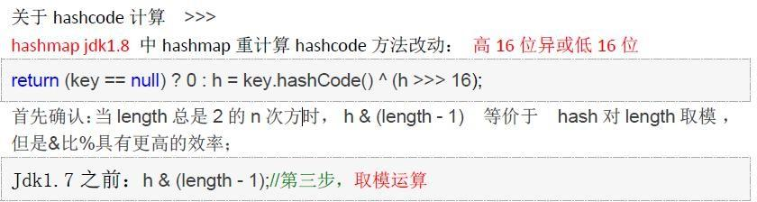
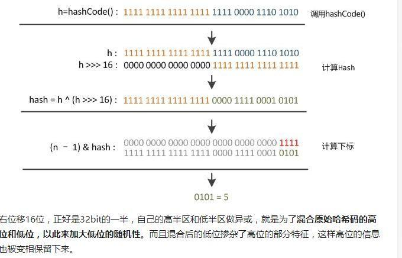
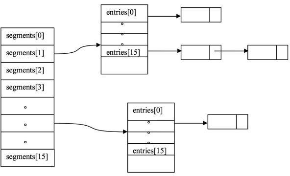
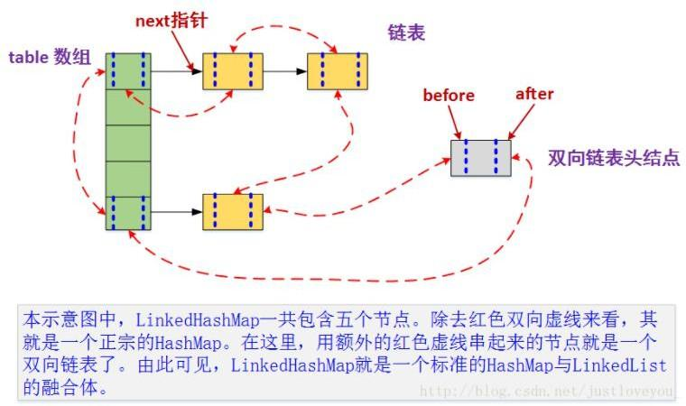

# Map 接口

一组成对的键值对对象，允许使用键来查找组，也被称为“关联数组”


## HashMap

> 利用哈希表来存储元素，继承了AbstractMap
>
> JDK1.8 之前 HashMap 由数组+链表组成的，数组是 HashMap 的主体，链表则是主要为了解决哈希冲突而存在的（“拉链法”解决冲突）
>
> JDK1.8 以后在解决哈希冲突时有了较大的变化，当链表长度大于阈值（默认为 8）时，将链表转化为红黑树，以减少搜索时间
>
> （将链表转换成红黑树前会判断，如果当前数组的长度小于 64，那么会选择先进行数组扩容，而不是转换为红黑树）


### 特点

- 允许为空
- 线程不安全
- 支持fail-fast机制


### hashmap存入原理

> 数组存的是链表的头结点，往hashmap中存键值对的时候，先得到key的hashcode值，如果发生冲突，就会通过与length-1按位与，重新计算hashcode，如果链表头不为空，那就比较key值，相同则替换，不同则接在链表后


### hashMap的底层数据结构实现

在 Java 中，保存数据有两种比较简单的数据结构：数组和链表。数组的特点是：寻址容易，插入和删除困难；链表的特点是：寻址困难，但插入和删除容易；所以我们将数组和链表结合在一起，发挥两者各自的优势，使用一种叫做拉链法的方式组成hash表

> 拉链法就是把具有相同散列地址的关键字(同义词)值放在同一个单链表中，称为同义词链表

7版本
数据+链表
数组中每一格就是一个链表。若遇到哈希冲突，则将冲突的值加到链表中即可。

8版本
Java8 对 HashMap 进行了一些修改，最大的不同就是利用了红黑树，所以其由 **数组+链表+红黑树** 组成。以减少搜索时间

8版本主要的优化就是扩容的优化
引入了红黑树，目的是避免单条链表过长而影响查询效率，解决了多线程死循环问题，但仍是非线程安全的，多线程时可能会造成数据丢失问题。


### HashMap的实现原理

1，HashMap的底层是使用数组+链表的方式实现的

2，同时也是基于Hash算法实现，当添加元素时，会利用key的hashCode去计算数组对应的下标，存储时，如果key值相同**，**则会覆盖原来的值，key值不同，也就是出现了hash冲突，就会去放入链表尾

3，获取数据时，通过hash值找到对应下标，进一步判断key值是否相等

4，同时在JDK1.8之后，对 HashMap 的实现做了优化，当链表中的节点数据超过八个之后，该链表会转为红黑树来提高查询效率，从原来的 O(n)到 O(logn)


### HashMap初始容量

1，HashMap 默认的初始化大小为 16。之后每次扩充，容量变为原来的 2 倍

2，创建时如果给定了容量初始值，HashMap 会将其扩充为 2 的幂次方大小

3，超出阈值转红黑树

```java
public HashMap(int initialCapacity, float loadFactor) {
    	//判断初始容量
        if (initialCapacity < 0)
            throw new IllegalArgumentException("Illegal initial capacity: " + initialCapacity);
    	//如果大于最大容量
        if (initialCapacity > MAXIMUM_CAPACITY)
            initialCapacity = MAXIMUM_CAPACITY;
    	
        if (loadFactor <= 0 || Float.isNaN(loadFactor))
            throw new IllegalArgumentException("Illegal load factor: " +loadFactor);
    
        this.loadFactor = loadFactor;
        this.threshold = tableSizeFor(initialCapacity);
    }

public HashMap(int initialCapacity) {
        this(initialCapacity, DEFAULT_LOAD_FACTOR);
    }
//保证了 HashMap 总是使用 2 的幂作为哈希表的大小
static final int tableSizeFor(int cap) {
        int n = cap - 1;
        n |= n >>> 1;
        n |= n >>> 2;
        n |= n >>> 4;
        n |= n >>> 8;
        n |= n >>> 16;
        return (n < 0) ? 1 : (n >= MAXIMUM_CAPACITY) ? MAXIMUM_CAPACITY : n + 1;
    }
```


### 常用方法

```java
//获取指定 key 对应对 value，如果找不到 key ，则返回设置的默认值
getDefault(key,value);
//获取map集合中所有的键值对象
values()
```


### Hashcode 的计算

7版本

```java
hash(k)&(table.length-1) // 等价于 hash(k)%table.length
```

原因是*HashMap*要求table.length必须是2的指数，因此table.length-1就是二进制低位全是1，跟hash(k)相与会将哈希值的高位全抹掉，剩下的就是余数了

8版本

```java
return (key == null) ? 0 : (h = key.hashCode()) ^ (h >>> 16);
```

--

与高位异或，能减少hash冲突复杂(注释翻译)：计算 key.hashCode() 并将哈希的较高位传播（XOR）到较低位。

由于该表使用二次幂掩码，因此仅在当前掩码之上位变化的散列集将始终发生冲突。 （已知的例子是在小表中保存连续整数的 Float 键集。）因此，我们应用了一种变换，将高位的影响向下传播。在位扩展的速度、实用性和质量之间存在折衷。因为许多常见的散列集已经合理分布（所以不要从传播中受益），并且因为我们使用树来处理 bin 中的大量冲突，我们只是以最便宜的方式对一些移位的位进行异或，以减少系统损失，以及合并最高位的影响，否则由于表边界，这些最高位将永远不会用于索引计算。




--




### hashMap 参数以及扩容机制

简单来说，当HashMap超过容量大小时，会进行扩容，扩容阀值的计算方式是：最大容量* 负载因子，每次扩容都是2倍，总数一直保持2的次方

扩容机制:
使用一个容量更大的数组来代替已有的容量小的数组，transfer()方 法将原有Entry数组的元素拷贝到新的Entry 数组里，JDK7重新计算每个元素在数组中的位置。JDK8中不是重新计算，而是用了更巧妙的方式。

衍生问题

JDK7的扩容机制/JDK8的扩容机制？7和8扩容时计算Hash的方式有什么不同？

​		JDk7的大概流程就是重新计算容量，并且重新生成一个新的数组，将老的数据重新计算Hash值在拷贝过去

​		JDK8的大概流程也是重新计算容量，但不是重新生成一个新的数组，而是遍历链表通过（Hash & 容量-1）是否等于0的方式判断其

是否位置发生了改变，而新位置等于老位置+老的数组长度


7为什么要重新计算Hash值？8那样计算的原理是什么？


resize 方法

> https://blog.csdn.net/u012501054/article/details/103710171/ 
>
> https://blog.csdn.net/zlp1992/article/details/104376309


#### 影响HashMap 的两个参数

负载因子和初始容量


#### resize方法源码解读

```java
final Node<K,V>[] resize() {
    Node<K,V>[] oldTab = table;
    // 保存之前的数组大小以及未初始化则为0
    int oldCap = (oldTab == null) ? 0 : oldTab.length;
    // 以前的容量阈值大小
    int oldThr = threshold;
    // 构建新值
    int newCap, newThr = 0;
    if (oldCap > 0) {
        // 如果以前的数组有值，并且大于了最大值
        if (oldCap >= MAXIMUM_CAPACITY) {
            // 那么就使得阈值为Int能表示的最大值，并返回老的数据
            threshold = Integer.MAX_VALUE;
            // 这里可以发现没有对原来的数据处理，为什么呢？
            return oldTab;
        }
        // 如果在扩容2倍后不超出最大值，并且原来的值大于初始容量
        else if ((newCap = oldCap << 1) < MAXIMUM_CAPACITY &&
                 oldCap >= DEFAULT_INITIAL_CAPACITY)
            // 更新容量的同时也更新阈值
            newThr = oldThr << 1; // double threshold
    }
    else if (oldThr > 0) // 如果原数组没值，并且阈值大于0，说明不满足扩容的条件
        newCap = oldThr;
    else { // 再有其他的条件就是初始化了
        newCap = DEFAULT_INITIAL_CAPACITY;
        newThr = (int)(DEFAULT_LOAD_FACTOR * DEFAULT_INITIAL_CAPACITY);
    }
    /**
     * 为什么要对newThr 为 0 特殊处理
     */
    if (newThr == 0) {
        float ft = (float)newCap * loadFactor;
        newThr = (newCap < MAXIMUM_CAPACITY && ft < (float)MAXIMUM_CAPACITY ?
                  (int)ft : Integer.MAX_VALUE);
    }
    threshold = newThr;
    @SuppressWarnings({"rawtypes","unchecked"})
        Node<K,V>[] newTab = (Node<K,V>[])new Node[newCap];
    table = newTab;
    // 在进行扩容操作后，数组中元素的hash会有所改变，需要进行扩容后的重新分配
    if (oldTab != null) {
        // 循环遍历老数组
        for (int j = 0; j < oldCap; ++j) {
            Node<K,V> e;
            if ((e = oldTab[j]) != null) {
                // 如果链表不为空，将老的结点置空，构建新结点后重新计算hash后再次指向原来的结点
                oldTab[j] = null;
                if (e.next == null)
                    newTab[e.hash & (newCap - 1)] = e;
                else if (e instanceof TreeNode)
                    // 是红黑树则走红黑树的逻辑
                    ((TreeNode<K,V>)e).split(this, newTab, j, oldCap);
                else {
                    // 如果还有后续结点
                    Node<K,V> loHead = null, loTail = null;
                    Node<K,V> hiHead = null, hiTail = null;
                    Node<K,V> next;
                    // 循环遍历链表，这里就涉及到重新计算Hash的方式
                  	// 涉及到7与8的对比
                    do {
                        // 临时存储下一个结点
                        next = e.next;
                      	// 为0则没有改变位置
                        if ((e.hash & oldCap) == 0) {
                            if (loTail == null)
                                loHead = e;//如果尾结点为空，那么令头结点为当前结点
                            else
                                loTail.next = e;// 不然就后移
                            loTail = e;
                        }
                      	// 否则位置发生了改变
                        else {
                            if (hiTail == null)
                                hiHead = e;
                            else
                                hiTail.next = e;
                            hiTail = e;
                        }
                    } while ((e = next) != null);
                    if (loTail != null) {
                      	// 将位置没改变的结点赋值在老位置
                        loTail.next = null;
                        newTab[j] = loHead;
                    }
                    if (hiTail != null) {
                      	// 将位置改变的结点赋值在新位置
                      	// 新位置 = 老位置 + 老容量
                        hiTail.next = null;
                        newTab[j + oldCap] = hiHead;
                    }
                }
            }
        }
    }
    return newTab;
}
```

对于Hash的重新计算，通过例子分析

一开始长度 n = 8，经过计算的hash = 0111

```
(n-1) & hash = (8-1) & 0111 = 0111 & 0111 = 0111
```

扩容之后数组长度是原来的2倍，即 n = 16，发现值是没有变的

```
(n -1) & hash = (16-1) & 0111 = 1111 & 0111 = 0111
```

例子二

Hah = 1111，n = 8

```
(n-1) & hash = 0111
```

扩容后

```
（n-1） & hash = 1111 & 1111 = 1111
```

在看一下 e.hash & oldCap 的值 = 1111 & 8 = 1111 & 1000 = 1000  != 0

新的位置 = 老位置+老长度 = 0111 + 8= 1111

可以发现通过 `e.hash & oldCap `  是否等于0来判断位置是否发生了变化时正确的

那么有没有看出规律呢，因为每次扩容都是2的倍数，计算位置的时候是和数组的长度-1做与操作，那么影响位置的数据只有最高的一位，比如 8-1 =7= 0111 ，16-1=15=1111 ，对于每个数据来说只有从右边数第四位的值会影响结果，当数据的hash的右边第四位为1的时候位置会发生变化，如上面的数据B，如果第四位为0，那么数据不会发生变化，如上面的数据A，而这个第四位 1000 恰好又是扩容前的数组长度，因此可以根据e.hash & oldCap的结果来判断，如果是0，说明位置没有发生变化，如果不为0，说明位置发生了变化，而且新的位置=老的位置+老的数组长度。


### get方法源码解读

```java
public V get(Object key) {
    Node<K,V> e;
    return (e = getNode(hash(key), key)) == null ? null : e.value;
}
```

具体实现

```java
final Node<K,V> getNode(int hash, Object key) {
    Node<K,V>[] tab; Node<K,V> first, e; int n; K k;
    // 是否初始化 && hash对应位置数组不为空
    if ((tab = table) != null && (n = tab.length) > 0 &&
        (first = tab[(n - 1) & hash]) != null) {
        if (first.hash == hash && // 总是检查第一个结点
            ((k = first.key) == key || (key != null && key.equals(k))))
            return first;
        // 当一个结点不满足 并且 当前结点的下个结点不为空时
        if ((e = first.next) != null) {
            // 判断是否为红黑树，否则走红黑树的逻辑
            if (first instanceof TreeNode)
                return ((TreeNode<K,V>)first).getTreeNode(hash, key);
            do {
                // 循环遍历链表找到对应的值
                if (e.hash == hash &&
                    ((k = e.key) == key || (key != null && key.equals(k))))
                    return e;
            } while ((e = e.next) != null);
        }
    }
    return null;
}
```


### remove方法解读

```java
public V remove(Object key) {
    Node<K,V> e;
    return (e = removeNode(hash(key), key, null, false, true)) == null ? null : e.value;
}
```

具体方法

```java
/**
 * 实现 Map.remove 和相关方法
 *
 * @param hash 散列码
 * @param key 键值对
 * @param value 值
 * @param matchValue 如果为true，则仅在值相等时移除
 * @param movable 如果为false，则在移除时不要移动其他节点
 * @return 被移除的键值对
 */
final Node<K,V> removeNode(int hash, Object key, Object value,
                           boolean matchValue, boolean movable) {
    Node<K,V>[] tab;
    Node<K,V> p;
    int n, index;
    /**
     * (tab = table) != null                        -> 哈希表不能为空
     * (n = tab.length) > 0                         -> 哈希表的长度不能为0
     * p = tab[index = (n - 1) & hash]) != null     -> n-1 > 0
     */
    // 如果已经初始化过 && hash对应位置的数组不为空
    if ((tab = table) != null && (n = tab.length) > 0 &&
        (p = tab[index = (n - 1) & hash]) != null) {
        Node<K,V> node = null, e; K k; V v;
        // hash判断，判断hash值是否相同并且key的地址和值都相同
        if (p.hash == hash &&
            ((k = p.key) == key || (key != null && key.equals(k))))
            node = p;
        else if ((e = p.next) != null) {
            // 如果没走上一次判断，说明hash不同，但是对于数组索引位置链表结点有多个时
            if (p instanceof TreeNode)
                // 红黑树判断
                node = ((TreeNode<K,V>)p).getTreeNode(hash, key);
            else {
                // 循环遍历链表，找到hash和传入过来参数一致的结点
                do {
                    if (e.hash == hash &&
                        ((k = e.key) == key ||
                         (key != null && key.equals(k)))) {
                        node = e;
                        break;
                    }
                    p = e;
                } while ((e = e.next) != null);
            }
        }
        // 如果结点不为空 && （!matchValue || value地址相等 || (value值相等)）
        // 那么也就确认了要删除的对象结点了
        if (node != null && (!matchValue || (v = node.value) == value ||
                             (value != null && value.equals(v)))) {
            if (node instanceof TreeNode)
                // 走红黑树删除逻辑
                ((TreeNode<K,V>)node).removeTreeNode(this, tab, movable);
            else if (node == p)
                // 此时的p代表的是要删除对象结点的上一个
                // 如果要删除的结点就是p，那么删除的结点就是头结点
                tab[index] = node.next;
            else
                // 这里是正常的链表拼接
                p.next = node.next;
            ++modCount;
            --size;
            // LinkedHashMap 逻辑
            afterNodeRemoval(node);
            // 返回被删除
            return node;
        }
    }
    // 没有找到,返回空值
    return null;
}
```


### put方法源码解读

7版本
首先会对map做一次查找，看是否包含该元组，如果已经包含则直接返回
如果没有找到，则会通过

```java
addEntry(int hash, K key, V value, int bucketIndex)
```

插入新的entry，插入方式为**头插法，添加后计算发现大于负载因子，会进行扩容，并重新计算hash**


8版本

```java
//该表在首次使用时初始化，并根据需要调整大小。 分配时，长度始终是 2 的幂。
transient Node<K,V>[] table;
```

put方法

```java
final V putVal(int hash, K key, V value, boolean onlyIfAbsent,
               boolean evict) {
    // 临时结点遍变量
    // 一个有趣的地方，jdk很是喜欢先赋值后再比较或者其他操作，是不是考虑了并发修改问题呢？
    Node<K,V>[] tab;
    Node<K,V> p;
    int n, i;
    if ((tab = table) == null || (n = tab.length) == 0)
      // 初始化
      n = (tab = resize()).length;
    // (n - 1) & hash 是 JDK8 扩容计算hash的方式
    if ((p = tab[i = (n - 1) & hash]) == null)
      // 说明对应位置没有结点，则创建一个新的头结点
      tab[i] = newNode(hash, key, value, null);
    else {
      // 说明对应位置有值
      Node<K,V> e; K k;
      // 如果当前结点的Hash等于当前Key的Hash && Key地址相同 || Key的值相同
      if (p.hash == hash &&
          ((k = p.key) == key || (key != null && key.equals(k))))
        // 满足以上条件就是说是同一个对象，对原来的Value进行替换
        e = p;
      else if (p instanceof TreeNode)
        // 如果链表已经变成了红黑树，则走树的逻辑
        e = ((TreeNode<K,V>)p).putTreeVal(this, tab, hash, key, value);
      else {
        // 如果以上情况都不是，那就是说明是Hash冲突，对象不同，Hash相同
        for (int binCount = 0; ; ++binCount) {
          if ((e = p.next) == null) {
            // 拼接链表
            p.next = newNode(hash, key, value, null);
            // 添加之后如果达到了转换为数的阈值，则转换为红黑树
            if (binCount >= TREEIFY_THRESHOLD - 1)
              treeifyBin(tab, hash);
            break;
          }
          // 重新判断一次的意义在哪里？
          // 同时也要校验每个节点的hash是否冲突，之前第一次仅仅是判断头结点
          if (e.hash == hash &&
              ((k = e.key) == key || (key != null && key.equals(k))))
            break;
          p = e;
        }
      }
      // 正常添加完之后
      if (e != null) { // 现有的键映射
        V oldValue = e.value;
        if (!onlyIfAbsent || oldValue == null)
          e.value = value;
        // 这里走LinkedHashMap的逻辑
        afterNodeAccess(e);
        return oldValue;
      }
    }
    ++modCount;
    if (++size > threshold)
      // 大于了就要进行容量调整操作
      resize();
    // 这里走LinkedHashMap的逻辑
    afterNodeInsertion(evict);
    return null;
}
```


### HashMap 如果链很长的话，HashMap会怎么优化？

题目变式：针对 HashMap 中某个 Entry 链太长，查找的时间复杂度可能达到 O(n)，怎么优化？


对于这个问题，涉及到的知识点就是HashMap在1.8的底层实现

1.8的HashMap是由数组+链表+红黑树组成，当链表长度超过8时会转换为红黑树，利用红黑树快速增删改查的提点提高HashMap的性能

原来的是O(N)，到8版本后就是O(log n)


### HashMap高并发下会出现什么问题

扩容问题


### HashMap存放自定义类时，需要实现什么方法？

HashCode 和 equals 方法

HashMap 的核心就是 Hash 值，必须要重写HashCode方法会影响HashMap的功能，数组索引的计算依赖于hash值，equals则是用来比较是否相同


**变式1：如果使用其他 Object 作为 HashMap 的 的 Key,怎么做？**

重写 hashCode()和 equals()方法

重写 hashCode()是因为需要计算存储数据的存储位置，需要注意不要试图从散列码计算中排除掉一个对象的关键部分来提高性能，这样虽然能更快但可能会导致更多的 Hash 碰撞；

重写 equals()方法，需要遵守自反性、对称性、传递性、一致性以及对于任何非 null 的引用值 x，x.equals(null)必须返回 false 的这几个特性，目的是为了保证 key 在哈希表中的唯一性；


**变式2：Hashmap 中的key 可以为任意对象或数据类型吗？**

可以null，但是不能是可变对象，对象的属性改变，那么hashcode值也会改变，导致找不到存放的数据

这个问题好极端，任意包括的东西太多了

> 使用HashMap的时候，需要指定泛型类型，所以我觉得HashMap能支持的类型也取决于泛型所能表达的类型
>
> 这句话回答的有问题


### HashMap 为什么可以插入空值？

 阅读过源码可以发现，在通过键值KEY计算hash值时，会去判断KEY是否为NULL，为空则计算出的Hash值为0，而在PutVal方法中，不会涉及到对Value的校验，所以Value也可以为空

> JDK8版本

```java
static final int hash(Object key) {
    int h;
    return (key == null) ? 0 : (h = key.hashCode()) ^ (h >>> 16);
}
```

对于JDK7的版本，没有怎么尝试阅读过，只知道会调用一个putForNullKey的方法遍历链表


### Hashmap 为什么线程不安全？

> 所涉及到HashMap的添加以及删除方法

简单来说就是：Hash 碰撞和扩容导致， HashMap 扩容的的时候可能会形成环形链表，造成死循环

复杂来说就是：

对于添加逻辑：HashMap底层是一个Entry数组，当发生Hash冲突的时候（也就是对象不同Hash值相同的情况），Hashmap是用链表的方式来解决的，对链表而言，新加入的节点会从头结点开始遍历链表加入。在这样的一个场景下，假如A线程和B线程同时对同一个数组位置调用addEntry，两个线程会同时得到现在的头结点，然后A写入新的头结点之后，B也写入新的头结点，那B的写入操作就会覆盖A的写入操作造成A的写入操作丢失，这是不安全的原因之一。

对于删除逻辑：当多个线程同时操作同一个数组位置的时候，也都会先取得现在状态下该位置存储的头结点，然后各自去进行计算操作，之后再把结果写回到该数组位置去，其实写回的时候可能其他的线程已经就把这个位置给修改过了，就会覆盖其他线程的修改。

对于扩容逻辑：当多个线程同时检测到总数量超过门限值的时候就会同时调用resize操作，各自生成新的数组并rehash后赋给该map底层的数组table，结果最终只有最后一个线程生成的新数组被赋给table变量，其他线程的均会丢失。而且当某些线程已经完成赋值而其他线程刚开始的时候，就会用已经被赋值的table作为原始数组，这样也会有问题。

同时，并发环境下扩容还会引起死循环（引发的原因是1.7版本使用的头插法，1.8改用尾插法）

当两个线程同时发现需要扩容操作时，都会去创建一个新的数组

线程A在执行到要遍历结点item时，时间片用完，暂停执行

这时线程B也执行到这里，假设这个结点组成的链表中元素在扩容之后位置都保持不变，那么线程B就会开始移动结点

假设以前的逻辑顺序是：a-b-c

那么1.7头插法后就是c-b-a

此时，线程A拿到资源，继续执行，暂停之前拿到的头结点还是a，那么就会继续走遍历链表的逻辑

a的next不为空，便让a的next指向了b，便形成了一个环


要想实现HashMap线程安全，那么需要调用 collections 类的静态方法synchronizeMap（）实现，或则作为局部变量使用，而不是全局

或者使用CurrentHashMap


### HashMap如何处理Hash攻击

> 也就是如何处理Hash冲突

hash攻击的原因是不同的类型值有可能hash值是一样的，那么就可以通过故意构造相同hash的字符串，达到攻击的目的

JDK7 的处理方式是数组超过一定长度就会使用链表代替（冲突链表方式 ）

JDK8 的处理方式是超过一定长度就会转变为红黑树（开放地址方式）


## CurrentHashMap 类

主要就是为了应对hashmap在并发环境下不安全而诞生的，ConcurrentHashMap的设计与实现非常精巧，大量的利用了volatile，final，CAS等lock-free技术来减少锁竞争对于性能的影响。

JDK1.7中 ConcurrentHashMap 采用了数组+Segment+分段锁的方式实现。

JDK8中 ConcurrentHashMap参考了JDK8 HashMap的实现，采用了数组+链表+红黑树的实现方式来设计，内部大量采用CAS操作



一个ConcurrentHashMap 维护一个Segment 数组，一个Segment 维护一个HashEntry 数组


### HashMap与ConCurrentHashMap的区别

- HashMap线程不安全，ConCurreentHashMap线程安全
- ConCurrentashMap将整个hash进行了分段segment，也就是将大数组分成了小数组，每个小片段segment上都有锁，插入时先找到片段，获取segment锁，然后在分段中插入
- ConcurrentHashMap锁的精度更精细，并发性能更好


### 与HashTable的区别

ConcurrentHashMap 和 Hashtable 的区别主要体现在实现线程安全的方式上不同。

 JDK1.7 的 ConcurrentHashMap 底层采用 分段的数组+链表 实现，JDK1.8 采用的数据结构跟 HashMap1.8 的结构一样，数组+链表/红黑二叉树。Hashtable
和 JDK1.8 之前的 HashMap 的底层数据结构类似都是采用 数组+链表 的形式，数组是HashMap 的主体，链表则是主要为了解决哈希冲突而存在的；

 ① 在 JDK1.7 的时候，ConcurrentHashMap（分段锁）对
整个桶数组进行了分割分段(Segment)，每一把锁只锁容器其中一部分数据，多线程访问容
器里不同数据段的数据，就不会存在锁竞争，提高并发访问率。（默认分配 16 个 Segment，
比 Hashtable 效率提高 16 倍。） 到了 JDK1.8 的时候已经摒弃了 Segment 的概念，而
是直接用 Node 数组+链表+红黑树的数据结构来实现，并发控制使用 synchronized 和CAS 来操作。（JDK1.6 以后 对 synchronized 锁做了很多优化） 整个看起来就像是优化
过且线程安全的 HashMap，虽然在 JDK1.8 中还能看到 Segment 的数据结构，但是已经简化了属性，只是为了兼容旧版本；


② Hashtable(同一把锁) :使用 synchronized 来保
证线程安全，效率非常低下。当一个线程访问同步方法时，其他线程也访问同步方法，可能
会进入阻塞或轮询状态，如使用 put 添加元素，另一个线程不能使用 put 添加元素，也
不能使用 get，竞争会越来越激烈效率越低


### JDK1.7实现的原理

在JDK1.5~1.7版本，Java使用了分段锁机制实现ConcurrentHashMap.

简而言之，ConcurrentHashMap在对象中保存了一个Segment数组，即将整个Hash表划分为多个分段；而每个Segment元素，它通过继承 ReentrantLock 来进行加锁，所以每次需要加锁的操作锁住的是一个 segment，这样只要保证每个 Segment 是线程安全的，也就实现了全局的线程安全；这样，在执行put操作时首先根据hash算法定位到元素属于哪个Segment，然后对该Segment加锁即可。因此，ConcurrentHashMap在多线程并发编程中可是实现多线程put操作。


`concurrencyLevel`: Segment 数（并行级别、并发数）。默认是 16，也就是说 ConcurrentHashMap 有 16 个 Segments，所以理论上，这个时候，最多可以同时支持 16 个线程并发写，只要它们的操作分别分布在不同的 Segment 上。这个值可以在初始化的时候设置为其他值，但是一旦初始化以后，它是不可以扩容的


## LinkedHashMap 类

> Map接口的哈希表和链表的实现，即继承自 `HashMap`，所以它的底层仍然是基于  `拉链式散列结构`  即 由数组和链表或红黑树组成
>
> 和HashMap的不同之处在于它维护了一个贯穿所有条目的双向链表
>
> 使得上面的结构可以保持键值对的插入顺序。
>
> 同时通过对链表进行相应的操作，实现了访问顺序相关逻辑




双向链表的操作可以在HashMap 的put操作中看出来

put 方法中调用了LinkedHashMap 的afterNodeAccess方法，是将其添加到链表的尾部


### Linkedhashmap 与 hashmap 的区别

- LinkedHashMap 是 HashMap 的子类

> 所以LinkedHashMap的很多方法是套用的HashMap父类的，例如put方法

- LinkedHashMap 中的 Entry 增加了两个指针 before 和 after，它们分别用于维护双向链接列表。
- 在 put 操作上，虽然 LinkedHashMap 完全继承了 HashMap 的 put 操作，但是在细节上还是做了一定的调整，比如，在 LinkedHashMap 中向哈希表中插入新 Entry 的同时，还会通过 Entry 的addBefore 方法将其链入到双向链表中。
- 在扩容操作上，虽然 LinkedHashMap 完全继承了 HashMap 的 resize 操作，但是鉴于性能和LinkedHashMap 自身特点的考量，LinkedHashMap 对其中的重哈希过程(transfer 方法)进行了重写
- 在读取操作上，LinkedHashMap 中重写了 HashMap 中的 get 方法，通过 HashMap中的 getEntry 方法获取 Entry 对象。在此基础上，进一步获取指定键对应的值。


## HashTable类

> 实现了一个哈希表，线程安全，数组+链表组成：数组是 HashMap 的主体，链表则是主要为了解决哈希冲突而存在的	
>
> Hashtable 默认的初始大小为 11，之后每次扩充，容量变为原来的 2n+1
>
> 问题：HashTable 基本被淘汰，不要在代码中使用它，为什么呢？

如果需要多线程高并发就需要`ConcurrentHashMap   `

​	


### HashMap和Hashtable区别

- **线程是否安全：**

  - HashMap 是非线程安全的，

  - HashTable 是线程安全的,

    > 因为 HashTable 内部的方法基本都经过`synchronized` 修饰

- **效率：** 因为线程安全的问题，HashMap 要比 HashTable 效率高一点

- **对nul的支持：** 

  - HashMap 可以存储 null 的 key 和 value，但 null 作为键只能有一个，null 作为值可以有多个；
  - HashTable 不允许有 null 键和 null 值，否则会抛出 NullPointerException。

- **初始容量大小和每次扩充容量大小的不同 ：**

  - 创建时如果不指定容量初始值，Hashtable 默认的初始大小为 11，之后每次扩充，容量变为原来的 2n+1。HashMap 默认的初始化大小为 16。之后每次扩充，容量变为原来的 2 倍。

  - 创建时如果给定了容量初始值，那么 Hashtable 会直接使用你给定的大小，而 HashMap 会将其扩充为 2 的幂次方大小（HashMap 中的`tableSizeFor()`方法保证）

  - 也就是说 HashMap 总是使用 2 的幂作为哈希表的大小

  - > 问题：为什么要使用2的幂次方呢？
    >
    > 为了能让 HashMap 存取高效，尽量较少碰撞，也就是要尽量把数据分配均匀。我们上面也讲到了过了，Hash 值的范围值-2147483648 到 2147483647，前后加起来大概 40 亿的映射空间，只要哈希函数映射得比较均匀松散，一般应用是很难出现碰撞的。但问题是一个 40 亿长度的数组，内存是放不下的。所以这个散列值是不能直接拿来用的。用之前还要先做对数组的长度取模运算，得到的余数才能用来要存放的位置也就是对应的数组下标。这个数组下标的计算方法是“ `(n - 1) & hash`”。（n 代表数组长度）。这也就解释了 HashMap 的长度为什么是 2 的幂次方。

- **底层数据结构：** 

  - JDK1.8 以后的 HashMap 在解决哈希冲突时有了较大的变化，当链表长度大于阈值（默认为 8）（将链表转换成红黑树前会判断，如果当前数组的长度小于 64，那么会选择先进行数组扩容，而不是转换为红黑树）时，将链表转化为红黑树，以减少搜索时间
  - Hashtable 没有这样的机制


###  ConcurrentHashMap 和 HashTable 区别

- ConcurrentHashMap 仅仅锁定 map 的某个部分，而 Hashtable 则会锁定整个 map。
- hashtable(同一把锁):使用 synchronized 来保证线程安全，但效率非常低下。当一个线程访问同步方法时，其他线程也访问同步方法，可能会进入阻塞或轮询状态，如使用 put 添加元素，另一个线程不能使用 put 添加元素，也不能使用 get，竞争会越来越激烈效率越低。
- concurrenthashmap(分段锁):(锁分段技术)每一把锁只锁容器其中一部分数据，多线程访问容 器里不同数据段的数据，就不会存在锁竞争，提高并发访问率。首先将数据分为一段一段的 存储，然后给每一段数据配一把锁，当一个线程占用锁访问其中一个段数据时，其他段的数 据也能被其他线程访问
- concurrenthashmap 是由 Segment 数组结构和 HahEntry 数组结构组成。Segment 是一种可重入锁 ReentrantLock，扮演锁的角色。HashEntry 用于存储键值对数据。一个 concurrenthashmap 里包含一个 Segment 数组。Segment 的结构和 Hashmap 类似，是一种数组和链表结构，一个 Segment 包含一个 HashEntry 数组，每个 HashEntry 是一个链表结构的元素，每个 Segment 守护着一个HashEntry 数组里的元素，当对 HashEntry 数组的数据进行修改时，必须首先获得对应的 Segment。

> 也就是说他们最大的区别就是对并发的处理


## IdentityHashMap类

> IdentityHashMap  是比较小众的Map实现


## WeakHashMap类

> WeakHashMap基于哈希表的Map实现，带有弱键

WeakHashMap   中的entry会自动移除，不会阻止里面的键被垃圾回收

不允许重复，常用作缓存


## SortedMap类

正如 Set 接口派生出 SortedSet 子接口，SortedSet 接口有一个 TreeSet 实现类一样，Map 接口也派生出一个 SortedMap 子接口，SortedMap 接口也有一个 TreeMap 实现类

### TreeMap

> 一个基于NavigableMap实现的红黑树（自平衡的排序二叉树）
>
> `TreeMap` 和`HashMap` 都继承自`AbstractMap` ，但是需要注意的是`TreeMap`它还实现了`NavigableMap`接口和`SortedMap` 接口

特点

- 实现 `NavigableMap` 接口让 `TreeMap` 有了对集合内元素的搜索的能力
- 实现`SortMap`接口让 `TreeMap` 有了对集合中的元素根据键排序的能力

#### HashMap与 TreeMap 的区别

1、 HashMap 通过 hashcode 对其内容进行快速查找，而 TreeMap 中所有的元素都保持着某种固定的顺序，如果你需要得到一个有序的结果你就应该使用 TreeMap（HashMap中元素的排列顺序是不固定的）

2、在 Map 中插入、删除和定位元素，HashMap 是最好的选择。但如果您要按自然顺序或自定义顺序遍历键，那么 TreeMap 会更好。使用 HashMap 要求添加的键类明确定义了hashCode()和 equals()的实现。

两个 map 中的元素一样，但顺序不一样，导致 hashCode()不一样

