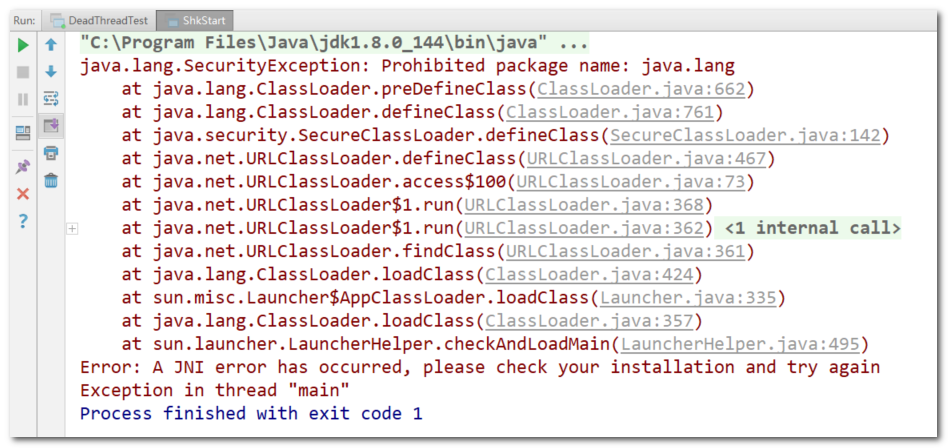
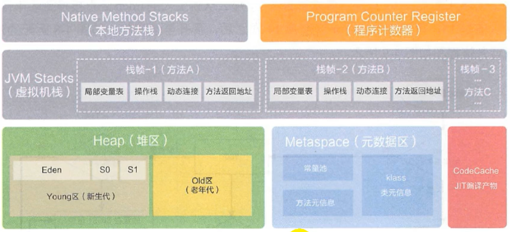
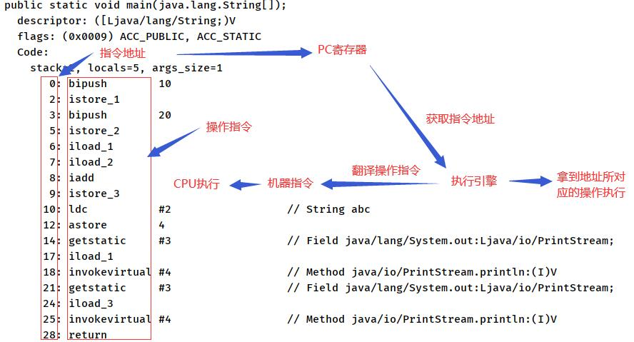
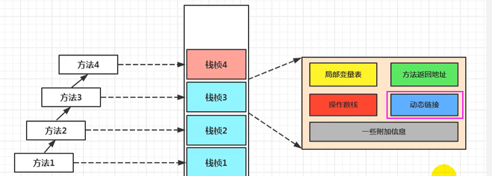
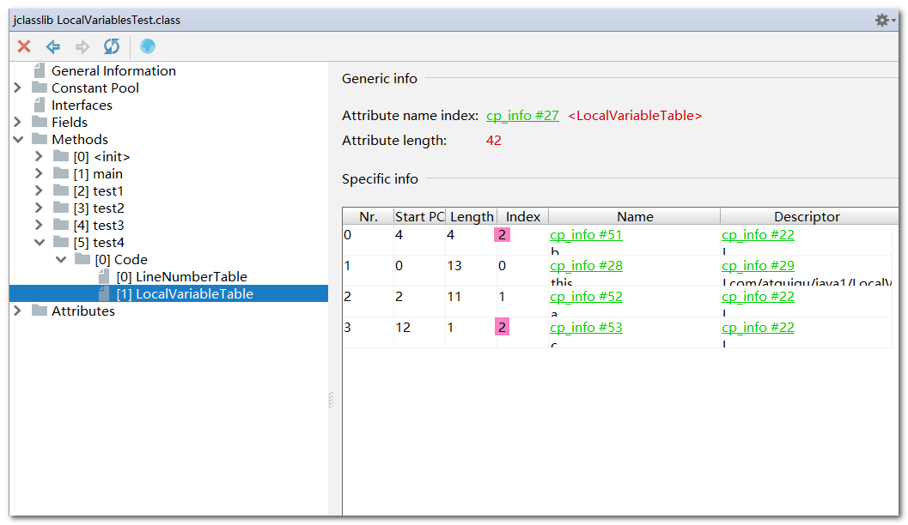
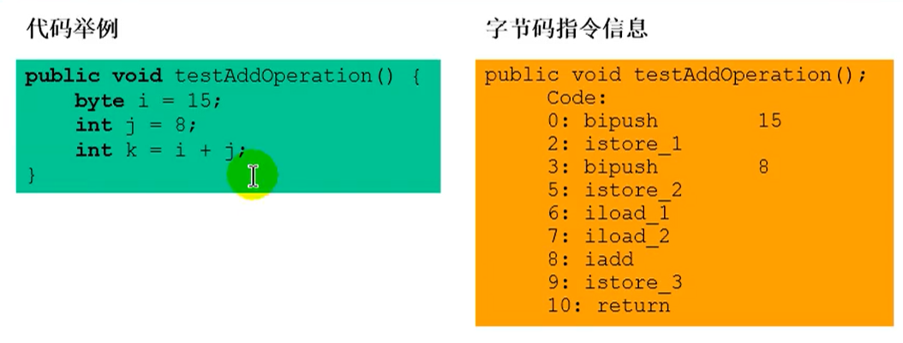
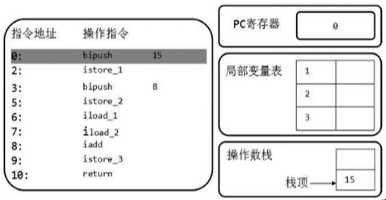
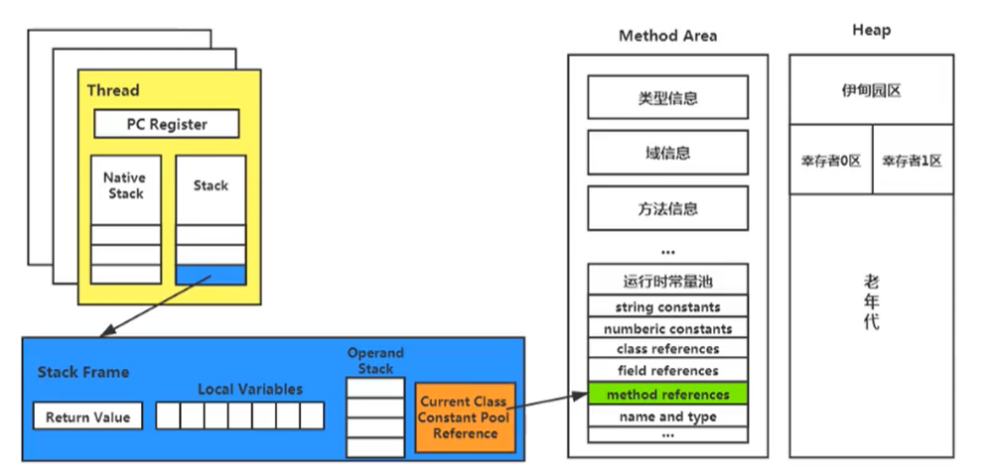
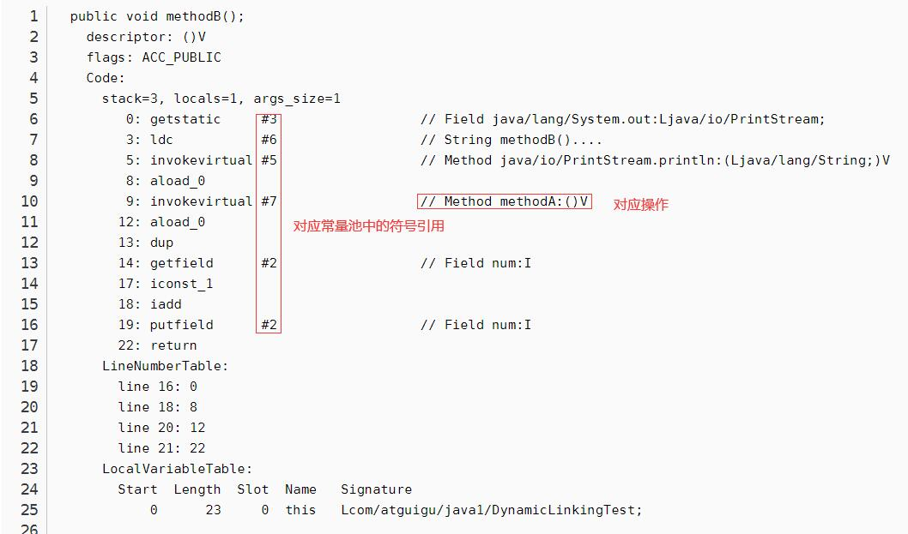

# JVM--内存和垃圾回收

> 笔记来源于《尚硅谷的JVM视频》
>
> 《深入理解JAVA虚拟机》

## 字节码

字节码（Byte-code）是一种包含执行程序，由一序列 op 代码/数据对组成的二进制文件，是一种中间码

平时说的java字节码，指的是用java语言编译成的字节码

> 由于JVM跨语言的平台特性，JVM支持很多语言，所以现在通常讲字节码都是jvm字节码，不同的编译器编译出的字节码文件不同


## 虚拟机

所谓虚拟机（Virtual Machine），就是一台虚拟的计算机。它是一款软件，用来执行一系列虚拟计算机指令

大体上，虚拟机可以分为**系统虚拟机**和**程序虚拟机**


## Java虚拟机

Java虚拟机是一台执行Java字节码的虚拟计算机

JVM平台的各种语言可以共享Java虚拟机带来的跨平台性、优秀的垃圾回器，以及可靠的即时编译器

Java技术的核心就是Java虚拟机（JVM，Java Virtual Machine），因为所有的Java程序都运行在Java虚拟机内部

Java虚拟机就是二进制字节码的运行环境，负责装载字节码到其内部，解释/编译为对应平台上的机器指令执行

特点：

- 一次编译，到处运行
- 自动内存管理
- 自动垃圾回收功能


## JVM所在位置

JVM是运行在操作系统之上的，它与硬件没有直接的交互

> 用户使用高级语言编译产生字节码文件，传入到JVM中解析，再产生运行结果


## JVM架构模型

Java编译器输入的指令流基本上是一种基于栈的指令集架构，另外一种指令集架构则是基于寄存器的指令集架构。具体来说：这两种架构之间的区别：

基于栈式架构的特点

- 设计和实现更简单，适用于资源受限的系统；
- 避开了寄存器的分配难题：使用零地址指令方式分配。
- 指令流中的指令大部分是零地址指令，其执行过程依赖于操作栈。指令集更小，编译器容易实现，但是指令多。
- 不需要硬件支持，可移植性更好，更好实现跨平台


基于寄存器架构的特点

- 典型的应用是x86的二进制指令集：比如传统的PC以及Android的Davlik虚拟机。
- 指令集架构则完全依赖硬件，可移植性差
- 性能优秀和执行更高效
- 花费更少的指令去完成一项操作。
- 在大部分情况下，基于寄存器架构的指令集往往都以一地址指令、二地址指令和三地址指令为主，而基于栈式架构的指令集却是以零地址指令为主方水洋


总结：

- 跨平台性
- 指令集小
- 指令多
- 执行性能比寄存器差

## JVM生命周期

jvm的启动

Java虚拟机的启动是通过引导类加载器（bootstrap class loader）创建一个初始类（initial class）来完成的，这个类是由虚拟机的具体实现指定的


jvm的执行

- 程序开始执行时他才运行，程序结束时他就停止。
- 执行一个所谓的Java程序的时候，真真正正在执行的是一个叫做Java虚拟机的进程。


jvm的退出

有如下的几种情况：

- 程序正常执行结束
- 程序在执行过程中遇到了异常或错误而异常终止
- 由于操作系统用现错误而导致Java虚拟机进程终止
- 某线程调用Runtime类或system类的exit方法，或Runtime类的halt方法，并且Java安全管理器也允许这次exit或halt操作。
- 除此之外，JNI（Java Native Interface）规范描述了用JNI Invocation API来加载或卸载 Java虚拟机时，Java虚拟机的退出情况。

## JVM家族

### Sun Classic VM

1，早在1996年Java1.0版本的时候，Sun公司发布了一款名为sun classic VM的Java虚拟机，它同时也是世界上第一款商用Java虚拟机，在JDK1.4时完全被淘汰

2，这款虚拟机内部只提供解释器，因此效率比较低

3，如果使用JIT编译器，就需要进行外挂。但是一旦使用了JIT编译器，JIT就会接管虚拟机的执行系统。解释器就不再工作。解释器和编译器不能配合工作

4，现在hotspot内置了此虚拟机


### Exact VM：

Exact Memory Management：准确式内存管理

具备现代高性能虚拟机的维形

1，热点探测（寻找出热点代码进行缓存）

2，编译器与解释器混合工作模式


### HotSpot VM

1，JDK1.3时，HotSpot VM成为默认虚拟机

2，不管是现在仍在广泛使用的JDK6，还是使用比例较多的JDK8中，默认的虚拟机都是HotSpot

3，HotSpot指的就是它的热点代码探测技术。

- 通过计数器找到最具编译价值代码，触发即时编译或栈上替换
- 通过编译器与解释器协同工作，在最优化的程序响应时间与最佳执行性能中取得平衡


### JRockit

1，专注于服务器端应用，JRockit内部不包含解析器实现，全部代码都靠即时编译器编译后执行

2，JRockit JVM是世界上最快的JVM


### IBM的J9

1，全称：IBM Technology for Java Virtual Machine，简称IT4J，内部代号：J9

2，市场定位与HotSpot接近，服务器端、桌面应用、嵌入式等多用途VM广泛用于IBM的各种Java产品

3，目前，有影响力的三大商用虚拟机之一，也号称是世界上最快的Java虚拟机


### KVM和CDC / CLDC Hotspot

- 智能控制器、传感器
- 老人手机、经济欠发达地区的功能手机


### Azul VM

1，Azul VM是Azu1Systems公司在HotSpot基础上进行大量改进，运行于Azul Systems公司的专有硬件Vega系统上的ava虚拟机


### Liquid VM

1，高性能Java虚拟机中的战斗机


### Apache Marmony

### Micorsoft JVM

1，微软为了在IE3浏览器中支持Java Applets，开发了Microsoft JVM

### Taobao JVM

1，基于openJDK开发了自己的定制版本AlibabaJDK，简称AJDK。是整个阿里Java体系的基石。

2，基于openJDK Hotspot VM发布的国内第一个优化、深度定制且开源的高性能服务器版Java虚拟机。

3，taobao vm应用在阿里产品上性能高，硬件严重依赖inte1的cpu，损失了兼容性，但提高了性能

4，目前已经在淘宝、天猫上线，把oracle官方JvM版本全部替换了


### Dalvik VM

1，谷歌开发的，应用于Android系统，并在Android2.2中提供了JIT，发展迅猛。

2，Dalvik y只能称作虚拟机，而不能称作“Java虚拟机”，它没有遵循 Java虚拟机规范


### Graal VM


# 类加载子系统

负责加载Class文件

## 流程

> 在.class文件->JVM->最终成为元数据模板，此过程就要一个运输工具（类装载器Class Loader），扮演一个快递员的角色。


字节码文件通过ClasserLoader加载，产生一个Class文件，然后再通过链接（验证，解析），最后就是初始化，调用类`


### 加载阶段

1，通过一个类的全限定名获取定义此类的二进制字节流

2，将这个字节流所代表的静态存储结构转化为方法区的运行时数据结构

3，**在内存中生成一个代表这个类的java.lang.Class对象**，作为方法区这个类的各种数据的访问入口

（class实例实在加载阶段产生的）


### 链接阶段

验证：确保Class文件的字节流中包含信息符合当前虚拟机的要求

主要包括四种验证，文件格式验证，元数据验证，字节码验证，符号引用验证


准备：为类变量分配内存并且设置该类**变量**的默认初始值，零值

（这里强调是将变量赋值）

```java
private int n = 1;
//在这个阶段 n = 0
//在下一个初始化阶段才是将 n = 1；
```


> final修饰的static在编译的时候就已经分配了，因为它已经是常量了
>
> 
>
> 实例变量不会分配，会随着对象一起分配到java堆中


解析：将常量池捏符号引用转换为直接引用

> 在加载类的时候实际上会去加载很多其他的类，不可能每个加载的类都存放在一个堆中，所以实际上是去使用引用


### 初始化阶段

1，初始化阶段就是执行类构造器方法<clinit>()方法的过程，其不同于类的构造器

> **构造器是虚拟机视角下的`<init>()`**
>
> **构造器方法中指令按语句在源文件中出现的顺序执行**


```java
public class ClassInitTest {
    //任何一个类声明以后，内部至少存在一个类的构造器
    private static int num = 1;
    
    static {
        num = 2;
        number = 20;
        System.out.println(num);
        System.out.println(number);  //报错，非法的前向引用
    }

    private static int number = 10;

    public static void main(String[] args) {
        
        System.out.println(ClassInitTest.num); // 2
        System.out.println(ClassInitTest.number); // 10
    }
}
```


> iconst_0  就是加载的变量


值得注意的是：

> 这个方法不需要定义，是编译器自动收集类中的所有类变量的赋值动作和静态代码快中的语句合并
>
> 当不存在赋值动作或者静态代码时，就不会有<clinit>()方法产生


2，该类有父类，在执行子类<clinit>()方法前父类已经执行完成

```java
public class ClinitTest1 {
    static class Father{
        public static int A = 1;
        static{
            A = 2;
        }
    }

    static class Son extends Father{
        public static int B = A;
    }

    public static void main(String[] args) {
        //加载Father类，其次加载Son类。
        System.out.println(Son.B);//2
    }
}
```


3，虚拟机保证一个类的<clinit>()方法在多线程下同步枷锁，也就是说，调用重复创建这个类时只是调用缓存中存在的类对象


这里会导致程序卡死：

有一个线程抢到同步锁，开始加载类，但是static代码块中是个死循环，另一个线程一直等待锁的释放

```java
public class DeadThreadTest {
    public static void main(String[] args) {
        Runnable r = () -> {
            System.out.println(Thread.currentThread().getName() + "开始");
            DeadThread dead = new DeadThread();
            System.out.println(Thread.currentThread().getName() + "结束");
        };

        Thread t1 = new Thread(r, "线程1");
        Thread t2 = new Thread(r, "线程2");

        t1.start();
        t2.start();
    }
}

class DeadThread {
    static {
        if (true) {
            System.out.println(Thread.currentThread().getName() + "初始化当前类");
            while (true) {

            }
        }
    }
}
```


## 类加载器分类

1，JVM支持两种类型的类加载器 。分别为引导类加载器（Bootstrap ClassLoader）和自定义类加载器（User-Defined ClassLoader）

2，Java虚拟机规范将所有派生于抽象类ClassLoader的类加载器都划分为自定义类加载器

> 也就是说，所有直接或者间接继承ClassLoader的加载器都划分为自定义加载器，即**ExtClassLoader 和 AppClassLoader 都属于自定义加载器**
>
> ClassLoader类，它是一个抽象类，其后所有的类加载器都继承自ClassLoader（不包括启动类加载器）
>
> 获取 ClassLoader 途径
>
> ```java
> clazz.getClassloader();//获取当前类的
> 
> Thread.currentThread().getContextClassLoader();//获取当前线程上下文的
> 
> ClassLoader.getSystemClassLoader();//获取系统的
> 
> DriverManager.getCallerClassLoader();//获取调用者的
> ```
>
> 


3，程序中常用的有3个：引导类加载器，扩展类加载器，系统类加载器，额外的还有用户自定义加载器，是包含关系

即

```java
ClassLoader systemClassLoader = ClassLoader.getSystemClassLoader();

// 获取其上层的：扩展类加载器
ClassLoader extClassLoader = systemClassLoader.getParent();

// 试图获取 根加载器（引导类加载器）
ClassLoader bootstrapClassLoader = extClassLoader.getParent();

// 获取自定义加载器
ClassLoader classLoader = ClassLoaderTest.class.getClassLoader();

// 获取String类型的加载器
ClassLoader classLoader1 = String.class.getClassLoader();

```

得到的结果，从结果可以看出 根加载器无法直接通过代码获取，同时目前用户代码所使用的加载器为系统类加载器。

同时我们通过获取String类型的加载器，发现是null，那么说明String类型是通过根加载器进行加载的，也就是说**Java的核心类库都是使用引导类加载器进行加载的**

```
sun.misc.Launcher$AppClassLoader@18b4aac2
sun.misc.Launcher$ExtClassLoader@1540e19d
null
sun.misc.Launcher$AppClassLoader@18b4aac2
null 
```


### 启动加载器

> 引导类加载器，Bootstrap ClassLoader					

1，使用C/C++语言实现的，嵌套在JVM内部

2，它用来加载Java的核心库，用于提供JVM自身需要的类

3，没有父加载器

4，加载扩展类和应用程序类加载器，并作为他们的父类加载器

5，出于安全考虑，Bootstrap启动类加载器只加载包名为java、javax、sun等开头的类

```java
URL[] urLs = sun.misc.Launcher.getBootstrapClassPath().getURLs();
for (URL element : urLs) {
	System.out.println(element.toExternalForm());
}

file:/C:/Program%20Files/Java/jdk1.8.0_144/jre/lib/resources.jar
file:/C:/Program%20Files/Java/jdk1.8.0_144/jre/lib/rt.jar
file:/C:/Program%20Files/Java/jdk1.8.0_144/jre/lib/sunrsasign.jar
file:/C:/Program%20Files/Java/jdk1.8.0_144/jre/lib/jsse.jar
file:/C:/Program%20Files/Java/jdk1.8.0_144/jre/lib/jce.jar
file:/C:/Program%20Files/Java/jdk1.8.0_144/jre/lib/charsets.jar
file:/C:/Program%20Files/Java/jdk1.8.0_144/jre/lib/jfr.jar
file:/C:/Program%20Files/Java/jdk1.8.0_144/jre/classes
```


### 扩展类加载器

> 扩展类加载器，Extension ClassLoader

1，Java语言编写，是Launcher的内部类

2，派生于ClassLoader类

> 从java.ext.dirs系统属性所指定的目录中加载类库，或从JDK的安装目录的jre/lib/ext子目录（扩展目录）下加载类库。如果用户创建的JAR放在此目录下，也会自动由扩展类加载器加载

```java
String extDirs = System.getProperty("java.ext.dirs");
for (String path : extDirs.split(";")) {
	System.out.println(path);
}

C:\Program Files\Java\jdk1.8.0_144\jre\lib\ext
C:\WINDOWS\Sun\Java\lib\ext
```


### 系统类加载器

> 应用程序类加载器，系统类加载器，AppClassLoader
>
> 虚拟机自带
>
> 通过classLoader.getSystemclassLoader()方法可以获取到该类加载器

1，Java语言编写,

2，派生于ClassLoader类

3，父类加载器为扩展类加载器

4，它负责加载环境变量classpath（也就是自定义类的路径）或系统属性java.class.path指定路径下的类库

5，一般来说，Java应用的类都是由它来完成加载


### 用户自定义类加载器

1，隔离加载类

2，修改类加载的方式

3，扩展加载源

4，防止源码泄漏


如何自定义类加载器？

1，继承抽象类java.lang.ClassLoader类

2，在JDK1.2之前，在自定义类加载器时，总会去继承ClassLoader类并重写loadClass()方法，从而实现自定义的类加载类，但是在JDK1.2之后已不再建议用户去覆盖loadClass()方法，而是建议把自定义的类加载逻辑写在findclass()方法中

3，在编写自定义类加载器时，如果没有太过于复杂的需求，可以直接继承URIClassLoader类，这样就可以避免自己去编写findclass()方法及其获取字节码流的方式，使自定义类加载器编写更加简洁

```java
public class CustomClassLoader extends ClassLoader {
    @Override
    protected Class<?> findClass(String name) throws ClassNotFoundException {

        try {
            byte[] result = getClassFromCustomPath(name);
            if (result == null) {
                throw new FileNotFoundException();
            } else {
                return defineClass(name, result, 0, result.length);
            }
        } catch (FileNotFoundException e) {
            e.printStackTrace();
        }

        throw new ClassNotFoundException(name);
    }

    private byte[] getClassFromCustomPath(String name) {
        //从自定义路径中加载指定类:细节略
        //如果指定路径的字节码文件进行了加密，则需要在此方法中进行解密操作。
        return null;
    }

    public static void main(String[] args) {
        CustomClassLoader customClassLoader = new CustomClassLoader();
        try {
            Class<?> clazz = Class.forName("One", true, customClassLoader);
            Object obj = clazz.newInstance();
            System.out.println(obj.getClass().getClassLoader());
        } catch (Exception e) {
            e.printStackTrace();
        }
    }
}
```


### 双亲委派机制

原理

**Java虚拟机对class文件采用的是按需加载的方式**，也就是说当需要使用该类时才会将它的class文件加载到内存生成class对象。

而且**加载某个类的class文件时，Java虚拟机采用的是双亲委派模式，即把请求交由父类处理，它是一种任务委派模式**


1. 如果一个类加载器收到了类加载请求，它并不会自己先去加载，而是把这个请求委托给父类的加载器去执行；
2. 如果父类加载器还存在其父类加载器，则进一步向上委托，依次递归，请求最终将到达顶层的启动类加载器；
3. 如果父类加载器可以完成类加载任务，就成功返回，倘若父类加载器无法完成此加载任务，子加载器才会尝试自己去加载，这就是双亲委派模式。
4. 父类加载器一层一层往下分配任务，如果子类加载器能加载，则加载此类，如果将加载任务分配至系统类加载器也无法加载此类，则抛出异常

> 当自己去创建一个javaapi中的类时，jvm不回去加载自己的类，而是去加载核心库中的java文件


优势

1，避免重复加载类

2，保护程序安全，防止核心API被篡改

代码

```java
//自己创建一个java.lang.String类
package java.lang;

public class String {
    static{
        System.out.println("我是自定义的String类的静态代码块");
    }
}

//测试类去加载自己的String类，看看是什么加载器加载的
public class StringTest {
    public static void main(String[] args) {
        java.lang.String str = new java.lang.String();
        System.out.println("hello,atguigu.com");

        StringTest test = new StringTest();
        System.out.println(test.getClass().getClassLoader());
    }
}

//程序没有输出我的内容，可见没有加载我自己的String类
```


### 沙箱安全机制

自定义String类时：在加载自定义String类的时候会率先使用引导类加载器加载

而引导类加载器在加载的过程中会先加载jdk自带的文件（rt.jar包中java.lang.String.class），报错信息说没有main方法，就是因为加载的是rt.jar包中的String类

```java
package java.lang;

public class String {
    static{
        System.out.println("我是自定义的String类的静态代码块");
    }
    //错误: 在类 java.lang.String 中找不到 main 方法
    public static void main(String[] args) {
        System.out.println("hello,String");
    }
}
```

这样可以保证对java核心源代码的保护，这就是沙箱安全机制

或者

```java
package java.lang;

public class ShkStartShkStart
ShkStart类 {
    public static void main(String[] args) {
        System.out.prShkStart类
```

--输出



# java内存区域

## 运行时数据区域

> Java虚拟机定义了若干种程序运行期间会使用到的运行时数据区
>
> 1. 其中有一些会随着虚拟机启动而创建，随着虚拟机退出而销毁。
> 2. 另外一些则是与线程一一对应的，这些与线程对应的数据区域会随着线程开始和结束而创建和销毁。

### 结构

线程独有：独立包括程序计数器、栈、本地方法栈

线程间共享：堆、堆外内存（永久代或元空间、代码缓存)

> 也就是是一个jvm有5个线程，那么就会产生1一个堆区域，一个方法去共享，然而各个线程都会有自己的虚拟机栈，本地方法栈，程序计数器
>
> 一个运行程序所产生一个Runtime对象，对应着一个jvm进程




## 线程

- 线程是一个程序里的运行单元。JVM允许一个应用有多个线程并行的执行
- 在Hotspot JVM里，**每个线程都与操作系统的本地线程直接映射**
- 当一个Java线程准备好执行以后，此时一个操作系统的本地线程也同时创建。Java线程执行终止后，本地线程也会回收
- 操作系统负责将线程安排调度到任何一个可用的CPU上。一旦本地线程初始化成功，它就会调用Java线程中的run()方法
- 如果一个线程抛异常，并且该线程时进程中最后一个守护线程，那么进程将停止


jvm主要的系统线程（了解）

**虚拟机线程**：这种线程的操作是需要JVM达到安全点才会出现。这些操作必须在不同的线程中发生的原因是他们都需要JVM达到安全点，这样堆才不会变化。这种线程的执行类型括"stop-the-world"的垃圾收集，线程栈收集，线程挂起以及偏向锁撤销

**周期任务线程**：这种线程是时间周期事件的体现（比如中断），他们一般用于周期性操作的调度执行

**GC线程**：这种线程对在JVM里不同种类的垃圾收集行为提供了支持

**编译线程**：这种线程在运行时会将字节码编译成到本地代码

**信号调度线程**：这种线程接收信号并发送给JVM，在它内部通过调用适当的方法进行处理


# 程序计数器

## PC寄存器

1，JVM中的PC寄存器是对物理PC寄存器的一种抽象模拟，不是实际存在的

2，它是一块很小的内存空间，几乎可以忽略不记。也是**运行速度最快的存储区域**,

3，**在JVM规范中，每个线程都有它自己的程序计数器，是线程私有的**

4，**程序计数器会存储当前线程正在执行的Java方法的JVM指令地址**

5，它是**唯一一个**在Java虚拟机规范中没有规定任何OutofMemoryError情况的区域（没有异常输出）


作用：PC寄存器用来存储指向**下一条指令的地址**，也即将要执行的指令代码。由执行引擎读取下一条指令，并执行该指令。

### 使用

```java
public static void main(String[] args) {
        int i = 10;
        int j = 20;
        int k = i + j;
        String s = "abc";
        System.out.println(i);
        System.out.println(k);
    }
```

使用反编译

```java
E:\IDEAProject\DataStructures\out\production\DataStructures\tutu\demo\LinkedList>javap -v test.class
```

输出的main方法信息

```java
 public static void main(java.lang.String[]);
    descriptor: ([Ljava/lang/String;)V
    flags: (0x0009) ACC_PUBLIC, ACC_STATIC
    Code:
      stack=2, locals=5, args_size=1
         0: bipush        10
         2: istore_1
         3: bipush        20
         5: istore_2
         6: iload_1
         7: iload_2
         8: iadd
         9: istore_3
        10: ldc           #2                  // String abc
        12: astore        4
        14: getstatic     #3                  // Field java/lang/System.out:Ljava/io/PrintStream;
        17: iload_1
        18: invokevirtual #4                  // Method java/io/PrintStream.println:(I)V
        21: getstatic     #3                  // Field java/lang/System.out:Ljava/io/PrintStream;
        24: iload_3
        25: invokevirtual #4                  // Method java/io/PrintStream.println:(I)V
        28: return
```

分析




### 作用

**使用PC寄存器存储字节码指令地址有什么用呢？**

1，因为线程是一个个的顺序执行流，CPU需要不停的切换各个线程，切换回来以后，就得知道接着从哪开始继续执行

2，JVM的字节码解释器就需要通过改变PC寄存器的值来明确下一条应该执行什么样的字节码指令


**PC寄存器为什么被设定为私有的**

为了能够准确地记录各个线程正在执行的当前字节码指令地址，最好的办法自然是为每一个线程都分配一个PC寄存器


#  虚拟机栈

背景

1. **由于跨平台性的设计，Java的指令都是根据栈来设计的**。不同平台CPU架构不同，所以不能设计为基于寄存器的。
2. **优点是跨平台，指令集小，编译器容易实现，缺点是性能下降，实现同样的功能需要更多的指令**。


## 栈与堆

1,首先栈是运行时的单位，而堆是存储的单位

2,栈解决程序的运行问题，即程序如何执行，或者说如何处理数据。

3,解决的是数据存储的问题，即数据怎么放，放哪里


## 概念

ava虚拟机栈（Java Virtual Machine Stack），早期也叫Java栈。每个线程在创建时都会创建一个虚拟机栈，其内部保存一个个的栈帧（Stack Frame），对应着一次次的Java方法调用


## 生命周期

**生命周期和线程一致**


## 特点

1，对于栈来说不存在垃圾回收问题（栈存在溢出的情况）

2 ，Java 虚拟机规范允许Java栈的大小**是动态的或者是固定不变的**。

3，如果采用固定大小的Java虚拟机栈，那每一个线程的Java虚拟机栈容量可以在线程创建的时候独立选定。

4，如果线程请求分配的栈容量超过Java虚拟机栈允许的最大容量，Java虚拟机将会抛出一个**StackoverflowError** 异常


栈溢出异常代码

```java
public class StackErrorTest {
    private static int count = 1;
    public static void main(String[] args) {
        System.out.println(count);
        count++;
        main(args);
    }
}
```


## 设置栈的大小

```
-Xss 1024m		// 栈内存为 1024MBS
```


## 栈的运行原理

1. JVM直接对Java栈的操作只有两个，就是对栈帧的**压栈和出栈**，遵循先进后出（后进先出）原则
2. 在一条活动线程中，一个时间点上，只会有一个活动的栈帧。即**只有当前正在执行的方法的栈帧（栈顶栈帧）是有效的**
   - 这个栈帧被称为**当前栈帧（Current Frame）**
   - 与当前栈帧相对应的方法就是**当前方法（Current Method）**
   - 定义这个方法的类就是**当前类（Current Class）**
3. 执行引擎运行的所有字节码指令只针对当前栈帧进行操作。
4. 如果在该方法中调用了其他方法，对应的新的栈帧会被创建出来，放在栈的顶端，成为新的当前帧。
5. **不同线程中所包含的栈帧是不允许存在相互引用的**，即不可能在一个栈帧之中引用另外一个线程的栈帧。
6. 如果当前方法调用了其他方法，**方法返回之际，当前栈帧会传回此方法的执行结果给前一个栈帧**，接着，虚拟机会丢弃当前栈帧，使得前一个栈帧重新成为当前栈帧。
7. Java方法有两种返回函数的方式，但不管使用哪种方式，都会导致栈帧被弹出
   - 一种是**正常的函数返回**，使用return指令
   - 另外一种是**抛出异常**


## 栈帧内部结构

1. 局部变量表（Local Variables）
2. 操作数栈（Operand Stack）（或表达式栈）
3. 动态链接（Dynamic Linking）（或指向运行时常量池的方法引用）
4. 方法返回地址（Return Address）（或方法正常退出或者异常退出的定义）
5. 一些附加信息




### 局部变量表

1. 局部变量表：**Local Variables，被称之为局部变量数组或本地变量表**
2. 定义为一个**数字数组**，主要用于**存储方法参数和定义在方法体内的局部变量**，这些数据类型包括各类基本数据类型、对象引用（reference），以及returnAddress类型。
3. 由于局部变量表是建立在线程的栈上，是线程的私有数据，因此**不存在数据安全问题**
4. **局部变量表所需的容量大小是在编译期确定下来的**，并保存在方法的Code属性的**maximum local variables**数据项中。在方法运行期间是不会改变局部变量表的大小的。
5. 方法嵌套调用的次数由栈的大小决定。一般来说，栈越大，方法嵌套调用次数越多。
   - 对一个函数而言，它的参数和局部变量越多，使得局部变量表膨胀，它的栈帧就越大，以满足方法调用所需传递的信息增大的需求。
   - 进而函数调用就会占用更多的栈空间，导致其嵌套调用次数就会减少。
6. 局部变量表中的变量只在当前方法调用中有效。
   - 在方法执行时，虚拟机通过使用局部变量表完成参数值到参数变量列表的传递过程。
   - 当方法调用结束后，随着方法栈帧的销毁，局部变量表也会随之销毁。


#### Slot

- 参数值的存放总是**从局部变量数组索引 0 的位置开始，到数组长度-1的索引结束**
- **局部变量表，最基本的存储单元是Slot（变量槽）**
- **32位以内的类型只占用一个slot**（包括returnAddress类型），**64位的类型占用两个slot**（1ong和double）

> 如何查看一个类型占用了几个slot
>
> 可以通过jclasslib中的index查看，两个类型的index相差多远

- **JVM会为局部变量表中的每一个Slot都分配一个访问索引**
  - 通过这个索引即可成功访问到局部变量表中指定的局部变量值
- **this将会存放在index为0的slot处**，其余的参数按照参数表顺序继续排列
- 重复利用问题

> 如果一个局部变量过了其作用域，
>
> 那么在其作用域之后申明新的局部变量变就很有可能会复用过期局部变量的槽位

```java
public void test4() {
    int a = 0;
    {
        int b = 0;
        b = a + 1;
    }
    //变量c使用之前已经销毁的变量b占据的slot的位置
    int c = a + 1;
}
```




#### 静态/局部变量的对比

类变量（静态变量）表有两次初始化的机会**，**

第一次是在“准备阶段”，执行系统初始化，对类变量设置零值，另一次则是在“初始化”阶段，赋予程序员在代码中定义的初始值


**局部变量表不存在系统初始化的过程**


#### 补充说明

1. 在栈帧中，与性能调优关系最为密切的部分就是前面提到的局部变量表。在方法执行时，虚拟机使用局部变量表完成方法的传递。
2. **局部变量表中的变量也是重要的垃圾回收根节点**，只要被局部变量表中直接或间接引用的对象都不会被回收。


### 操作数栈

#### 特点

操作数栈，在方法执行过程中，**根据字节码指令，往栈中写入数据或提取数据**，即入栈和 出栈

举例



#### 作用

主要用于保存计算过程的中间结果，同时作为计算过程中变量临时的存储空间

其所需的**最大深度在编译期就定义好了**，保存在方法的Code属性中，为**maxstack**的值

其**返回值将会被压入当前栈帧的操作数栈中**，并更新PC寄存器中下一条需要执行的字节码指令


#### 执行流程



1,`bipush`：将15放入操作数栈的栈顶中

2，`istore_1`：将15放在局部变量表的索引（index）为1对应的地方

3，`pc寄存器`指向下一个地址指令


#### ++i 与 i++ 的区别

> 待补充代码和笔记


#### 栈顶缓存技术

执行代码的时候所涉及到的指令很多，每一项的操作一定会涉及很多出栈入栈操作，意味着对内存更多的读写操作，这样会影响执行速度，所以就有了栈顶缓存技术：将栈顶元素全部缓存在物理CPU的寄存器中，以此降低对内存的读写次数，提高效率


### 静态链接

（static Linking）

当一个字节码文件被装载进JVM内部时，**如果被调用的目标方法在编译期确定，且运行期保持不变时**，这种情况下将调用方法的符号引用转换为直接引用的过程称之为静态链接


### 动态链接

（Dynamic Linking）

> **如果被调用的方法在编译期无法被确定下来**，也就是说，**只能够在程序运行期将调用的方法的符号转换为直接引用**，由于这种引用转换过程具备**动态性**，因此也被称之为动态链接。

1，每一个栈帧都包含一个指向运行时常量池中该栈帧所属方法的引用，使得当前方法能实现动态链接

> 在Java源文件被编译到字节码文件中时，**所有的变量和方法引用都作为符号引用（Symbolic Reference）保存在class文件的常量池里**

2，动态链接的作用就是为了将这些符号引用转换为调用方法的直接引用



例子




#### 使用常量池的原因

1. 因为在不同的方法，都可能调用常量或者方法，所以**只需要存储一份即可，然后记录其引用即可，节省了空间**
2. 常量池的作用：就是为了提供一些符号和常量，便于指令的识别


### 虚方法和非虚方法

非虚方法：编译器就确定下来的调用版本，并且版本运行时不可变

虚方法：和非虚方法相反

> 静态方法、私有方法、final方法、实例构造器、父类方法都是非虚方法，其他的都是虚方法


### 4条表明方法的指令

1. invokestatic：调用静态方法，解析阶段确定唯一方法版本
2. invokespecial：调用`<init>`方法、私有及父类方法，解析阶段确定唯一方法版本
3. invokevirtual：调用所有虚方法
4. invokeinterface：调用接口方法

```java
class Animal {
    public void eat() {
        System.out.println("动物进食");
    }
}
interface Huntable {
    void hunt();
}
class Dog extends Animal implements Huntable {
    @Override
    public void eat() {
        System.out.println("狗吃骨头");
    }
    @Override
    public void hunt() {
        System.out.println("捕食耗子，多管闲事");
    }
}
class Cat extends Animal implements Huntable {
    //invokespecial
    public Cat() {
        super();//表现为：早期绑定
    }

    public Cat(String name) {
        this();//表现为：早期绑定
    }

    @Override
    public void eat() {
        super.eat();//表现为：早期绑定
        System.out.println("猫吃鱼");
    }

    @Override
    public void hunt() {
        System.out.println("捕食耗子，天经地义");
    }
}

public class AnimalTest {
    //invokevirtual
    public void showAnimal(Animal animal) {
        animal.eat();//表现为：晚期绑定
    }
	//invokeinterface
    public void showHunt(Huntable h) {
        h.hunt();//表现为：晚期绑定
    }
}
```

