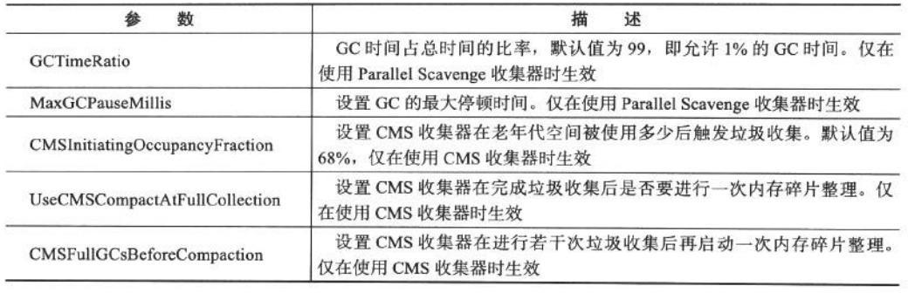

# 标题：JVM--内存和垃圾回收

> 笔记来源于《尚硅谷的JVM视频》《深入理解JAVA虚拟机》
>

# JVM与java体系结构

## 字节码

字节码（Byte-code）是一种包含执行程序，由一序列 op 代码/数据对组成的二进制文件，是一种中间码

平时说的java字节码，指的是用java语言编译成的字节码

> 由于JVM跨语言的平台特性，JVM支持很多语言，所以现在通常讲字节码都是jvm字节码，不同的编译器编译出的字节码文件不同

## 虚拟机

所谓虚拟机（Virtual Machine），就是一台虚拟的计算机。它是一款软件，用来执行一系列虚拟计算机指令

大体上，虚拟机可以分为**系统虚拟机**和**程序虚拟机**

## Java虚拟机

Java虚拟机是一台执行Java字节码的虚拟计算机

JVM平台的各种语言可以共享Java虚拟机带来的跨平台性、优秀的垃圾回器，以及可靠的即时编译器

Java技术的核心就是Java虚拟机（JVM，Java Virtual Machine），因为所有的Java程序都运行在Java虚拟机内部

Java虚拟机就是二进制字节码的运行环境，负责装载字节码到其内部，解释/编译为对应平台上的机器指令执行

特点：

- 一次编译，到处运行
- 自动内存管理
- 自动垃圾回收功能

## JVM所在位置

JVM是运行在操作系统之上的，它与硬件没有直接的交互

> 用户使用高级语言编译产生字节码文件，传入到JVM中解析，再产生运行结果

## JVM架构模型

Java编译器输入的指令流基本上是一种基于栈的指令集架构，另外一种指令集架构则是基于寄存器的指令集架构。具体来说：这两种架构之间的区别：

基于栈式架构的特点

- 设计和实现更简单，适用于资源受限的系统；
- 避开了寄存器的分配难题：使用零地址指令方式分配。
- 指令流中的指令大部分是零地址指令，其执行过程依赖于操作栈。指令集更小，编译器容易实现，但是指令多。
- 不需要硬件支持，可移植性更好，更好实现跨平台

基于寄存器架构的特点

- 典型的应用是x86的二进制指令集：比如传统的PC以及Android的Davlik虚拟机。
- 指令集架构则完全依赖硬件，可移植性差
- 性能优秀和执行更高效
- 花费更少的指令去完成一项操作。
- 在大部分情况下，基于寄存器架构的指令集往往都以一地址指令、二地址指令和三地址指令为主，而基于栈式架构的指令集却是以零地址指令为主方水洋

总结：

- 跨平台性
- 指令集小
- 指令多
- 执行性能比寄存器差

## JVM生命周期

jvm的启动

Java虚拟机的启动是通过引导类加载器（bootstrap class loader）创建一个初始类（initial class）来完成的，这个类是由虚拟机的具体实现指定的

jvm的执行

- 程序开始执行时他才运行，程序结束时他就停止。
- 执行一个所谓的Java程序的时候，真真正正在执行的是一个叫做Java虚拟机的进程。

jvm的退出

有如下的几种情况：

- 程序正常执行结束
- 程序在执行过程中遇到了异常或错误而异常终止
- 由于操作系统用现错误而导致Java虚拟机进程终止
- 某线程调用Runtime类或system类的exit方法，或Runtime类的halt方法，并且Java安全管理器也允许这次exit或halt操作。
- 除此之外，JNI（Java Native Interface）规范描述了用JNI Invocation API来加载或卸载 Java虚拟机时，Java虚拟机的退出情况。

## JVM的整体结构

## Java代码执行流程

## JVM的架构模型

Java编译器输入的指令流基本上是一种基于栈的指令集架构，另外一种指令集架构则是基于寄存器的指令集架构。

具体来说：这两种架构之间的区别：

**基于栈式架构的特点**

- 设计和实现更简单，适用于资源受限的系统

- 避开了寄存器的分配难题：使用零地址指令方式分配

- 指令流中的指令大部分是零地址指令，其执行过程依赖于操作栈。指令集更小，编译器容易实现

- 不需要硬件支持，可移植性更好，更好实现跨平台

**基于寄存器架构的特点**

- 典型的应用是x86的二进制指令集：比如传统的PC以及Android的Davlik虚拟机

- 指令集架构则完全依赖硬件，可移植性差

- 性能优秀和执行更高效

- 花费更少的指令去完成一项操作

- 在大部分情况下，基于寄存器架构的指令集往往都以一地址指令、二地址指令和三地址指令为主，而基于栈式架构的指令集却是以零地址指令为主

## JVM家族

### Sun Classic VM

1，早在1996年Java1.0版本的时候，Sun公司发布了一款名为sun classic VM的Java虚拟机，它同时也是世界上第一款商用Java虚拟机，在JDK1.4时完全被淘汰

2，这款虚拟机内部只提供解释器，因此效率比较低

3，如果使用JIT编译器，就需要进行外挂。但是一旦使用了JIT编译器，JIT就会接管虚拟机的执行系统。解释器就不再工作。解释器和编译器不能配合工作

4，现在hotspot内置了此虚拟机

### Exact VM：

Exact Memory Management：准确式内存管理

具备现代高性能虚拟机的维形

1，热点探测（寻找出热点代码进行缓存）

2，编译器与解释器混合工作模式

### HotSpot VM

1，JDK1.3时，HotSpot VM成为默认虚拟机

2，不管是现在仍在广泛使用的JDK6，还是使用比例较多的JDK8中，默认的虚拟机都是HotSpot

3，HotSpot指的就是它的热点代码探测技术。

- 通过计数器找到最具编译价值代码，触发即时编译或栈上替换
- 通过编译器与解释器协同工作，在最优化的程序响应时间与最佳执行性能中取得平衡

### JRockit

1，专注于服务器端应用，JRockit内部不包含解析器实现，全部代码都靠即时编译器编译后执行

2，JRockit JVM是世界上最快的JVM

### IBM的J9

1，全称：IBM Technology for Java Virtual Machine，简称IT4J，内部代号：J9

2，市场定位与HotSpot接近，服务器端、桌面应用、嵌入式等多用途VM广泛用于IBM的各种Java产品

3，目前，有影响力的三大商用虚拟机之一，也号称是世界上最快的Java虚拟机

### KVM和CDC / CLDC Hotspot

- 智能控制器、传感器
- 老人手机、经济欠发达地区的功能手机

### Azul VM

1，Azul VM是Azu1Systems公司在HotSpot基础上进行大量改进，运行于Azul Systems公司的专有硬件Vega系统上的ava虚拟机

### Liquid VM

1，高性能Java虚拟机中的战斗机

### Apache Marmony

### Micorsoft JVM

1，微软为了在IE3浏览器中支持Java Applets，开发了Microsoft JVM

### Taobao JVM

1，基于openJDK开发了自己的定制版本AlibabaJDK，简称AJDK。是整个阿里Java体系的基石。

2，基于openJDK Hotspot VM发布的国内第一个优化、深度定制且开源的高性能服务器版Java虚拟机。

3，taobao vm应用在阿里产品上性能高，硬件严重依赖inte1的cpu，损失了兼容性，但提高了性能

4，目前已经在淘宝、天猫上线，把oracle官方JvM版本全部替换了

### Dalvik VM

1，谷歌开发的，应用于Android系统，并在Android2.2中提供了JIT，发展迅猛。

2，Dalvik y只能称作虚拟机，而不能称作“Java虚拟机”，它没有遵循 Java虚拟机规范

### Graal VM

# GC算法

## 什么样的对象需要回收？

对象到GC Roots没有引用链，那么这个对象不可用，需要回收

## 什么可作为GC Root对象

- 虚拟机栈的引用对象
- 方法区中的类静态属性引用的对象
- 方法区中的常量引用对象
- 本地方法栈中JNI（native方法）引用的对象

## 算法

### 标记-清除算法

- 标记所有需要回收的对象，标记完成后统一回收所有被标记的对象
- 标记和清除两个效率低
- 清除后会有大量的不连续的内存碎片，导致分配较大对象时无法找到足够的连续内存空间，而提前出发另一次垃圾回收

### 复制算法

### 标记整理算法

### 分代收集算法

## GC

### Minor GC

### Full GC

### MinGC

### YGC

说白了就是复制算法，对象只会存在于 Eden 区和名为“From”的
Survivor 区，Survivor 区“To”是空的。紧接着进行 GC，Eden 区中所有存活的对象都会被复制
到“To”，而在“From”区中，仍存活的对象会根据他们的年龄值来决定去向。年龄达到一定值
(年龄阈值，可以通过
-XX:MaxTenuringThreshold 来设置)的对象会被移动到年老代中，没有达到阈值的对象会被复制到
“To”区域。经过这次 GC 后，Eden 区和 From 区已经被清空。这个时候，“From”和“To”会
交换他们的角色，也就是新的“To”就是上次 GC 前的“From”，新的“From”就是上次 GC 前
的“To”。不管怎样，都会保证名为 To 的 Survivor 区域是空的。Minor GC 会一直重复这样的过
程，直到“To” 区被填满，“To”区被填满之后，会将所有对象移动到年老代中。
其中如果发生晋升失败的情况，那么说明老年代的内存空间不够用了，需要进行一次 FullGC

### FGC

FGC 就是标记整理或者是标记清除算法来清除老年代

## 内存泄露

### 检查内存泄露的工具

# JVM调优：补充

字节跳动第二期中有提到

#  jstat jmap jps jinfo jconsole

字节跳动第二期中有提到

# jvm参数

-Xmx3550m：设置 JVM 最大堆内存为 3550M。
-Xms3550m：设置 JVM 初始堆内存为 3550M。此值可以设置与-Xmx 相同，以避免每次垃圾回
收完成后 JVM 重新分配内存。
-Xss128k：设置每个线程的栈大小。JDK5.0 以后每个线程栈大小为 1M，之前每个线程栈大小为
256K。应当根据应用的线程所需内存大小进行调整。在相同物理内存下，减小这个值能生成更多的
线程。但是操作系统对一个进程内的线程数还是有限制的，不能无限生成， 经验值在
3000~5000 左右。需要注意的是：当这个值被设置的较大（例如>2MB）时将会在很大程度上降低
系统的性能。
-Xmn2g：设置年轻代大小为 2G。在整个堆内存大小确定的情况下，增大年轻代将会减小年老代，
反之亦然。此值关系到 JVM 垃圾回收，对系统性能影响较大，官方推荐配置为整个堆大小的 3/8。
-XX:NewSize=1024m：设置年轻代初始值为 1024M。
-XX:MaxNewSize=1024m：设置年轻代最大值为 1024M。
第 73 页 共 210 页
-XX:PermSize=256m：设置持久代初始值为 256M。
-XX:MaxPermSize=256m：设置持久代最大值为 256M。
-XX:NewRatio=4：设置年轻代（包括 1 个 Eden 和 2 个 Survivor 区）与年老代的比值。表示年轻
代比年老代为 1:4。
-XX:SurvivorRatio=4：设置年轻代中 Eden 区与 Survivor 区的比值。表示 2 个 Survivor 区
（JVM 堆内存年轻代中默认有 2 个大小相等的 Survivor 区）与 1 个 Eden 区的比值为 2:4， 即 1
个 Survivor 区占整个年轻代大小的 1/6。
-XX:MaxTenuringThreshold=7：表示一个对象如果在 Survivor 区（救助空间）移动了 7 次还没
有被垃圾回收就进入年老代。如果设置为 0 的话，则年轻代对象不经过 Survivor 区， 直接进入年
老代，对于需要大量常驻内存的应用，这样做可以提高效率。如果将此值设置为一个较大值，则年
轻代对象会在 Survivor 区进行多次复制，这样可以增加对象在年轻代存活时间，增加对象在年轻代
被垃圾回收的概率，减少 Full GC 的频率，这样做可以在某种程度上提高服务稳定性。
-XX:PretenureSizeThreshold 直接晋升到老年代的对象大小，设置这个参数后，大于这个参
数的对象将直接在老年代分配。
-XX：MaxTenuringThreshold 每次 minorGC 就增加一次，超过这个值，在 from 中的对象直接进

# 面试题

## 一般 Java 堆是如何实现的？

在 HotSpot 虚拟机实现中，Java 堆分成了新生代和老年代，我当时看的是 1.7 的实现， 所有
还有永久代，新生代中又分为了 eden 区和 survivor 区，survivor 区又分成了 S0 和 S1，或则是
from 和 to，（这个时候，我要求纸和笔，因为我觉得这个话题可以聊蛮长时间，又是我比较熟悉
的...一边画图，一边描述），其中 eden，from 和 to 的内存大小默认是 8:1:1
（各种细节都要说出来...），此时，我已经在纸上画出了新生代和老年代代表的区域

## 对象在内存中的初始化过程

首先查看类的符号引用，看是否已经在常量池中，在说明已经加载过了，不在的话需要进行类的加
载，验证，准备，解析，初始化的过程。
上诉过程执行完毕以后，又将 Student 加载进内存，也就是存储 Student.class
的字段信息和方法信息，存储到方法区中
字段信息：存放类中声明的每一个字段的信息，包括字段的名、类型、修饰符。方法信息：类中声
明的每一个方法的信息，包括方法名、返回值类型、参数类型、修饰符、异常、方法的字节码。
3.然后在自己的线程私有的虚拟机栈中，存储该引用，然后在每个线程的私有空间里面去分配空间存
储 new Student(),如果空间不足在 eden 区域进行分配空间
4.对类中的成员变量进行默认初始化
5.对类中的成员变量进行显示初始化
6.有构造代码块就先执行构造代码块，如果没有，则省略(此步上文未体现)
7.执行构造方法，通过构造方法对对对象数据进行初始化
8.堆内存中的数据初始化完毕，把内存值复制给 s 变量

## 对象的强、软、弱和虚引用

⑴强引用（StrongReference）
强引用是使用最普遍的引用。如果一个对象具有强引用，那垃圾回收器绝不会回收它。
⑵软引用（SoftReference）
如果一个对象只具有软引用，则内存空间足够，垃圾回收器就不会回收它；如果内存空间不足了，
就会回收这些对象的内存
⑶弱引用（WeakReference）
弱引用与软引用的区别在于：只具有弱引用的对象拥有更短暂的生命周期。在垃圾回收器线程扫描
它所管辖的内存区域的过程中，一旦发现了只具有弱引用的对象，不管当前内存空间足够与否，都
会回收它的内存
⑷虚引用（PhantomReference）
“虚引用”顾名思义，就是形同虚设，与其他几种引用都不同，虚引用并不会决定对象的生命周
期。如果一个对象仅持有虚引用，那么它就和没有任何引用一样，在任何时候都可能被垃圾回收器
回收。

## 如何减少 GC 的次数

对象不用时最好显示置为 NULL
一般而言，为 NULL 的对象都会被作为垃圾处理，所以将不用的对象置为
NULL，有利于 GC 收集器判定垃圾，从而提高了 GC 的效率。
尽量少使用 System,gc()
此函数建议 JVM 进行主 GC，会增加主 GC 的频率，增加了间接性停顿的次数。
尽量少使用静态变量
静态变量属于全局变量，不会被 GC 回收，他们会一直占用内存
尽量使用 StringBuffer,而不使用 String 来累加字符串
分散对象创建或删除的时间
集中在短时间内大量创建新对象，特别是大对象，会导致突然需要大量内存，
JVM 在这种
情况下只能进行主 GC 以回收内存，从而增加主 GC 的频率。
尽量少用 finaliza 函数
它会加大 GC 的工作量。
如果有需要使用经常用到的图片，可以使用软引用类型，将图片保存在内存中， 而不引起
outofmemory
能用基本类型入 INT 就不用对象 Integer
增大-Xmx 的值

##  新生代 老年代 永久代

年轻代：
事实上，在上一节，已经介绍了新生代的主要垃圾回收方法，在新生代中，使用“停止-复制”算法
进行清理，将新生代内存分为 2 部分，1 部分 Eden 区较大，1 部分Survivor 比较小，并被划分为
两个等量的部分。每次进行清理时，将Eden 区和一个 Survivor 中仍然存活的对象拷贝到 另一个
Survivor 中，然后清理掉 Eden 和刚才的 Survivor。
这里也可以发现，停止复制算法中，用来复制的两部分并不总是相等的（传统的停止复制算法两部
分内存相等，但新生代中使用 1 个大的 Eden 区和 2 个小的 Survivor 区来避免这个问题）
由于绝大部分的对象都是短命的，甚至存活不到Survivor 中，所以，Eden 区与 Survivor 的比例较
大， HotSpot 默认是 8:1，即分别占新生代的 80%，10%，10%。如果一次回收中，
Survivor+Eden 中存活下来的内存超过了 10%，则需要将一部分对象分配到 老年代。用-
XX:SurvivorRatio 参数来配置 Eden 区域Survivor 区的容量比值，默认是 8，代表 Eden：
Survivor1：Survivor2=8:1:1.
老年代：
老年代存储的对象比年轻代多得多，而且不乏大对象，对老年代进行内存清理时，如果使用停止-复
制算法，则相当低效。一般，老年代用的算法是标记-整理算法，即：标记出仍然存活的对象（存在
引用的）， 将所有存活的对象向一端移动，以保证内存的连续。
在发生 Minor GC 时，虚拟机会检查每次晋升进入老年代的大小是否大于老年代的剩余空间大小，
如果大于，则直接触发一次 Full GC，否则，就查看是否设置了-XX:+HandlePromotionFailure
（允许担保失败）， 如果允许，则只会进行 MinorGC，此时可以容忍内存分配失败；如果不允
许，则仍然进行 Full GC（这代表着如果设置-XX:+Handle PromotionFailure，则触发 MinorGC
就会同时触发 Full GC，哪怕老年代还有很多内存，所以，最好不要这样做）。
方法区（永久代）：
永久代的回收有两种：常量池中的常量，无用的类信息，常量的回收很简单，没有引用了就可以被
回收。对于无用的类进行回收，必须保证 3 点：
1.类的所有实例都已经被回收
2.加载类的 ClassLoader 已经被回收
3.类对象的 Class 对象没有被引用（即没有通过反射引用该类的地方）
永久代的回收并不是必须的，可以通过参数来设置是否对类进行回收。HotSpot 提供-Xnoclassgc
进行控制
使用-verbose，-XX:+TraceClassLoading、-XX:+TraceClassUnLoading 可以查看类加载和卸载
信息
-verbose、-XX:+TraceClassLoading 可以在 Product 版 HotSpot 中使用；
-XX:+TraceClassUnLoading 需要 fastdebug 版 HotSpot 支持