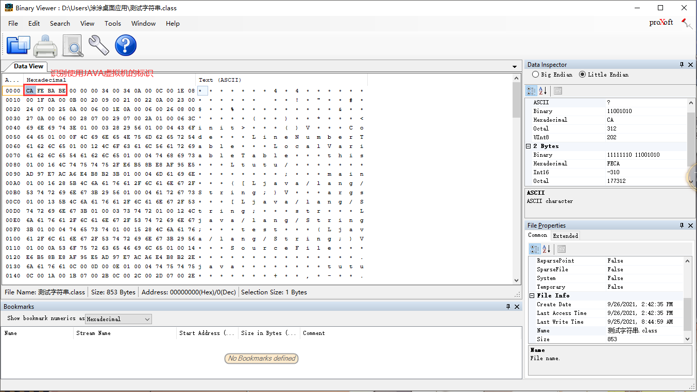

# 类加载子系统

负责加载Class文件


## 加载流程

> 在.class文件->JVM->最终成为元数据模板，此过程就要一个运输工具（类装载器Class Loader），扮演一个快递员的角色。


字节码文件通过ClasserLoader加载，产生一个Class文件，然后再通过链接（验证，解析），最后就是初始化，调用类


- 类加载器子系统负责从文件系统或者网络中加载Class文件，class文件在文件开头有特定的文件标识。

- ClassLoader只负责class文件的加载，至于它是否可以运行，则由Execution Engine决定。

- 加载的类信息存放于一块称为方法区的内存空间。除了类的信息外，方法区中还会存放运行时常量池信息，可能还包括字符串字面量和数字常量（这部分常量信息是Class文件中常量池部分的内存映射）


简单的加载

```java
public class HelloLoader {
    public static void main(String[] args) {
        System.out.println("Hello World!");
    }
}
```

具体简单的加载过程如下


### 加载阶段

1，通过一个类的全限定名获取定义此类的二进制字节流，进内存

2，将这个字节流所代表的静态存储结构转化为方法区的运行时数据结构

3，**在内存中生成一个代表这个类的java.lang.Class对象**，作为方法区这个类的各种数据的访问入口

> 这个类存放在哪里呢？
>
> 堆？方法区放它的引用

--

> 注意：class实例实在加载阶段产生的
>


### 链接阶段

#### 验证

确保Class文件的字节流中包含信息符合当前虚拟机的要求

主要包括四种验证，文件格式验证，元数据验证，字节码验证，符号引用验证


> 使用Binary Viewer 查看字节码文件




#### 准备

为类变量分配内存并且设置该类**变量**的默认初始值，零值

> 这里强调是将变量赋值
>

```java
private int n = 1;
//在这个阶段 n = 0
//在下一个初始化阶段才是将 n = 1；
```


> final修饰的static在编译的时候就已经分配了，因为它已经是常量了
>
> 实例变量不会分配，因为这个时候还没有创建对象，后续会随着对象一起分配到java堆中


**那么静态变量什么时候分配呢？**

> 准备阶段只是分配为默认值
>
> 在加载流程中的初始化阶段就正式分配


#### 解析

将常量池捏符号引用转换为直接引用

> 在加载类的时候实际上会去加载很多其他的类，不可能每个加载的类都存放在一个堆中，所以实际上是去使用引用


### 初始化阶段

1，初始化阶段就是执行类构造器方法<clinit>()方法的过程，其不同于类的构造器

> **构造器是虚拟机视角下的`<init>()`**
>
> **构造器方法中指令按语句在源文件中出现的顺序执行**

以下例子体现其顺序执行的特点

```java
public class ClassInitTest {
    //任何一个类声明以后，内部至少存在一个类的构造器,也就对应了虚拟机的<init>()方法
    private static int num = 1;
    
    static {
        num = 2;
        number = 20; // 单纯只是赋值就不会报错
        System.out.println(num);
        System.out.println(number);  //如果这个时候使用number，就会报错，非法的前向引用
    }

    private static int number = 10;

    public static void main(String[] args) {
        
        System.out.println(ClassInitTest.num); // 2
        System.out.println(ClassInitTest.number); // 最终打印10,用10覆盖了20
    }
}
```


> iconst_0  就是加载的变量，也就num


值得注意的是：

> 这个方法不需要定义，是编译器自动收集类中的所有**类变量**的赋值动作和静态代码快中的语句合并
>
> 当不存在赋值动作或者静态代码时，就不会有<clinit>()方法产生
>
> 强调：类变量和静态代码块

例子

```java
public class ClassInitTest {
    // 这个时候既没有类变量又没有静态代码块，就不会有<clinit>()方法
    private int m = 10;
    public static void main(String[] args) {
    	int n  = 10;
    }
}
```


2，该类有父类，在执行子类<clinit>()方法前父类已经执行完成

```java
public class ClinitTest1 {
    static class Father{
        public static int A = 1;
        static{
            A = 2;
        }
    }

    static class Son extends Father{
        public static int B = A;
    }

    public static void main(String[] args) {
        //加载Father类，其次加载Son类。
        System.out.println(Son.B);// 输出2
    }
}
```


3，虚拟机保证一个类的<clinit>()方法在多线程下同步枷锁，也就是说，调用重复创建这个类时只是调用缓存中存在的类对象，只会加载一次


这里会导致程序卡死：

有一个线程抢到同步锁，开始加载类，但是static代码块中是个死循环，另一个线程一直等待锁的释放

```java
public class DeadThreadTest {
    public static void main(String[] args) {
        Runnable r = () -> {
            System.out.println(Thread.currentThread().getName() + "开始");
            DeadThread dead = new DeadThread();
            System.out.println(Thread.currentThread().getName() + "结束");
        };

        Thread t1 = new Thread(r, "线程1");
        Thread t2 = new Thread(r, "线程2");

        t1.start();
        t2.start();
    }
}

class DeadThread {
    static {
        if (true) {
            System.out.println(Thread.currentThread().getName() + "初始化当前类");
            // 确保代码块执行不出来
            while (true) {

            }
        }
    }
}
```


### 类加载阶段的准备阶段需要注意的点

- 对基本数据类型来说，对于类变量(static)和全局变量，如果不显式地对其赋值而直接使用，则系统会为其赋予默认的零值，而对于局部变量来说，在使用前必须显式地为其赋值，否则编译时不通过。
- 对于同时被`static`和`final`修饰的常量，必须在声明的时候就为其显式地赋值，否则编译时不通过；而只被final修饰的常量则既可以在声明时显式地为其赋值，也可以在类初始化时显式地为其赋值，总之，在使用前必须为其显式地赋值，系统不会为其赋予默认零值。
- 对于引用数据类型`reference`来说，如数组引用、对象引用等，如果没有对其进行显式地赋值而直接使用，系统都会为其赋予默认的零值，即`null`。
- 如果在数组初始化时没有对数组中的各元素赋值，那么其中的元素将根据对应的数据类型而被赋予默认的零值。
- 如果类字段的字段属性表中存在ConstantValue属性，即同时被final和static修饰，那么在准备阶段变量value就会被初始化为ConstValue属性所指定的值。假设上面的类变量value被定义为: `public static final int value = 3；`编译时Javac将会为value生成ConstantValue属性，在准备阶段虚拟机就会根据ConstantValue的设置将value赋值为3。我们可以理解为`static final`常量在编译期就将其结果放入了调用它的类的常量池中


## 类加载器

1，JVM支持两种类型的类加载器 。

分别为引导类加载器（Bootstrap ClassLoader）：没有继承classloader

和

自定义类加载器（User-Defined ClassLoader）：继承classloader


> 额外注意：四者是包含关系，不是上下层，也不是父子类继承关系


2，Java虚拟机规范将所有派生于抽象类ClassLoader的类加载器都划分为自定义类加载器

> 也就是说，所有直接或者间接继承ClassLoader的加载器都划分为自定义加载器，即**ExtClassLoader 和 AppClassLoader 都属于自定义加载器**
>
> ClassLoader类，它是一个抽象类，其后所有的类加载器都继承自ClassLoader（不包括启动类加载器）


获取 ClassLoader 途径

```java
clazz.getClassloader();//获取当前类的

Thread.currentThread().getContextClassLoader();//获取当前线程上下文的

ClassLoader.getSystemClassLoader();//获取系统的

DriverManager.getCallerClassLoader();//获取调用者的
```


3，程序中常用的有3个：引导类加载器，扩展类加载器，系统类加载器，额外的还有用户自定义加载器，是包含关系

即

```java
// 获取 系统加载器
ClassLoader systemClassLoader = ClassLoader.getSystemClassLoader();

// 获取其上层的：扩展类加载器
ClassLoader extClassLoader = systemClassLoader.getParent();

// 试图获取 根加载器（引导类加载器），这里获取不到
ClassLoader bootstrapClassLoader = extClassLoader.getParent();

// 获取自定义加载器，这里可以发现
// 自定义的类都是由 系统加载器 加载的
ClassLoader classLoader = ClassLoaderTest.class.getClassLoader();

// 获取String类型的加载器，这里同样获取不到
// 这样也就说明java核心类库都是由 引导类加载器 加载的
ClassLoader classLoader1 = String.class.getClassLoader();

```

得到的结果，从结果可以看出 根加载器无法直接通过代码获取，同时目前用户代码所使用的加载器为系统类加载器。

同时我们通过获取String类型的加载器，发现是null，那么说明String类型是通过根加载器进行加载的，也就是说**Java的核心类库都是使用引导类加载器进行加载的**

```
sun.misc.Launcher$AppClassLoader@18b4aac2
sun.misc.Launcher$ExtClassLoader@1540e19d
null
sun.misc.Launcher$AppClassLoader@18b4aac2
null 
```


### 引导类加载器（启动类加载器）

> 引导类加载器，Bootstrap ClassLoader					

1，使用C/C++语言实现的，嵌套在JVM内部

2，它用来加载Java的核心库，用于提供JVM自身需要的类

3，没有父加载器，不继承java.lang.ClassLoader,（是由c++写的，肯定不继承），获取不到

4，加载扩展类和应用程序类加载器，并作为他们的父类加载器

5，出于安全考虑，Bootstrap启动类加载器只加载包名为java、javax、sun等开头的类，加载java的核心类

```java
URL[] urLs = sun.misc.Launcher.getBootstrapClassPath().getURLs();
for (URL element : urLs) {
	System.out.println(element.toExternalForm());
}

// 输出：获取扩展类加载的jar包 
file:/C:/Program%20Files/Java/jdk1.8.0_144/jre/lib/resources.jar
file:/C:/Program%20Files/Java/jdk1.8.0_144/jre/lib/rt.jar
file:/C:/Program%20Files/Java/jdk1.8.0_144/jre/lib/sunrsasign.jar
file:/C:/Program%20Files/Java/jdk1.8.0_144/jre/lib/jsse.jar
file:/C:/Program%20Files/Java/jdk1.8.0_144/jre/lib/jce.jar
file:/C:/Program%20Files/Java/jdk1.8.0_144/jre/lib/charsets.jar
file:/C:/Program%20Files/Java/jdk1.8.0_144/jre/lib/jfr.jar
file:/C:/Program%20Files/Java/jdk1.8.0_144/jre/classes
```


### 扩展类加载器

> 扩展类加载器，Extension ClassLoader

1，Java语言编写，是Launcher的内部类

2，派生于ClassLoader类

> 从java.ext.dirs系统属性所指定的目录中加载类库，或从JDK的安装目录的jre/lib/ext子目录（扩展目录）下加载类库。
>
> 如果用户创建的JAR放在此目录下，也会自动由扩展类加载器加载

```java
String extDirs = System.getProperty("java.ext.dirs");
for (String path : extDirs.split(";")) {
	System.out.println(path);
}
// 获取扩展类加载器加载的路径
C:\Program Files\Java\jdk1.8.0_144\jre\lib\ext
C:\WINDOWS\Sun\Java\lib\ext
```


### 系统类加载器

> 应用程序类加载器，系统类加载器，AppClassLoader，SystemClassLoader
>
> 虚拟机自带
>
> 通过classLoader.getSystemclassLoader()方法可以获取到该类加载器

1，Java语言编写,

2，派生于ClassLoader类

3，getParent(),父类继承关系，父类加载器为扩展类加载器

4，它负责加载环境变量classpath（也就是自定义类的路径）或系统属性java.class.path指定路径下的类库

5，一般来说，**Java应用的类都是由它来完成加载**


### 用户自定义类加载器

什么时候需要自定义加载器？

1，隔离加载类

> 某些框架中的一些东西是相互隔离的，需要自定义加载方式

2，修改类加载的方式

3，扩展加载源

4，防止源码泄漏


#### 如何自定义类加载器？

1，继承抽象类java.lang.ClassLoader类

2，在JDK1.2之前，在自定义类加载器时，总会去继承ClassLoader类并重写loadClass()方法，从而实现自定义的类加载类，但是在JDK1.2之后已不再建议用户去覆盖loadClass()方法，而是建议把自定义的类加载逻辑写在findclass()方法中

3，在编写自定义类加载器时，如果没有太过于复杂的需求，可以直接继承URIClassLoader类，这样就可以避免自己去编写findclass()方法及其获取字节码流的方式，使自定义类加载器编写更加简洁

```java
public class CustomClassLoader extends ClassLoader {
    @Override
    protected Class<?> findClass(String name) throws ClassNotFoundException {

        try {
            byte[] result = getClassFromCustomPath(name);
            if (result == null) {
                throw new FileNotFoundException();
            } else {
                return defineClass(name, result, 0, result.length);
            }
        } catch (FileNotFoundException e) {
            e.printStackTrace();
        }

        throw new ClassNotFoundException(name);
    }

    private byte[] getClassFromCustomPath(String name) {
        //从自定义路径中加载指定类:细节略
        //如果指定路径的字节码文件进行了加密，则需要在此方法中进行解密操作。
        return null;
    }

    public static void main(String[] args) {
        CustomClassLoader customClassLoader = new CustomClassLoader();
        try {
            Class<?> clazz = Class.forName("One", true, customClassLoader);
            Object obj = clazz.newInstance();
            System.out.println(obj.getClass().getClassLoader());
        } catch (Exception e) {
            e.printStackTrace();
        }
    }
}
```


## 双亲委派机制


### 源码

```java
public Class<?> loadClass(String name)throws ClassNotFoundException {
  return loadClass(name, false);
}
protected synchronized Class<?> loadClass(String name, boolean resolve)throws ClassNotFoundException {
  // 首先判断该类型是否已经被加载
  Class c = findLoadedClass(name);
  if (c == null) {
    //如果没有被加载，就委托给父类加载或者委派给启动类加载器加载
    try {
      if (parent != null) {
        //如果存在父类加载器，就委派给父类加载器加载
        c = parent.loadClass(name, false);
      } else {
        //如果不存在父类加载器，就检查是否是由启动类加载器加载的类，通过调用本地方法native Class findBootstrapClass(String name)
        c = findBootstrapClass0(name);
      }
    } catch (ClassNotFoundException e) {
      // 如果父类加载器和启动类加载器都不能完成加载任务，才调用自身的加载功能
      c = findClass(name);
    }
  }
  if (resolve) {
    resolveClass(c);
  }
  return c;
}

```


### 原理

**Java虚拟机对class文件采用的是按需加载的方式**，也就是说当需要使用该类时才会将它的class文件加载到内存生成class对象。

而且**加载某个类的class文件时，Java虚拟机采用的是双亲委派模式，即把请求交由父类处理，它是一种任务委派模式**


1. 如果一个类加载器收到了类加载请求，它并不会自己先去加载，而是把这个请求委托给父类的加载器去执行；
2. 如果父类加载器还存在其父类加载器，则进一步向上委托，依次递归，请求最终将到达顶层的启动类加载器；
3. 如果父类加载器可以完成类加载任务，就成功返回，倘若父类加载器无法完成此加载任务，子加载器才会尝试自己去加载，这就是双亲委派模式。
4. 父类加载器一层一层往下分配任务，如果子类加载器能加载，则加载此类，如果将加载任务分配至系统类加载器也无法加载此类，则抛出异常

> 当自己去创建一个javaapi中的类时，jvm不回去加载自己的类，而是去加载核心库中的java文件
>
> 比如：
>
> 创建一个java.lang.String，jvm不会去加载自己写的String类，而是去加载核心库中的String
>
> 根据双亲委派机制，在加载我们自定义的String时，会一直向上抛，直到启动类加载器这里，它发现是java包下的，所以归它去加载，而加载的是确实核心类库中的String，而不是自己的String
>
> 就是这样保护了代码
>
> 在比如
>
> 创建一个java.lang包中不存在的类，执行时也会报错：java.lang.SecurityException


### 双亲委派举例1

```java
//自己创建一个java.lang.String类
package java.lang;

public class String {
    static{
        System.out.println("我是自定义的String类的静态代码块");
    }
}

// 测试类去加载自己的String类，看看是什么加载器加载的

// 根据双清委派机制，加载的核心类库的String，核心库中的String是没有main方法的，所以会报错
public class StringTest {
    public static void main(String[] args) {
        java.lang.String str = new java.lang.String();
        System.out.println("hello,atguigu.com");

        StringTest test = new StringTest();
        System.out.println(test.getClass().getClassLoader());
    }
}

//程序没有输出我的内容，可见没有加载我自己的String类
```

--

输出错误异常

```
错误: 在类 java.lang.String 中找不到 main 方法, 请将 main 方法定义为:
   public static void main(String[] args)
否则 JavaFX 应用程序类必须扩展javafx.application.Application
```


### 双亲委派举例2

当我们加载jdbc.jar 用于实现数据库连接的时候，首先我们需要知道的是 jdbc.jar是基于SPI接口进行实现的，所以在加载的时候，会进行双亲委派，最终从根加载器中加载 SPI核心类，然后在加载SPI接口类，接着在进行反向委派，通过线程上下文类加载器进行实现类jdbc.jar的加载。


### 优势

1，避免重复加载类

2，保护程序安全，防止核心API被篡改


### 沙箱安全机制

自定义String类时：在加载自定义String类的时候会率先使用引导类加载器加载

而引导类加载器在加载的过程中会先加载jdk自带的文件（rt.jar包中java.lang.String.class），报错信息说没有main方法，就是因为加载的是rt.jar包中的String类

```java
package java.lang;

public class String {
    static{
        System.out.println("我是自定义的String类的静态代码块");
    }
    //错误: 在类 java.lang.String 中找不到 main 方法
    public static void main(String[] args) {
        System.out.println("hello,String");
    }
}
```

这样可以保证对java核心源代码的保护，这就是**沙箱安全机制**

或者

```java
package java.lang;

public class ShkStartShkStart
ShkStart类 {
    public static void main(String[] args) {
        System.out.prShkStart类
```

--输出


## ClassLoader

ClassLoader类是一个抽象类，其后所有的类加载器都继承自ClassLoader（不包括引导类加载器）


## **如何判断两个class对象是否相同**

在JVM中表示两个class对象是否为同一个类存在两个必要条件：

- 类的完整类名必须一致，包括包名。

- 加载这个类的ClassLoader（指ClassLoader实例对象）必须相同。

> 就好比上面自己的例子，String类，虽然都是java.lang.String，但是如果真的都会被加载，一个是启动类加载器，一个是系统类加载器，两个不相同

换句话说，

在JVM中，即使这两个类对象（class对象）来源同一个Class文件，被同一个虚拟机所加载，但只要加载它们的ClassLoader实例对象不同，那么这两个类对象也是不相等的


## **对类加载器的引用**

JVM必须知道一个类型是由启动加载器加载的还是由用户类加载器加载的。

如果一个类型是由用户类加载器加载的，那么JVM会将这个类加载器的一个引用作为类型信息的一部分保存在方法区中。

当解析一个类型到另一个类型的引用的时候，JVM需要保证这两个类型的类加载器是相同的。


## 类的主动使用和被动使用

Java程序对类的使用方式分为：主动使用和被动使用。

主动使用，又分为七种情况：

-  创建类的实例 

> new

-  访问某个类或接口的静态变量，或者对该静态变量赋值 

-  调用类的静态方法 

-  反射，比如：Class.forName（"com.atguigu.Test"）） 

-  初始化一个类的子类 

-  Java虚拟机启动时被标明为启动类的类 

-  JDK 7 开始提供的动态语言支持：
  java.lang.invoke.MethodHandle实例的解析结果
  REF_getStatic、REF_putStatic、REF_invokeStatic句柄对应的类没有初始化，则初始化 


**除了以上七种情况，其他使用Java类的方式都被看作是对类的被动使用，都不会导致类的初始化。**