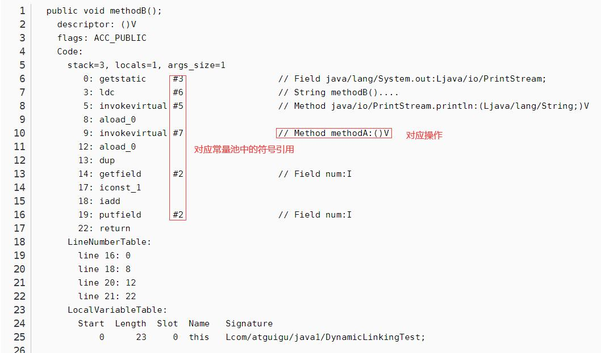

#  运行时数据区

> class文件经过类加载器加载进内存用什么样的数据结构保存的呢？


> Java虚拟机定义了若干种程序运行期间会使用到的运行时数据区
>
> 1. 其中有一些会随着虚拟机启动而创建，随着虚拟机退出而销毁。
> 2. 另外一些则是与线程一一对应的，这些与线程对应的数据区域会随着线程开始和结束而创建和销毁。


## java内存区域

JMM 就是一组规则，这组规则意在解决在并发编程可能出现的线程安全问题，

JMM (JavaMemory Model)是 Java 内存模型，JMM 定义了程序中各个共享变量的访问规则,即在虚拟机中将变量存储到内存和从内存读取变量这样的底层细节。并提供了内置解决方案（happen-before 原则）及其外部可使用的同步手段(synchronized/volatile 等)，确保了程序执行在多线程环境中的应有的原子性，可视性及其有序性。

JMM 规定了所有的变量都存储在主内存（Main Memory）中。

每个线程还有自己的工作内存（Working Memory）,线程的工作内存中保存了该线程使用到的变量的主内存的副本拷贝，线程对变量的所有操作（读取、赋值等）都必须在工作内存中进行，而不能直接读写主内存中的变量

> volatile 变量仍然有工作内存的拷贝，但是由于它特殊的操作顺序性规定，所以看起来如同直接在主内存中读写访问一般

不同的线程之间也无法直接访问对方工作内存中的变量，线程之间值的传递都需要通过主内存来完成。


## 为什么要实现内存模型

- 内存模型保证程序的正确执行
- 编译器生成的指令顺序，与源代码中的不同
- 编译器可能把变量保存在寄存器中，而不是内存中
- 处理器可以采用乱序并行的方式执行指令
- 缓存可能改变将写入变量提交到主存的次序
- 保存在处理器本地缓存中的值，对其他处理器是不可见的


### 结构（❤要背）

线程独有：独立包括程序计数器、栈、本地方法栈

线程间共享：堆、堆外内存（永久代或元空间、代码缓存)

> 也就是是一个jvm有5个线程，那么就会产生1一个堆区域，一个方法去共享，然而各个线程都会有自己的虚拟机栈，本地方法栈，程序计数器
>
> 一个运行程序所产生一个Runtime对象，对应着一个jvm进程


> 方法区：元数据区


堆

- 存放对象实例，数组
- 线程共享
- 空间最大，GC的主要区域
- 虚拟机启动时创建
- 可以动态扩展，内存溢出会有oom异常
- 逻辑上连续，物理上不连续
- -Xmx-Xms 设置堆的大小


方法区（永久代）

- HotStop将方法去称为永久代
- 
- 虚拟机加载的类的信息：常量，静态变量，如 Java 类、方法等
- 持久代对垃圾回收没有显著影响，但是有些应用可能动态生成或者调用一些 class，例如 Hibernate等，在这种时候需要设置一个比较大的持久代空间来存放这些运行过程中新增的类
- 一般包含
  - 类的方法(字节码...) 类名(Sring 对象)
  - .class 文件读到的常量信息
  - class 对象相关的对象列表和类型列表 (e.g., 方法对象的 array). JVM 创建的内部对象
  - JIT 编译器优化用的信息
- oom异常


虚拟机栈

- 线程私有，为java方法服务，方法被执行时创建栈帧-》局部变量表-》局部变量，对象引用
- 局部变量表存放基本的数据类型，对象的引用，returnAddress类型
- 无法扩容=》OOM异常
- 超出容量=》StackOverflowError


本地方法栈

- 线程私有
- 为本地方法服务，为虚拟机使用到的native方法服务
- HotSpot将虚拟机栈和本地方法栈合二为一
- 程序计数器
  - 记录正在执行的虚拟机字节码指令地址
  - 执行本地方法时其值为undefined
  - 线程私有，没有OOM异常

- 运行时常量池
  - 方法区的一部分，存放编译器产生的字面量和符号引用
  - 常量池无法申请空间=》OOM异常


## happens-before 原则

程序顺序原则，即在一个线程内必须保证语义串行性，也就是说按照代码顺序执行

锁规则

解锁(unlock)操作必然发生在后续的同一个锁的加锁(lock)之前，也就是说，如果对于一个锁解锁后，再加锁，那么加锁的动作必须在解锁动作之后(同一个锁)。

volatile 规则

volatile 变量的写，先发生于读，这保证了 volatile 变量的可见性，简单的理解就是，volatile 变量在每次被线程访问时，都强迫从主内存中读该变量的值，而当该变量发生变化时，又会强迫将最新的值刷新到主内存， 任何时刻，不同的线程总是能够看到该变量的最新值

线程启动规则

线程的 start()方法先于它的每一个动作，即如果线程 A 在执行线程 B 的 start 方法之前修改了共享变量的值，那么当线程 B 执行 start 方法时，线程 A 对共享变量的修改对线程 B 可见

线程终止规则

线程的所有操作先于线程的终结，Thread.join()方法的作用是等待当前执行的线程终止。假设在线程 B 终止之前，修改了共享变量，线程 A 从线程 B 的 join 方法成功返回后，线程 B对共享变量的修改将对线程 A 可见

线程中断规则

对线程 interrupt()方法的调用先行发生于被中断线程的代码检测到中断事件的发生，可以通过Thread.interrupted()方法检测线程是否中断

对象终结规则

对象的构造函数执行，结束先于 finalize()方法


## 线程

- 线程是一个程序里的运行单元。JVM允许一个应用有多个线程并行的执行
- 在Hotspot JVM里，**每个线程都与操作系统的本地线程直接映射**
- 当一个Java线程准备好执行以后，此时一个操作系统的本地线程也同时创建。Java线程执行终止后，本地线程也会回收
- 操作系统负责将线程安排调度到任何一个可用的CPU上。一旦本地线程初始化成功，它就会调用Java线程中的run()方法
- 如果一个线程抛异常，并且该线程时进程中最后一个守护线程，那么进程将停止


jvm主要的系统线程（了解）

**虚拟机线程**：这种线程的操作是需要JVM达到安全点才会出现。这些操作必须在不同的线程中发生的原因是他们都需要JVM达到安全点，这样堆才不会变化。这种线程的执行类型括"stop-the-world"的垃圾收集，线程栈收集，线程挂起以及偏向锁撤销

**周期任务线程**：这种线程是时间周期事件的体现（比如中断），他们一般用于周期性操作的调度执行

**GC线程**：这种线程对在JVM里不同种类的垃圾收集行为提供了支持

**编译线程**：这种线程在运行时会将字节码编译成到本地代码

**信号调度线程**：这种线程接收信号并发送给JVM，在它内部通过调用适当的方法进行处理


## Student s = new Student()做了什么

1，加载Student.class文件进内存

2，在栈空间中为s开辟空间

3，在堆中为Student对象开辟空间

4，对Student对象成员变量默认初始化

5，对Student对象成员变量显示初始化

6，构造方法

7，Student对象初始化完成，将对象地址赋值给s


# 程序计数器

## PC寄存器

1，JVM中的PC寄存器是对物理PC寄存器的一种抽象模拟，不是实际存在的

2，它是一块很小的内存空间，几乎可以忽略不记。也是**运行速度最快的存储区域**,

3，**在JVM规范中，每个线程都有它自己的程序计数器，是线程私有的**

4，**程序计数器会存储当前线程正在执行的Java方法的JVM指令地址**

5，它是**唯一一个**在Java虚拟机规范中没有规定任何OutofMemoryError情况的区域（没有异常输出）


作用：PC寄存器用来存储指向**下一条指令的地址**，也即将要执行的指令代码。由执行引擎读取下一条指令，并执行该指令。

### 使用

```java
public static void main(String[] args) {
        int i = 10;
        int j = 20;
        int k = i + j;
        String s = "abc";
        System.out.println(i);
        System.out.println(k);
    }
```

使用反编译

```java
E:\IDEAProject\DataStructures\out\production\DataStructures\tutu\demo\LinkedList>javap -v test.class
```

输出的main方法信息

```java
 public static void main(java.lang.String[]);
    descriptor: ([Ljava/lang/String;)V
    flags: (0x0009) ACC_PUBLIC, ACC_STATIC
    Code:
      stack=2, locals=5, args_size=1
         0: bipush        10
         2: istore_1
         3: bipush        20
         5: istore_2
         6: iload_1
         7: iload_2
         8: iadd
         9: istore_3
        10: ldc           #2                  // String abc
        12: astore        4
        14: getstatic     #3                  // Field java/lang/System.out:Ljava/io/PrintStream;
        17: iload_1
        18: invokevirtual #4                  // Method java/io/PrintStream.println:(I)V
        21: getstatic     #3                  // Field java/lang/System.out:Ljava/io/PrintStream;
        24: iload_3
        25: invokevirtual #4                  // Method java/io/PrintStream.println:(I)V
        28: return
```

分析


### 面试题

**使用PC寄存器存储字节码指令地址有什么用呢？**

1，因为线程是一个个的顺序执行流，CPU需要不停的切换各个线程，切换回来以后，就得知道接着从哪开始继续执行

2，JVM的字节码解释器就需要通过改变PC寄存器的值来明确下一条应该执行什么样的字节码指令


**PC寄存器为什么被设定为私有的**

1，线程之间并发执行，线程在规定时间片中未执行完，再次回来时需要精准知道上一次执行到哪里

2，为了能够准确地记录各个线程正在执行的当前字节码指令地址，最好的办法自然是为每一个线程都分配一个PC寄存器

3，不可能为多个线程共享一个执行的指令地址，这样每个线程都会去修改这个地址，这样就会混乱


#  虚拟机栈

背景

1. **由于跨平台性的设计，Java的指令都是根据栈来设计的**。不同平台CPU架构不同，所以不能设计为基于寄存器的。
2. **优点是跨平台，指令集小，编译器容易实现，缺点是性能下降，实现同样的功能需要更多的指令**。


## 栈与堆的区别

1,首先栈是运行时的单位，而堆是存储的单位

2,栈解决程序的运行问题，即程序如何执行，或者说如何处理数据。

3,解决的是数据存储的问题，即数据怎么放，放哪里


## 概念

java虚拟机栈（Java Virtual Machine Stack），早期也叫Java栈。

每个线程在创建时都会创建一个虚拟机栈，其内部保存一个个的栈帧（Stack Frame），对应着一次次的Java方法调用

栈是线程私有的

主管Java程序的运行，它保存方法的局部变量、部分结果，并参与方法的调用和返回。


## 生命周期

**生命周期和线程一致，随着线程的消亡而消亡**


## 特点

1，对于栈来说**不存在垃圾回收问题**（栈存在溢出的情况）

2 ，Java 虚拟机规范允许Java栈的大小**是动态的或者是固定不变的**。

3，如果采用固定大小的Java虚拟机栈，那每一个线程的Java虚拟机栈容量可以在线程创建的时候独立选定。

4，如果线程请求分配的栈容量超过Java虚拟机栈允许的最大容量，Java虚拟机将会抛出一个**StackoverflowError** 异常

5，栈是一种快速有效的分配存储方式，访问速度仅次于程序计数器。


栈溢出异常代码

```java
public class StackErrorTest {
    private static int count = 1;
    public static void main(String[] args) {
        System.out.println(count);
        count++;
        main(args);
    }
}
```


## 设置栈的大小

```
-Xss 1024m		// 栈内存为 1024MBS
```


## 栈的运行原理

1. JVM直接对Java栈的操作只有两个，就是对栈帧的**压栈和出栈**，遵循先进后出（后进先出）原则
2. 在一条活动线程中，一个时间点上，只会有一个活动的栈帧。即**只有当前正在执行的方法的栈帧（栈顶栈帧）是有效的**
   - 这个栈帧被称为**当前栈帧（Current Frame）**
   - 与当前栈帧相对应的方法就是**当前方法（Current Method）**
   - 定义这个方法的类就是**当前类（Current Class）**
3. 执行引擎运行的所有字节码指令只针对当前栈帧进行操作。

> 栈帧是个数据集，维系着方法执行过程中的各种数据信息。

1. 如果在该方法中调用了其他方法，对应的新的栈帧会被创建出来，放在栈的顶端，成为新的当前帧。
2. **不同线程中所包含的栈帧是不  允许存在相互引用的**，即不可能在一个栈帧之中引用另外一个线程的栈帧。
3. 如果当前方法调用了其他方法，**方法返回之际，当前栈帧会传回此方法的执行结果给前一个栈帧**，接着，虚拟机会丢弃当前栈帧，使得前一个栈帧重新成为当前栈帧。
4. Java方法有两种返回函数的方式，但不管使用哪种方式，都会导致栈帧被弹出
   - 一种是**正常的函数返回**，使用return指令
   - 另外一种是**抛出异常**


## 栈帧内部结构

1. 局部变量表（Local Variables）
2. 操作数栈（Operand Stack）（或表达式栈）
3. 动态链接（Dynamic Linking）（或指向运行时常量池的方法引用）
4. 方法返回地址（Return Address）（或方法正常退出或者异常退出的定义）
5. 一些附加信息


并行每个线程下的栈都是私有的，因此每个线程都有自己各自的栈，并且每个栈里面都有很多栈帧，栈帧的大小主要由局部变量表 和 操作数栈决定的

行每个线程下的栈都是私有的，因此每个线程都有自己各自的栈，并且每个栈里面都有很多栈帧，栈帧的大小主要由局部变量表 和 操作数栈决定的


### 局部变量表

1. 局部变量表：**Local Variables，被称之为局部变量数组或本地变量表**
2. 定义为一个==**数字数组**==，主要用于==**存储方法参数和定义在方法体内的局部变量**==，这些数据类型包括各类==**基本数据类型**==、==**对象引用**==（reference），以及==**returnAddress**==类型。
3. ##### 由于局部变量表是建立在线程的栈上，==是线程的私有数据==，因此**不存在数据安全问题**
4. ==**局部变量表所需的容量大小是在编译期确定下来的**==，并保存在方法的Code属性的==**maximum local variables**==数据项中。==在方法运行期间是不会改变局部变量表的大小的==。
5. 方法嵌套调用的次数由栈的大小决定。一般来说，栈越大，方法嵌套调用次数越多。
   - 对一个函数而言，它的参数和局部变量越多，使得局部变量表膨胀，它的栈帧就越大，以满足方法调用所需传递的信息增大的需求。
   - 进而函数调用就会占用更多的栈空间，导致其嵌套调用次数就会减少。
6. ==局部变量表中的变量只在当前方法调用中有效==
   
   - 在方法执行时，虚拟机通过使用局部变量表完成参数值到参数变量列表的传递过程。
   - 当方法调用结束后，随着方法栈帧的销毁，局部变量表也会随之销毁。

测试代码

```java
public class 栈内部结构 {
    public static void main(String[] args) {
        int o = 1;
        栈内部结构 in = new 栈内部结构();
        in.s();
    }
    public int s(){
        return 1;
    }
}
```

查看


#### Slot

- 参数值的存放总是==**从局部变量数组索引 0 的位置开始，到数组长度-1的索引结束**==
- ==**局部变量表，最基本的存储单元是Slot（变量槽）**==
- ==**32位以内的类型只占用一个slot**==（包括returnAddress类型），==**64位的类型占用两个slot**==（1ong和double）

> 如何查看一个类型占用了几个slot
>
> 可以通过jclasslib中的index查看，两个类型的index相差多远


- **JVM会为局部变量表中的每一个Slot都分配一个访问索引**
  - 通过这个索引即可成功访问到局部变量表中指定的局部变量值
- **this将会存放在index为0的slot处**，其余的参数按照参数表顺序继续排列

> 这里也涉及到，为什么static方法中，不能用this，因为局部变量表里没有
>
> 非static方法中，this会放在第一个

- 重复利用问题

> 如果一个局部变量过了其作用域，
>
> 那么在其作用域之后申明新的局部变量变就很有可能会复用过期局部变量的槽位

```java
// 重复利用
public void test4() {
    int a = 0;
    {
        int b = 0;
        b = a + 1;
    }
    //变量c使用之前已经销毁的变量b占据的slot的位置
    // b变量已经开辟过一个数组空间，b丢弃之后，c就会用b之前用过的位置
    int c = a + 1;
}
```


#### 静态/局部变量的对比

类变量（静态变量）表有两次初始化的机会**，**

第一次是在“准备阶段”，执行系统初始化，对类变量设置零值，另一次则是在“初始化”阶段，赋予程序员在代码中定义的初始值


**局部变量表不存在系统初始化的过程**

也就是说局部变量一定要显示赋值，不然无法使用


#### 补充说明

1. 在栈帧中，与性能调优关系最为密切的部分就是前面提到的局部变量表。在方法执行时，虚拟机使用局部变量表完成方法的传递。
2. **局部变量表中的变量也是重要的垃圾回收根节点**，因为只要被局部变量表中直接或间接引用的对象都不会被回收。


### 操作数栈

1，每一个独立的栈帧除了包含局部变量表以外，还包含一个后进先出（Last-In-First-Out）的 操作数栈，也可以称之为表达式栈（Expression Stack）

2，==java虚拟机的解释引擎是基于栈（操作数栈）的执行引擎==

3，操作数栈，==主要用于保存计算过程的中间结果，同时作为计算过程中变量临时的存储空间==

4，栈中的任何一个元素都是可以任意的Java数据类型

- 32bit的类型占用一个栈单位深度

- 64bit的类型占用两个栈单位深度

5，其所需的==**最大深度在编译期就定义好了**==，保存在方法的Code属性中，为==**maxstack**==的值

6，被调用的方法有返回值时，其==**返回值将会被压入当前栈帧的操作数栈中**==，并更新PC寄存器中下一条需要执行的字节码指令


#### 特点

操作数栈，在方法执行过程中，**根据字节码指令，往栈中写入数据或提取数据**，即入栈和 出栈


举例


举例


#### 作用

主要用于保存计算过程的中间结果，同时作为计算过程中变量临时的存储空间


#### 执行流程

```java
public void testAddOperation() {
    byte i = 15;
    int j = 8;
    int k = i + j;
}
```

--

```
public void testAddoperation(); 
    Code:
    0: bipush 15 
    2: istore_1 
    3: bipush 8
    5: istore_2
    6: iload_1
    7: iload_2
    8: iadd
    9: istore_3
    10: return
```


1，`bipush 15` ：将15放入==操作数栈==的栈顶中

2，`istore_1`：将15放在局部变量表的索引（index）为1对应的地方

3，`pc寄存器`指向下一个地址指令

4，`bipush 8`：将8放入==操作数栈==的栈顶中

5，`istore_2`：将8放在局部变量表的索引（index）为2对应的地方

6，`iload_1`：加载局部变量表索引1，进操作数栈

7，`iload_2`：加载局部变量表索引2，进操作数栈

8，`iadd`：相加操作

9，`istore_3`：将结果存入索引为3对应的地方

10，`return`：返回


#### 栈顶缓存技术

执行代码的时候所涉及到的指令很多，每一项的操作一定会涉及很多出栈入栈操作，意味着对内存更多的读写操作，这样会影响执行速度，所以就有了栈顶缓存技术：将栈顶元素全部缓存在物理CPU的寄存器中，以此降低对内存的读写次数，提高效率


### 动态链接区

1，==每一个栈帧都包含一个指向**运行时常量池**中该栈帧所属方法的引用==，==使得当前方法能实现动态链接==

> 在Java源文件被编译到字节码文件中时，**所有的变量和方法引用都作为符号引用（Symbolic Reference）保存在class文件的常量池里**

2，动态链接的作用就是为了==将这些符号引用转换为调用方法的直接引用==


- 蓝色为一个个的栈帧，其中有个存放运行时常量池引用的地方，也就是棕色区域，动态链接


例子




#### 使用常量池的原因

1. 因为在不同的方法，都可能调用常量或者方法，所以**只需要存储一份即可，然后记录其引用即可，节省了空间**
2. 常量池的作用：就是为了提供一些符号和常量，便于指令的识别


### 方法的调用

在JVM中，将==符号引用==转换为调用方法的==直接引用==与==方法的绑定机制==相关

> 方法的调用，实际上是先调用方法的符号引用，通过符号引用找到对应的直接引用，然后直接使用


那么虚拟机怎么知道该调用哪个方法呢？


#### 静态链接

（static Linking）

当一个字节码文件被装载进JVM内部时，==**如果被调用的目标方法在编译期确定，且运行期保持不变时**==，这种情况下将调用方法的符号引用转换为直接引用的过程称之为静态链接


#### 动态链接

（Dynamic Linking）

**如果被调用的方法在编译期无法被确定下来**，也就是说，==**只能够在程序运行期将调用的方法的符号转换为直接引用**==，由于这种引用转换过程具备**动态性**，因此也被称之为动态链接。

> 存在常量池中的符号引用


对应的方法的绑定机制为：早期绑定（Early Binding）和晚期绑定（Late Binding）。

> ==绑定是一个字段、方法或者类在符号引用被替换为直接引用的过程，这仅仅发生一次。==


#### 早期绑定

==早期绑定就是指被调用的目标方法如果在编译期可知，且运行期保持不变时==，即可将这个方法与所属的类型进行绑定，

这样一来，由于明确了被调用的目标方法究竟是哪一个，因此也就可以使用静态链接的方式将符号引用转换为直接引用

#### 晚期绑定

==如果被调用的方法在编译期无法被确定下来，只能够在程序运行期根据实际的类型绑定相关的方法==，这种绑定方式也就被称之为晚期绑定。

```java
// 反编译文件中
incokespecial  // 晚期绑定的意思
```


------

随着高级语言的横空出世，类似于Java一样的基于面向对象的编程语言如今越来越多，尽管这类编程语言在语法风格上存在一定的差别，但是它们彼此之间始终保持着一个共性，那就是都支持封装、继承和多态等面向对象特性，既然这一类的编程语言具备多态特悄，那么自然也就具备早期绑定和晚期绑定两种绑定方式。


Java中任何一个普通的方法其实都具备虚函数的特征，它们相当于C语言中的虚函数（C中则需要使用关键字virtual来显式定义）。

如果在Java程序中不希望某个方法拥有虚函数的特征时，则可以**使用关键字final来标记这个方法**。


#### 虚方法和非虚方法

非虚方法：编译器就确定下来的调用版本，并且版本运行时不可变

> 静态方法、私有方法、final方法、实例构造器、父类方法都是非虚方法，其他的都是虚方法
>
> 也就是说编译阶段就能知道你在调用哪个方法，即为非虚方法

虚方法：和非虚方法相反


重写引出了非虚方法，那么重写的本质是什么呢？

##### 重写的本质

1，找到操作数栈顶的第一个元素所执行的对象的实际类型，记作C。

> 比如我们重写一个方法，会将其入操作数栈，根据字节码指令 `invokevirtual `，寻找实际类型C

2，如果在类型C中找到与常量中的描述符合简单名称都相符的方法，则进行访问权限校验，如果通过则返回这个方法的直接引用，查找过程结束；如果不通过，则返回java.lang.IllegalAccessError 异常。

3，否则，按照继承关系从下往上依次对C的各个父类进行第2步的搜索和验证过程。

4，如果始终没有找到合适的方法，则抛出java.1ang.AbstractMethodsrror异常。


**IllegalAccessError介绍**

程序试图访问或修改一个属性或调用一个方法，这个属性或方法，你没有权限访问。

一般的，这个会引起编译器异常。这个错误如果发生在运行时，就说明一个类发生了不兼容的改变。

> 当一些包冲突时，可能会有这样的问题


##### 虚方法表

- 虚方法表会在类加载的链接阶段被创建并开始初始化，类的变量初始值准备完成之后，JVM会把该类的方法表也初始化完毕。
- 每个类中都有一个虚方法表，表中存放着各个方法的实际入口
- 在面向对象的编程中，会很频繁的使用到动态分派，如果在每次动态分派的过程中都要重新在类的方法元数据中搜索合适的目标的话就可能影响到执行效率。因此，为了提高性能，JVM采用在类的方法区建立一个虚方法表 （virtual method table）（非虚方法不会出现在表中）来实现。使用索引表来代替查找。


#### 4条表明方法的指令

1. `invokestatic`：调用静态方法，解析阶段确定唯一方法版本
2. `invokespecial`：调用`<init>`方法、私有及父类方法，解析阶段确定唯一方法版本

> 以上指令都是调用非虚方法，以下方法（除开final是用 invokevirtual 调用）都是调用虚方法

1. `invokevirtual`：调用所有虚方法
2. `invokeinterface`：调用接口方法

```java
class Animal {
    public void eat() {
        System.out.println("动物进食");
    }
}
interface Huntable {
    void hunt();
}
class Dog extends Animal implements Huntable {
    @Override
    public void eat() {
        System.out.println("狗吃骨头");
    }
    @Override
    public void hunt() {
        System.out.println("捕食耗子，多管闲事");
    }
}
class Cat extends Animal implements Huntable {
    //invokespecial
    public Cat() {
        super();//表现为：早期绑定
    }

    public Cat(String name) {
        this();//表现为：早期绑定
    }

    @Override
    public void eat() {
        super.eat();//表现为：早期绑定
        System.out.println("猫吃鱼");
    }

    @Override
    public void hunt() {
        System.out.println("捕食耗子，天经地义");
    }
}

public class AnimalTest {
    //invokevirtual
    public void showAnimal(Animal animal) {
        animal.eat();//表现为：晚期绑定
    }
	//invokeinterface
    public void showHunt(Huntable h) {
        h.hunt();//表现为：晚期绑定
    }
}
```


#### 动态调用指令

- invokedynamic：动态解析出需要调用的方法，然后执行

> java 7 中出现该指令
>
> 使得 java 具有了动态语言的特征
>
> java 8 中出现了lambda表达式，`invokedynamic`指令的生成


### 方法返回地址

该区域存放调用该方法的pc寄存器的值，将其交给执行引擎，好执行上一个方法


存放调用该方法的pc寄存器的值。一个方法的结束，有两种方式：


- 正常执行完成

- 出现未处理的异常，非正常退出

 

无论通过哪种方式退出，在方法退出后都返回到该方法被调用的位置。

方法正常退出时，调用者的pc计数器的值作为返回地址，即调用该方法的指令的下一条指令的地址。

而通过异常退出的，返回地址是要通过异常表来确定，栈帧中一般不会保存这部分信息。

正常完成出口和异常完成出口的区别在于：通过异常完成出口退出的不会给他的上层调用者产生任何的返回值


不同的类型，字节码的指令也不同

> 0 return
>
> ireturn
>
> areturn
>
> lreturn 
>
> freturn


如果有异常，那么就会去异常表处理


### 附加信息

栈帧中还允许携带与Java虚拟机实现相关的一些附加信息。例如：对程序调试提供支持的信息。


# 堆

## 概念

1，==一个JVM实例只存在一个堆内存==，堆也是Java内存管理的核心区域

2，Java堆区在JVM==启动的时候即被创建==，其空间==大小也就确定==了。是JVM管理的最大一块内存空间。==堆内存的大小是可以调节的==

3，《Java虚拟机规范》规定，==堆可以处于物理上不连续的内存空间中，但在逻辑上它应该被视为连续的==

4，所有的线程共享Java堆，但是还可以划分==线程私有的缓冲区==

5，《Java虚拟机规范》中对Java堆的描述是：所有的对象实例以及数组都应当在运行时分配在堆上

6，数组和对象可能永远不会存储在栈上，因为栈帧中保存引用，这个引用指向对象或者数组在堆中的位置

> 一般就是虚拟机栈中的局部变量表存放对象的引用，真正的对象存放在堆中

7，在方法结束后，堆中的对象不会马上被移除，仅仅在垃圾收集的时候才会被移除


## 堆内存

Java 7及之前堆内存==逻辑==上分为三部分：新生区+养老区+==永久区==


- Young Generation Space 新生区 Young/New 又被划分为Eden区和Survivor区

- Tenure generation space 养老区 Old/Tenure

- Permanent Space 永久区 Perm


Java 8及之后堆内存==逻辑==上分为三部分：新生区+养老区+==元空间==


- Young Generation Space 新生区 Young/New 又被划分为Eden区和Survivor区

- Tenure generation space 养老区 Old/Tenure

- Meta Space 元空间 Meta


内部结构

JDK7


JDK8


可以看到，由以前的永久代，变成了元空间

实际上对内存的设置，也只是针对新生代和年老代了


## 设置堆大小

Java堆区用于存储Java对象实例，那么堆的大小在JVM启动时就已经设定好了，大家可以通过选项"-Xmx"和"-Xms"来进行设置。


- “-Xms"用于表示堆区的起始内存，等价于`-XX:InitialHeapSize`

> -X jvm参数 ms memory start 起始的大小

- “-Xmx"则用于表示堆区的最大内存，等价于`-XX:MaxHeapSize`

> -X JVM参数 mx memory max 堆空间的最大内存大小

一旦堆区中的内存大小超过“-Xmx"所指定的最大内存时，将会抛出OutOfMemoryError异常。

默认情况下

- 初始内存大小：物理电脑内存大小 / 64

- 最大内存大小：物理电脑内存大小 / 4

如何查看虚拟机堆内存的大小呢？

```java
long totalMemory = Runtime.getRuntime().totalMemory();
long max = Runtime.getRuntime().maxMemory();
System.out.println(totalMemory/1024/1024+"M");
System.out.println(max/1024/1024+"M");
```

返回结果为

```java
119M // 初始内存 8G * 1024 / 64 = 128
1737M // 最大内存 8G * 1024 /4 = 2048
```

如果设置参数

> -Xms100m -Xmx100m
>
> 这里也需要注意
>
> 我们在设置堆内存空间大小时，两参数保持一致
>
> 以免堆因为内存不足一直做扩容操作，这样影响性能

再打印信息

```java
// 打印了96，我明明设置的 100 ，为什么会是 96呢？ 
96M
96M
```

通过以下两种方式可以查看堆内存的情况

- jps 查看执行程序的端口，jstat -gc 端口，查看指定程序的GC情况
- 通过参数 `-XX:+PrintGCDetails` 查看GC信息

```
Heap
PSYoungGen      total 29696K, used 3118K [0x00000000fdf00000, 0x0000000100000000, 0x0000000100000000)
    eden space 25600K, 12% used [0x00000000fdf00000,0x00000000fe20b938,0x00000000ff800000)
    from space 4096K, 0% used [0x00000000ffc00000,0x00000000ffc00000,0x0000000100000000)
    to   space 4096K, 0% used [0x00000000ff800000,0x00000000ff800000,0x00000000ffc00000)
ParOldGen       total 68608K, used 0K [0x00000000f9c00000, 0x00000000fdf00000, 0x00000000fdf00000)
	object space 68608K, 0% used [0x00000000f9c00000,0x00000000f9c00000,0x00000000fdf00000)
Metaspace       used 3374K, capacity 4496K, committed 4864K, reserved 1056768K
	class space    used 368K, capacity 388K, committed 512K, reserved 1048576K
```

通过这个可以看到

> 新生代的大小= 29696K = 25600K（Eden区）+ 4096K（Survivor区）
>
> 老年代的大小= 68608K
>
> 和=98304KB=96M

原因是什么呢？

因为Survivor虽然有两个区域，但是实际使用的时候，只会使用其中一个


## OutOfMemory实例

一直添加对象

为了测试明显，设置了堆的大小

> -Xms1m -Xmx1m

```java
public class TestOOM {
    public static void main(String[] args) throws InterruptedException {
        List<Target> list = new ArrayList<>();
        while(true){
            Thread.sleep(100);
            list.add(new Target(100000));
        }
    }
}

class Target{
    private int number;
    public Target(int number){
        this.number = number;
    }
}
```

结果


## 年轻代和老年代

存储在JVM中的Java对象可以被划分为两类：

- 一类是生命周期较短的瞬时对象，这类对象的创建和消亡都非常迅速

- 另外一类对象的生命周期却非常长，在某些极端的情况下还能够与JVM的生命周期保持一致


Java堆区进一步细分的话，可以划分为年轻代（YoungGen）和老年代（oldGen）

其中年轻代又可以划分为Eden空间、Survivor0空间和Survivor1空间（有时也叫做from区、to区）

> 不一定 Survivor0 就是 from区  Survivor1 就是  to区

> Eden区 称为 伊甸园 （上帝创造亚当和夏娃）
>
> Survivor 称为 幸存者


既然堆的空间能设置

那么年轻代和老年代也能设置

- 默认1/2，表示新生代占1，老年代占2，新生代占整个堆的1/3

- 可以修改`-XX:NewRatio=4`，表示新生代占1，老年代占4，新生代占整个堆的1/5

在HotSpot中，Eden空间和另外两个survivor空间缺省所占的比例是==8：1：1==

可以通过选项“`-xx:SurvivorRatio`”调整这个空间比例

- 比如 `-xx:SurvivorRatio=6` => 6:1:1

同时可以设置年轻代的最大内存

- -Xmn

> 使用需要注意，不能和 -XX:NewRato 同用
>


==几乎所有的Java对象都是在Eden区被new出来的。绝大部分的Java对象的销毁都在新生代进行了。==


### 对象的分配过程


由图分析

1，程序正常运行，创建的对象放置在Eden区

2，当Eden区满了之后，会触发YGC/Minor GC，将没有使用的“垃圾”回收，溢出Eden区，但还是会有没有被回收的对象，这个时候就会将这些对象放入Survivor区，被放入对象的Survivor区称为from区，没有放的被称为to区，同时年龄计数器加一

> 都会为每个对象分配一个年龄计数器，每挺过一次垃圾回收，年龄加一

3，此时Eden区又再一次满了，这个时候又会触发 YGC/Minor GC，将Eden区和from区中没有使用的垃圾回收，剩下没有被回收的放入to区，from区没有被回收的也会进行复制再移动到to区，年龄加一

4，就这样来来回回的回收

5，当幸存者区中的对象年龄，超过一定的阈值时，就会被放入老年代

> 我们可以设置对应的判断依据
>
> -Xx:MaxTenuringThreshold = N
>
> N代表回收次数

6，长此以往，如果幸存区也满了，这属于特殊情况，会将幸存区的对象放入老年代中

7，同时，不一定所有的对象都会经历这样的过程进老年代，也存在有的对象一创建就进入了老年代（大对象）

8， 在养老区，相对悠闲。当养老区内存不足时，再次触发GC：Major GC，进行养老区的内存清理 

9，若养老区执行了Major GC之后，发现依然无法进行对象的保存，就会产生OOM异常


流程图


==频繁在新生区收集，很少在老年代收集，几乎不再永久代和元空间进行收集==


## Minor GC，MajorGC、Full GC

针对Hotspot VM的实现，它里面的GC按照回收区域又分为两大种类型：一种是部分收集（Partial GC），一种是整堆收集（FullGC）


- 部分收集：不是完整收集整个Java堆的垃圾收集。其中又分为： 

- - 新生代收集（Minor GC / Young GC）：只是新生代的垃圾收集

- - 老年代收集（Major GC / Old GC）：只是老年代的圾收集。 

- - - 目前，只有CMSGC会有单独收集老年代的行为。

- - - 注意，很多时候Major GC 会和Full GC混淆使用，需要具体分辨是老年代回收还是整堆回收。

- - 混合收集（MixedGC）：收集整个新生代以及部分老年代的垃圾收集。 

- - - 目前，只有G1 GC会有这种行为

- 整堆收集（Full GC）：收集整个java堆和方法区的垃圾收集。

### 年轻代GC（Minor GC）触发机制

当年轻代空间不足时，就会触发MinorGC，这里的年轻代满指的是Eden代满，Survivor满不会引发GC。（每次Minor GC会清理年轻代的内存。）

Minor GC会引发STW，暂停其它用户的线程，等垃圾回收结束，用户线程才恢复运行


### 老年代GC（Major GC / Full GC）触发机制

-  指发生在老年代的GC，对象从老年代消失时，我们说 “Major GC” 或 “Full GC” 发生了 

-  出现了Major Gc，经常会伴随至少一次的Minor GC（但非绝对的，在Paralle1 Scavenge收集器的收集策略里就有直接进行MajorGC的策略选择过程） 

   -  也就是在老年代空间不足时，会先尝试触发Minor Gc。如果之后空间还不足，则触发Major GC


> 空间分配担保。
>
> MinorGC 前虚拟机必须检查老年代最大可用连续空间是否大于新生代对象总空间，如果满足则说明这次 Minor GC 确定安全。
>
> 如果不，JVM会查看HandlePromotionFailure 参数是否允许担保失败，
>
> 如果允许会继续检查老年代最大可用连续空间是否大于历次晋升老年代对象的平均大小，如果满足将Minor GC，否则改成一次 FullGC。

-  Major GC的速度一般会比Minor GC慢10倍以上，STW的时间更长 

-  如果Major GC后，内存还不足，就报OOM了 


### Full GC触发机制

触发Full GC执行的情况有如下五种：


1. 调用System.gc()时，系统建议执行Full GC，但是不必然执行

1. 老年代空间不足

1. 方法区空间不足

1. 通过Minor GC后进入老年代的平均大小大于老年代的可用内存

1. 由Eden区、survivor space0（From Space）区向survivor space1（To Space）区复制时，对象大小大于To Space可用内存，则把该对象转存到老年代，且老年代的可用内存小于该对象大小


说明：Full GC 是开发或调优中尽量要避免的。这样暂时时间会短一些


### 堆空间分代思想

为什么要把Java堆分代？不分代就不能正常工作了吗？

经研究，不同对象的生命周期不同。70%-99%的对象是临时对象。

其实不分代完全可以，分代的唯一理由就是优化GC性能。如果没有分代，那所有的对象都在一块。

GC的时候要找到哪些对象没用，这样就会对堆的所有区域进行扫描。

而很多对象都是朝生夕死的，如果分代的话，把新创建的对象放到某一地方，当GC的时候先把这块存储“朝生夕死”对象的区域进行回收，这样就会腾出很大的空间出来。

.


### 内存分配策略

如果对象在Eden出生并经过第一次Minor GC后仍然存活，并且能被Survivor容纳的话，将被移动到survivor空间中，并将对象年龄设为1。对象在survivor区中每熬过一次MinorGC，年龄就增加1岁，当它的年龄增加到一定程度（默认为15岁，其实每个JVM、每个GC都有所不同）时，就会被晋升到老年代


对象晋升老年代的年龄阀值，可以通过选项`-XX:MaxTenuringThreshold`来设置

针对不同年龄段的对象分配原则如下所示：

- 优先分配到Eden

- 大对象直接分配到老年代（尽量避免程序中出现过多的大对象）

- 长期存活的对象分配到老年代

- 动态对象年龄判断：如果survivor区中相同年龄的所有对象大小的总和大于Survivor空间的一半，年龄大于或等于该年龄的对象可以直接进入老年代，无须等到`MaxTenuringThreshold`（阈值）中要求的年龄。

- 空间分配担保： `-XX:HandlePromotionFailure`

代码

```java
// -Xms60m -Xmx60m -XX:NewRatio=2 -XX:SurvivorRatio=8 -XX:+PrintGCDetails
public static void main(String[] args) {
	byte[] bytes = new byte[1024 * 1024 * 20]; // 20M
}
```

根据配置可以计算

新生代：16M，幸存区：2M，老年代：36M

分析

```
Heap
PSYoungGen      total 18432K, used 2628K [0x00000000fec00000, 0x0000000100000000, 0x0000000100000000)
    eden space 16384K, 16% used [0x00000000fec00000,0x00000000fee91208,0x00000000ffc00000)
    from space 2048K, 0% used [0x00000000ffe00000,0x00000000ffe00000,0x0000000100000000)
    to   space 2048K, 0% used [0x00000000ffc00000,0x00000000ffc00000,0x00000000ffe00000)
ParOldGen       total 40960K, used 20480K [0x00000000fc400000, 0x00000000fec00000, 0x00000000fec00000)
	object space 40960K, 50% used [0x00000000fc400000,0x00000000fd800010,0x00000000fec00000)
Metaspace       used 3431K, capacity 4496K, committed 4864K, reserved 1056768K
class space    used 373K, capacity 388K, committed 512K, reserved 1048576K
```

可以看到，没有进行垃圾回收

20M的数据，直接放入了老年代


## TLAB

> （Thread Local Allocation Buffer）

- 堆区是线程共享区域，任何线程都可以访问到堆区中的共享数据 

-  由于对象实例的创建在JVM中非常频繁，因此在并发环境下从堆区中划分内存空间是线程不安全的 

-  为避免多个线程操作同一地址，需要使用加锁等机制，进而影响分配速度。 

为了解决以上的问题，产生了TLAB

- 从内存模型而不是垃圾收集的角度，对Eden区域继续进行划分，JVM为每个线程分配了一个私有缓存区域，它包含在Eden空间内。 

-  多线程同时分配内存时，使用TLAB可以避免一系列的非线程安全问题，同时还能够提升内存分配的吞吐量，因此我们可以将这种内存分配方式称之为快速分配策略


- 尽管不是所有的对象实例都能够在TLAB中成功分配内存，但JVM确实是将TLAB作为内存分配的首选。 

-  在程序中，开发人员可以通过选项“`-XX:UseTLAB`”设置是否开启TLAB空间。 

-  默认情况下，TLAB空间的内存非常小，仅占有整个Eden空间的1%，当然我们可以通过选项 “`-XX:TLABWasteTargetPercent`” 设置TLAB空间所占用Eden空间的百分比大小。 

-  一旦对象在TLAB空间分配内存失败时，JVM就会尝试着通过使用加锁机制确保数据操作的原子性，从而直接在Eden空间中分配内存。 


## 堆空间的参数设置

```java
-XX:+PrintFlagsInitial  //查看所有的参数的默认初始值
-XX:+PrintFlagsFinal  //查看所有的参数的最终值（可能会存在修改，不再是初始值）
-Xms  //初始堆空间内存（默认为物理内存的1/64）
-Xmx  //最大堆空间内存（默认为物理内存的1/4）
-Xmn  //设置新生代的大小。（初始值及最大值）
-XX:NewRatio  //配置新生代与老年代在堆结构的占比
-XX:SurvivorRatio  //设置新生代中Eden和S0/S1空间的比例
-XX:MaxTenuringThreshold  //设置新生代垃圾的最大年龄
-XX:+PrintGCDetails //输出详细的GC处理日志
//打印gc简要信息：①-Xx：+PrintGC ② - verbose:gc
-XX:HandlePromotionFalilure：//是否设置空间分配担保
```


## 堆是分配对象的唯一选择么？


# 方法区

1，方法区在程序运行时就创建好了，可以固定大小，也可以根据内存，动态的扩展

2，逻辑上称 方法区 属于 堆，但是在真正使用的时候，是区分堆和方法区的

> 《Java虚拟机规范》中明确说明：“尽管所有的方法区在逻辑上是属于堆的一部分，但一些简单的实现可能不会选择去进行垃圾收集或者进行压缩。
>
> ”但对于HotSpotJVM而言，方法区还有一个别名叫做Non-Heap（非堆），目的就是要和堆分开。
>
> 我们发现，设置堆空间大小的时候不会影响方法区大小，这样也能看出堆和方法区是区分的


- 方法区（Method Area）与Java堆一样，==是各个线程共享的内存区域。==

- 方法区在==JVM启动的时候被创建==，并且它的实际的物理内存空间中和Java堆区一样都可以是不连续的。

- 方法区的大小，==跟堆空间一样==，可以选择固定大小或者可扩展。

- 方法区的大小决定了系统可以保存多少个类，如果系统定义了太多的类，导致方法区溢出，虚拟机同样会抛出内存溢出错误：`java.lang.OutOfMemoryError: PermGen space` ==1.7以前==或者`java.lang.OutOfMemoryError: Metaspace` ==1.8之后==

- - 加载大量的第三方的jar包；Tomcat部署的工程过多（30~50个）；大量动态的生成反射类

- 关闭JVM就会释放这个区域的内存。


代码

```java
public class testDemo {
    public static void main(String[] args) {
        try {
            Thread.sleep(100000);
        } catch (InterruptedException e) {
            e.printStackTrace();
        }
    }
}
```

像这样的代码，加载的类都有1000之多


## HotSpot中方法区的演进

==在jdk7及以前，习惯上把方法区，称为永久代。jdk8开始，使用元空间取代了永久代。==

本质上，方法区和永久代并不等价。仅是对hotspot而言的。

现在来看，当年使用永久代，不是好的主意。导致Java程序更容易OOM（超过`-XX:MaxPermsize`上限）

> 因为使用永久代用的是虚拟机的内存


JDK8，终于完全废弃了永久代的概念，改用与JRockit、J9一样在本地内存中实现的元空间（Metaspace）来代替

元空间与永久代最大的区别在于：==元空间不在虚拟机设置的内存中，而是使用本地内存==


## 设置方法区大小

**jdk7及以前**

- 通过来设置==永久代==初始分配空间。默认值是20.75M`-XX:Permsize`

- 通过来设定==永久代==最大可分配空间。32位机器默认是64M，64位机器模式是82M`-XX:MaxPermsize`

- 当JVM加载的类信息容量超过了这个值，会报异常`OutOfMemoryError:PermGen space`（注意这里是PermGen space）

**JDK8以后**

- ==元数据区==大小可以使用参数 `-XX:MetaspaceSize` 和 `-XX:MaxMetaspaceSize`指定

- 默认值依赖于平台。windows下，`-XX:MetaspaceSize=21M -XX:MaxMetaspaceSize=-1//即没有限制`。

- 与永久代不同，如果不指定大小，默认情况下，虚拟机会耗尽所有的可用系统内存。如果元数据区发生溢出，虚拟机一样会抛出异常`OutOfMemoryError:Metaspace`（注意这里是 Metaspace ）

- `-XX:MetaspaceSize`：设置初始的元空间大小。对于一个64位的服务器端JVM来说，其默认的`-XX:MetaspaceSize`值为21MB。这就是初始的高水位线，一旦触及这个水位线，Full GC将会被触发并卸载没用的类（即这些类对应的类加载器不再存活），然后这个高水位线将会重置。新的高水位线的值取决于GC后释放了多少元空间。如果释放的空间不足，那么在不超过`MaxMetaspaceSize`时，适当提高该值。如果释放空间过多，则适当降低该值。

- 如果初始化的高水位线设置过低，上述高水位线调整情况会发生很多次。通过垃圾回收器的日志可以观察到Full GC多次调用。为了避免频繁地GC，建议将`-XX:MetaspaceSize`设置为一个相对较高的值。


## 如何解决方法区的OOM

1.  要解决OOM异常或heap space的异常，一般的手段是首先通过内存映像分析工具（如Eclipse Memory Analyzer）对dump出来的堆转储快照进行分析，重点是确认内存中的对象是否是必要的，也就是要先分清楚到底是出现了内存泄漏（Memory Leak）还是内存溢出（Memory Overflow） 

> 泄露就是 老对象一直放在那里堆积导致泄露
>
> 溢出就是 新对象要进来发现空间不够

1.  如果是内存泄漏，可进一步通过工具查看泄漏对象到GC Roots的引用链。于是就能找到泄漏对象是通过怎样的路径与GCRoots相关联并导致垃圾收集器无法自动回收它们的。掌握了泄漏对象的类型信息，以及GCRoots引用链的信息，就可以比较准确地定位出泄漏代码的位置。 

1.  如果不存在内存泄漏，换句话说就是内存中的对象确实都还必须存活着，那就应当检查虚拟机的堆参数（`-Xmx`与`-Xms`），与机器物理内存对比看是否还可以调大，从代码上检查是否存在某些对象生命周期过长、持有状态时间过长的情况，尝试减少程序运行期的内存消耗。 


## 内存结构

《深入理解Java虚拟机》书中对方法区（Method Area）存储内容描述如下：

它用于存储已被虚拟机加载的==类型信息==、==常量==、==静态变量==、即时编译器编译后的==代码缓存==等。

**类型信息**

对每个加载的类型（类class、接口interface、枚举enum、注解annotation），JVM必须在方法区中存储以下类型信息：

1，这个类型的==完整有效名称==（全名=包名.类名）

2，这个类型直接==父类的完整有效名==（对于interface或是java.lang.object，都没有父类）

3，这个类型的==修饰符==（public，abstract，final的某个子集）

4，这个类型直接==接口==的一个有序列表


**域（Field）信息**

JVM必须在方法区中保存类型的==所有域的相关信息==以及==域的声明顺序==。

域的相关信息包括：域名称、域类型、域修饰符（public，private，protected，static，final，volatile，transient的某个子集）


**方法（Method）信息**

JVM必须保存所有方法的以下信息，同域信息一样包括声明顺序：

1，方法==名称==

2，方法的==返回类型==（或void）

3，方法==参数==的数量和类型（按顺序）

4，方法的==修饰符==（public，private，protected，static，final，synchronized，native，abstract的一个子集）

5，方法的==字节码==（bytecodes）、==操作数栈==、==局部变量表==及大小（abstract和native方法除外）

6，==异常表==（abstract和native方法除外） 

- - 每个异常处理的开始位置、结束位置、代码处理在程序计数器中的偏移地址、被捕获的异常类的常量池索引


**non-final的类变量**

- 静态变量和类关联在一起，随着类的加载而加载，他们成为类数据在逻辑上的一部分

- 类变量被类的所有实例共享，==即使没有类实例时，你也可以访问它==

代码

```java
public class MethodAreaTest {
    public static void main(String[] args) {
        Order order = new Order();
        order.hello(); // 打印hello
        System.out.println(order.count); // 输出1
    }
}
class Order {
    public static int count = 1;
    public static void hello() {
        System.out.println("hello!");
    }
}
```


**全局常量（static final）**

被声明为final的类变量的处理方法则不同，每个全局常量在编译的时候就会被分配了。


## 运行时常量池和常量池

- 方法区，内部包含了运行时常量池

- 字节码文件，内部包含了常量池

- 要弄清楚方法区，需要理解清楚ClassFile，因为加载类的信息都在方法区。

- 要弄清楚方法区的运行时常量池，需要理解清楚ClassFile中的常量池。

一个有效的字节码文件中除了包含类的版本信息、字段、方法以及接口等描述符信息外，还包含一项信息就是常量池表（Constant Pool Table），包括各种字面量和对类型、域和方法的符号


**为什么需要常量池？**

一个java源文件中的类、接口，编译后产生一个字节码文件。而Java中的字节码需要数据支持，通常这种数据会很大以至于不能直接存到字节码里，换另一种方式，可以存到常量池，这个字节码包含了指向常量池的引用

> 在动态链接的时候会用到运行时常量池


**常量池中有什么?**

- 数量值

- 字符串值

- 类引用

- 字段引用

- 方法引用


==常量池可以看做是一张表，虚拟机指令根据这张常量表找到要执行的类名、方法名、参数类型、字面量等类型==

==常量池表（Constant Pool Table）是Class文件的一部分，用于存放编译期生成的各种字面量与符号引用，这部分内容将在类加载后存放到方法区的运行时常量池中。==


**运行时常量池**

- 运行时常量池（Runtime Constant Pool）是方法区的一部分。

- 运行时常量池，在加载类和接口到虚拟机后，就会创建对应的运行时常量池。

- JVM为每个已加载的类型（类或接口）都维护一个常量池。池中的数据项像数组项一样，是通过索引访问的。

- 运行时常量池中包含多种不同的常量，包括编译期就已经明确的数值字面量，也包括到运行期解析后才能够获得的方法或者字段引用。此时不再是常量池中的符号地址了，这里换为真实地址。

- 运行时常量池，相对于Class文件常量池的另一重要特征是：具备动态性。

- 运行时常量池类似于传统编程语言中的符号表（symboltable），但是它所包含的数据却比符号表要更加丰富一些。

- 当创建类或接口的运行时常量池时，如果构造运行时常量池所需的内存空间超过了方法区所能提供的最大值，则JVM会抛OutOfMemoryError异常。


# 面试题

## 分配的栈内存越大越好么？ 

是，一定时间内降低了OOM概率，但是会挤占其它的线程空间，因为整个空间是有限的。


## OOM问题

| 运行时数据区 | 是否存在Error | 是否存在GC |
| ------------ | ------------- | ---------- |
| 程序计数器   | 否            | 否         |
| 虚拟机栈     | 是（SOE）     | 否         |
| 本地方法栈   | 是            | 否         |
| 方法区       | 是（OOM）     | 是         |
| 堆           | 是            | 是         |