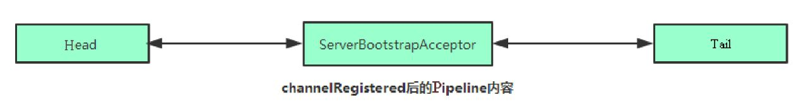

# 前言

bootstrap 也就是 Netty 的一个启动器，配置Netty 并启动

其中最主要的就是涉及到 Channel 的一个绑定操作 所以 Bootstrap 主讲 Channel


# Channel

在Netty中，Channel相当于一个Socket的抽象，它为用户提供了关于Socket状态（是连接还是断开）及对Socket的读、写等操作

> 我把 Socket 理解为 socket长连接 类似	
>
> 除了TCP，Netty还支持很多其他的连接协议，并且每种协议还有NIO（非阻塞I/O）和OIO（Old-I/O，即传统的阻塞I/O）版本的区别，不同协议不同阻塞类型的连接都有不同的Channel类型与之对应
>
> 都是以 xxxChannel ，都继承于 Channel

## NioSocketChannel

Bootstrap是Netty提供的一个便利的工厂类，可以通过它来完成客户端或服务端的Netty初始化

在启动客户端或者服务端时都需要用到 Bootstrap 作为启动器，配置相关的信息

> 配置EventLoopGroup（工作线程组）、配置ChannelType（使用的Channel类型）、配置Handler（处理器）

基本的使用

```java
EventLoopGroup group = new NioEventLoopGroup(); // 工作线程组
try {
    Bootstrap b = new Bootstrap(); // 启动器
    b.group(group) 
     .channel(NioSocketChannel.class) // 配置 channel
     .option(ChannelOption.TCP_NODELAY, true) // 配置参数
     .handler(); // 配置 handler 处理器
    // Start the client.
    ChannelFuture f = b.connect(HOST, PORT).sync();

    // Wait until the connection is closed.
    f.channel().closeFuture().sync();
} finally {
    // Shut down the event loop to terminate all threads.
    group.shutdownGracefully();
}
```


`Bootstrap` 的 `channel` 方法就是用来配置 Channel 的

```java
public B channel(Class<? extends C> channelClass) {
  return channelFactory(new ReflectiveChannelFactory<C>(
    ObjectUtil.checkNotNull(channelClass, "channelClass")
  ));
}
```

很明显就是创建一个工厂类去创建对应的Channel

其中就一个实现方法 `newChannel`，这个方法就是去调用对应`Class` 的`newInstance()` 方法

这里其实也只是配置，那么真实的调用，并且构建出 Channel 是什么时候呢？

得看`AbstractBootstrap` 中的 `initAndRegister` 方法

```java
final ChannelFuture initAndRegister() {
  Channel channel = null;
  try {
    // 实例化 Channel
    channel = channelFactory.newChannel();
    // 初始化相关变量
    init(channel);
  } catch (Throwable t) {
   	// 省略
  }
  ChannelFuture regFuture = config().group().register(channel);
  if (regFuture.cause() != null) {
    if (channel.isRegistered()) {
      channel.close();
    } else {
      channel.unsafe().closeForcibly();
    }
  }
  return regFuture;
}
```


**ChannelPipeline的初始化**

在实例化一个Channel时，必然都要实例化一个ChannelPipeline

在 `AbstractChannel` 的构造方法中可以看到

```java
protected AbstractChannel(Channel parent) {
    this.parent = parent;
    id = newId();
    // 构建 Unsafe Unsafe其实是对Java底层Socket操作的封装
    unsafe = newUnsafe();
    // 构建 pipeline
    pipeline = newChannelPipeline();
}
```

DefaultChannelPipeline中还有两个特殊的属性，即Head和Tail，这两个属性是双向链表的头和尾。其实在DefaultChannelPipeline中维护了一个以AbstractChannelHandlerContext为节点元素的双向链表，这个链表是Netty实现Pipeline机制的关键


**EventLoop的初始化**

EventLoop子类很多，以`NioEventLoopGroup` 为例

其初始化就是一个构建线程池的过程，直属父类维护了一个指定 nThreads 数目的 EventExecutor 数组，父类`MultithreadEventExecutorGroup` 通过 `newChild` 来初始化这个数组	


**将Channel注册到Selector**

> Channel会在Bootstrap的initAndRegister()中进行初始化，但是这个方法还会将初始化好的Channe注册到NioEventLoop的Selector中

当Channel初始化后，紧接着会调用group().register()方法来向Selector注册Channel

因此，在Netty中，每个Channel都会关联一个特定的EventLoop，并且这个Channel中的所有I/O操作都是在这个EventLoop中执行的；当关联好Channel和EventLoop后，会继续调用底层Java NIO的SocketChannel对象的register()方法，将底层Java NIO的SocketChannel注册到指定的Selector中。通过这两步，就完成了Netty对Channel的注册过程。


**Handler的添加过程**

Netty有一个强大和灵活之处就是基于Pipeline的自定义Handler机制

基于此，我们可以像添加插件一样自由组合各种各样的Handler来完成业务逻辑


## NioServerSocketChannel

### 服务端Channel的初始化

一样是传入 channel 进行 构建，然后就会进入 AbstractChannel 顶层	实例化一个Unsafe和Pipeline

服务端ChannelPipeline的初始化和客户端一致

服务端Channel注册到Selector和客户端一致

不过服务端有两个 EventLoopGroup ： bossGroup与workerGroup

，bossGroup只用于服务端的accept

workerGroup负责客户端连接通道的I/O操作

group().register(channel)将bossGroup和NioServerSocketChannel关联起来了

在关联代码中涉及到一个Selector的轮询流程

（1）Selector事件轮询是从EventLoop的execute()方法开始的。

（2）在EventLoop的execute()方法中，会为每一个任务都创建一个独立的线程，并保存到无锁化串行任务队列。

（3）线程任务队列的每个任务实际调用的是NioEventLoop的run()方法。

（4）在run()方法中调用processSelectedKeys()处理轮询事件。


netty 是如何解决JDK的空轮询BUG呢？

大家应该早就听说过臭名昭著的Java NIO epoll的Bug，它会导致Selector空轮询，最终导致CPU使用率达到100%。官方声称JDK 1.6的update18修复了该问题，但是直到JDK 1.7该问题仍旧存在，只不过该Bug发生概率降低了一些而已，并没有被根本解决。出现此Bug是因为当Selector轮询结果为空时，没有进行wakeup或对新消息及时进行处理，导致发生了空轮询，CPU使用率达到了100%。


在Netty中最终的解决办法是：创建一个新的Selector，将可用事件重新注册到新的Selector中来终止空轮询。我们来回顾一下事件轮询的关键代码。


handler 的添加

在 服务端 bind 方法中可以知道

会构建一个 ChannelFuture

```
final ChannelFuture regFuture = initAndRegister();
```

在这个方法中就会尝试实例化 channel

```
channel = channelFactory.newChannel();
init(channel);
```

找到 init 的 ServerBootStrap 实现，就会发现一个关键代码

```java
p.addLast(new ChannelInitializer<Channel>() {
    @Override
    public void initChannel(final Channel ch) {
        //...
        if (handler != null) {
            pipeline.addLast(handler);
        }
        // 
        ch.eventLoop().execute(new Runnable() {
            @Override
            public void run() {
              	// 省略方法参数
                pipeline.addLast(new ServerBootstrapAcceptor()));
            }
        });
    }
});
```

额外添加了一个 `ServerBootstrapAcceptor`

> 这个 ServerBootstrapAcceptor 是

此时的 pipeline 内容



而 我们自己一开始配置的 Handle的添加是在有连接/事件时就会绑定进来

在 `ServerBootstrap` 中的 `channelRead` 就能看出来

而 `channelRead` 的调用是需要等到有 OP_ACCEPT 事件时才会调用