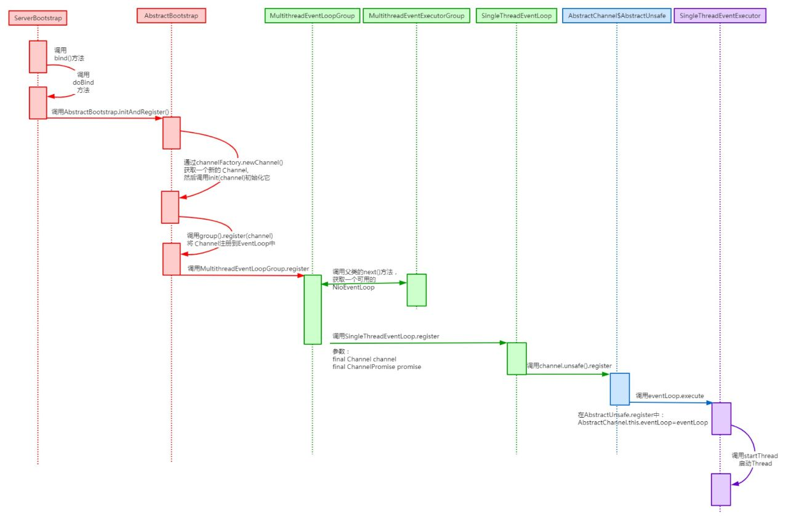

# EventLoop

一个Netty程序启动时，至少要指定一个EventLoopGroup，在使用NIO的过程中通常是指NioEventLoopGroup。

NioEventLoop继承自SingleThreadEventLoop，而SingleThreadEventLoop又继承自SingleThreadEventExecutor。而SingleThreadEventExecutor是Netty对本地线程的抽象，它内部有一个Thread属性，实际上就是存储了一个本地Java线程。因此我们可以简单地认为，一个NioEventLoop对象其实就是和一个特定的线程进行绑定，并且在NioEventLoop生命周期内，其绑定的线程都不会再改变。


通常来说，NioEventLoop负责执行两个任务：第一个任务是作为I/O线程，执行与Channel相关的I/O操作，包括调用Selector等待就绪的I/O事件、读写数据与数据处理等；而第二个任务是作为任务队列，执行taskQueue中的任务，例如用户调用eventLoop.schedule提交的定时任务也是由这个线程执行的。

EventLoop 的启动 在AbstractChannel$AbstractUnsafe的register()方法中调用eventLoop.execute()方法，在EventLoop中进行Channel注册代码的执行




## EventLoopGroup 实例化

1）EventLoopGroup（其实是MultithreadEventExecutorGroup）内部维护一个属性为EventExecutor的children的数组，其大小是nThreads，这样就初始化了一个线程池。

（2）我们在实例化NioEventLoopGroup时，如果指定线程池大小，则nThreads就是指定的值，否则是CPU核数×2。

（3）在MultithreadEventExecutorGroup中调用newChild()抽象方法来初始化children数组。

（4）newChild()抽象方法实际上是在NioEventLoopGroup中实现的，由它返回一个NioEventLoop实例。

（5）初始化NioEventLoop对象并给属性赋值，具体赋值的属性如下。

● provider：就是在NioEventLoopGroup的构造器中，调用SelectorProvider的provider()方法获取的SelectorProvider对象。

● selector：就是在NioEventLoop构造器中，调用selector=provider.openSelector()方法获取的Selector对象。


==事件循环对象==

EventLoop 本质是一个单线程执行器（同时维护了一个 Selector），里面有 run 方法处理 Channel 上源源不断的 io 事件：acctpt，read...

它的继承关系比较复杂

* 一条线是继承自 j.u.c.ScheduledExecutorService 因此包含了线程池中所有的方法
* 另一条线是继承自 netty 自己的 OrderedEventExecutor，
  * 提供了 boolean inEventLoop(Thread thread) 方法判断一个线程是否属于此 EventLoop
  * 提供了 parent 方法来看看自己属于哪个 EventLoopGroup


==事件循环组==

EventLoopGroup 是一组 EventLoop，Channel 一般会调用 EventLoopGroup 的 register 方法来绑定其中一个 EventLoop，后续这个 Channel 上的 io 事件都由此 EventLoop 来处理（保证了 io 事件处理时的线程安全）

* 继承自 netty 自己的 EventExecutorGroup
  * 实现了 Iterable 接口提供遍历 EventLoop 的能力
  * 另有 next 方法获取集合中下一个 EventLoop


以一个简单的实现为例：

```java
// 内部创建了两个 EventLoop, 每个 EventLoop 维护一个线程
EventLoopGroup loop = new NioEventLoopGroup(); // 可以处理 io事件，普通任务，定时任务
DefaultEventLoopGroup group = new DefaultEventLoopGroup(2);// 可以处理 普通任务，定时任务，除此以外，两者没有区别
```

追踪 `NioEventLoopGroup`  的初始化方法

```java
// DEFAULT_EVENT_LOOP_THREADS 的值是cpu核心数*2
private static final int DEFAULT_EVENT_LOOP_THREADS = 
    Math.max(1, SystemPropertyUtil.getInt("io.netty.eventLoopThreads", NettyRuntime.availableProcessors() * 2));

protected MultithreadEventLoopGroup(int nThreads, Executor executor, Object... args) {
    super(nThreads == 0 ? DEFAULT_EVENT_LOOP_THREADS : nThreads, executor, args);
}
```


输出

```java
System.out.println(group.next());
System.out.println(group.next());
System.out.println(group.next());
// 可以看到是循环
io.netty.channel.DefaultEventLoop@60f82f98
io.netty.channel.DefaultEventLoop@35f983a6
io.netty.channel.DefaultEventLoop@60f82f98
```

执行任务

```java
// 可以用来执行耗时较长的任务
loop.next().submit(()->{
    log.debug("ok");
});
14:12:19.668 [nioEventLoopGroup-2-1] DEBUG com.tutu.test.NettyDemo.EventLoopGroupDemo - ok
```

定时任务

```java
loop.next().scheduleAtFixedRate(()-> {
    System.out.println("error");
},0,1, TimeUnit.SECONDS);
```


#### 优雅关闭

优雅关闭 `shutdownGracefully` 方法。

该方法会首先切换 `EventLoopGroup` 到关闭状态从而拒绝新的任务的加入，然后在任务队列的任务都处理完成后，停止线程的运行。从而确保整体应用是在正常有序的状态下退出的


#### 演示 NioEventLoop 处理 io 事件

服务器端两个 nio worker 工人

```java
new ServerBootstrap()
    .group(new NioEventLoopGroup(1), new NioEventLoopGroup(2))
    .channel(NioServerSocketChannel.class)
    .childHandler(new ChannelInitializer<NioSocketChannel>() {
        @Override
        protected void initChannel(NioSocketChannel ch) {
            ch.pipeline().addLast(new ChannelInboundHandlerAdapter() {
                @Override
                public void channelRead(ChannelHandlerContext ctx, Object msg) {
                    ByteBuf byteBuf = msg instanceof ByteBuf ? ((ByteBuf) msg) : null;
                    if (byteBuf != null) {
                        byte[] buf = new byte[16];
                        ByteBuf len = byteBuf.readBytes(buf, 0, byteBuf.readableBytes());
                        log.debug(new String(buf));
                    }
                }
            });
        }
    }).bind(8080).sync();
```

客户端，启动三次，分别修改发送字符串为 zhangsan（第一次），lisi（第二次），wangwu（第三次）

```java
public static void main(String[] args) throws InterruptedException {
    Channel channel = new Bootstrap()
            .group(new NioEventLoopGroup(1))
            .handler(new ChannelInitializer<NioSocketChannel>() {
                @Override
                protected void initChannel(NioSocketChannel ch) throws Exception {
                    System.out.println("init...");
                    ch.pipeline().addLast(new LoggingHandler(LogLevel.DEBUG));
                }
            })
            .channel(NioSocketChannel.class).connect("localhost", 8080)
            .sync()
            .channel();

    channel.writeAndFlush(ByteBufAllocator.DEFAULT.buffer().writeBytes("wangwu".getBytes()));
    Thread.sleep(2000);
    channel.writeAndFlush(ByteBufAllocator.DEFAULT.buffer().writeBytes("wangwu".getBytes()));
```

最后输出

```
22:03:34 [DEBUG] [nioEventLoopGroup-3-1] c.i.o.EventLoopTest - zhangsan       
22:03:36 [DEBUG] [nioEventLoopGroup-3-1] c.i.o.EventLoopTest - zhangsan       
22:05:36 [DEBUG] [nioEventLoopGroup-3-2] c.i.o.EventLoopTest - lisi           
22:05:38 [DEBUG] [nioEventLoopGroup-3-2] c.i.o.EventLoopTest - lisi           
22:06:09 [DEBUG] [nioEventLoopGroup-3-1] c.i.o.EventLoopTest - wangwu        
22:06:11 [DEBUG] [nioEventLoopGroup-3-1] c.i.o.EventLoopTest - wangwu         
```

可以看到两个工人轮流处理 channel，但工人与 channel 之间进行了绑定


再增加两个非 nio 工人

```java
DefaultEventLoopGroup normalWorkers = new DefaultEventLoopGroup(2);
new ServerBootstrap()
    .group(new NioEventLoopGroup(1), new NioEventLoopGroup(2))
    .channel(NioServerSocketChannel.class)
    .childHandler(new ChannelInitializer<NioSocketChannel>() {
        @Override
        protected void initChannel(NioSocketChannel ch)  {
            ch.pipeline().addLast(new LoggingHandler(LogLevel.DEBUG));
            ch.pipeline().addLast(normalWorkers,"myhandler",
              new ChannelInboundHandlerAdapter() {
                @Override
                public void channelRead(ChannelHandlerContext ctx, Object msg) {
                    ByteBuf byteBuf = msg instanceof ByteBuf ? ((ByteBuf) msg) : null;
                    if (byteBuf != null) {
                        byte[] buf = new byte[16];
                        ByteBuf len = byteBuf.readBytes(buf, 0, byteBuf.readableBytes());
                        log.debug(new String(buf));
                    }
                }
            });
        }
    }).bind(8080).sync();
```

客户端代码不变，启动三次，分别修改发送字符串为 zhangsan（第一次），lisi（第二次），wangwu（第三次）

输出

```
22:19:48 [DEBUG] [nioEventLoopGroup-4-1] i.n.h.l.LoggingHandler - [id: 0x251562d5, L:/127.0.0.1:8080 - R:/127.0.0.1:52588] REGISTERED
22:19:48 [DEBUG] [nioEventLoopGroup-4-1] i.n.h.l.LoggingHandler - [id: 0x251562d5, L:/127.0.0.1:8080 - R:/127.0.0.1:52588] ACTIVE
22:19:48 [DEBUG] [nioEventLoopGroup-4-1] i.n.h.l.LoggingHandler - [id: 0x251562d5, L:/127.0.0.1:8080 - R:/127.0.0.1:52588] READ: 8B
         +-------------------------------------------------+
         |  0  1  2  3  4  5  6  7  8  9  a  b  c  d  e  f |
+--------+-------------------------------------------------+----------------+
|00000000| 7a 68 61 6e 67 73 61 6e                         |zhangsan        |
+--------+-------------------------------------------------+----------------+
22:19:48 [DEBUG] [nioEventLoopGroup-4-1] i.n.h.l.LoggingHandler - [id: 0x251562d5, L:/127.0.0.1:8080 - R:/127.0.0.1:52588] READ COMPLETE
22:19:48 [DEBUG] [defaultEventLoopGroup-2-1] c.i.o.EventLoopTest - zhangsan        
22:19:50 [DEBUG] [nioEventLoopGroup-4-1] i.n.h.l.LoggingHandler - [id: 0x251562d5, L:/127.0.0.1:8080 - R:/127.0.0.1:52588] READ: 8B
         +-------------------------------------------------+
         |  0  1  2  3  4  5  6  7  8  9  a  b  c  d  e  f |
+--------+-------------------------------------------------+----------------+
|00000000| 7a 68 61 6e 67 73 61 6e                         |zhangsan        |
+--------+-------------------------------------------------+----------------+
22:19:50 [DEBUG] [nioEventLoopGroup-4-1] i.n.h.l.LoggingHandler - [id: 0x251562d5, L:/127.0.0.1:8080 - R:/127.0.0.1:52588] READ COMPLETE
22:19:50 [DEBUG] [defaultEventLoopGroup-2-1] c.i.o.EventLoopTest - zhangsan        
22:20:24 [DEBUG] [nioEventLoopGroup-4-2] i.n.h.l.LoggingHandler - [id: 0x94b2a840, L:/127.0.0.1:8080 - R:/127.0.0.1:52612] REGISTERED
22:20:24 [DEBUG] [nioEventLoopGroup-4-2] i.n.h.l.LoggingHandler - [id: 0x94b2a840, L:/127.0.0.1:8080 - R:/127.0.0.1:52612] ACTIVE
22:20:25 [DEBUG] [nioEventLoopGroup-4-2] i.n.h.l.LoggingHandler - [id: 0x94b2a840, L:/127.0.0.1:8080 - R:/127.0.0.1:52612] READ: 4B
         +-------------------------------------------------+
         |  0  1  2  3  4  5  6  7  8  9  a  b  c  d  e  f |
+--------+-------------------------------------------------+----------------+
|00000000| 6c 69 73 69                                     |lisi            |
+--------+-------------------------------------------------+----------------+
22:20:25 [DEBUG] [nioEventLoopGroup-4-2] i.n.h.l.LoggingHandler - [id: 0x94b2a840, L:/127.0.0.1:8080 - R:/127.0.0.1:52612] READ COMPLETE
22:20:25 [DEBUG] [defaultEventLoopGroup-2-2] c.i.o.EventLoopTest - lisi            
22:20:27 [DEBUG] [nioEventLoopGroup-4-2] i.n.h.l.LoggingHandler - [id: 0x94b2a840, L:/127.0.0.1:8080 - R:/127.0.0.1:52612] READ: 4B
         +-------------------------------------------------+
         |  0  1  2  3  4  5  6  7  8  9  a  b  c  d  e  f |
+--------+-------------------------------------------------+----------------+
|00000000| 6c 69 73 69                                     |lisi            |
+--------+-------------------------------------------------+----------------+
22:20:27 [DEBUG] [nioEventLoopGroup-4-2] i.n.h.l.LoggingHandler - [id: 0x94b2a840, L:/127.0.0.1:8080 - R:/127.0.0.1:52612] READ COMPLETE
22:20:27 [DEBUG] [defaultEventLoopGroup-2-2] c.i.o.EventLoopTest - lisi            
22:20:38 [DEBUG] [nioEventLoopGroup-4-1] i.n.h.l.LoggingHandler - [id: 0x79a26af9, L:/127.0.0.1:8080 - R:/127.0.0.1:52625] REGISTERED
22:20:38 [DEBUG] [nioEventLoopGroup-4-1] i.n.h.l.LoggingHandler - [id: 0x79a26af9, L:/127.0.0.1:8080 - R:/127.0.0.1:52625] ACTIVE
22:20:38 [DEBUG] [nioEventLoopGroup-4-1] i.n.h.l.LoggingHandler - [id: 0x79a26af9, L:/127.0.0.1:8080 - R:/127.0.0.1:52625] READ: 6B
         +-------------------------------------------------+
         |  0  1  2  3  4  5  6  7  8  9  a  b  c  d  e  f |
+--------+-------------------------------------------------+----------------+
|00000000| 77 61 6e 67 77 75                               |wangwu          |
+--------+-------------------------------------------------+----------------+
22:20:38 [DEBUG] [nioEventLoopGroup-4-1] i.n.h.l.LoggingHandler - [id: 0x79a26af9, L:/127.0.0.1:8080 - R:/127.0.0.1:52625] READ COMPLETE
22:20:38 [DEBUG] [defaultEventLoopGroup-2-1] c.i.o.EventLoopTest - wangwu          
22:20:40 [DEBUG] [nioEventLoopGroup-4-1] i.n.h.l.LoggingHandler - [id: 0x79a26af9, L:/127.0.0.1:8080 - R:/127.0.0.1:52625] READ: 6B
         +-------------------------------------------------+
         |  0  1  2  3  4  5  6  7  8  9  a  b  c  d  e  f |
+--------+-------------------------------------------------+----------------+
|00000000| 77 61 6e 67 77 75                               |wangwu          |
+--------+-------------------------------------------------+----------------+
22:20:40 [DEBUG] [nioEventLoopGroup-4-1] i.n.h.l.LoggingHandler - [id: 0x79a26af9, L:/127.0.0.1:8080 - R:/127.0.0.1:52625] READ COMPLETE
22:20:40 [DEBUG] [defaultEventLoopGroup-2-1] c.i.o.EventLoopTest - wangwu          
```

可以看到，nio 工人和 非 nio 工人也分别绑定了 channel（LoggingHandler 由 nio 工人执行，而我们自己的 handler 由非 nio 工人执行）


#### handler 执行中如何换人？

追踪一下 `ctx.fireChannelRead(msg);`方法，找到了 `invokeChannelRead` 方法

关键代码 `io.netty.channel.AbstractChannelHandlerContext#invokeChannelRead()`

```java
static void invokeChannelRead(final AbstractChannelHandlerContext next, Object msg) {
    final Object m = next.pipeline.touch(ObjectUtil.checkNotNull(msg, "msg"), next);
    // 下一个 handler 的事件循环是否与当前的事件循环是同一个线程
    EventExecutor executor = next.executor();
    
    // 是，直接调用
    if (executor.inEventLoop()) {
        next.invokeChannelRead(m);
    } 
    // 不是，将要执行的代码作为任务提交给下一个事件循环处理（换人）
    else {
        executor.execute(new Runnable() {
            @Override
            public void run() {
                next.invokeChannelRead(m);
            }
        });
    }
}
```

* 如果两个 handler 绑定的是同一个线程，那么就直接调用
* 否则，把要调用的代码封装为一个任务对象，由下一个 handler 的线程来调用

