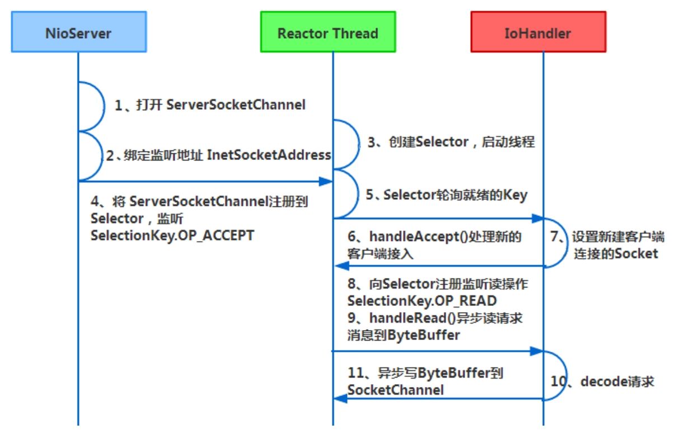
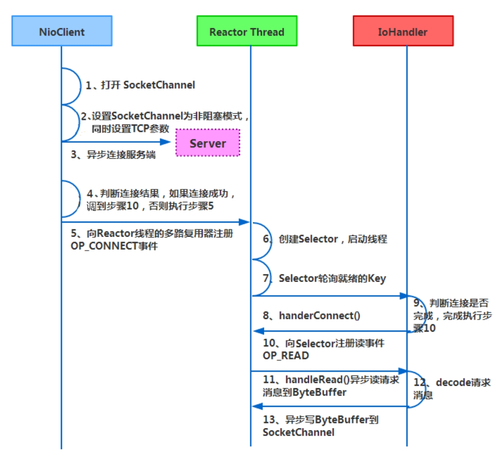
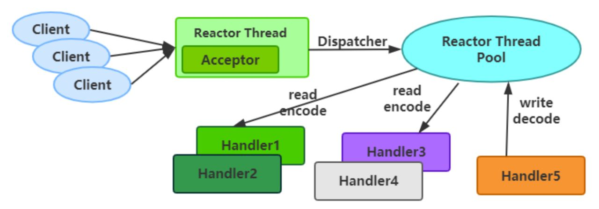
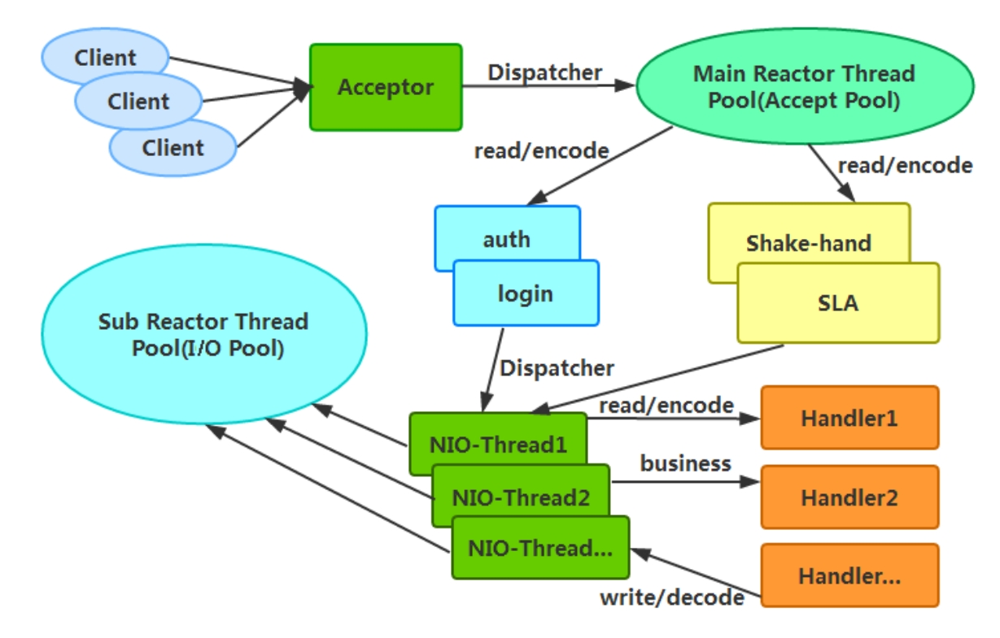
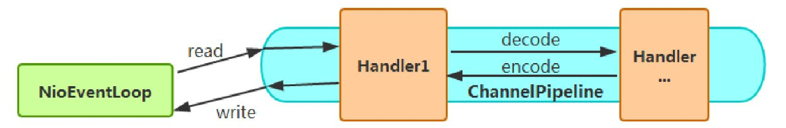

# Netty之前

## 传统RPC性能差

- 网络传输方式存在弊端。传统的RPC框架或者基于RMI等方式的远程服务调用都是采用BIO,并发场景下性能下降
- 线程模型存在弊端。由于传统的RPC框架均采用BIO模型，这使得每个TCP连接都需要分配1个线程，而线程资源是JVM非常宝贵的资源，当I/O读写阻塞导致线程无法及时释放时，会导致系统性能急剧下降，甚至会导致虚拟机无法创建新的线程。

## Netty三大核心

- IO传输模型：NIO（select/poll模型）
- 数据协议：
- 线程模型：Reactor线程模型

> （1）I/O传输模型：用什么样的通道将数据发送给对方，是BIO、NIO还是AIO，I/O传输模型在很大程度上决定了框架的性能。
>
> （2）数据协议：采用什么样的通信协议，是HTTP还是内部私有协议。协议的选择不同，性能模型也就不同。一般来说内部私有协议比公有协议的性能更高。
>
> （3）线程模型：线程模型涉及如何读取数据包，读取之后的编解码在哪个线程中进行，编解码后的消息如何派发等方面。线程模型设计得不同，对性能也会产生非常大的影响。

## Netty高性能

### 异步非阻塞

多路复用I/O就是把多个I/O的阻塞复用到同一个Selector的阻塞上，从而达到系统在单线程的情况下也可以同时处理多个客户端请求的目的。

多路复用I/O的最大优势是系统开销小

Netty底层是采用Reactor线程模型来设计和实现的

Netty采用的是异步通信模式，单个I/O线程也可以并发处理多个客户端连接和读写操作

Netty服务端API的通信步骤

Netty客户端API的通信步骤

Netty的I/O线程NioEventLoop聚合了Selector

Netty采用的是异步通信模式，单个I/O线程也可以并发处理多个客户端连接和读写操作

### 零拷贝

（1）Netty接收和发送ByteBuffer采用DirectBuffer，使用堆外直接内存进行Socket读写，不需要进行字节缓冲区的二次拷贝。如果使用传统的堆存（Heap Buffer）进行Socket读写，那么JVM会将堆存拷贝一份到直接内存中，然后才写入Socket。相比于堆外直接内存，消息在发送过程中多了一次缓冲区的内存拷贝。

（2）Netty提供了组合Buffer对象，可以聚合多个ByteBuffer对象，用户可以像操作一个Buffer那样方便地对组合Buffer进行操作，避免了传统的通过内存拷贝的方式将几个小Buffer合并成一个大Buffer的烦琐操作。

（3）Netty中文件传输采用了transferTo()方法，它可以直接将文件缓冲区的数据发送到目标Channel，避免了传统通过循环write()方式导致的内存拷贝问题。

零拷贝的实现方式

- AbstractNioByteChannel$NioByteUnsafe 中的read 方法 直接读取缓冲数据：allocHandle.allocate()方法
- CompositeByteBuf 实现封装 多个ByteBuf 成一个
- 文件传输的零拷贝：transferTo，将文件channel写入到指定channel

### 内存池

随着JVM和JIT（Just-In-Time）即时编译技术的发展，对象的分配和回收已然是一个非常轻量级的工作。但是对于缓冲区来说还有些特殊，尤其是对于堆外直接内存的分配和回收，是一种耗时的操作。为了尽量重复利用缓冲区内存，Netty设计了一套基于内存池的缓冲区重用机制

Netty提供了多种内存管理策略，通过在启动辅助类中配置相关参数，可以实现差异化的个性定制

采用内存池分配直接缓冲区明显比采用堆外内存分配快很多：newDirectBuffer 方法

### Reactor线程模型

常用的Reactor线程模型有三种，分别如下。

**（1）Reactor单线程模型**

指的是所有的I/O操作都在同一个NIO线程中完成

Acceptor负责接收客户端的TCP连接请求消息，链路建立成功之后，通过Dispatcher将对应的ByteBuffer派发到指定的Handler上进行消息解码，用户Handler通过NIO线程将消息发送给客户端

单线程模型不适用于高负载、高并发的场景，主要原因如下：

- 一个NIO线程如果同时处理成百上千的链路，则机器在性能上无法满足，即便是NIO线程的CPU负载达到100%，也无法满足海量消息的编码、解码、读取和发送。

- 如果NIO线程负载过重，那么处理速度将变慢，从而导致大量客户端连接超时，超时之后往往会进行重发，这更加重了NIO线程的负载，最终会导致大量消息积压和处理超时，NIO线程就会成为系统的性能瓶颈。

- 一旦NIO线程发生意外或者进入死循环状态，就会导致整个系统通信模块不可用，从而不能接收和处理外部消息，造成节点故障。

**（2）Reactor多线程模型**

- 有一个专门的NIO线程Acceptor用于监听服务端、接收客户端的TCP连接请求。

- 网络I/O的读、写等操作只由一个NIO线程池负责，可以采用标准的JDK线程池来实现，它包含一个任务队列和多个可用的线程，由这些NIO线程负责消息的读取、解码、编码和发送。

- 一个NIO线程可以同时处理多条请求链路，但是一条链路只对应一个NIO线程，防止发生并发串行。

**（3）主从Reactor多线程模型**

在极特殊的应用场景中，一个NIO线程负责监听和处理所有的客户端连接也可能会存在性能问题，所以就出现了主从的多线程模式

> 比如在并发场景下，多个请求需要进行预处理，那么单个NIO线程性能就会下降

Acceptor线程池仅仅用于客户端的登录、握手和安全认证，一旦链路建立成功，就将链路注册到后端Sub Reactor子线程池的I/O线程上，再由I/O线程负责后续的I/O操作

### 无锁化

在大多数应用场景下，并行多线程处理可以提升系统的并发性能。但是，如果对共享资源的并发访问处理不当，就会造成严重的锁竞争，最终导致系统性能的下降。为了尽可能避免锁竞争带来的性能损耗，可以通过串行化设计来避免多线程竞争和同步锁，即消息的处理尽可能在同一个线程内完成，不进行线程切换

Netty的串行设计工作原理 无锁队列

Netty的NioEventLoop读取消息之后，直接调用ChannelPipeline的fireChannelRead（Object msg），只要用户不主动切换线程，NioEventLoop就会调用用户的Handler，期间不进行线程切换，这种串行处理方式避免了多线程操作导致的锁竞争，从性能角度看是最优的。

### 高效并发编程

Netty的高效并发编程主要体现在如下几点。

（1）volatile关键字的大量且正确的使用。

（2）CAS和原子类的广泛使用。

（3）线程安全容器的使用。

（4）通过读写锁提升并发性能。

### 高效序列化

Netty默认提供了对Google Protobuf的支持

### 灵活的TCP参数配置能力

合理设置TCP参数在某些场景下对性能的提升具有显著的效果

面我们总结一下对性能影响比较大的几个配置项。

（1）SO_RCVBUF和SO_SNDBUF：通常建议值为128KB或者256KB。

（2）SO_TCPNODELAY：Nagle算法通过将缓冲区内的小封包自动相连，组成较大的封包，阻止大量小封包的发送阻塞网络，从而提高网络应用效率。但是对于延时敏感的应用场景需要关闭该优化算法。

**解释：**Nagle算法是以其发明人John Nagle的名字命名的，它用于将小的碎片数据连接成更大的报文来最小化所发送的报文的数量。如果需要发送一些较小的报文，则需要禁用该算法。Netty默认禁用该算法，从而使报文传输延时最小化。

（3）软中断：如果Linux内核版本支持RPS（2.6.35版本以上），开启RPS后可以实现软中断，提升网络吞吐量。RPS会根据数据包的源地址、目的地址，以及源端口和目的端口进行计算得出一个Hash值，然后根据这个Hash值来选择软中断CPU的运行。从上层来看，也就是说将每个连接和CPU绑定，并通过这个Hash值在多个CPU上均衡软中断，提升网络并行处理性能。