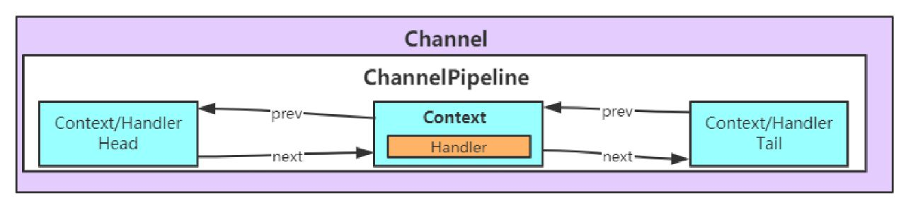

##  Channel与ChannelPipeline

在Netty中每个Channel都有且仅有一个ChannelPipeline与之对应



通过上图可以看到，一个Channel包含了一个ChannelPipeline，而ChannelPipeline中又维护了一个由ChannelHandlerContext组成的双向链表。这个链表的头是HeadContext，链表的尾是TailContext，并且每个ChannelHandlerContext中又关联着一个ChannelHandler。


从 `Channel` 的构造方法中也能看出 ：每个Channel都有且仅有一个ChannelPipeline与之对应

```java
protected AbstractChannel(Channel parent) {
    this.parent = parent;
    id = newId();
    // 构建 Unsafe Unsafe其实是对Java底层Socket操作的封装
    unsafe = newUnsafe();
    // 构建 pipeline
    pipeline = newChannelPipeline();
}
```


那么  `Pipeline`  的初始化是怎么执行的呢？

```java
protected DefaultChannelPipeline(Channel channel) {
    this.channel = ObjectUtil.checkNotNull(channel, "channel");
    succeededFuture = new SucceededChannelFuture(channel, null);
    voidPromise =  new VoidChannelPromise(channel, true);

    // AbstractChannelHandlerContext 双向链表
    // head 与 tail 一个重要的区别参数： inbound 和 outbound
    tail = new TailContext(this);
    head = new HeadContext(this);
    head.next = tail;
    tail.prev = head;
}
```

在DefaultChannelPipeline构造器中，首先将与之关联的Channel保存到属性channel中。然后实例化两个ChannelHandlerContext：一个是HeadContext实例Head，另一个是TailContext实例Tail。接着将Head和Tail互相指向，构成一个双向链表。

上面代码中的Head实现了ChannelInboundHandler接口，而Tail实现了ChannelOutboundHandler接口，因此可以说Head和Tail既是ChannelHandler，又是ChannelHandlerContext


## ChannelInitializer的添加

最开始的时候ChannelPipeline中含有两个ChannelHandlerContext（同时也是ChannelHandler），但是此时的Pipeline并不能实现特定的功能，因为还没有添加自定义的ChannelHandler。通常来说，在初始化Bootstrap时，会添加自定义的ChannelHandler


问：在我们定义了这样的 `ChannelHandler` 方法后，又是什么时候添加到 `ChannelPipeline` 中去的呢？

答：Bootstrap 的 init() 方法

```java
void init(Channel channel) {
    ChannelPipeline p = channel.pipeline();
    p.addLast(config.handler());

    setChannelOptions(channel, newOptionsArray(), logger);
    setAttributes(channel, newAttributesArray());
}
```

> 但是这只是在客户端的BootStrap，在服务端的BootStrap的添加不是在这个 `init`逻辑中

这里的 `addLast` 不仅仅是一个简单的集合添加方法

- 校验是否为 NULL
- 包装成 AbstractChannelHandlerContext
- 添加到代码维护的双向链表中


问：但是对于 init 方法，参数 `channel` 是怎么来的呢？

答：自定义`ChannelHandler`的添加过程，发生在`AbstractUnsafe`的`register0()`方法中，在这个方法中调用了`pipeline.fireChannelRegistered()`方法