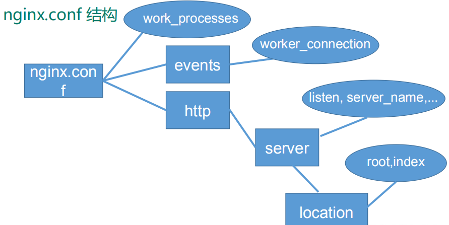
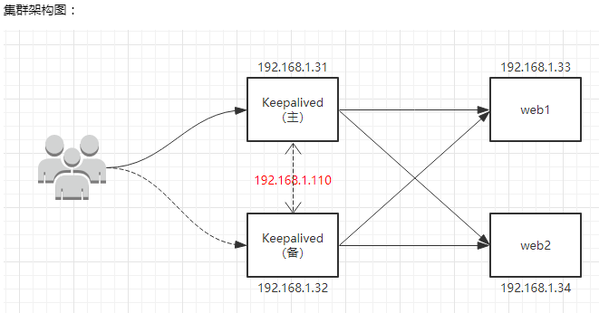
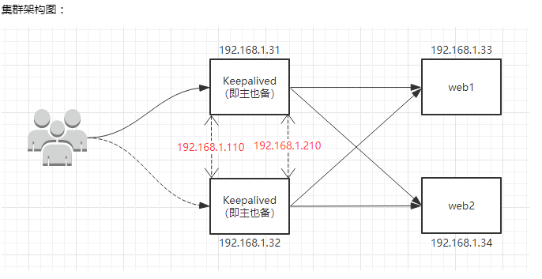
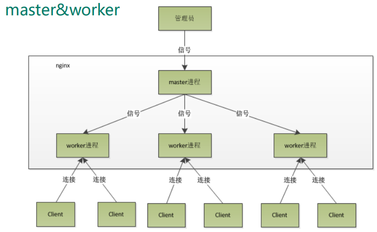
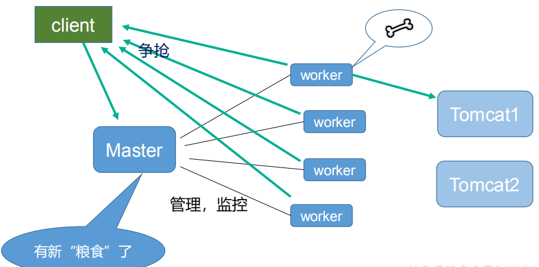

# Nginx

## Nginx概述

1，Nginx 是一个高性能的 HTTP 和反向代理服务器,特点是占有内存少，并发能 力强

2，Nginx 可以作为静态页面的 web 服务器，同时还支持 CGI 协议的动态语言，比如 perl、php 等。但是不支持 java。Java 程序只能通过与 tomcat 配合完成。Nginx 专为性能优化而开发， 性能是其最重要的考量,实现上非常注重效率 ，能经受高负载的考验


## 配置文件



### 全局块

从配置文件开始到 events 块之间的内容，主要会设置一些影响 nginx 服务器整体运行的配置指令，主要包括配
置运行 Nginx 服务器的用户（组）、允许生成的 worker process 数，进程 PID 存放路径、日志存放路径和类型以
及配置文件的引入等。


### events 块

events 块涉及的指令主要影响 Nginx 服务器与用户的网络连接，常用的设置包括是否开启对多 work process
下的网络连接进行序列化，是否允许同时接收多个网络连接，选取哪种事件驱动模型来处理连接请求，每个 word
process 可以同时支持的最大连接数等

> 注意：这部分的配置对 Nginx 的性能影响较大，在实际中应该灵活配置

```properties
events {
	work_connections 1024;
	# 每个 work process 支持的最大连接数为 1024.
}
```


### http块

http 块也可以包括 http 全局块、server 块。

#### http 全局块

http 全局块配置的指令包括文件引入、MIME-TYPE 定义、日志自定义、连接超时时间、单链接请求数上限等。

#### server 块

这块和虚拟主机有密切关系，虚拟主机从用户角度看，和一台独立的硬件主机是完全一样的，该技术的产生是为了
节省互联网服务器硬件成本。
每个 http 块可以包括多个 server 块，而每个 server 块就相当于一个虚拟主机。
而每个 server 块也分为全局 server 块，以及可以同时包含多个 locaton 块。

1、全局 server 块
最常见的配置是本虚拟机主机的监听配置和本虚拟主机的名称或 IP 配置。

2、location 块
一个 server 块可以配置多个 location 块。
这块的主要作用是基于 Nginx 服务器接收到的请求字符串（例如 server_name/uri-string），对虚拟主机名称
（也可以是 IP 别名）之外的字符串（例如 前面的 /uri-string）进行匹配，对特定的请求进行处理。地址定向、数据缓存和应答控制等功能，还有许多第三方模块的配置也在这里进行。


## 反向代理

> 正向代理：
>
> 用户访问互联网，需要通过代理服务器才能够访问
>
> 需要在客户端配置代理服务器进行指定网站访问 


反向代理，我们只 需要将请求发送到反向代理服务器，由反向代理服务器去选择目标服务器获取数据后，在返 回给客户端，此时反向代理服务器和目标服务器对外就是一个服务器，暴露的是代理服务器 地址，隐藏了真实服务器 IP 地址


> 例子
>
> 访问http://localhost:8001，跳转到http://localhost:8002


这里会有涉及到域名和ip的对应关系，需要在windows中的host文件中添加关系

```properties
# 例子
192.168.17.129  www.123.com 
```


具体操作

1，配置域名和ip的关系（可以省略）

2，配置文件（nginx.conf）

```properties
# 这样访问8001就会跳转到8002
server {
		listen 8001;
		server_name localhost;

		location ~ / {           
			 proxy_pass http://localhost:8002;
		}
	}
```

3，可以通过不同的请求，去访问不同的端口的服务

```properties
# 这样访问localhost:8001/edu就会跳转到8002
# 这样访问localhost:8001/duc就会跳转到8003
server {
		listen 8001;
		server_name localhost;

		location ~ /edu/ {           
			 proxy_pass http://localhost:8002;
		}
		location ~ /duc/ {
			proxy_pass http://localhost:8003;
		}
	}
```


location语法规则

> =：用于不含正则表达式之前，字符串必须严格匹配
>
> ~：用于表示包含正则表达式，区分大小写
>
> ~*：用于表示包含正则表达式，不区分大小写
>
> ^~：用于不含正则表达式的 uri 前，要求 Nginx 服务器找到标识 uri 和请求字 符串匹配度最高的 location 后，立即使用此 location 处理请求，而不再使用 location 块中的正则 uri 和请求字符串做匹配


## 负载均衡

将负载分摊到不同的服务中

实例

```properties
http{
# myserver是名字，可以任意取
	upstream myserver{
		server 115.28.52.63:8080;
		server 115.28.52.63:8081;
	}
	service{
		location / {
			proxy_pass http://myserver;
			proxy_connect_timeout 10;
		}
	}
}
```


分配方式

1，轮询（默认）

2，weight （权重）

> weight 代表权,重默认为 1,权重越高被分配的客户端越多 

```properties
http{
	upstream myserver{
		server 115.28.52.63:8080 weight=1;
		server 115.28.52.63:8081 weight=2;
	}
}
```

3，ip_hash

> 每个请求按访问 ip 的 hash 结果分配，这样每个访客固定访问一个后端服务器

```properties
http{
	upstream myserver{
		ip_hash;
		server 115.28.52.63:8080;
		server 115.28.52.63:8081;
	}
}
```

4，fair

> 按后端服务器的响应时间来分配请求，响应时间短的优先分配

```properties
http{
	upstream myserver{
		fair;
		server 115.28.52.63:8080;
		server 115.28.52.63:8081;
	}
}
```


## 动静分离

Nginx 动静分离简单来说就是把动态跟静态请求分开

严格意义上说应该是动态请求跟静态请求分开，可以理解成使用 Nginx 处理静态页面，Tomcat 处理动态页面。


动静分离从目前实现角度来讲大致分为两种： 

一种是纯粹把静态文件独立成单独的域名，放在独立的服务器上，也是目前主流推崇的方案；


另外一种方法就是动态跟静态文件混合在一起发布，通过 nginx 来分开。


> 通过 location 指定不同的后缀名实现不同的请求转发。
>
> 通过 expires 参数设置，可以使 浏览器缓存过期时间，减少与服务器之前的请求和流量。
>
> 具体 Expires 定义：是给一个资 源设定一个过期时间，也就是说无需去服务端验证，直接通过浏览器自身确认是否过期即可， 所以不会产生额外的流量。此种方法非常适合不经常变动的资源。（如果经常更新的文件， 不建议使用 Expires 来缓存），我这里设置 3d，表示在这 3 天之内访问这个 URL，发送 一个请求，比对服务器该文件最后更新时间没有变化，则不会从服务器抓取，返回状态码 304，如果有修改，则直接从服务器重新下载，返回状态码 200


实例

```properties
server{
# 这样访问a下的就是访问动态页面
	location /a/ {
	# root的意思是根目录下
		root /root/;
		index index.html index.html;
	}
# 访问b下的就是静态资源	
	location /b/ {
		root /root/;
		# autoindex on 就是将目录下的文件全部展示
		autoindex on;
	}
}
```


## 高可用

Keepalived+Nginx 高可用集群（主从模式） 




Keepalived+Nginx 高可用集群（双主模式）




## 原理




当请求过来时，nginx就会传递给Master进程，Master就会发给所有的worker，进行抢夺，抢到请求的worker就会处理请求，去访问服务器




master- -s workers 的机制的好处

1，worker都是独立的进程，相互之间不会影响

2，对于每个 worker 进程来说，独立的进程，不需要加锁，所以省掉了锁带来的开销，同时在编程以及问题查找时，也会方便很多。

3，Nginx 同 redis 类似都采用了 io 多路复用机制，每个 worker 都是一个独立的进程，但每个进 程里只有一个主线程，通过异步非阻塞的方式来处理请求。

4，每个 worker 的线程可以把一个 cpu 的性能发挥到极致。所以 worker 数和服务器的 cpu 数相等是最为适宜的。

5，设少了会浪费 cpu，设多了会造成 cpu 频繁切换上下文带来的损耗。


**设置 worker 数**

 worker_processes 4 #work 绑定 cpu(4 work 绑定 4cpu)。

```properties
worker_cpu_affinity 0001 0010 0100 1000 
#work 绑定 cpu (4 work 绑定 8cpu 中的 4 个) 。 
worker_cpu_affinity 0000001 00000010 00000100 00001000 
```

连接数 worker_connection 

这个值是表示每个 worker 进程所能建立连接的最大值，所以，一个 nginx 能建立的最大连接 数，应该是 

```
worker_connections * worker_processes。
```

当然，这里说的是最大连接数，对于 HTTP 请 求 本 地 资 源 来 说 ， 能 够 支 持 的 最 大 并 发 数 量 是 

```
worker_connections * worker_processes，
```

如果是支持 http1.1 的浏览器每次访问要占两个连接，所以普通的静态访 问最大并发数是： 

```
worker_connections * worker_processes /2，
```

而如果是 HTTP 作 为反向代 理来说，最大并发数量应该是 

```
worker_connections *  worker_processes/4。
```

因为作为反向代理服务器，每个并发会建立与客户端的连接和与后端服 务的连接，会占用两个连接。 

 