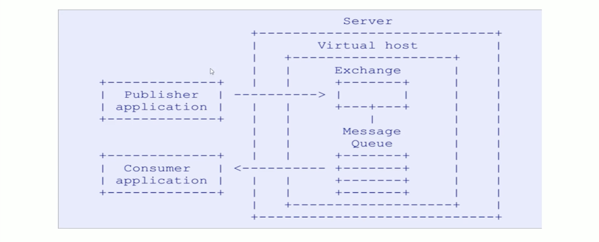
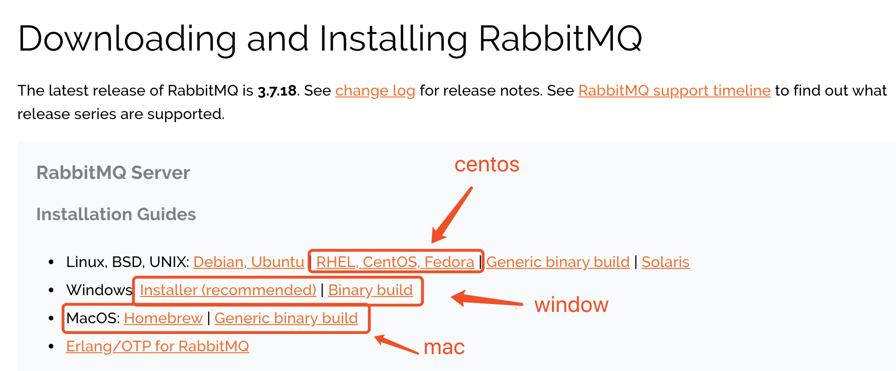
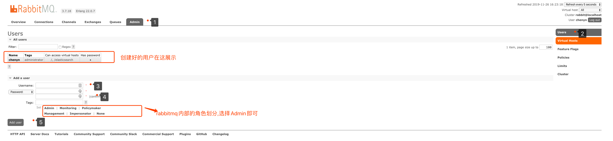
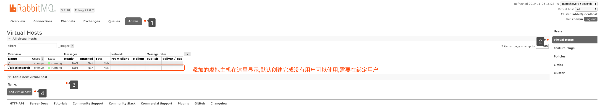
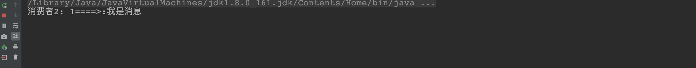
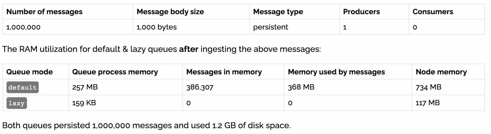
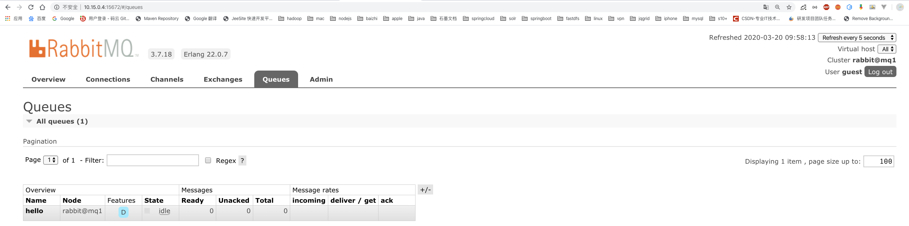
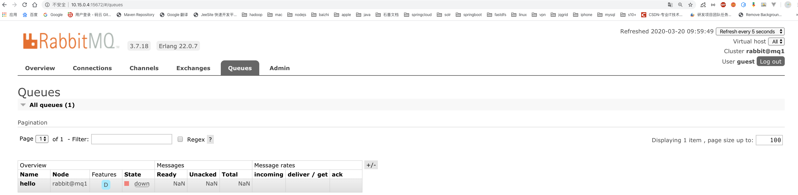

# RabbitMQ 实战教程

## MQ引言

### 什么是MQ

`MQ`(Message Quene) :  翻译为 `消息队列`,通过典型的 `生产者`和`消费者`模型,生产者不断向消息队列中生产消息，消费者不断的从队列中获取消息。因为消息的生产和消费都是异步的，而且只关心消息的发送和接收，没有业务逻辑的侵入,轻松的实现系统间解耦。

别名为 `消息中间件`	通过利用高效可靠的消息传递机制进行平台无关的数据交流，并基于数据通信来进行分布式系统的集成。

### 什么是中间件

中间件（Middleware）是处于操作系统和应用程序之间的软件

> 为什么需要使用消息中间件

具体地说，中间件屏蔽了底层操作系统的复杂性，使程序开发人员面对一个简单而统一的开发环境，减少程序设计的复杂性，将注意力集中在自己的业务上，不必再为程序在不同系统软件上的移植而重复工作，从而大大减少了技术上的负担，中间件带给应用系统的，不只是开发的简便、开发周期的缩短，也减少了系统的维护、运行和管理的工作量，还减少了计算机总体费用的投入。

> 中间件特点

为解决分布异构问题，人们提出了中间件（middleware)的概念。中间件时位于平台（硬件和操作系统）和应用之间的通用服务，如下图所示，这些服务具有标准的程序接口和协议。针对不同的操作系统和硬件平台，它们可以有符合接口的协议规范的多种实现。

也很难给中间件一个严格的定义，但中间件应具有如下的一些特点：

1. 满足大量应用的需要
2. 运行于多种硬件和 OS平台
3. 支持分布计算，提供跨网络、硬件和 OS平台的透明性的应用或服务的交互
4. 支持标准的协议
5. 支持标准的接口

由于标准接口对于可移植性和标准协议对于互操作性的重要性，中间件已成为许多标准化工作的主要部分。对于应用软件开发，中间件远比操作系统和网络服务更为重要，中间件提供的程序接口定义了一个相对稳定的高层应用环境，不管底层的计算机硬件和系统软件怎样更新换代，只要将中间件升级更新，并保持中间件对外的接口定义不变，应用软件几乎不需任何修改，从而保护了企业在应用软件开发和维护中的重大投资。

简单说：中间件有个很大的特点，是脱离于具体设计目标，而具备提供普遍独立功能需求的模块。这使得中间件一定是可替换的。如果一个系统设计中，中间件是不可替代的，不是架构、框架设计有问题，那么就是这个中间件，在别处可能是个中间件，在这个系统内是引擎。

> 在项目中什么时候使用中间件技术

在项目的架构和重构中，使用任何技术和架构的改变我们都需要谨慎斟酌和思考，因为任何技术的融入和变化都可能人员，技术，和成本的增加，中间件的技术一般现在一些互联网公司或者项目中使用比较多，如果你仅仅还只是一个初创公司建议还是使用单体架构，最多加个缓存中间件即可，不要盲目追求新或者所谓的高性能，而追求的背后一定是业务的驱动和项目的驱动，因为一旦追求就意味着你的学习成本，公司的人员结构以及服务器成本，维护和运维的成本都会增加，所以需要谨慎选择和考虑。

但是作为一个开放人员，一定要有学习中间件技术的能力和思维，否则很容易当项目发展到一个阶段在去掌握估计或者在面试中提及，就会给自己带来不小的困扰，在当今这个时代这些技术也并不是什么新鲜的东西，如果去掌握和挖掘最关键的还是自己花时间和经历去探讨和研究。

### MQ有哪些

当今市面上有很多主流的消息中间件，如老牌的`ActiveMQ`、`RabbitMQ`，炙手可热的`Kafka`，阿里巴巴自主开发`RocketMQ`等。

### 不同MQ特点

```markdown
# 1.ActiveMQ
		ActiveMQ 是Apache出品，最流行的，能力强劲的开源消息总线。它是一个完全支持JMS规范的的消息中间件。丰富的API,多种集群架构模式让ActiveMQ在业界成为老牌的消息中间件,在中小型企业颇受欢迎!

# 2.Kafka
		Kafka是LinkedIn开源的分布式发布-订阅消息系统，目前归属于Apache顶级项目。Kafka主要特点是基于Pull的模式来处理消息消费，
		追求高吞吐量，一开始的目的就是用于日志收集和传输。0.8版本开始支持复制，不支持事务，对消息的重复、丢失、错误没有严格要求，
		适合产生大量数据的互联网服务的数据收集业务。

# 3.RocketMQ
		RocketMQ是阿里开源的消息中间件，它是纯Java开发，具有高吞吐量、高可用性、适合大规模分布式系统应用的特点。RocketMQ思路起
		源于Kafka，但并不是Kafka的一个Copy，它对消息的可靠传输及事务性做了优化，目前在阿里集团被广泛应用于交易、充值、流计算、消
		息推送、日志流式处理、binglog分发等场景。

# 4.RabbitMQ
		RabbitMQ是使用Erlang语言开发的开源消息队列系统，基于AMQP协议来实现。AMQP的主要特征是面向消息、队列、路由（包括点对点和
		发布/订阅）、可靠性、安全。AMQP协议更多用在企业系统内对数据一致性、稳定性和可靠性要求很高的场景，对性能和吞吐量的要求还在
		其次。
		
```

> RabbitMQ比Kafka可靠，Kafka更适合IO高吞吐的处理，一般应用在大数据日志处理或对实时性（少量延迟），可靠性（少量丢数据）要求稍低的场景使用，比如ELK日志收集。

---


### 为什么要用MQ

**流量消峰**

**应用解耦**

**异步处理**


## RabbitMQ 的引言

### RabbitMQ 

> 基于`AMQP`协议，erlang语言开发，是部署最广泛的开源消息中间件,是最受欢迎的开源消息中间件之一
>
> 它接受并转发消息


`官网`: https://www.rabbitmq.com/

`官方教程`: https://www.rabbitmq.com/#getstarted

```markdown
 # AMQP 协议
 		AMQP（advanced message queuing protocol）`在2003年时被提出，最早用于解决金融领不同平台之间的消息传递交互问题。顾名思义，AMQP是一种协议，更准确的说是一种binary wire-level protocol（链接协议）。这是其和JMS的本质差别，AMQP不从API层进行限定，而是直接定义网络交换的数据格式。这使得实现了AMQP的provider天然性就是跨平台的。以下是AMQP协议模型:
```



### RabbitMQ核心概念

- 生产者

  产生数据发送消息的程序是生产者

- 交换机

  交换机是 RabbitMQ 非常重要的一个部件，一方面它接收来自生产者的消息，另一方面它将消息 推送到队列中。交换机必须确切知道如何处理它接收到的消息，是将这些消息推送到特定队列还是推 送到多个队列，亦或者是把消息丢弃，这个得有交换机类型决定

- 队列

  队列是 RabbitMQ 内部使用的一种数据结构，尽管消息流经 RabbitMQ 和应用程序，但它们只能存 储在队列中。队列仅受主机的内存和磁盘限制的约束，本质上是一个大的消息缓冲区。许多生产者可 以将消息发送到一个队列，许多消费者可以尝试从一个队列接收数据。这就是我们使用队列的方式

- 消费者

  消费与接收具有相似的含义。消费者大多时候是一个等待接收消息的程序。请注意生产者，消费 者和消息中间件很多时候并不在同一机器上。同一个应用程序既可以是生产者又是可以是消费者。


- Broker

  接收和分发消息的应用，RabbitMQ Server 就是 Message Broker

- Virtual host

  出于多租户和安全因素设计的，把 AMQP 的基本组件划分到一个虚拟的分组中，类似 于网络中的 namespace 概念。当多个不同的用户使用同一个 RabbitMQ server 提供的服务时，可以划分出 多个 vhost，每个用户在自己的 vhost 创建 exchange／queue 等

- Connection

  publisher／consumer 和 broker 之间的 TCP 连接

- Channel

  如果每一次访问 RabbitMQ 都建立一个 Connection，在消息量大的时候建立 TCP Connection 的开销将是巨大的，效率也较低。Channel 是在 connection 内部建立的逻辑连接，如果应用程 序支持多线程，通常每个 thread 创建单独的 channel 进行通讯，AMQP method 包含了 channel id 帮助客 户端和 message broker 识别 channel，所以 channel 之间是完全隔离的。Channel 作为轻量级的 Connection 极大减少了操作系统建立 TCP connection 的开销 

- Exchange

  message 到达 broker 的第一站，根据分发规则，匹配查询表中的 routing key，分发 消息到 queue 中去。常用的类型有：direct (point-to-point), topic (publish-subscribe) and fanout (multicast)

- Queue

  消息最终被送到这里等待 consumer 取走

- Binding

  exchange 和 queue 之间的虚拟连接，binding 中可以包含 routing key，Binding 信息被保 存到 exchange 中的查询表中，用于 message 的分发依据


### RabbitMQ 的安装

#### 下载

`官网下载地址`: https://www.rabbitmq.com/download.html

> `最新版本`: 3.7.18

#### 下载的安装包

> `注意`:这里的安装包是centos7安装的包

#### 安装步骤

```markdown
# 1.将rabbitmq安装包上传到linux系统中
	erlang-22.0.7-1.el7.x86_64.rpm
	rabbitmq-server-3.7.18-1.el7.noarch.rpm

# 2.安装Erlang依赖包
	rpm -ivh erlang-22.0.7-1.el7.x86_64.rpm

# 3.安装RabbitMQ安装包(需要联网)
	yum install -y rabbitmq-server-3.7.18-1.el7.noarch.rpm
		注意:默认安装完成后配置文件模板在:/usr/share/doc/rabbitmq-server-3.7.18/rabbitmq.config.example目录中,需要	
				将配置文件复制到/etc/rabbitmq/目录中,并修改名称为rabbitmq.config
# 4.复制配置文件
	cp /usr/share/doc/rabbitmq-server-3.7.18/rabbitmq.config.example /etc/rabbitmq/rabbitmq.config

# 5.查看配置文件位置
	ls /etc/rabbitmq/rabbitmq.config

# 6.修改配置文件(参见下图:)
	vim /etc/rabbitmq/rabbitmq.config 
```


将上图中配置文件中红色部分去掉`%%`,以及最后的`,`逗号 修改为下图:


```markdown
# 7.执行如下命令,启动rabbitmq中的插件管理
	rabbitmq-plugins enable rabbitmq_management
	
	出现如下说明:
		Enabling plugins on node rabbit@localhost:
    rabbitmq_management
    The following plugins have been configured:
      rabbitmq_management
      rabbitmq_management_agent
      rabbitmq_web_dispatch
    Applying plugin configuration to rabbit@localhost...
    The following plugins have been enabled:
      rabbitmq_management
      rabbitmq_management_agent
      rabbitmq_web_dispatch

    set 3 plugins.
    Offline change; changes will take effect at broker restart.

# 8.启动RabbitMQ的服务
	systemctl start rabbitmq-server
	systemctl restart rabbitmq-server
	systemctl stop rabbitmq-server
	

# 9.查看服务状态(见下图:)
	systemctl status rabbitmq-server
  ● rabbitmq-server.service - RabbitMQ broker
     Loaded: loaded (/usr/lib/systemd/system/rabbitmq-server.service; disabled; vendor preset: disabled)
     Active: active (running) since 三 2019-09-25 22:26:35 CST; 7s ago
   Main PID: 2904 (beam.smp)
     Status: "Initialized"
     CGroup: /system.slice/rabbitmq-server.service
             ├─2904 /usr/lib64/erlang/erts-10.4.4/bin/beam.smp -W w -A 64 -MBas ageffcbf -MHas ageffcbf -
             MBlmbcs...
             ├─3220 erl_child_setup 32768
             ├─3243 inet_gethost 4
             └─3244 inet_gethost 4
      .........
```


```markdown
# 10.关闭防火墙服务
	systemctl disable firewalld
    Removed symlink /etc/systemd/system/multi-user.target.wants/firewalld.service.
    Removed symlink /etc/systemd/system/dbus-org.fedoraproject.FirewallD1.service.
	systemctl stop firewalld   

# 11.访问web管理界面
	http://10.15.0.8:15672/
```

 

```markdown
# 12.登录管理界面
	username:  guest
	password:  guest
```


## RabiitMQ 配置

### RabbitMQ 管理命令行

```markdown
# 1.服务启动相关
	systemctl start|restart|stop|status rabbitmq-server

# 2.管理命令行  用来在不使用web管理界面情况下命令操作RabbitMQ
	rabbitmqctl  help  可以查看更多命令

# 3.插件管理命令行
	rabbitmq-plugins enable|list|disable 
```

### web管理界面介绍

#### overview概览


- `connections：无论生产者还是消费者，都需要与RabbitMQ建立连接后才可以完成消息的生产和消费，在这里可以查看连接情况`

- `channels：通道，建立连接后，会形成通道，消息的投递获取依赖通道。`

- `Exchanges：交换机，用来实现消息的路由`

- `Queues：队列，即消息队列，消息存放在队列中，等待消费，消费后被移除队列。`

  

#### Admin用户和虚拟主机管理

#####  添加用户



上面的Tags选项，其实是指定用户的角色，可选的有以下几个：

- `超级管理员(administrator)`

  可登陆管理控制台，可查看所有的信息，并且可以对用户，策略(policy)进行操作。

- `监控者(monitoring)`

  可登陆管理控制台，同时可以查看rabbitmq节点的相关信息(进程数，内存使用情况，磁盘使用情况等)

- `策略制定者(policymaker)`

  可登陆管理控制台, 同时可以对policy进行管理。但无法查看节点的相关信息(上图红框标识的部分)。

- `普通管理者(management)`

  仅可登陆管理控制台，无法看到节点信息，也无法对策略进行管理。

- `其他`

  无法登陆管理控制台，通常就是普通的生产者和消费者。

##### 创建虚拟主机

```markdown
# 虚拟主机
	为了让各个用户可以互不干扰的工作，RabbitMQ添加了虚拟主机（Virtual Hosts）的概念。其实就是一个独立的访问路径，不同用户使用不同路径，各自有自己的队列、交换机，互相不会影响。
```

 

##### 绑定虚拟主机和用户

创建好虚拟主机，我们还要给用户添加访问权限：

点击添加好的虚拟主机：

 

进入虚拟机设置界面:


## RabbitMQ 的第一个程序

### AMQP协议的回顾


### RabbitMQ支持的消息模型


### 引入依赖

```xml
<dependency>
    <groupId>com.rabbitmq</groupId>
    <artifactId>amqp-client</artifactId>
    <version>5.7.2</version>
</dependency>
```

### 第一种模型(直连)


在上图的模型中，有以下概念：

- P：生产者，也就是要发送消息的程序
- C：消费者：消息的接受者，会一直等待消息到来。
- queue：消息队列，图中红色部分。类似一个邮箱，可以缓存消息；生产者向其中投递消息，消费者从其中取出消息。

开发生产者

```java
//创建连接工厂
ConnectionFactory connectionFactory = new ConnectionFactory();
connectionFactory.setHost("10.15.0.9");
connectionFactory.setPort(5672);
connectionFactory.setUsername("ems");
connectionFactory.setPassword("123");
connectionFactory.setVirtualHost("/ems");
Connection connection = connectionFactory.newConnection();
//创建通道
Channel channel = connection.createChannel();
//参数1: 是否持久化  参数2:是否独占队列 参数3:是否自动删除  参数4:其他属性
channel.queueDeclare("hello",true,false,false,null);
// 参数1：交换机名称 参数2：队列名称 参数3：发送消息的设置 参数4：消息的具体内容
channel.basicPublish("","hello", null,"hello rabbitmq".getBytes());
channel.close();
connection.close();
```

 开发消费者

```java
//创建连接工厂
ConnectionFactory connectionFactory = new ConnectionFactory();
connectionFactory.setHost("10.15.0.9");
connectionFactory.setPort(5672);
connectionFactory.setUsername("ems");
connectionFactory.setPassword("123");
connectionFactory.setVirtualHost("/ems");
Connection connection = connectionFactory.newConnection();
Channel channel = connection.createChannel();
channel.queueDeclare("hello", true, false, false, null);
channel.basicConsume("hello",true,new DefaultConsumer(channel){
    @Override
    public void handleDelivery(String consumerTag, Envelope envelope, AMQP.BasicProperties properties, byte[] body) throws IOException {
        System.out.println(new String(body));
    }
});
// 这里不需要去关闭，而是需要消费者一直去监听生产者的消息
// 这里关闭会导致消息来不及回调，就已经被close了
//channel.close();
//connection.close();
```

参数的说明

```java
// 要额外注意，无论是消费者还是生产者，对于队列的消息的设置是要一样的，不能说存的时候是持久化的，获取的时候就去获取不是持久化的
channel.queueDeclare("hello",true,false,false,null);
'参数1':用来声明通道对应的队列
'参数2':用来指定是否持久化队列，false就代表不持久化，会在RabbitMq重启后删除，true会持久化队列但里面的消息不会持久化。
'参数3':用来指定是否独占队列
'参数4':用来指定是否自动删除队列，是指消费者完全与队列断开连接后，才会删除
'参数5':对队列的额外配置  
    
// 如果需要同时保留队列中的消息，那么需要在发送消息的时候进行设置
// 将null 替换为 MessageProperties.PERSISTENT_TEXT_PLAIN
// 这样发送的消息同样就会被持久化
channel.basicPublish("","hello", null,"hello rabbitmq".getBytes());  

```

---


### 第二种模型(work quene)

`Work queues`，也被称为（`Task queues`），任务模型。当消息处理比较耗时的时候，可能生产消息的速度会远远大于消息的消费速度。长此以往，消息就会堆积越来越多，无法及时处理。此时就可以使用work 模型：**让多个消费者绑定到一个队列，共同消费队列中的消息**。队列中的消息一旦消费，就会消失，因此任务是不会被重复执行的。


角色：

- P：生产者：任务的发布者
- C1：消费者-1，领取任务并且完成任务，假设完成速度较慢
- C2：消费者-2：领取任务并完成任务，假设完成速度快

开发生产者

```java
channel.queueDeclare("hello", true, false, false, null);
for (int i = 0; i < 10; i++) {
  channel.basicPublish("", "hello", null, (i+"====>:我是消息").getBytes());
}
```

开发消费者-1

```java
channel.queueDeclare("hello",true,false,false,null);
channel.basicConsume("hello",true,new DefaultConsumer(channel){
  @Override
  public void handleDelivery(String consumerTag, Envelope envelope, AMQP.BasicProperties properties, byte[] body) throws IOException {
    System.out.println("消费者1: "+new String(body));
  }
});
```

开发消费者-2

```java
channel.queueDeclare("hello",true,false,false,null);
channel.basicConsume("hello",true,new DefaultConsumer(channel){
  @Override
  public void handleDelivery(String consumerTag, Envelope envelope, AMQP.BasicProperties properties, byte[] body) throws IOException {
    try {
      Thread.sleep(1000);   //处理消息比较慢 一秒处理一个消息
    } catch (InterruptedException e) {
      e.printStackTrace();
    }
    System.out.println("消费者2: "+new String(body));  
  }
});
```

测试结果


> `总结:默认情况下，RabbitMQ将按顺序将每个消息发送给下一个使用者。平均而言，每个消费者都会收到相同数量的消息。这种分发消息的方式称为循环。`

##### 消息自动确认机制

> 完成一项任务可能需要几秒钟的时间。
>
> 您可能想知道，如果其中一个消费者开始了一项长期任务，但只完成了一部分就去世了，会发生什么情况。
>
> 在我们当前的代码中，一旦RabbitMQ将消息传递给消费者，它就会立即将其标记为删除。在这种情况下，如果您杀死一名工人，我们将丢失它刚刚处理的消息。
>
> 我们还将丢失已发送到此特定工作进程但尚未处理的所有消息。
>
> 但我们不想失去任何任务。如果一名工人死亡，我们希望将任务交付给另一名工人。


```java
channel.basicQos(1);//一次只接受一条未确认的消息

channel.basicConsume("hello",false,new DefaultConsumer(channel){
  @Override
  public void handleDelivery(String consumerTag, Envelope envelope, AMQP.BasicProperties properties, byte[] body) throws IOException {
    System.out.println("消费者1: "+new String(body));
      //参数2:关闭自动确认消息
      //默认消息采用的是自动应答，所以我们要想实现消息消费过程中不丢失，需要把自动应答改为手动应答
    channel.basicAck(envelope.getDeliveryTag(),false);//手动确认消息
  }
});
```

- 设置通道一次只能消费一个消息

- 关闭消息的自动确认,开启手动确认消息

  

  

---


##### 持久化

当 RabbitMQ 服务停掉以后，消息生产者发送过来的消息不丢失要如何保障？

默认情况下 RabbitMQ 退出或由于某种原因崩溃时，它忽视队列和消息，除非告知它不要这样做。

确保消息不会丢失需要做两件事：**我们需要将队列和消息都标记为持久化。**

```java
//消费者声明队列时  durable = true 代表持久化开启
channel.queueDeclare(TASK_QUEUE_NAME, durable, false, false, null);
```

--

将消息持久化

```java
channel.basicPublih("",Queue,MessageProperties.PERSISTENT_TEXT_PLAIN,message.getByte());
```


### 第三种模型(fanout) 

`fanout 扇出 也称为广播`

 

在广播模式下，消息发送流程是这样的：

-  可以有多个消费者
-  每个**消费者有自己的queue**（队列）
-  每个**队列都要绑定到Exchange**（交换机）
- **生产者发送的消息，只能发送到交换机**，交换机来决定要发给哪个队列，生产者无法决定。
-  交换机把消息发送给绑定过的所有队列
-  队列的消费者都能拿到消息。实现一条消息被多个消费者消费

开发生产者

```java
//声明交换机
// 参数1：交换机的名称
// 参数2：交换机的类型，fanout的是广播，会将消息发送到和交换机绑定的每一个队列中
channel.exchangeDeclare("logs","fanout");//广播 一条消息多个消费者同时消费
//发布消息
channel.basicPublish("logs","",null,"hello".getBytes());
```

开发消费者-1

```java
//绑定交换机
channel.exchangeDeclare("logs","fanout");
//创建临时队列
String queue = channel.queueDeclare().getQueue();
//将临时队列绑定exchange
channel.queueBind(queue,"logs","");
//处理消息
channel.basicConsume(queue,true,new DefaultConsumer(channel){
  @Override
  public void handleDelivery(String consumerTag, Envelope envelope, AMQP.BasicProperties properties, byte[] body) throws IOException {
    System.out.println("消费者1: "+new String(body));
  }
});
```

开发消费者-2

```java
//绑定交换机
channel.exchangeDeclare("logs","fanout");
//创建临时队列
String queue = channel.queueDeclare().getQueue();
//将临时队列绑定exchange
channel.queueBind(queue,"logs","");
//处理消息
channel.basicConsume(queue,true,new DefaultConsumer(channel){
  @Override
  public void handleDelivery(String consumerTag, Envelope envelope, AMQP.BasicProperties properties, byte[] body) throws IOException {
    System.out.println("消费者2: "+new String(body));
  }
});
```

开发消费者-3

```java
//绑定交换机
channel.exchangeDeclare("logs","fanout");
//创建临时队列
String queue = channel.queueDeclare().getQueue();
//将临时队列绑定exchange
channel.queueBind(queue,"logs","");
//处理消息
channel.basicConsume(queue,true,new DefaultConsumer(channel){
  @Override
  public void handleDelivery(String consumerTag, Envelope envelope, AMQP.BasicProperties properties, byte[] body) throws IOException {
    System.out.println("消费者3: "+new String(body));
  }
});
```

测试结果


----

### 第四种模型(Routing)

#### Routing 之订阅模型-Direct(直连)

`在Fanout模式中，一条消息，会被所有订阅的队列都消费。但是，在某些场景下，我们希望不同的消息被不同的队列消费。这时就要用到Direct类型的Exchange。`

 在Direct模型下：

- 队列与交换机的绑定，不能是任意绑定了，而是要指定一个`RoutingKey`（路由key）
- 消息的发送方在 向 Exchange发送消息时，也必须指定消息的 `RoutingKey`。
- Exchange不再把消息交给每一个绑定的队列，而是根据消息的`Routing Key`进行判断，只有队列的`Routingkey`与消息的 `Routing key`完全一致，才会接收到消息

流程:


图解：

- P：生产者，向Exchange发送消息，发送消息时，会指定一个routing key。
- X：Exchange（交换机），接收生产者的消息，然后把消息递交给 与routing key完全匹配的队列
- C1：消费者，其所在队列指定了需要routing key 为 error 的消息
- C2：消费者，其所在队列指定了需要routing key 为 info、error、warning 的消息

开发生产者

```java
//声明交换机  参数1:交换机名称 参数2:交换机类型 基于指令的Routing key转发
channel.exchangeDeclare("logs_direct","direct");
String key = "";
//发布消息
channel.basicPublish("logs_direct",key,null,("指定的route key"+key+"的消息").getBytes());
```

开发消费者-1

```java
 //声明交换机
channel.exchangeDeclare("logs_direct","direct");
//创建临时队列
String queue = channel.queueDeclare().getQueue();
//绑定队列和交换机
channel.queueBind(queue,"logs_direct","error");
channel.queueBind(queue,"logs_direct","info");
channel.queueBind(queue,"logs_direct","warn");

//消费消息
channel.basicConsume(queue,true,new DefaultConsumer(channel){
  @Override
  public void handleDelivery(String consumerTag, Envelope envelope, AMQP.BasicProperties properties, byte[] body) throws IOException {
    System.out.println("消费者1: "+new String(body));
  }
});
```

开发消费者-2

```java
//声明交换机
channel.exchangeDeclare("logs_direct","direct");
//创建临时队列
String queue = channel.queueDeclare().getQueue();
//绑定队列和交换机
channel.queueBind(queue,"logs_direct","error");
//消费消息
channel.basicConsume(queue,true,new DefaultConsumer(channel){
  @Override
  public void handleDelivery(String consumerTag, Envelope envelope, AMQP.BasicProperties properties, byte[] body) throws IOException {
    System.out.println("消费者2: "+new String(body));
  }
});
```

测试生产者发送Route key为error的消息时

 

 

测试生产者发送Route key为info的消息时

 

 

----


#### Routing 之订阅模型-Topic

`Topic`类型的`Exchange`与`Direct`相比，都是可以根据`RoutingKey`把消息路由到不同的队列。

只不过`Topic`类型`Exchange`可以让队列在绑定`Routing key` 的时候使用通配符！这种模型`Routingkey` 一般都是由一个或多个单词组成，多个单词之间以”.”分割，例如： `item.insert`


``` markdown
# 统配符
		* (star) can substitute for exactly one word.    匹配不多不少恰好1个词
		# (hash) can substitute for zero or more words.  匹配一个或多个词
# 如:
		audit.#    匹配audit.irs.corporate或者 audit.irs 等
        audit.*   只能匹配 audit.irs
```

开发生产者

```java
//生命交换机和交换机类型 topic 使用动态路由(通配符方式)
channel.exchangeDeclare("topics","topic");
String routekey = "user.save";//动态路由key
//发布消息
channel.basicPublish("topics",routekey,null,("这是路由中的动态订阅模型,route key: ["+routekey+"]").getBytes());
```

开发消费者-1 

`Routing Key中使用*通配符方式`

```java
 //声明交换机
channel.exchangeDeclare("topics","topic");
//创建临时队列
String queue = channel.queueDeclare().getQueue();
//绑定队列与交换机并设置获取交换机中动态路由
channel.queueBind(queue,"topics","user.*");

//消费消息
channel.basicConsume(queue,true,new DefaultConsumer(channel){
  @Override
  public void handleDelivery(String consumerTag, Envelope envelope, AMQP.BasicProperties properties, byte[] body) throws IOException {
    System.out.println("消费者1: "+new String(body));
  }
});
```

开发消费者-2

`Routing Key中使用#通配符方式`

```java
//声明交换机
channel.exchangeDeclare("topics","topic");
//创建临时队列
String queue = channel.queueDeclare().getQueue();
//绑定队列与交换机并设置获取交换机中动态路由
channel.queueBind(queue,"topics","user.#");

//消费消息
channel.basicConsume(queue,true,new DefaultConsumer(channel){
  @Override
  public void handleDelivery(String consumerTag, Envelope envelope, AMQP.BasicProperties properties, byte[] body) throws IOException {
    System.out.println("消费者2: "+new String(body));
  }
});
```

测试结果

 

 


## 发布确认逻辑

生产者将信道设置成 confirm 模式，一旦信道进入 confirm 模式，所有在该信道上面发布的消息都将会被指派一个唯一的 ID(从 1 开始)，一旦消息被投递到所有匹配的队列之后，broker 就会发送一个确认给生产者(包含消息的唯一 ID)，这就使得生产者知道消息已经正确到达目的队列了，如果消息和队列是可持久化的，那么确认消息会在将消息写入磁盘之后发出，broker 回传给生产者的确认消息中 delivery-tag 域包含了确认消息的序列号，此外 broker 也可以设置basic.ack 的 multiple 域，表示到这个序列号之前的所有消息都已经得到了处理。

confirm 模式最大的好处在于他是异步的，一旦发布一条消息，生产者应用程序就可以在等信道返回确认的同时继续发送下一条消息，当消息最终得到确认之后，生产者应用便可以通过回调方法来处理该确认消息，如果RabbitMQ 因为自身内部错误导致消息丢失，就会发送一条 nack 消息， 生产者应用程序同样可以在回调方法中处理该 nack 消息。


发布确认默认是没有开启的，如果要开启需要调用方法 confirmSelect，每当你要想使用发布确认，都需要在 channel 上调用该方法

```
//开启发布确认
channel.confirmSelect();
```

### 单个确认发布

这是一种简单的确认方式，它是一种**同步确认发布**的方式，也就是发布一个消息之后只有它被确认发布，后续的消息才能继续发布，`waitForConfirmsOrDie(long)` 这个方法只有在消息被确认的时候才返回，如果在指定时间范围内这个消息没有被确认那么它将抛出异常。

这种确认方式有一个最大的缺点就是：**发布速度特别的慢**，因为如果没有确认发布的消息就会阻塞所有后续消息的发布，这种方式最多提供每秒不超过数百条发布消息的吞吐量。当然对于某些应用程序来说这可能已经足够了。

```java
/**
 * 单个发送
 */
public static void publishMessageIndividually() throws Exception {
    Channel channel = RabbitMqUtils.getChannel();
    //队列声明
    String queueName = UUID.randomUUID().toString();
    channel.queueDeclare(queueName, true, false, false, null);
    //开启发布确认
    channel.confirmSelect();

    long begin = System.currentTimeMillis();

    for (int i = 0; i < MESSAGE_COUNT; i++) {
        String message = i + "";
        channel.basicPublish("", queueName, null, message.getBytes());
        //服务端返回 false 或超时时间内未返回，生产者可以消息重发
        boolean flag = channel.waitForConfirms();
        if (flag) {
            System.out.println("消息发送成功");
        }
    }

    long end = System.currentTimeMillis();
    System.out.println("发布" + MESSAGE_COUNT + "个单独确认消息,耗时" + (end - begin) + "ms");

}
```

### 批量确认发布

上面那种方式非常慢，与单个等待确认消息相比，先发布一批消息然后一起确认可以极大地提高吞吐量，当然这种方式的缺点就是：当发生故障导致发布出现问题时，不知道是哪个消息出 问题了，我们必须将整个批处理保存在内存中，以记录重要的信息而后重新发布消息。

当然这种方案仍然是同步的，也一样阻塞消息的发布。

```java
/**
 * 批量
 */
public static void publishMessageBatch() throws Exception {
    Channel channel = RabbitMqUtils.getChannel();
    //队列声明
    String queueName = UUID.randomUUID().toString();
    channel.queueDeclare(queueName, true, false, false, null);
    //开启发布确认
    channel.confirmSelect();
    //批量确认消息大小
    int batchSize = 100;
    //未确认消息个数
    int outstandingMessageCount = 0;
    long begin = System.currentTimeMillis();

    for (int i = 0; i < MESSAGE_COUNT; i++) {
        String message = i + "";
        channel.basicPublish("", queueName, null, message.getBytes());
        outstandingMessageCount++;
        if (outstandingMessageCount == batchSize) {
            channel.waitForConfirms();
            outstandingMessageCount = 0;
        }
    }
    //为了确保还有剩余没有确认消息 再次确认
    if (outstandingMessageCount > 0) {
        channel.waitForConfirms();
    }
    long end = System.currentTimeMillis();
    System.out.println("发布" + MESSAGE_COUNT + "个批量确认消息,耗时" + (end - begin) + "ms");
}
```

### 异步确认发布 

利用回调函数来达到消息可靠性传递的，这个中间件也是通过函数回调来保证是否投递成功


如何处理异步未确认消息?

最好的解决的解决方案就是把未确认的消息放到一个基于内存的能被发布线程访问的队列， 比如说用 ConcurrentLinkedQueue 这个队列在 confirm callbacks 与发布线程之间进行消息的传递。


**以上 3 种发布确认速度对比 :**

- 单独发布消息

  同步等待确认，简单，但吞吐量非常有限。

- 批量发布消息

  批量同步等待确认，简单，合理的吞吐量，一旦出现问题但很难推断出是那条消息出现了问题。

- 异步处理

  最佳性能和资源使用，在出现错误的情况下可以很好地控制，但是实现起来稍微难些


## 幂等性

> 幂等性, 通俗的说就是一个接口, 多次发起同一个请求, 必须保证操作只能执行一次

用户对于同一操作发起的一次请求或者多次请求的结果是一致的，不会因为多次点击而产生了副作用。 

> 举个最简单的例子，那就是支付，用户购买商品后支付，支付扣款成功，但是返回结果的时候网络异常， 此时钱已经扣了，用户再次点击按钮，此时会进行第二次扣款，返回结果成功，用户查询余额发现多扣钱 了，流水记录也变成了两条。
>
> 在以前的单应用系统中，我们只需要把数据操作放入事务中即可，发生错误立即回滚，但是再响应客户端的时候也有可能出现网络中断或者异常等等

消费者在消费 MQ 中的消息时，MQ 已把消息发送给消费者，消费者在给 MQ 返回 ack 时网络中断， 故 MQ 未收到确认信息，该条消息会重新发给其他的消费者，或者在网络重连后再次发送给该消费者，但实际上该消费者已成功消费了该条消息，造成消费者消费了重复的消息。

总而言之：就是多次消费问题

如何解决呢？

MQ 消费者的幂等性的解决

一般使用全局 ID 或者写个唯一标识比如时间戳 或者 UUID 或者订单消费者消费 MQ 中的消息也可利用 MQ 的该 id 来判断，或者可按自己的规则生成一个全局唯一 id，每次消费消息时用该 全局ID 先判断该消息是否已消费过

业界主流的幂等性有两种操作:

1，唯一 ID+指纹码机制,利用数据库主键去重

利用查询语句进行判断这个 id 是否存在数据库中，劣势就是在高并发时，如果是单个数据库就会有写入性能瓶颈，当然也可以采用分库分表提升性能

2，利用 redis 的原子性去实现

利用 redis 执行 setnx 命令，天然具有幂等性。从而实现不重复消费。也就是Redis的分布式锁


## 队列

### 临时队列


### 优先级队列

使用场景

订单催付的场景，我们的客户在天猫下的订单，淘宝会及时将订单推送给我们，如果在用户设定的时间内未付款那么就会给用户推送一条短信提醒

有些商家的订单需要优先处理

>  redis 只能用 List 做一个简简单单的消息队列，并不能实现一个优先级的场景，
>
> 所以订单量大了后采用 RabbitMQ 进行改造和优化

1，首先创建优先队列


2，编写代码

```java
public static void send5(){
    ConnectionFactory factory = new ConnectionFactory();
    factory.setHost("47.110.149.212");
    factory.setPort(5672);
    factory.setUsername("tjj");
    factory.setPassword("tjj");
    // 设置虚拟主机
    factory.setVirtualHost("/test");
    try {
        Connection connection = factory.newConnection();
        Channel channel = connection.createChannel();
        Map<String, Object> map = new HashMap<>();
        // 设置优先级 有 10 个等级
        map.put("x-max-priority", 10);
        channel.queueDeclare("priority",true,false,false,map);
        // 先发送优先级低的
        AMQP.BasicProperties low = new AMQP.BasicProperties().builder().priority(2).build();
        channel.basicPublish("","priority",low,("rabbit[优先级2]").getBytes());
        // 再发送优先级高的
        AMQP.BasicProperties high = new AMQP.BasicProperties().builder().priority(8).build();
        channel.basicPublish("","priority",high,("rabbit[优先级8]").getBytes());

        channel.close();
        connection.close();
    } catch (IOException e) {
        e.printStackTrace();
    } catch (TimeoutException e) {
        e.printStackTrace();
    }
}
```

--

```java
public static void cunsumer4() {
    ConnectionFactory factory = new ConnectionFactory();
    factory.setHost("47.110.149.212");
    factory.setPort(5672);
    factory.setUsername("tjj");
    factory.setPassword("tjj");
    factory.setVirtualHost("/test");
    Connection connection = null;
    try {
        connection = factory.newConnection();
        Channel channel = connection.createChannel();
        Map<String, Object> map = new HashMap<>();
        map.put("x-max-priority", 10);
        channel.queueDeclare("priority", true, false, false, map);
        channel.basicConsume("priority",true,new DefaultConsumer(channel){
            @Override
            public void handleDelivery(String consumerTag, Envelope envelope, AMQP.BasicProperties properties, byte[] body) throws IOException {
                System.out.println("消费者4："+new String(body));
            }
        });
    } catch (IOException e) {
        e.printStackTrace();
    } catch (TimeoutException e) {
        e.printStackTrace();
    }


}
```


### 惰性队列

RabbitMQ 从 3.6.0 版本开始引入了惰性队列的概念

惰性队列会尽可能的将消息存入磁盘中，而在消费者消费到相应的消息时才会被加载到内存中，它的一个重要的设计目标是能够支持更长的队列，

即支持更多的消息存储。

> 默认情况下，当生产者将消息发送到 RabbitMQ 的时候，队列中的消息会尽可能的存储在内存之中， 这样可以更加快速的将消息发送给消费者。即使是持久化的消息，在被写入磁盘的同时也会在内存中驻留一份备份。当RabbitMQ 需要释放内存的时候，会将内存中的消息换页至磁盘中，这个操作会耗费较长的时间，也会阻塞队列的操作，进而无法接收新的消息。

当消费者由于各种各样的原因(比如消费者下线、宕机亦或者是由于维护而关闭等)而致使长时间内不能消费消息而造成堆积时，惰性队列就很有必要了。


队列具备两种模式：default 和 lazy。

可以通过调用 channel.queueDeclare 方法的时候在参数中设置，也可以通过 Policy 的方式设置

> 如果一个队列同时使用这两种方式设置的话，那么 Policy 的方式具备更高的优先级。
>
> 如果要通过声明的方式改变已有队列的模式的话，那么只能先删除队列，然后再重新声明一个新的。


1，参数设置声明

```java
Map<String, Object> args = new HashMap<String, Object>();
args.put("x-queue-mode", "lazy");
channel.queueDeclare("queue", false, false, false, args);
```



在发送 1 百万条消息，每条消息大概占 1KB 的情况下，普通队列占用内存是 1.2GB，而惰性队列仅仅 占用 1.5MB


### 死信队列

概念

死信，顾名思义就是无法被消费的消息。

某些时候由于特定的原因**导致 queue 中的某些消息无法被消费**，这样的消息如果没有后续的处理，就变成了死信，有死信自然就有了死信队列。


什么情况会造成死信

- 消息 TTL 过期，TTL是Time To Live的缩写, 也就是生存时间
- 队列达到最大长度，队列满了，无法再添加数据到 mq 中
- 消息被拒绝，(basic.reject 或 basic.nack) 并且 requeue=false.


TTL实现


### 延迟队列


## SpringBoot中使用RabbitMQ

### 搭建初始环境

1. 引入依赖

```xml
<dependency>
  <groupId>org.springframework.boot</groupId>
  <artifactId>spring-boot-starter-amqp</artifactId>
</dependency>
```

2. 配置配置文件

```yml
spring:
  application:
    name: springboot_rabbitmq
  rabbitmq:
    host: 10.15.0.9
    port: 5672
    username: ems
    password: 123
    virtual-host: /ems
```

`RabbitTemplate`  用来简化操作     使用时候直接在项目中注入即可使用

### 第一种hello world模型使用

1. 开发生产者

   ```java
   @Autowired
   private RabbitTemplate rabbitTemplate;
   
   @Test
   public void testHello(){
     rabbitTemplate. ("hello","hello world");
   }
   ```

2. 开发消费者

   ```java
   @Component
   @RabbitListener(queuesToDeclare = @Queue("hello"))
   public class HelloCustomer {
   
       @RabbitHandler
       public void receive1(String message){
           System.out.println("message = " + message);
       }
   }
   ```

### 第二种work模型使用

1. 开发生产者

   ```java
   @Autowired
   private RabbitTemplate rabbitTemplate;
   
   @Test
   public void testWork(){
     for (int i = 0; i < 10; i++) {
       rabbitTemplate.convertAndSend("work","hello work!");
     }
   }
   ```

2. 开发消费者

   ```java
   @Component
   public class WorkCustomer {
       @RabbitListener(queuesToDeclare = @Queue("work"))
       public void receive1(String message){
           System.out.println("work message1 = " + message);
       }
   
       @RabbitListener(queuesToDeclare = @Queue("work"))
       public void receive2(String message){
           System.out.println("work message2 = " + message);
       }
   }
   ```

   > `说明:默认在Spring AMQP实现中Work这种方式就是公平调度,如果需要实现能者多劳需要额外配置`

### Fanout 广播模型

1. 开发生产者

   ```java
   @Autowired
   private RabbitTemplate rabbitTemplate;
   
   @Test
   public void testFanout() throws InterruptedException {
     rabbitTemplate.convertAndSend("logs","","这是日志广播");
   }
   ```

   

2. 开发消费者

   ```java
   @Component
   public class FanoutCustomer {
   
       @RabbitListener(bindings = @QueueBinding(
               value = @Queue,
               exchange = @Exchange(name="logs",type = "fanout")
       ))
       public void receive1(String message){
           System.out.println("message1 = " + message);
       }
   
       @RabbitListener(bindings = @QueueBinding(
               value = @Queue, //创建临时队列
               exchange = @Exchange(name="logs",type = "fanout")  //绑定交换机类型
       ))
       public void receive2(String message){
           System.out.println("message2 = " + message);
       }
   }
   ```

   

### Route 路由模型

1. 开发生产者

   ```java
   @Autowired
   private RabbitTemplate rabbitTemplate;
   
   @Test
   public void testDirect(){
     rabbitTemplate.convertAndSend("directs","error","error 的日志信息");
   }
   ```

2. 开发消费者

   ```java
   @Component
   public class DirectCustomer {
   
       @RabbitListener(bindings ={
               @QueueBinding(
                       value = @Queue(),
                       key={"info","error"},
                       exchange = @Exchange(type = "direct",name="directs")
               )})
       public void receive1(String message){
           System.out.println("message1 = " + message);
       }
   
       @RabbitListener(bindings ={
               @QueueBinding(
                       value = @Queue(),
                       key={"error"},
                       exchange = @Exchange(type = "direct",name="directs")
               )})
       public void receive2(String message){
           System.out.println("message2 = " + message);
       }
   }
   
   ```

### Topic 订阅模型(动态路由模型)

1. ##### 开发生产者

   ```java
   @Autowired
   private RabbitTemplate rabbitTemplate;
   
   //topic
   @Test
   public void testTopic(){
     rabbitTemplate.convertAndSend("topics","user.save.findAll","user.save.findAll 的消息");
   }
   ```

   

2. ##### 开发消费者

   ```java
   @Component
   public class TopCustomer {
       @RabbitListener(bindings = {
               @QueueBinding(
                       value = @Queue,
                       key = {"user.*"},
                       exchange = @Exchange(type = "topic",name = "topics")
               )
       })
       public void receive1(String message){
           System.out.println("message1 = " + message);
       }
   
       @RabbitListener(bindings = {
               @QueueBinding(
                       value = @Queue,
                       key = {"user.#"},
                       exchange = @Exchange(type = "topic",name = "topics")
               )
       })
       public void receive2(String message){
           System.out.println("message2 = " + message);
       }
   }
   ```

   ----

## MQ的应用场景

### 异步处理

`场景说明：用户注册后，需要发注册邮件和注册短信,传统的做法有两种 1.串行的方式 2.并行的方式`

- `串行方式:` 将注册信息写入数据库后,发送注册邮件,再发送注册短信,以上三个任务全部完成后才返回给客户端。 这有一个问题是,邮件,短信并不是必须的,它只是一个通知,而这种做法让客户端等待没有必要等待的东西. 

 

- `并行方式: `将注册信息写入数据库后,发送邮件的同时,发送短信,以上三个任务完成后,返回给客户端,并行的方式能提高处理的时间。 

 

- `消息队列:`假设三个业务节点分别使用50ms,串行方式使用时间150ms,并行使用时间100ms。虽然并行已经提高的处理时间,但是,前面说过,邮件和短信对我正常的使用网站没有任何影响，客户端没有必要等着其发送完成才显示注册成功,应该是写入数据库后就返回.  `消息队列`: 引入消息队列后，把发送邮件,短信不是必须的业务逻辑异步处理 

  

由此可以看出,引入消息队列后，用户的响应时间就等于写入数据库的时间+写入消息队列的时间(可以忽略不计),引入消息队列后处理后,响应时间是串行的3倍,是并行的2倍。


### 应用解耦

`场景：双11是购物狂节,用户下单后,订单系统需要通知库存系统,传统的做法就是订单系统调用库存系统的接口. `

 

这种做法有一个缺点:

当库存系统出现故障时,订单就会失败。 订单系统和库存系统高耦合.  引入消息队列 

 

- `订单系统:`用户下单后,订单系统完成持久化处理,将消息写入消息队列,返回用户订单下单成功。

- `库存系统:`订阅下单的消息,获取下单消息,进行库操作。  就算库存系统出现故障,消息队列也能保证消息的可靠投递,不会导致消息丢失.

  

### 流量削峰

 `场景:` 秒杀活动，一般会因为流量过大，导致应用挂掉,为了解决这个问题，一般在应用前端加入消息队列。  

  `作用:` 

​			1.可以控制活动人数，超过此一定阀值的订单直接丢弃(我为什么秒杀一次都没有成功过呢^^) 

​			2.可以缓解短时间的高流量压垮应用(应用程序按自己的最大处理能力获取订单) 

 

1.用户的请求,服务器收到之后,首先写入消息队列,加入消息队列长度超过最大值,则直接抛弃用户请求或跳转到错误页面.  

2.秒杀业务根据消息队列中的请求信息，再做后续处理.

-----

## RabbitMQ的集群

### 集群架构

#### 普通集群(副本集群)

> All data/state required for the operation of a RabbitMQ broker is replicated across all nodes. An exception to this are message queues, which by default reside on one node, though they are visible and reachable from all nodes. To replicate queues across nodes in a cluster   --摘自官网

`默认情况下:RabbitMQ代理操作所需的所有数据/状态都将跨所有节点复制。这方面的一个例外是消息队列，默认情况下，消息队列位于一个节点上，尽管它们可以从所有节点看到和访问`

1. ##### 架构图


​	核心解决问题:  `当集群中某一时刻master节点宕机,可以对Quene中信息,进行备份`

2. ##### 集群搭建

   ```markdown
   # 0.集群规划
   	node1: 10.15.0.3  mq1  master 主节点
   	node2: 10.15.0.4  mq2  repl1  副本节点
   	node3: 10.15.0.5  mq3  repl2  副本节点
   
   # 1.克隆三台机器主机名和ip映射
   	vim /etc/hosts加入:
   		 10.15.0.3 mq1
       	10.15.0.4 mq2
       	10.15.0.5 mq3
   	node1: vim /etc/hostname 加入:  mq1
   	node2: vim /etc/hostname 加入:  mq2
   	node3: vim /etc/hostname 加入:  mq3
   
   # 2.三个机器安装rabbitmq,并同步cookie文件,在node1上执行:
   	scp /var/lib/rabbitmq/.erlang.cookie root@mq2:/var/lib/rabbitmq/
   	scp /var/lib/rabbitmq/.erlang.cookie root@mq3:/var/lib/rabbitmq/
   
   # 3.查看cookie是否一致:
   	node1: cat /var/lib/rabbitmq/.erlang.cookie 
   	node2: cat /var/lib/rabbitmq/.erlang.cookie 
   	node3: cat /var/lib/rabbitmq/.erlang.cookie 
   
   # 4.后台启动rabbitmq所有节点执行如下命令,启动成功访问管理界面:
   	rabbitmq-server -detached 
   
   # 5.在node2和node3执行加入集群命令:
   	1.关闭       rabbitmqctl stop_app
   	2.加入集群    rabbitmqctl join_cluster rabbit@mq1
   	3.启动服务    rabbitmqctl start_app
   
   # 6.查看集群状态,任意节点执行:
   	rabbitmqctl cluster_status
   
   # 7.如果出现如下显示,集群搭建成功:
   	Cluster status of node rabbit@mq3 ...
   	[{nodes,[{disc,[rabbit@mq1,rabbit@mq2,rabbit@mq3]}]},
   	{running_nodes,[rabbit@mq1,rabbit@mq2,rabbit@mq3]},
   	{cluster_name,<<"rabbit@mq1">>},
   	{partitions,[]},
   	{alarms,[{rabbit@mq1,[]},{rabbit@mq2,[]},{rabbit@mq3,[]}]}]
   
   # 8.登录管理界面,展示如下状态:
   ```

   

   ```markdown
   # 9.测试集群在node1上,创建队列
   ```

   

   ```markdown
   # 10.查看node2和node3节点:
   ```

   

   

   ```markdown
   # 11.关闭node1节点,执行如下命令,查看node2和node3:
   	rabbitmqctl stop_app
   ```

   

   

   ---

#### 镜像集群

> This guide covers mirroring (queue contents replication) of classic queues  --摘自官网
>
> By default, contents of a queue within a RabbitMQ cluster are located on a single node (the node on which the queue was declared). This is in contrast to exchanges and bindings, which can always be considered to be on all nodes. Queues can optionally be made *mirrored* across multiple nodes. --摘自官网

`镜像队列机制就是将队列在三个节点之间设置主从关系，消息会在三个节点之间进行自动同步，且如果其中一个节点不可用，并不会导致消息丢失或服务不可用的情况，提升MQ集群的整体高可用性。`


1. ##### 集群架构图

   

   

2. ##### 配置集群架构

   ```markdown
   # 0.策略说明
   	rabbitmqctl set_policy [-p <vhost>] [--priority <priority>] [--apply-to <apply-to>] <name> <pattern>  <definition>
   	-p Vhost： 可选参数，针对指定vhost下的queue进行设置
   	Name:     policy的名称
   	Pattern: queue的匹配模式(正则表达式)
   	Definition：镜像定义，包括三个部分ha-mode, ha-params, ha-sync-mode
              		ha-mode:指明镜像队列的模式，有效值为 all/exactly/nodes
                           all：表示在集群中所有的节点上进行镜像
                           exactly：表示在指定个数的节点上进行镜像，节点的个数由ha-params指定
                           nodes：表示在指定的节点上进行镜像，节点名称通过ha-params指定
               	 ha-params：ha-mode模式需要用到的参数
                   ha-sync-mode：进行队列中消息的同步方式，有效值为automatic和manual
                   priority：可选参数，policy的优先级
                   
                    
   # 1.查看当前策略
   	rabbitmqctl list_policies
   
   # 2.添加策略
   	rabbitmqctl set_policy ha-all '^hello' '{"ha-mode":"all","ha-sync-mode":"automatic"}' 
   	说明:策略正则表达式为 “^” 表示所有匹配所有队列名称  ^hello:匹配hello开头队列
   
   # 3.删除策略
   	rabbitmqctl clear_policy ha-all
   
   # 4.测试集群
   ```

   ----

   