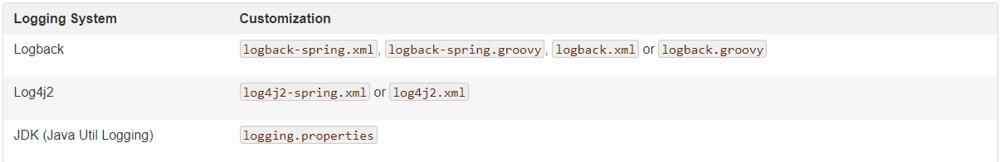

# SpringBoot日志使用


spring-boot选择SLF4J作为日志抽象层，logback作为实现


一个项目中可能有多个不同的日志，所以就需要做到统一

1，先排除其他日志框架

2，中间包替换原来的日志框架

3，导入FLF4J的实现


一，导入依赖

```xml
<dependency>    
     <groupId>org.springframework.boot</groupId>      
     <artifactId>spring‐boot‐starter‐logging</artifactId>       
</dependency>
```


在要使用其他的日志框架前，需要把默认的日志移除，因为其他的日志文件的包名会和默认的包名冲突

springboot使用的是slf4j+logback，所以，会将原来的commons-logging移除

```xml
<dependency>   
       <groupId>org.springframework</groupId>    
       <artifactId>spring‐core</artifactId>     
       <!--移除commons‐logging-->
       <exclusions>        
           <exclusion>                 
           <groupId>commons‐logging</groupId>                
           <artifactId>commons‐logging</artifactId>                  
           </exclusion>                 
       </exclusions>            
</dependency>
```


二，使用

```java
Logger logger = LoggerFactory.getLogger(getClass());
```


三，输出

```javascript
//由低到高  
//可以调整输出的日志级别；日志就只会在这个级别以以后的高级别生效   
logger.trace("这是trace日志...");          
logger.debug("这是debug日志...");    

//SpringBoot没有指定级别的就用SpringBoot默认规定的级别；root 级别          
logger.info("这是info日志...");        
logger.warn("这是warn日志...");          
logger.error("这是error日志...");
```


四，修改配置

在当前磁盘的根路径下创建spring文件夹和里面的log文件夹；使用 spring.log 作为默认文件

```properties
 logging.path=/spring/log 
```

 不指定路径在当前项目下生成springboot.log日志 

```properties
logging.file=G:/springboot.log 
```

在控制台输出的日志的格式 

```properties
logging.pattern.console= %d{yyyy‐MM‐dd} [%thread] %‐5level %logger{50} ‐ %msg%n 
```

指定文件中日志输出的格式

```properties
 logging.pattern.file = %d{yyyy‐MM‐dd} [%thread] %‐5level %logger{50} ‐ %msg%n 
```


五，指定日志文件

需要什么日志文件，就在resource中放入需要的日志文件

推荐使用-spring结尾的配置文件

这样springboot就会开启更高级的功能




