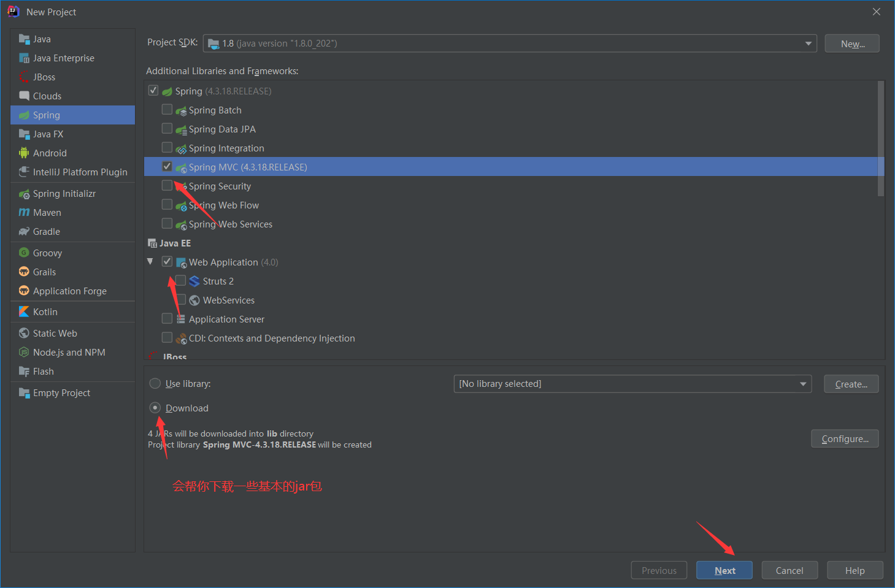

# SpringMVC

> 笔记来源于视频笔记
>
> 没有啥书籍可以借鉴去补充笔记，尽量的减少文字，框架使用为主

## 一，概念

### 三层架构 

1. 开发服务器端程序，一般都基于两种形式，一种C/S架构程序，一种B/S架构程序 

2. 使用Java语言基本上都是开发B/S架构的程序，B/S架构又分成了三层架构

3. 三层架构 
   1. 表现层：WEB层，用来和客户端进行数据交互的。表现层一般会采用MVC的设计模型 
   2. 业务层：处理公司具体的业务逻辑的 
   3. 持久层：用来操作数据库的 

   

### MVC模型 

（Model View Controller 模型视图控制器）

1. Model：数据模型，JavaBean的类，用来进行数据封装。

2. View：指用来展示数据页面给用户 

3. Controller：用来接收用户的请求，整个流程的控制器


### SpringMvc

1，SpringMVC 是一种基于 Java 的实现 MVC 设计模型的请求驱动类型的轻量级 Web 框架

2，Spring 框架提供了构建 Web 应用程序的全功 能 MVC 模块

3，使用 Spring 可插入的 MVC 架构，从而在使用 Spring 进行 WEB 开发时，可以选择使用 Spring 的 Spring MVC 框架或集成其他 MVC 开发框架

4，支持 RESTful 编程风格的请求


### 角色划分

**1，前端控制器（`DispatcherServlet`）**  

```
是整个流程控制的中心，由它调用其它组件处理用户的请求
```

**2，请求到处理器映射（`HandlerMapping`）**

```
1.负责根据用户请求找到 Handler 即处理器，SpringMVC 提供了不同的映射器实现不同的映射方式
2.简单来讲，根据注解，调用对应请求需要的方法
```

**3，处理器适配器（`HandlerAdapter`）**

```
1.具体业务控制器 
2.对处理器进行执行，这是适配器模式的应用，通过扩展适配器可以对更多类型的处理器进行执行
```

**4，视图解析器（`ViewResolver`）**  

```
1.也就是，经过处理后，需要调用其他的页面	
```

**5，处理器或页面控制器（`Controller`）**

**6，验证器（` Validator`）**  

**7，命令对象（Command  请求参数绑定到的对象就叫命令对象**）

**8，表单对象（Form Object 提供给表单展示和提交到的对象就叫表单对象）** 


**在 SpringMVC 的各个组件中，处理器映射器、处理器适配器、视图解析器称为 SpringMVC 的三大组件** 


### SpringMvc 和 Struts2 对比

共同点

​	都是表现层框架，都是基于 MVC 模型编写的

​	底层都离不开原始 ServletAPI

​	处理请求的机制都是一个核心控制器


区别

​	**Spring MVC 的入口是 Servlet, 而 Struts2 是 Filter**   

​	**Spring MVC 是基于方法设计的，而 Struts2 是基于类**，Struts2 每次执行都会创建一个动作类。所 以 Spring MVC 会稍微比 Struts2 快些。 

​	 **Spring MVC 使用更加简洁,同时还支持 JSR303, 处理 ajax 的请求更方便**  (JSR303 是一套 JavaBean 参数校验的标准，它定义了很多常用的校验注解，我们可以直接将这些注 解加在我们 JavaBean 的属性上面，就可以在需要校验的时候进行校验了。)  

​	**Struts2 的 OGNL 表达式使页面的开发效率相比 Spring MVC 更高些**，但执行效率并没有比 JSTL 提 升，尤其是 struts2 的表单标签，远没有 html 执行效率高


## 二，入门使用

1. 当启动Tomcat服务器的时候，因为配置了`load-on-startup标签`，所以会创建`DispatcherServlet对象`， 就会加载springmvc.xml配置文件 

2. 开启了注解扫描，那么`HelloController对象`就会被创建

3. 从`index.jsp`发送请求，请求会先到达`DispatcherServlet核心控制器`，根据配置`@RequestMapping注解` 找到执行的具体方法

4. 根据执行方法的返回值，再根据配置的视图解析器，去指定的目录下查找指定名称的JSP文件 

5. Tomcat服务器渲染页面，做出响应 


1，创建SpringMvc项目，依赖会自动下载，并且会创建默认的目录




```xml
<dependency>
    <groupId>org.springframework</groupId>
    <artifactId>spring-context</artifactId>
    <version>5.0.2.RELEASE</version>
</dependency>
<dependency>
    <groupId>org.springframework</groupId>
    <artifactId>spring-web</artifactId>
    <version>5.0.2.RELEASE</version>
</dependency>
<dependency>
    <groupId>org.springframework</groupId>
    <artifactId>spring-webmvc</artifactId>
    <version>5.0.2.RELEASE</version>
</dependency>
<dependency>
    <groupId>javax.servlet</groupId>
    <artifactId>servlet-api</artifactId>
    <version>2.5</version>
    <scope>provided</scope>
</dependency>
<dependency>
    <groupId>javax.servlet.jsp</groupId>
    <artifactId>jsp-api</artifactId>
    <version>2.0</version>
    <scope>provided</scope>
</dependency>
```


2，配置web.xml文件（`DispatcherServlet`）


**1.配置`DispatcherServlet`接收用户的请求，并调用其他的对象，执行某个功能**

**2.<init-param>配置`springmvc`的xml配置文件，让项目会去读取配置文件中的信息**

**3. <load-on-startup>**

```xml
<!-- SpringMVC的核心控制器 -->  
<servlet>        
    <servlet-name>dispatcherServlet</servlet-name>    
    <servlet-class>org.springframework.web.servlet.DispatcherServlet</servletclass>      

<!-- 配置Servlet的初始化参数，读取springmvc的配置文件，创建spring容器 -->
<init-param>
    <param-name>contextConfigLocation</param-name>        
    <param-value>classpath:springmvc-config.xml</param-value>  
</init-param> 
      
<!-- 配置servlet启动时加载对象 --> 
<load-on-startup>1</load-on-startup>   
</servlet>

<servlet-mapping>      
    <servlet-name>dispatcherServlet</servlet-name>       
    <url-pattern>/</url-pattern>  
</servlet-mapping>
```


3，配置springmvcconfig.xml文件

```xml
<?xml version="1.0" encoding="UTF-8"?>
<beans xmlns="http://www.springframework.org/schema/beans" 
       xmlns:mvc="http://www.springframework.org/schema/mvc" 
       xmlns:context="http://www.springframework.org/schema/context" 
       xmlns:xsi="http://www.w3.org/2001/XMLSchema-instance"   
       xsi:schemaLocation="        
       http://www.springframework.org/schema/beans     
       http://www.springframework.org/schema/beans/spring-beans.xsd    
       http://www.springframework.org/schema/mvc     
      http://www.springframework.org/schema/mvc/spring-mvc.xsd    
      http://www.springframework.org/schema/context     
      http://www.springframework.org/schema/context/spring-context.xsd">  
      <!--可以在spring的官网的查到xml信息-->
</beans>      
```

具体配置

```xml
	<!-- 配置spring创建容器时要扫描的包 -->   
    <context:component-scan base-package=""></context:component-scan>      
    
	<!-- 配置视图解析器 --> 
	<!-- 配置之后就可以在控制器中直接返回jsp或者html文件的名称来访问那个页面文件 --> 
    <bean 
    id="viewResolver" 
    class="org.springframework.web.servlet.view.InternalResourceViewResolver">
        <!--前缀-->
        <property name="prefix" value="/WEB-INF/pages/"></property>
        <!--后缀-->
        <property name="suffix" value=".jsp"></property>   
    </bean>     
    <!-- 配置spring开启注解mvc的支持   -->
    <mvc:annotation-driven></mvc:annotation-driven>
```

配置了就需要去在`/WEB-INF`目录下创建`pages`目录，和`jsp`文件


4，编写web页面和控制器类

```java
//浏览器输入：http:localhost:8080/项目名/mvc/hello
@Controller 
public class HelloController {  
       @RequestMapping(path="/hello")    
       public String sayHello() {          
        return "success";   
        }
}
```

--


## 三，常用注解

### RequestMapping

1. RequestMapping注解的作用是建立请求URL和处理方法之间的对应关系 

2. RequestMapping注解可以作用在方法和类上
   1. 作用在类上：第一级的访问目录 
   2. 作用在方法上：第二级的访问目录

相关属性

```properties
1. path: 指定请求路径的url 
2. value: value属性和path属性是一样的
3. mthod: 指定该方法的请求方式，是一个对象数组
4. params: 指定限制请求参数的条件
# params="a" 说明是要求参数中要有a
5. headers: 发送的请求中必须包含的请求头
```


> **@PsotMapping**
>
> **@GetMapping**
>
> 这个注解是对 @RequestMapping（method）的衍生
>
> 即，接受post请求，get请求


### RequestParam

**作用**：把请求中的指定名称的参数传递给控制器中的形参赋值 

**属性** ：

1. **value**：请求参数中的名称 

2. **required**：请求参数中是否必须提供此参数，默认值是true，**必须提供** 


**应用**：就是在参数名和控制器方法中的参数不一致时，进行转换

```java
 @RequestMapping(path="/hello")    
 public String sayHello(@RequestParam(value="username",required=false)String name) {}
```


### RequestBody

**作用**：用于获取请求体的内容（注意：get方法不可以）

**属性 ：**

1. **required**：是否必须有请求体，默认值是true 

```java
@RequestMapping(path="/hello")    
public String sayHello(@RequestBody String body) {}
```


### PathVariable

**作用**：拥有绑定url中的占位符的

> 例如：url中有/delete/{id}，{id}就是占位符 

**属性** 

1. value：指定url中的占位符名称 

**应用**：Restful风格的URL 

请求路径一样，可以根据不同的请求方式去执行后台的不同方法 ，也就是说所有控制器的方法都没有虚拟路径，只有类上有虚拟路径

而Restful风格就会根据每个方法中不同的请求方式去执行不同的方法


restful风格的URL优点
1. 结构清晰 2. 符合标准 3. 易于理解 4. 扩展方便 

```java
@RequestMapping(path="/hello/{id}")
public String sayHello(@PathVariable(value="id") String id) { } 
```


### ResponseBody

@responseBody注解的作用是将controller的方法返回的对象通过适当的转换器转换为指定的格式之后，写入到response对象的body区

**通常用来返回JSON数据或者是XML数据**


**注意**：在使用此注解之后不会再走视图处理器，而是直接将数据写入到输入流中，他的效果等同于通过response对象输出指定格式的数据。


### RestController

 简单来说就是结合了 @Controller注解和@ResponseBody注解


### RequestHeader

**作用**：获取指定请求头的值 

```java
@RequestMapping(path="/hello")    
public String sayHello(@RequestHeader(value="Accept") String header) {  }
```


### CookieValue

**作用**：用于获取指定cookie的名称的值

```java
@RequestMapping(path="/hello")    
public String sayHello(@CookieValue(value="") String cookieValue) {}
```


### ModelAttribute  

**作用** 

1. 出现在方法上：表示当前方法会在控制器方法执行前线执行。

2. 出现在参数上：获取指定的数据给参数赋值。 


**应用** ： 当提交表单数据，不是完整的实体数据时，保证没有提交的字段使用数据库原来的数据

```java
//当修饰的方法有返回值时，返回的数据会作为参数传递到调用的方法中
@ModelAttribute    
public User showUser() {     
    User user = new User();     
    return user;    
}          
@RequestMapping(path="/updateUser")   
public String updateUser(User user) {   }
```


```java
//当修饰方法没有返回值时，使用map集合封装
@ModelAttribute    
public void showUser(String name,Map<String, User> map) {                  
    User user = new User();      
    map.put("abc", user);   
 } 
@RequestMapping(path="/updateUser")
public String updateUser(@ModelAttribute(value="abc") User user) {   }
```


### SessionAttributes

**作用**：控制器方法间的参数共享

1，存入Session

```java
@RequestMapping(path="/save")   
public String save(Model model) {    
    model.addAttribute("username", "root"); 
} 
```

2，获取

```java
@SessionAttributes(value= {"username"},types= {String.class})       
@RequestMapping(path="/find")   
public String find(ModelMap modelMap) {       
	String username = (String) modelMap.get("username");          
} 
```

3，删除

```java
@SessionAttributes(value= {"username"},types= {String.class})       
@RequestMapping(path="/delete")
public String delete(SessionStatus status) {
     status.setComplete();
}
```


## 四，请求参数

对于传入进来的参数，`SpringMvc`会自动的将传入的参数封装

问题一：如果参数不匹配时，会发生什么


### 1，绑定json数据

需要的jar包

**注意**：2.7.0以下的版本用不了

```xml
<dependency>         
      <groupId>com.fasterxml.jackson.core</groupId>    
      <artifactId>jackson-databind</artifactId>
      <version>2.9.0</version>    
</dependency>   
  
  <dependency>   
      <groupId>com.fasterxml.jackson.core</groupId>           
      <artifactId>jackson-core</artifactId>          
      <version>2.9.0</version>       
  </dependency>    
     
  <dependency>           
      <groupId>com.fasterxml.jackson.core</groupId>           
      <artifactId>jackson-annotations</artifactId>        
      <version>2.9.0</version>       
  </dependency>
```

一，配置静态资源不拦截

```xml
mvc:resources 标签配置不过滤
1. location元素表示webapp目录下的包下的所有文件
2. mapping元素表示以/static开头的所有请求路径，如/static/a 或者/static/a/b

<!-- 设置静态资源不过滤 -->
<mvc:resources location="/css/" mapping="/css/**"/> 
```

二，获取

使用`@RequestBody`获取请求体数据

```java
@RequestMapping("/testJson")    
public void testJson(@RequestBody String body) { }
```

使用`@RequestBody`注解把`json`的字符串转换成`JavaBean`的对象

```java
@RequestMapping("/testJson")    
public @ResponseBody Address testJson(@RequestBody Address address) {}
```


### 2，自定义类型转换

`springmvc`中会自动的将获取的参数进行类型转换，但是也会有无法转换的情况，所以需要自定义类型的转换

> 一个简单的例子就是时间Date

一，定义一个类，实现 Converter 接口

```java
//S:表示接受的类型，T：表示目标类型  
public interface Converter<S, T> {
   @Nullable 
   //实现类型转换的方法
    T convert(S source); 
} 

public class StringToDateConverter implements Converter<String, Date> { 
//用于把 String 类型转成日期类型
@Override  
public Date convert(String source) {   
    DateFormat format = null;  
    try {  
    	format = new SimpleDateFormat("yyyy-MM-dd"); 
    	Date date = format.parse(source);   
   	 	return date;   
    } catch (Exception e) {   
    	throw new RuntimeException("输入日期有误");  
    }  
} 
}
```

二，在spring配置文件中配置类型转换器

```xml
<!-- 配置类型转换器工厂 --> 
<bean id="converterService"   
class="org.springframework.context.support.ConversionServiceFactoryBean"> 
 <!-- 给工厂注入一个新的类型转换器 -->     
  <property name="converters"> 
      <array> 
       <!-- 配置自定义类型转换器 -->    
          <bean class="com.itheima.web.converter.StringToDateConverter"/> 
      </array>     
 </property> 
</bean>  
```

三，annotation-driven标签中引用配置的类型转换服务   

```xml
<!-- 引用自定义类型转换器 --> 
  <mvc:annotation-driven 
            conversion-service="converterService"></mvc:annotation-driven>
```

四，获取Servlet对象，只需要在方法的参数中添加就能使用

```java
@Controller 
public class HelloController {  
       @RequestMapping(path="")    
       public String sayHello(StringToDateConverter converter ) {
           //可以直接使用
       }
}
```


### 3，使用 ServletAPI 对象作为方法参数

SpringMVC 还支持使用原始 ServletAPI 对象作为控制器方法的参数，可以直接使用

```
HttpServletRequest
HttpServletResponse
HttpSession
java.security.Principal
Locale
InputStream
OutputStream
Reader
Writer
```

使用

```java
public String testServletAPI(HttpServletRequest request,HttpServletResponse response,HttpSession session) {
    return "success";
}
```


## 五，中文乱码问题

1.post请求的乱码，在web.xml中配置过滤器

2.get请求乱码，在tomcat的server.xml中配置

### POST请求	

```xml
<filter>    
    <filter-name>CharacterEncodingFilter</filter-name>   
    <filter-class>
        org.springframework.web.filter.CharacterEncodingFilter 
    </filter-class>   
<!-- 设置过滤器中的属性值 -->  
<!-- 也就是需要转换的编码 -->    
    <init-param>  
        <param-name>encoding</param-name>   
        <param-value>UTF-8</param-value>
    </init-param>   
 <!-- 启动过滤器 -->    
    <init-param>   
      <param-name>forceEncoding</param-name>   
      <param-value>true</param-value>  
    </init-param>   
</filter> 
```

或者在spring配置文件中

```xml
<location 表示路径，mapping 表示文件，**表示该目录下的文件以及子目录的文件>  
<mvc:resources location="/css/" mapping="/css/**"/> 
```


### Get请求

需要修改tomcat的service.xml配置文件

```xml
<Connector  connectionTimeout="20000"  port="8080" 
   protocol="HTTP/1.1"  redirectPort="8443"/> 
改为：
 <Connector  connectionTimeout="20000"  port="8080"   
   protocol="HTTP/1.1"  redirectPort="8443"  
   useBodyEncodingForURI="true"/> 

<!--如果遇到 ajax 请求仍然乱码: useBodyEncodingForURI="true"改为 URIEncoding="UTF-8"--> 
```


## 六，响应数据

> 也就是控制器返回的数据

**分类：**

​	1.返回字符串

​	2.返回void	

​	3.返回ModelAndView对象

### 1，字符串

Controller方法返回字符串可以指定逻辑视图的名称，根据视图解析器为物理视图的地址指定逻辑视图名，经过视图解析器解析为文件的物理路径

```java
//    /WEB-INF/pages/success.jsp 
@RequestMapping(value="")    
public String sayHello() {        
    // 跳转到XX页面
    //前提是在核心控制器中配置了对请求的配置  
    return "success";
}
```

### 2，Void

 如果控制器的方法返回值编写成void，执行程序报404的异常，默认查找页面没有找到

> 默认会跳转到@RequestMapping(value="/initUpdate") 的页面

可以使用请求转发或者重定向跳转到指定的页面

```java
@RequestMapping(value="/initAdd")
public void initAdd(HttpServletRequest request,HttpServletResponse response) throws
    Exception {
    	System.out.println("请求转发或者重定向");
    	// 请求转发
    	// request.getRequestDispatcher("/WEB-INF/pages/add.jsp").forward(request,response);
    	// 重定向
    	// response.sendRedirect(request.getContextPath()+"/add2.jsp");
   	 	response.setCharacterEncoding("UTF-8");
   	 	response.setContentType("text/html;charset=UTF-8");
    	// 直接响应数据
    	response.getWriter().print("你好");
    	return;
}
```


### 3，ModelAndView

ModelAndView对象是Spring提供的一个对象，可以用来调整具体的页面视图 

```java
 @RequestMapping(value="/findAll")
     public ModelAndView findAll() throws Exception { 
     ModelAndView mv = new ModelAndView();
         // 跳转页面  
         mv.setViewName("list");
         // 添加对象        
         mv.addObject("users", users);
         return mv;
} 
```


## 七，两种转发方式

### 1，forward请求转发

```java
"forward:转发的路径"，不走视图解析器了，所以需要编写完整的路径    
@RequestMapping("/")    
public String delete() throws Exception {
       return "forward:/WEB-INF/pages/success.jsp";   
       return "forward:/user/findAll";    
}
```


### 2，redirect重定向

```java
@RequestMapping("/")    
  public String count() throws Exception {              
      return "redirect:/add.html";        
      return "redirect:/user/findAll";    
  }
```


## 八，文件上传

### 1，需要的依赖

```xml
<dependency>            
    <groupId>commons-fileupload</groupId>            
    <artifactId>commons-fileupload</artifactId>            
    <version>1.3.1</version>        
</dependency>       
 
<dependency>            
    <groupId>commons-io</groupId>            
    <artifactId>commons-io</artifactId>            
    <version>2.4</version>        
</dependency
```

配置文件

```xml
	<!-- upload settings -->
    <bean id="multipartResolver"  class="org.springframework.web.multipart.commons.CommonsMultipartResolver">
        <property name="maxUploadSize" value="102400000"></property>
    </bean>
```


### 2，编写上传页面

```html
<!--enctype:是表单请求正文的类型，取值必须是：multipart/form-data  (默认值是:application/x-www-form-urlencoded)-->  
<!--method 属性取值必须是 Post--> 
<!--提供一个文件选择域<input type="file" />-->
       
<form action="user/fileupload" method="post" enctype="multipart/form-data">
     选择文件：<input type="file" name="upload"/><br/> 
    <input type="submit" value="上传文件"/>    
</form>
```

> **当enctype=”application/x-www-form-urlencoded”时，form 表单的正文内容是：**键值对形式key=value
>
> **form 表单的 enctype 取值为 Mutilpart/form-data 时，请求正文内容就变成**

--这也就是为什么需要两个依赖的原因，需要借助第三方插件才能解析

```json
-----------------------------7de1a433602ac        分界符 
Content-Disposition: form-data; name="userName"   协议头 
            aaa                                   协议的正文 
-----------------------------7de1a433602ac 
Content-Disposition: form-data; name="file"; 
filename="C:\Users\zhy\Desktop\fileupload_demofile\b.txt" 
Content-Type: text/plain                          协议的类型（MIME 类型） 
 
bbbbbbbbbbbbbbbbbbbbbbbbbbbbbbbb 
-----------------------------7de1a433602ac-- 
```

### 3，控制器

```java
@RequestMapping(value="/fileupload")    
public String fileupload(HttpServletRequest request) throws Exception {
        // 先获取到要上传的文件目录        
        String path = request.getSession().getServletContext().getRealPath("/uploads");
        // 创建File对象，一会向该路径下上传文件        
        File file = new File(path);        
        // 判断路径是否存在，如果不存在，创建该路径       
        if(!file.exists()) {            
            file.mkdirs();        
        }        
        // 创建磁盘文件项工厂        
        DiskFileItemFactory factory = new DiskFileItemFactory();        
        ServletFileUpload fileUpload = new ServletFileUpload(factory);    
        // 解析request对象        
        List<FileItem> list = fileUpload.parseRequest(request);        
        // 遍历        
        for (FileItem fileItem : list) {            
        // 判断文件项是普通字段，还是上传的文件            
        if(fileItem.isFormField()) {                    
           }else {             
            // 上传文件项
            // 获取到上传文件的名称                
            String filename = fileItem.getName(); 
            // 上传文件                
            fileItem.write(new File(file, filename)); 
            // 删除临时文件                
            fileItem.delete(); 
         }        
 }               
  return "success";   
  
    }
```


### 4，springmvc方式上传文件

一， 文件上传的解析器 id是固定的，不能起别的名称，否则无法实现请求参数的绑定

```xml
<!-- 配置文件上传解析器 --> 
<bean id="multipartResolver"  
<!-- id 的值是固定的-->  
class="org.springframework.web.multipart.commons.CommonsMultipartResolver">
 <!-- 设置上传文件的最大尺寸为 5MB -->
   <property name="maxUploadSize"> 
       <value>5242880</value>  
   </property>
</bean> 
```


二，控制器

```html
<input type="file" name="upload"/>
```

--

```java
@Controller("fileUploadController") 
public class FileUploadController {   
    @RequestMapping("/fileUpload")  
    public String testResponseJson(String picname,MultipartFile upload,HttpServletRequest request) throws Exception{   
  		//定义文件名   
  		String fileName = ""; 
  		//1.获取原始的上传的文件名   
  		String uploadFileName =  upload.getOriginalFilename(); 
  		//2.截取文件扩展名   
  		String extendName = uploadFileName.substring(uploadFileName.lastIndexOf(".")+1, uploadFileName.length()); 
  		//3.把文件加上随机数，防止文件重复   
  		String uuid = UUID.randomUUID().toString().replace("-", "").toUpperCase(); 
  		//4.判断是否输入了文件名   
  		if(!StringUtils.isEmpty(picname)) {    
      		fileName = uuid+"_"+picname+"."+extendName;   
  		}else {    
      		fileName = uuid+"_"+uploadFileName; 
  		}    
  		//2.获取文件路径 
  		ServletContext context = request.getServletContext(); 
  		String basePath = context.getRealPath("/uploads"); 
  
  		//3.解决同一文件夹中文件过多问题   
  		String datePath = new SimpleDateFormat("yyyy-MM-dd").format(new Date());   
  		//4.判断路径是否存在   
  		File file = new File(basePath+"/"+datePath);   
  		if(!file.exists()) {    
      		file.mkdirs(); 
  		} 
  		//5.使用 MulitpartFile 接口中方法，把上传的文件写到指定位置   
  		upload.transferTo(new File(file,fileName));   
  		return "success";  
  } 
}
```


### 5，跨服务上传

1，依赖

```xml
 <dependency>            
     <groupId>com.sun.jersey</groupId>            
     <artifactId>jersey-core</artifactId>            
     <version>1.18.1</version>        
 </dependency>     
    
 <dependency>            
     <groupId>com.sun.jersey</groupId>            
     <artifactId>jersey-client</artifactId>
     <version>1.18.1</version>        
 </dependency
```

2，控制器

```java
 public String fileupload3(MultipartFile upload) throws Exception {  
     // 定义图片服务器的请求路径，这个路径就是其他服务器的路径    
     String path = "http://localhost:9090/day02_springmvc5_02image/uploads/";  
     // 获取到上传文件的名称      
     String filename = upload.getOriginalFilename();     
     // 向图片服务器上传文件                
     // 创建客户端对象        
     Client client = Client.create();        
     // 连接图片服务器        
     WebResource webResource = client.resource(path+filename);     
     // 上传文件      
     webResource.put(upload.getBytes());      
     return "success";    
 }
```


## 九，异常处理

### 1，接口方式处理自定义异常

如果该异常类型不是系统自定义的异常，`springmvc`提供一个`HandlerExceptionResolver接口`，自定义全局异常处理器必须要实现这个接口

只要实现这个接口了的就是全局异常处理器

```java
public class SysExceptionResolver implements HandlerExceptionResolver{
public ModelAndView resolveException(HttpServletRequest request, HttpServletResponse response, Object handler,Exception ex) {
    ex.printStackTrace();        
    SysException e = null;        
    // 获取到异常对象        
    if(ex instanceof SysException) {            
    	e = (SysException) ex;        
    }else {           
     	e = new SysException("请联系管理员");        
    }        
    ModelAndView mv = new ModelAndView();        
    // 存入错误的提示信息        
    mv.addObject("message", e.getMessage());        
    // 跳转的Jsp页面        
    mv.setViewName("error");        
    return mv;    
 }
}
```

配置异常处理器

```
<bean id="sysExceptionResolver" class="SysExceptionResolver"/>
```

一般处理异常都会都一个统一的异常类进行封装

```java
public class SysException extends Exception{
private static final long serialVersionUID = 4055945147128016300L;
    // 异常提示信息
    private String message;
    
    public String getMessage() {
    return message;
    }
    public void setMessage(String message) {
    this.message = message;
    }
    public SysException(String message) {
    	this.message = message;
    }
}    
```


### 2，SpringMvc自带的异常处理器

`SpringMvc`中自带了一个异常处理器叫`SimpleMappingExceptionResolver`，该处理器实现了`HandlerExceptionResolver 接口`

要使用需要在springmvc.xml文件中配置

```xml
<!-- springmvc提供的简单异常处理器 -->
<bean class="org.springframework.web.servlet.handler.SimpleMappingExceptionResolver">
     <!-- 定义默认的异常处理页面 -->
    <property name="defaultErrorView" value="/WEB-INF/jsp/error.jsp"/>
    <!-- 定义异常处理页面用来获取异常信息的变量名，也可不定义，默认名为exception --> 
    <property name="exceptionAttribute" value="ex"/>
    <!-- 定义需要特殊处理的异常，这是重要点 --> 
    <property name="exceptionMappings">
        <props>
            <prop key="ssm.exception.MyException">/WEB-INF/jsp/custom_error.jsp</prop>
        </props>
        <!-- 还可以定义其他的自定义异常 -->
    </property>
</bean>
```

这样在抛出指定异常后就会默认跳转到相关页面

### 3，注解实现异常处理

一个基础的`BaseController`，然后其他处理异常的Controller都去继承

```java
@Controller
public class BaseController { 
    @ExceptionHandler(指定异常类.class)  
    public String exp(HttpServletRequest request, Exception ex) { 
    //处理指定的异常
    }
}
```

另外一种就是 `@ControllerAdvice `+ `@ ExceptionHandler`实现全局异常处理

```java
@ControllerAdvice
@ResponseBody
public class WebExceptionHandle {
    @ExceptionHandler(指定异常类.class)  
    public String exp(HttpServletRequest request, Exception ex) { 
    //处理指定的异常
    }
}
```


## 十，拦截器

**概念**

1. SpringMVC框架中的拦截器用于对处理器进行预处理和后处理的技术。 

2. 可以定义拦截器链，连接器链就是将拦截器按着一定的顺序结成一条链，在访问被拦截的方法时，拦截器链 中的拦截器会按着定义的顺序执行

是在spring配置文件中的循序

3. 拦截器和过滤器的功能比较类似，有区别 
   1. **过滤器是Servlet规范的一部分，任何框架都可以使用过滤器技术**
   2. **拦截器是SpringMVC框架独有的**。
   3. 过滤器配置了/*，可以拦截任何资源
   4. 拦截器只会对控制器中的方法进行拦截。 

4. 拦截器也是AOP思想的一种实现方式

5. **想要自定义拦截器，需要实现HandlerInterceptor接口**

### 1，自定义拦截器

第一种

```java
postHandlepublic class MyInterceptor1 implements HandlerInterceptor{
 
/*
return true放行,执行Controller方法 
return false拦截,虽然请求能执行，但是对应的控制器的方法是不会执行的,这个时候就要利用两个httpservlet参数，进行重定向或者请求转发
*/
    
//preHandle方法是进行处理器拦截用的，顾名思义，该方法将在Controller处理之前进行调用，SpringMVC中的Interceptor拦截器是链式的，可以同时存在    
public boolean preHandle(HttpServletRequest request, HttpServletResponse response, Object handler)throws Exception {            
	return true;
}

//preHandle方法返回值为true的时候才会执行,这个方法是在控制器执行后拦截,在视图渲染之前执行                               
public boolean postHandle(HttpServletRequest request, HttpServletResponse response, Object handler)throws Exception {

}
//该方法也是需要preHandle方法的返回值为true时才会执行,该方法将在整个请求完成之后，也就是DispatcherServlet渲染了视图执行 
//这个方法的主要作用是用于清理资源的
public void afterCompletion(HttpServletRequest request,HttpServletResponse response,Object handler,Exception ex) 
    throws Exception {  
        // TODO Auto-generated method stub  
          
    }  
```

第二种

实现 `WebRequestInterceptor 接口`

```java
public class AllInterceptor implements WebRequestInterceptor {  
      
    /** 
     * 在请求处理之前执行，该方法主要是用于准备资源数据的，然后可以把它们当做请求属性放到WebRequest中 
     */  
    @Override  
    public void preHandle(WebRequest request) throws Exception {   
        
    }   
    /** 
     * 该方法将在Controller执行之后，返回视图之前执行，ModelMap表示请求Controller处理之后返回的Model对象，所以可以在 
     * 这个方法中修改ModelMap的属性，从而达到改变返回的模型的效果。 
     */  
    @Override 
    public void postHandle(WebRequest request, ModelMap map) throws Exception {  
        
    }  
  
    /** 
     * 该方法将在整个请求完成之后，也就是说在视图渲染之后进行调用，主要用于进行一些资源的释放 
     */  
    @Override  
    public void afterCompletion(WebRequest request, Exception exception)  throws Exception { 
        
    }  
      
}  
```


配置

```xml
<!-- 配置拦截器 -->    
 <mvc:interceptors>        
     <mvc:interceptor>            
        //设置对哪个虚拟地址下的所有方法进行拦截         
         <mvc:mapping path="/user/*"/>            
        //设置不进行拦截的方法          
         <mvc:exclude-mapping path=""/>            -->            
         //注册拦截器对象            
         <bean class="cn.demo1.MyInterceptor"/>        
     </mvc:interceptor>    
 </mvc:interceptors>
```

