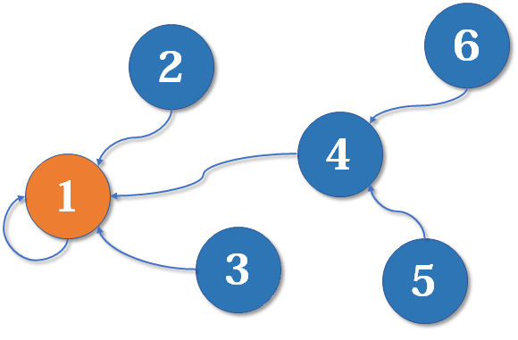

# 算法分享

> 前言
>
> 秦保科技 2023年1月30日
>
> 在开发和迁移的过程中，由于框架的特性，弱化了数据库的操作，使得很多数据查询出来就是原本的数据结构，数据的加工操作都是在代码层面控制的，所以，对于某些算法的了解，能帮助我们更优雅高效的完成某些操作以此解决对应的需求


## 目录

一，并查集

二，查找相关的算法

> 快速的查询容器中的元素
>
> 了解这些能更高效的解决执行时间问题，“一次定义多次查询，而不是次次从头查询”
>
> 前半年的学习就是针对《算法》，后续的分享以算法居多，除非我发现好玩的

三，动态规划替换

> 周五

## 并查集

> 当时是想通过并查集去解决我集合间的交并补的操作，但是我想错了，并查集并不能解决这个问题，但是不妨碍的研究并查集

需求场景

- 我需要查询出商品集合对应的佣金信息，没有佣金信息的商品置零处理
- 编辑佣金中的商品操作，需要对前端传来的商品和佣金中的商品做并、差集，以此完成佣金中商品的添加、删除、修改操作

这种的类似求交、并、补集的操作，都可以通过集合操作方法或者Stream流的方式来完成

> 比如 addAll这些，还有流中的filtter

但是由于某些信息我需要重复使用，为了避免每一次都需要进行集合操作，我在项目中一般都是将某个集合转为Map，通过key检索的方式提高效率

所以就有了这样的代码风格

```java
List A;
List B;
Map AMap = A.toMap();
for(B){
	if(AMap.get(b) != null){
		// doSomething
	}
}
List C = AMap.filter(B);
C.stream()....// 集合操作
```

这样很不优雅，但是我可以抽取公共类呀！抽取不了

因为集合中的东西很杂，我没有一个公共的类去接受这么一些类，这样我就可以用公共字段去玩一些东西了，我每份代码中也只需要用方法替换就行，而不是以上这么长的代码片

那么我就想到了某个替换方式：并查集


### 概念

并查集是一种树型的数据结构，用于处理一些不相交集合的合并及查询问题

> 并查集基础|菜鸟教程   https://www.runoob.com/data-structures/union-find-basic.html

并查集被很多OIer认为是最简洁而优雅的数据结构之一，主要用于解决一些**元素分组**的问题。

它管理一系列**不相交的集合**，并支持两种操作：

- **合并**（Union）：把两个不相交的集合合并为一个集合。
- **查询**（Find）：查询两个元素是否在同一个集合中。

> 看到这里，有没有感觉这能解决我上面提出的两个需求点
>
> 但是得抠字眼：不相交

亲戚、帮派问题是理解并查集用法的一个很好的例子

x和y是亲戚，y和z是亲戚，那么x和z也是亲戚。如果x,y是亲戚，那么x的亲戚都是y的亲戚，y的亲戚也都是x的亲戚。

题目就是要求：随便拿两个人，判断是否是亲戚

按照简单的逻辑思路：放入不同的集合，如果两个人在一个集合，那么就表明是亲戚

> 假设现在2个家族，也就是2个集合List1，List2
>
> List3 = [A,B,C,D,E,F] 这是所有的人
>
> 遍历这个数组，在遍历List3的同时也遍历List1，List2，如果判断是亲戚就放进去
>
> 很明显，这个算法不叫算法，如果没有这样的并查集算法，我们该怎么处理这样一层一层的关联关系？


### 引入

并查集的重要思想在于，**用集合中的一个元素代表集合**

最初的状态为：[1,2,3,4,5],按照每个元素代表一个集合的思想，那么用 (下标+1) 代表元素，用数值代表指向的对象

此时1的亲戚就是1以此类推


谁是谁的亲戚就指向谁

现在这个图就表示

[2,3,4] 是 1 的直系亲戚。[5,6] 是4 的直系亲戚

此时，树的形状就产生了

按照之前的定义格式，那么现在的数组就变成了 

亲戚：[1,1,1,1,4,4]

自己：[1,2,3,4,5,6]




### 构建

```java
private static int[] arr;

/**
     * 初始化
     * @param n
     */
public static void init(int n){
  arr = new int[n];
  for (int i = 0 ; i < n ; i ++){
    arr[i] = i+1;
  }
}
```


### 查询

怎么查谁是谁的亲戚呢？

```java
/**
     * 查询父节点
     * @param node
     * @return
     */
public static int find(int node){
  if (arr[node] == (node+1)) {
    // 证明自己是自己的亲戚，也就是一开始的状态
    return node;
  }else {
    // 不是自己说明他有上层亲戚
    return find(arr[node]);
  }
}
```


### 合并

类似于帮派打斗间的吞并

前面有提到过：**x和y是亲戚，y和z是亲戚，那么x和z也是亲戚**

所以才有了合并操作

```java
/**
 * 合并
 * @param node1
 * @param node2
 */
public static void merge(int node1 , int node2){
    arr[find(node1)] = find(node2);
}
```


简单版本并查集的核心操作就是这么多，并查集也不是很难，了解其数据结构就能导入到某些场景

> 研究时我也自我思考了下
>
> - 是否可以衍生出额外的基础操作
> - 指向父节点的方式是否可以变化
> - 树的转换
>
> 比如说：并查集最终以树的形式改变，既然树已经成型，那么我肯定可以利用结点的某些特点进行树的转换，像什么搜索树，平衡树...，也就是涉及到后续的“查找算法”


### 路径压缩

最简单的并查集的效率比较低，具体得分析场景

也就是链路过长，这也是某些 “树” 的通病 


解决的方式就是路径压缩啦

既然最终都是属于4的，为啥要查4次呢？直接告诉她顶层亲戚不就好了

就好比机构的查询逻辑一致

x


### 扩展

- 基于size 的优化：某个根节点的子节点过多


变化到


- 基于rank 的优化

并查集基于 size 的优化，但是某些场景下，也会存在某些问题


问题：合并后树的深度变长


优化后


### 结合需求

最后回归一开始的需求，并查集是否能满足呢？

> 小讨论


我的最后是：感觉上不可以，又感觉可以

首先，我违背了不相交这个原则，我需求中的两个集合中的元素，两个集合可能都含有，这样就相交了，直接瓦解！

然后我又换个思路

用商品当做人，佣金模板和前端当做亲戚

如果这么做

首先，我需要查到所有的商品（能解决，始终按照前端版本就行）

然后，我要开始找亲戚，去佣金模板中查...
