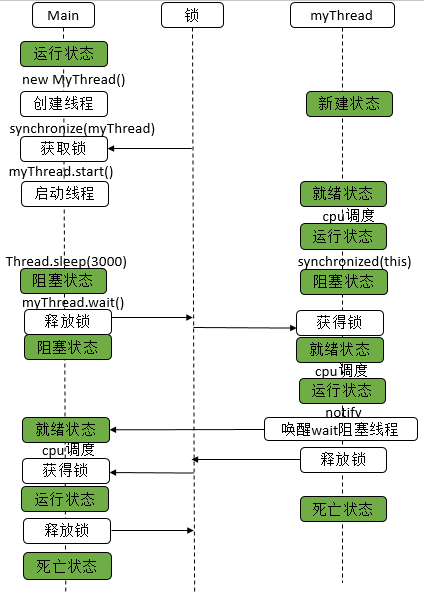

# LockSupport分析

LockSupport用来创建锁和其他同步类的基本线程阻塞原语

AQS框架借助于两个类：Unsafe(提供CAS操作)和LockSupport(提供park/unpark操作)

两个核心方法：park和unpark

## 几个LockSupport有关的问题

> 以下问题来自 [JUC锁: LockSupport详解 | Java 全栈知识体系 (pdai.tech)](https://pdai.tech/md/java/thread/java-thread-x-lock-LockSupport.html)

一，为什么LockSupport也是核心基础类? 

个人认为：

LockSupport用来创建锁和其他同步类的基本线程阻塞原语。

简而言之，当调用LockSupport.park时，表示当前线程将会等待，直至获得许可，当调用LockSupport.unpark时，必须把等待获得许可的线程作为参数进行传递，好让此线程继续运行。

因为其可以阻塞和唤醒线程的特性，所以是创建锁和其他同步类的基础

并且AQS框架借助于两个类：Unsafe(提供CAS操作)和LockSupport(提供park/unpark操作)

这样也就更加说明了LockSupport是核心基础类

> 一，阻塞/唤醒线程
>
> 二，AQS需要


二，wait/notify 和 LockSupport 的park/unpark实现同步区别在哪？

总结说法

> 前者需要获取到 synchronized 锁，是对对象线程进行阻塞和唤醒
>
> 后者是对当前线程阻塞，将指定线程Thread唤醒，更符合阻塞线程的直观定义


三，如果在wait()之前执行了notify()会怎样?

会报错，**抛出IllegalMonitorStateException异常**，也就是如果没有获取到对象的监视器锁，就会抛出这个异常


四，如果在park()之前执行了unpark()会怎样?

**线程不会被阻塞，直接跳过park()，继续执行后续内容**

> park 是可以被打断的


五，LockSupport.park()会释放锁资源吗?Condition.await()呢?Object.wait()呢？

不会，它只负责阻塞当前线程，释放锁资源实际上是在Condition的await()方法中实现的。

> 在前面 LockSupport也是核心基础类 中提到了
>
> 一是阻塞唤醒线程，二是AQS需要，我们知道，很多锁的底层是使用AQS实现的，锁是对资源的占有，也就意味着资源的释放是在Condition的await()中实现

对于 `Object.wait()`，因为 `wait`方法是需要获取锁的，必须在 `synchronized`中。


六，对上个问题扩展：Thread.sleep()、Object.wait()、Condition.await()、LockSupport.park()的区别? 

> 这四个的比较不能一同展开，得两两比较，这里是归纳了往简单了说

1，Thread.sleep()不会释放占有的锁，Object.wait()会释放占有的锁【sleep和wait最大的区别】，Condition.await()会释放占有的锁

2，Thread.sleep()到时间了会自动唤醒，然后继续执行，Object.wait()不带时间的，需要另一个线程使用Object.notify()唤醒；

3，Object.wait()和Condition.await()的原理比较类似，对比sleep都差不多

4，Thread.sleep()没法从外部唤醒，只能自己醒过，LockSupport.park()方法可以被另一个线程调用LockSupport.unpark()方法唤醒；

5，Thread.sleep()本身就是一个native方法，LockSupport.park()底层是调用的Unsafe的native方法；

6，从功能上来说，Thread.sleep()和LockSupport.park()方法类似，都是阻塞当前线程的执行，且都不会释放当前线程占有的锁资源；

> 是否会释放锁
>
> 是否自动唤醒


## 常用方法

1，park/parkNanos

```java
public static void park(Object blocker) {
    // 获取当前线程
    Thread t = Thread.currentThread();
    // 设置Blocker
    setBlocker(t, blocker);
    // 获取许可
    UNSAFE.park(false, 0L);
    // 重新可运行后再此设置Blocker
    setBlocker(t, null);
}
```


调用park函数时，首先获取当前线程，然后设置当前线程的parkBlocker字段，即调用setBlocker函数，之后调用Unsafe类的park函数，之后再调用setBlocker函数。那么问题来了，为什么要在此park函数中要调用两次setBlocker函数呢? 原因其实很简单，调用park函数时，当前线程首先设置好parkBlocker字段，然后再调用Unsafe的park函数，此后，当前线程就已经阻塞了，等待该线程的unpark函数被调用，所以后面的一个setBlocker函数无法运行，unpark函数被调用，该线程获得许可后，就可以继续运行了，也就运行第二个setBlocker，把该线程的parkBlocker字段设置为null，这样就完成了整个park函数的逻辑。==如果没有第二个setBlocker，那么之后没有调用park(Object blocker)，而直接调用getBlocker函数，得到的还是前一个park(Object blocker)设置的blocker，显然是不符合逻辑的==。总之，必须要保证在park(Object blocker)整个函数执行完后，该线程的parkBlocker字段又恢复为null。所以，park(Object)型函数里必须要调用setBlocker函数两次。setBlocker方法如下。


2，unpark/unparkNanos

3，parkUntil：指定的时限前禁用当前线程


> 其实底层逻辑很简单，底层就是调用Unsafe相关方法
>
> park()/unpark()底层的原理是“二元信号量”，你可以把它相像成只有一个许可证的Semaphore，只不过这个信号量在重复执行unpark()的时候也不会再增加许可证，最多只有一个许可证


## LockSupport示例说明

这里直接借鉴例子

```java
class MyThread extends Thread {
    
    public void run() {
        synchronized (this) {
            System.out.println("before notify");            
            notify();
            System.out.println("after notify");    
        }
    }
}

public class WaitAndNotifyDemo {
    public static void main(String[] args) throws InterruptedException {
        MyThread myThread = new MyThread();            
        synchronized (myThread) {
            try {        
                myThread.start();
                // 主线程睡眠3s
                Thread.sleep(3000);
                System.out.println("before wait");
                // 阻塞主线程
                myThread.wait();
                System.out.println("after wait");
            } catch (InterruptedException e) {
                e.printStackTrace();
            }            
        }        
    }
}
```

看了这个图感觉真的很清晰明了




以及park 和 unpark 的例子

```java
class MyThread extends Thread {
    private Object object;

    public MyThread(Object object) {
        this.object = object;
    }

    public void run() {
        System.out.println("before unpark");
        try {
            Thread.sleep(1000);
        } catch (InterruptedException e) {
            e.printStackTrace();
        }
        // 获取blocker
        System.out.println("Blocker info " + LockSupport.getBlocker((Thread) object));
        // 释放许可
        LockSupport.unpark((Thread) object);
        // 休眠500ms，保证先执行park中的setBlocker(t, null);
        try {
            Thread.sleep(500);
        } catch (InterruptedException e) {
            e.printStackTrace();
        }
        // 再次获取blocker
        System.out.println("Blocker info " + LockSupport.getBlocker((Thread) object));

        System.out.println("after unpark");
    }
}

public class test {
    public static void main(String[] args) {
        MyThread myThread = new MyThread(Thread.currentThread());
        myThread.start();
        System.out.println("before park");
        // 获取许可
        LockSupport.park("ParkAndUnparkDemo");
        System.out.println("after park");
    }
}
```


## 个人总结

通过分析，LockSupport 很像是一个工具类，负责线程的阻塞与唤醒，觉得要讲LockSupport ，其实需要搭配着AQS，看他们是如何完成锁的操作的

> 其实 LockSupport  就是 rt.jar 中的工具类