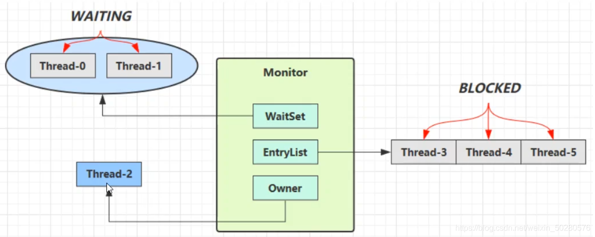
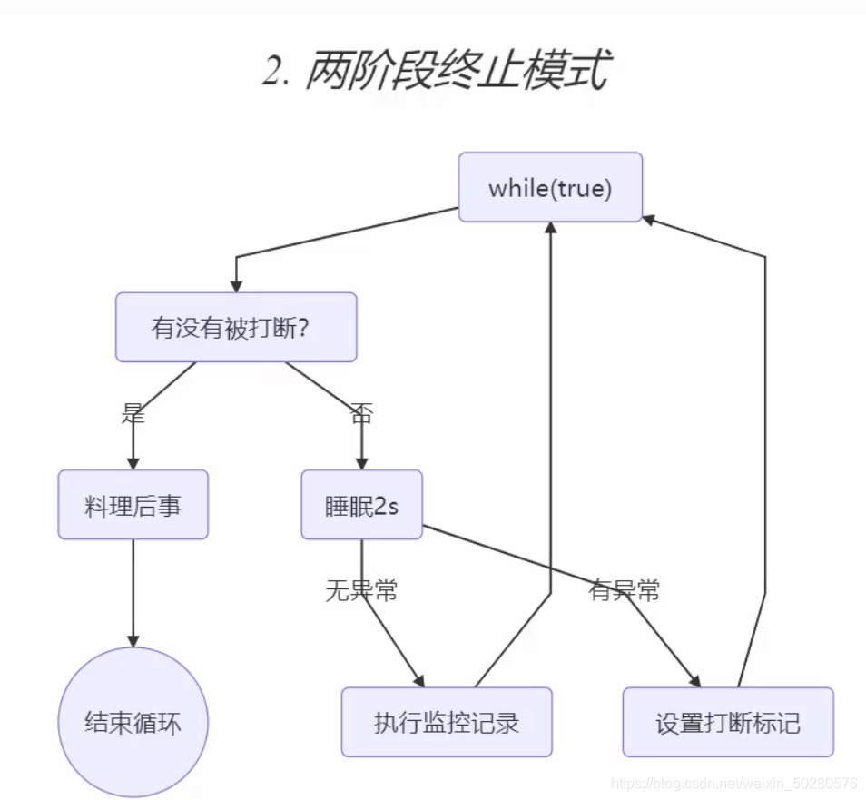
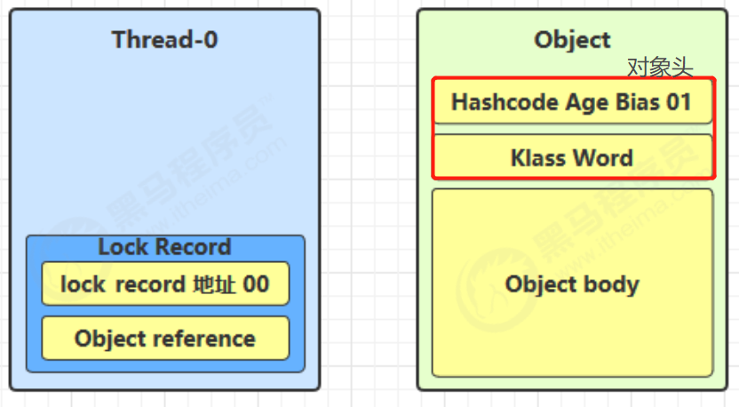
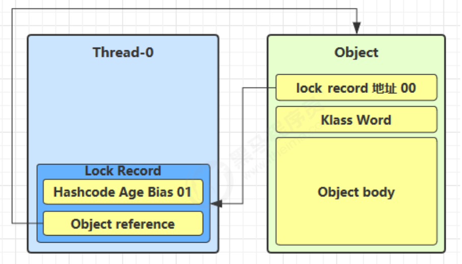
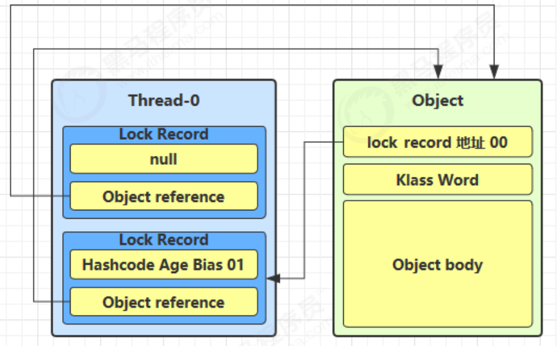
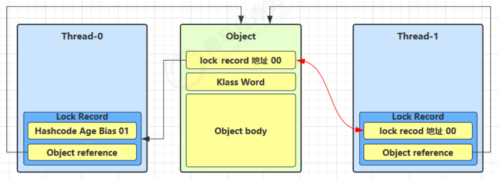
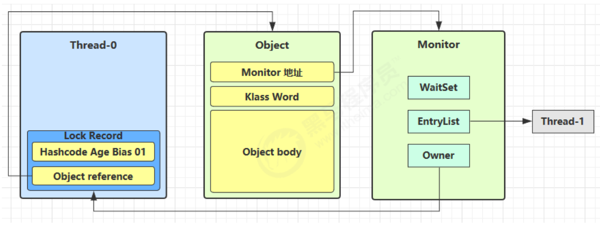
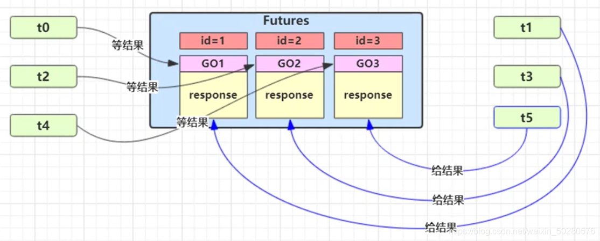
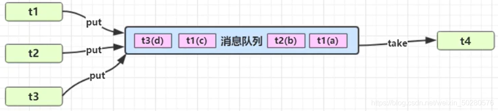

# 并发

## java线程

### 一，线程的创建

#### 第一种：直接使用`Thread`

```java
Thread t1 = new Thread("t1") {
    @Override
    // run 方法内实现了要执行的任务
    public void run() {
    
    }
};
t1.start();
```

#### 第二种：使用`Runable`

```java
// 创建任务对象
Runnable task2 = new Runnable() {
    @Override
    public void run() {
    
    }
};
// 参数1 是任务对象; 参数2 是线程名字，推荐给线程起个名字
Thread t2 = new Thread(task2, "t2");
t2.start();
```

#### 第三种：`FutureTask `

```java
public static void main(String[] args) throws ExecutionException, InterruptedException {
    // 可以返回数据
    FutureTask futureTask = new FutureTask<>(new Callable<Integer>() {
    @Override
    public Integer call() throws Exception {
        log.debug("多线程任务");
        Thread.sleep(100);
        return 100;
    }
    });
    // 主线程阻塞，同步等待 task 执行完毕的结果
    new Thread(futureTask,"我的名字").start();
    log.debug("主线程");
    log.debug("{}",futureTask.get());
}
```


`Runable`和 `Thread`的关系

> 用 Runnable 让任务类脱离了 Thread 继承体系，更灵活  


### 二，线程运行

#### 栈与栈帧

每当线程运行启动时，jvm虚拟机会给线程分配一块栈内存

- 每个栈由多个栈帧（Frame）组成，对应着每次方法调用时所占用的内存  
- 每个线程只能有一个活动栈帧，对应着当前正在执行的那个方法


#### 上下文切换

线程执行时会发生一些事情，导致cpu不在执行当前线程，从而导致线程的切换

- 时间片用完
- 垃圾回收
- 更高级的线程抢占
- 线程自己调用了相关的方法，主动挂起

> 当上下文切换（Context Switch）时，操作系统会保留当前线程的状态，频繁的上下文切换会影响性能
>
> 状态包括程序计数器、虚拟机栈中每个栈帧的信息，如局部变量、操作数栈、返回地址等  


#### 线程优先级

- 线程优先级会提示（hint）调度器优先调度该线程，但它仅仅是一个提示，调度器可以忽略它
- 如果 `cpu `比较忙，那么优先级高的线程会获得更多的时间片，但` cpu` 闲时，优先级几乎没作用  
- 简单来说优先级不能控制线程的执行顺序，仅仅是提示

设置优先级

```java
Thread t1 = new Thead(new Runable(),"t1");
t1.setPriority(1-10);
```


#### 常用方法

| 方法名           | Static | 功能                                                         | 备注                                                         |
| ---------------- | ------ | ------------------------------------------------------------ | ------------------------------------------------------------ |
| start            |        | 启动一个新线程                                               | start 方法只是让线程进入就绪状态，里面代码不一定立刻运行，只有当 CPU 将时间片分给线程时，才能进入运行状态，执行代码。<br />每个线程的 start 方法只能调用一次，调用多次就会出现 IllegalThreadStateException |
| run              |        | 新线程启动会调用的方法                                       | 如果在构造 Thread 对象时传递了 Runnable 参数，则线程启动后会调用 Runnable 中的 run 方法，否则默认不执行任何操作。<br />但可以创建 Thread 的子类对象，来覆盖默认行为 |
| join             |        | 等待线程运行结束                                             |                                                              |
| join(long n)     |        | 等待线程运行结束,最多等待 n 毫秒                             |                                                              |
| getId            |        | 获取线程长整型的 id，id唯一                                  |                                                              |
| getName          |        | 获取线程名                                                   |                                                              |
| setName(String)  |        | 修改线程名                                                   |                                                              |
| getPriority      |        | 获取线程优先级                                               |                                                              |
| setPriority(int) |        | 修改线程优先级                                               | java中规定线程优先级是1~10 的整数，较大的优先级能提高该线程被 CPU 调度的机率 |
| getState         |        | 获取线程状态                                                 | Java 中线程状态是用 6 个 enum 表示<br />分别为：NEW, RUNNABLE, BLOCKED, WAITING, TIMED_WAITING, TERMINATED |
| isInterrupted    |        | 判断是否被打断                                               | 不会清除 打断标记                                            |
| isAlive          |        | 线程是否存活（还没有运行完毕）                               |                                                              |
| interrupt        |        | 打断线程                                                     | 如果被打断线程正在 sleep，wait，join 会导致被打断的线程抛出 InterruptedException，并清除 打断标记 ；如果打断的正在运行的线程，则会设置 打断标记，park 的线程被打断，也会设置 打断标记 |
| interrupted      | static | 判断当前线程是否被打断                                       | 会清除 打断标记                                              |
| currentThread    | static | 获取当前正在执行的线程                                       |                                                              |
| sleep(long n)    | static | 让当前执行的线程休眠n毫秒，休眠时让出 cpu 的时间片给其它线程 |                                                              |
| yield()          | static | 提示线程调度器让出当前线程对CPU的使用                        | 主要是为了测试和调试                                         |

---


#### sleep 与 yield  

sleep

1. 调用 sleep 会让当前线程从 *Running* 进入 *Timed Waiting* 状态（阻塞）
2. 其它线程可以使用 interrupt 方法打断正在睡眠的线程，这时 sleep 方法会抛出 `InterruptedException`
3. 睡眠结束后的线程未必会立刻得到执行，重新进入到就绪状态
4. 建议用 `TimeUnit` 的 sleep 代替 Thread 的 sleep 来获得更好的可读  

```java
//对Thread.sleep方法的包装，实现是一样的，只是多了时间单位转换和验证
public void sleep(long timeout) throws InterruptedException {
    if (timeout > 0) {
        long ms = toMillis(timeout);
        int ns = excessNanos(timeout, ms);
        Thread.sleep(ms, ns);
    }
}
```

yield

1. 调用 yield 会让当前线程从 *Running* 进入 *Runnable* 就绪状态，然后调度执行其它线程，让当前运行线程回到可运行状态
2. 暂停当前正在执行的线程对象(及放弃当前拥有的cup资源), 并执行其他线程
3. 具体的实现依赖于操作系统的任务调度器  


#### wait与Notify

- 调用wait方法后，线程会进入WaitSet中，变为Waiting状态

  > 这里要注意
  >
  > waiting和bocked状态都是阻塞状态，cpu不会分配时间片给该线程
  >
  > 但两者还是有区别的
  >
  > 1，BLOCKED 线程是在竞争对象时，发现 Monitor 的 Owner 已经是别的线程了，此时就会进入 EntryList 中，并处于 BLOCKED 状态
  > 2，WAITING 线程是获得了对象的锁，但是自身因为某些原因需要进入阻塞状态时，锁对象调用了 wait 方法而进入了 WaitSet 中，处于 WAITING 状态3，BLOCKED 线程会在锁被释放的时候被唤醒，但是处于 WAITING 状态的线程只有被锁对象调用了 notify 方法，才会被唤醒



- 只有线程获取了锁，才能调用wait 和 notify 方法

会报错

```java
// 非法监视
Exception in thread "main" java.lang.IllegalMonitorStateException
	at java.lang.Object.wait(Native Method)
	at java.lang.Object.wait(Object.java:502)
	at com.tutu.ChapterOne.Test_wait_notity.s(Test_wait_notity.java:15)
	at com.tutu.ChapterOne.Test_wait_notity.main(Test_wait_notity.java:11)
```

- notifyAll会唤醒所有的waiting状态的线程，这个时候线程就会重新去竞争锁，没有竞争到的就是进入阻塞

使用wait和notify

使用的时候需要注意“虚假唤醒”的问题，即：唤醒的不是我想要唤醒的线程

所以在使用时，一般都是将调用wait的地方使用while

```java
synchronized (lock) {
	while(条件) {
        //不满足条件，一直等待，避免虚假唤醒
		lock.wait();
	}
	//满足条件后再运行
}

synchronized (lock) {
	//唤醒所有等待线程
	lock.notifyAll();
}
```


#### wait与sleep

区别

- Sleep是Thread的方法，wait是Object的方法（即：所有对象的方法）
- Sleep不会释放锁资源，Wait会释放锁资源，但他们都是会释放CPU资源
- Sleep 不需要与 synchronized 一起使用，而 Wait 需要与 synchronized 一起使用（对象被锁以后才能使用）
- 使用 wait 一般需要搭配 notify 或者 notifyAll 来使用，不然会让线程一直等待。


#### join方法

程序中会有一个线程需要等待另一个线程的结果，才能继续进行，即，同步执行

所以就有了join方法

同样可以在join加入参数，代表等待超时时间

```java
public class n2 {
    static int r1 = 0;
    static int r2 = 0;
    public static void main(String[] args) throws InterruptedException {
        Thread t1 = new Thread(() ->{
            try {
                Thread.sleep(1000);
            } catch (InterruptedException e) {
                e.printStackTrace();
            }
            r1 = 10;
        });
        Thread t2 = new Thread(() ->{
            try {
                Thread.sleep(1000);
            } catch (InterruptedException e) {
                e.printStackTrace();
            }
            r2 = 10;
        });
        t1.start();
        t2.start();
        // 这里就是main线程要等待t1，和t2执行完
        t1.join();
        t2.join();
        log.info("{}",r1+r2);
    }
}
```


#### interrupt 方法  

interrupt方法，会打断sleep，wait，join 的线程  

```JAVA
Thread t1 = new Thread(()->{
    try {
    	Thread.sleep(1);
    } catch (InterruptedException e) {
    	e.printStackTrace();
    }
}, "t1");
t1.start();
t1.interrupt();
log.debug(" 打断状态: {}", t1.isInterrupted());
```

打印信息

```java
// 打断正常执行的线程不会出现InterruptedException异常
java.lang.InterruptedException: sleep interrupted
	at java.lang.Thread.sleep(Native Method)
	at com.tutu.ChapterOne.n3.lambda$main$0(n3.java:11)
	at java.lang.Thread.run(Thread.java:748)
18:23:05.888 [main] DEBUG com.tutu.ChapterOne.n3 -  打断状态: true
```

---

打断park线程

```java
LockSupport.park();//挂起当前线程，除非线程获得了许可证
```

代码

```java
private static void f1() throws InterruptedException {
Thread t1 = new Thread(() -> {
    log.debug("park...");
    // 这里需要注意，如果打断标记已经是 true, 则 park 会失效
    // 也就是说再次执行park方法就没有用了
    // 可以使用 Thread.interrupted() 清除打断状态
    LockSupport.park();
    log.debug("unpark...");
    log.debug("打断状态：{}", Thread.currentThread().isInterrupted());
}, "t1");
t1.start();
Thread.sleep(1000);
t1.interrupt();
}
```

打印信息

```java
18:42:43.374 [t1] DEBUG com.tutu.ChapterOne.n4 - park...
// 可以看到等待一秒后才会继续执行
18:42:44.372 [t1] DEBUG com.tutu.ChapterOne.n4 - unpark...
18:42:44.372 [t1] DEBUG com.tutu.ChapterOne.n4 - 打断状态：true
```


#### 模式之两阶段终止



代码

```java
/**
 * 使用 interrupt 进行两阶段终止模式
 */
@Slf4j(topic = "c.Code_13_Test")
public class n5 {
    public static void main(String[] args) throws InterruptedException {
        TwoParseTermination twoParseTermination = new TwoParseTermination();
        twoParseTermination.start();
        Thread.sleep(3000);
        twoParseTermination.stop();
    }

    @Slf4j(topic = "c.TwoParseTermination")
    static class TwoParseTermination {
        private Thread monitor;
        // 启动线程
        public void start() {
            monitor = new Thread(() -> {
                while (true) {
                    // currentThread 当前线程
                    Thread thread = Thread.currentThread();
                    // 判断是否被打断
                    if(thread.isInterrupted()) { // 调用 isInterrupted 不会清除标记
                        log.info("打断后处理后续手续 ...");
                        break;
                    } else {
                        try {
                            Thread.sleep(1000);
                            log.info("执行监控的功能 ...");
                        } catch (InterruptedException e) {
                            // 如果在休眠时被打断
                            log.info("设置打断标记 ...");
                            thread.interrupt();
                            e.printStackTrace();
                        }
                    }
                }
            }, "monitor");
            monitor.start();
        }
        // 终止线程
        public void stop() {
            monitor.interrupt();
        }
    }
}
```

输出

```java
18:55:31.452 [monitor] INFO c.TwoParseTermination - 执行监控的功能 ...
18:55:32.458 [monitor] INFO c.TwoParseTermination - 执行监控的功能 ...
// 这个时候外部停止monitor线程，就会打断当前线程
18:55:33.448 [monitor] INFO c.TwoParseTermination - 设置打断标记 ...
// 再一个循环，这个时候发现已经被打断了
18:55:33.449 [monitor] INFO c.TwoParseTermination - 打断后处理后续手续 ...
java.lang.InterruptedException: sleep interrupted
	at java.lang.Thread.sleep(Native Method)
	at com.tutu.ChapterOne.n5$TwoParseTermination.lambda$start$0(n5.java:30)
	at java.lang.Thread.run(Thread.java:748)
```


#### 守护线程

默认情况下，Java 进程需要等待所有线程都运行结束，才会结束。有一种特殊的线程叫做守护线程，只要其它非守护线程运行结束了，即使守护线程的代码没有执行完，也会强制结束  

```java
@Slf4j
public class n6 {
    public static void main(String[] args) throws InterruptedException {
        log.debug("开始运行...");
        Thread t1 = new Thread(() -> {
            log.debug("开始运行...");
            try {
                sleep(2);
            } catch (InterruptedException e) {
                e.printStackTrace();
            }
            log.debug("运行结束...");
        }, "daemon");
        // 设置该线程为守护线程
        // 这个时候t1就是main的守护线程，当main结束的时候，t1也会直接结束
        t1.setDaemon(true);
        t1.start();
        sleep(1);
        log.debug("运行结束...");
    }
}
```


#### park & unpark

> park & unpark 是 LockSupport 线程通信工具类的静态方法。

```java
// 暂停当前线程
LockSupport.park();
// 恢复某个线程的运行
LockSupport.unpark;
```


## 三，共享模型之管程

### 1，临界区

对公共资源进行访问的代码，称为临界区


### 2，竞态条件 Race Condition

多个线程在临界区内执行，由于代码的执行序列不同而导致结果无法预测，称之为发生了竞态条件  


### 3，synchronized

为解决临界区的竞态条件

- 阻塞式的解决方案：synchronized，Lock 
- 非阻塞式的解决方案：原子变量  

#### synchronized

简称：对象锁。

- 采用互斥的方式，让共享资源最多被一个线程访问，其他线程获取这个资源就会被阻塞
- synchronized 实际是用**对象锁**保证了**临界区内代码的原子性**，临界区内的代码对外是不可分割的，不会被线程切换所打断
- 当拥有锁的线程因为某些原因cpu没有执行时，不会去将锁释放，其他访问共享资源的线程还是会被阻塞，当拥有锁的线程又获取权限可以执行时，就会进入队列，再次 执行，执行完后才会释放锁，下一个线程获取锁去访问


语法

```java
synchronized(对象)
{
	//临界区
}
```

--

```java
public static void main(String[] args) throws InterruptedException {
    Thread t1 = new Thread(() -> {
        for (int i = 0; i < 5000; i++) {
            synchronized (room) {
                counter++;
            }
    	}
	}, "t1");
    Thread t2 = new Thread(() -> {
        for (int i = 0; i < 5000; i++) {
            synchronized (room) {
            	counter--;
            }
        }
    }, "t2");
t1.start();
t2.start();
t1.join();
t2.join();
log.debug("{}",counter);
}
```


#### 方法上的synchronized

synchronized加在方法上，等价于对当前类加锁

```java
class Test{
	public synchronized void test() {}
}
//等价于
class Test{
    public void test() {
        synchronized(this) {}
    }
}
```

synchronized加在静态方法上，相当于对这个类对象进行加锁

```java
class Test{
	public synchronized static void test() {}
}
//等价于
class Test{
    public static void test() {
    	synchronized(Test.class) {}
    }
}
```


#### synchronized原理

```java
static final Object lock=new Object();
static int counter = 0;
public static void main(String[] args) {
    synchronized (lock) {
    	counter++;
    }
}
```

以上源码进过反编译后得到

```java
 public static void main(java.lang.String[]);
    Code:
       0: getstatic     #2                  // 获取lock锁
       3: dup // 复制
       4: astore_1 //将lock锁引用复制给slot 1
       5: monitorenter // 将lock对象MarkWord设置为Monitor指针
       6: getstatic     #3                  // Field counter:I
       9: iconst_1
      10: iadd
      11: putstatic     #3                  // Field counter:I
      14: aload_1 // 获取astore_1存储的lock引用
      15: monitorexit// 将对象的MarkWord重置，因为你解开锁了，所以需要还原，唤醒EntryList中等待的线程
      16: goto          24 //代码结束
      19: astore_2//将异常信息存储给slot 2
      20: aload_1 // 获取astore_1存储的lock引用
      21: monitorexit
      22: aload_2
      23: athrow
      24: return
    Exception table: // 这里会监控指定行数的异常，如果出现异常，就会在19行开始处理
       from    to  target type
           6    16    19   any
          19    22    19   any
```

#### 轻量级锁

- 轻量级锁的使用场景是：如果一个对象虽然有多个线程要对它进行加锁，但是加锁的时间是错开的（也就是没有人可以竞争的），那么可以使用轻量级锁来进行优化。
- 当有竞争时，就会升级为重量级锁
- 轻量级锁对使用者是透明的，即语法仍然是`synchronized`，假设有两个方法同步块，利用同一个对象加锁

```java
static final Object obj = new Object();
public static void method1() {
     synchronized( obj ) {
         // 同步块 A
         method2();
     }
}
public static void method2() {
     synchronized( obj ) {
         // 同步块 B
     }
}
```

一，线程使用synchronized代码块时，线程会创建锁记录（Lock Record），其会存储被锁对象的Mark Word和对象引用reference



二，让锁记录中的Object reference指向对象，并且尝试用cas(compare and sweep)替换Object对象的Mark Word ，将Mark Word 的值存入锁记录中，如果替换成功，那么对象的对象头储存的就是锁记录的地址和状态00



三，如果替换失败，那么就有两种情况

- 其它线程已经持有了该Object的轻量级锁，那么表示有竞争，将进入锁膨胀阶段
- 自己的线程已经执行了synchronized进行加锁，那么那么再添加一条 Lock Record 作为重入的计数，不同的是，不会在保存被锁对象的Mark Word值，转而为null



四，线程退出synchronized代码块时

- 存储的Mark Word值为null时，代表有重入，这时直接重置锁记录，重入数减一，便完成了退出
- 存储的Mark Word值不为null时，使用cas将Mark Word的值恢复给对象
  - 如果成功，那么线程解锁成功
  - 如果失败，代表轻量级锁进入了锁膨胀或者升级为了重量级锁，需要进入重量级锁的解锁流程


#### 锁膨胀

在线程尝试加锁的过程中，发现cas加锁操作不成功，有一种情况就是该对象已经有了轻量级锁，其他线程尝试加锁失败，从而进入锁膨胀，将轻量级锁升级为重量级锁

一，当 Thread-1 进行轻量级加锁时，Thread-0 已经对该对象加了轻量级锁



二，这时 Thread-1 加轻量级锁失败，进入锁膨胀流程

1. 即为对象申请Monitor锁，让Object指向重量级锁地址，然后自己进入Monitor 的EntryList 变成BLOCKED状态



三，当Thread-0 推出synchronized同步块时，使用cas将Mark Word的值恢复给对象头

如果失败，那么会进入重量级锁的解锁过程，即按照Monitor的地址找到Monitor对象，将Owner设置为null，唤醒EntryList 中的Thread-1线程


#### 自旋优化

重量级锁竞争的时候，还可以使用自旋来进行优化，如果当前线程自旋成功（即在自旋的时候持锁的线程释放了锁），那么当前线程就可以不用进行上下文切换就获得了锁

> 换句话说，当遇到有线程使用资源时，当前线程会自旋重试，看看使用资源的线程放弃资源了没，如果拥有资源的线程成功解锁，那么自旋的线程就可以直接加锁成功，就不能上下文切换了。
>
> 自旋次数有限制，一定自旋重试后，资源还没解锁，那么当前线程就会进入阻塞状态
>
> 单核的cpu不会有自旋的现象
>
> 在 Java 6 之后自旋锁是自适应的，比如对象刚刚的一次自旋操作成功过，那么认为这次自旋成功的可能性会高，就多自旋几次；反之，就少自旋甚至不自旋
>
> Java 7 之后不能控制是否开启自旋功能


#### 偏向锁

在轻量级锁中，同一个线程对同一个对象进行重入锁时，都需要`cas`加锁，，有点消耗性能，为了解决这种现象，java6时引入了偏向锁的概念，即，线程第一次使用`cas`加锁时，会将对象的Mark Word头设置为入锁线程ID，标志着这个对象从属于这个线程，当该对象再次进行重入锁时，只用去验证id是否为自己的，就可以直接加锁，不用在进行`cas`操作了

> 如下图 Mark Word(部分)，状态为Biased代表偏向，状态为01，前面是线程的ID（54）

---

```java
|--------------------------------------------------------------------|------------------|
| Mark Word (64 bits)                                                | State            |
|--------------------------------------------------------------------|------------------|
| unused:25 | hashcode:31 | unused:1 | age:4 | biased_lock:0  | 01   | Normal           |
|--------------------------------------------------------------------|------------------|
| thread:54 | epoch:2 | unused:1 | age:4 | biased_lock:1      | 01   | Biased           |
|--------------------------------------------------------------------|------------------|
```

有偏向锁时对象的创建过程

1，如果开启了偏向锁（默认是开启的），那么对象刚创建之后，Mark Word 最后三位的值101，并且这是它的Thread，epoch，age都是0，在加锁的时候进行设置这些的值.

2，偏向锁默认是延迟的，不会在程序启动的时候立刻生效

> 如果想避免延迟，可以添加虚拟机参数来禁用延迟：-`XX:BiasedLockingStartupDelay=0`来禁用延迟

3，处于偏向锁的对象解锁后，线程 id 仍存储于对象头中

4，禁用偏向锁

> `-XX:-UseBiasedLocking`

额外注意

> 一，调用类的hasCode方法，会撤销该对象的偏向锁
>
> 原因是hascode方法会去获取对象头中的hascode值，然而开启了偏向锁的对象头中没有hascode值，
>
> 所以就会去关闭偏向锁，进入正常的状态
>
> 二，在一个线程享有该对象的偏向锁时，有其他的线程也来使用该对象，对其加锁，就会产生竞争，这个时候就会将偏向锁转为轻量级锁（也就是撤销偏向锁）
>
> 三，如果对象被多个线程访问，但是没有竞争，那么偏向很有可能发生转移，可以不用升级为	轻量级锁
>
> 但是有条件：必须是发生撤销次数超过20次时，才会发生偏向的转移
>
> 在20次之前，都是会升级为轻量级锁，在20次这个阈值时，系统就会将偏向锁指向另外个线程	
>
> 四，在撤销次数超过40次之后，jvm就会觉得自己偏向错了，所以就会将整个类的所有对象都变为不可偏向的，新建的对象同样不可以偏向

#### 锁消除

java中有一个JIT即时编译器，会在解释运行代码时进行逃逸分析，发现某些对象不会逃出某些范围，那么就不用需要对其加锁，就会对其进行优化，省略加锁的代码

```java
public void f1(){
	a++
}
public void f2(){
    // 此时o对象不会逃出f2的范围，同时是线程独有的，没有安全问题
	Object o = new Object();
	synchronized(o){
		a++;
	}
}
```


### 四，变量安全问题


#### 成员变量和静态变量

- 如果它们没有共享，则线程安全  
- 如果它们被共享了，根据它们的状态是否能够改变，又分两种情况  
  - 如果只有读操作，则线程安全  
  - 如果有读写操作，则这段代码是临界区，需要考虑线程安全  

#### 局部变量

- 局部变量是线程安全的  
- 部变量引用的对象则未必 
  - 如果该对象没有逃离方法的作用访问，它是线程安全的  
  - 如果该对象逃离方法的作用范围，需要考虑线程安全  


例子

多个线程访问lsit中的数据时，如果list是全局变量，那么很有可能产生安全问题，因为，jvm虚拟机会在堆中创建一个list对象，几个线程会共用这个list

但是如果将list设置为局部变量，那么每个线程就会在堆中使用各自的list，不会残生冲突


### 五，常见的安全类

- String 
- Integer
- StringBuffer 
- Random 
- Vector  
- Hashtable 
- java.util.concurrent 包下的类 


> 注意
>
> 这里说它们是线程安全的是指，多个线程调用它们同一个实例的某个方法时，是线程安全的 
>
> 每个方法是原子的  
>
> 它们多个方法的组合不是原子的 
>
> ```java
> // 这不安全
> // 当线程1去get时，还没有put，就阻塞了
> // 这个时候线程2去get,将key设置为2
> // 线程1在去put时，会吧线程2的结果覆盖，本来正确的是2，结果是1
> if( table.get("key") == null) {
> 	table.put("key", value);
> }
> ```


### 六，分析类是否安全

一

此类不是线程安全的，MyAspect切面类只有一个实例，成员变量start 会被多个线程同时进行读写操作

```java
@Aspect
@Component
public class MyAspect {
    // 是否安全？
    private long start = 0L;

    @Before("execution(* *(..))")
    public void before() {
    	start = System.nanoTime();
    }

    @After("execution(* *(..))")
    public void after() {
    	long end = System.nanoTime();
    	System.out.println("cost time:" + (end-start));
    }
}
```

二

3个类都是线程安全的

类中都没有成员变量访问

UserServiceImpl引用的对象也不是线程共享的，所以是安全的，同理其他的也是一样

```java
public class MyServlet extends HttpServlet {
	private UserService userService = new UserServiceImpl();
    public void doGet(HttpServletRequest request, HttpServletResponse response) {
        userService.update(...);
    }
}

public class UserServiceImpl implements UserService {
    private UserDao userDao = new UserDaoImpl();
    public void update() {
    	userDao.update();
	}
}
public class UserDaoImpl implements UserDao {
    public void update() {
        String sql = "update user set password = ? where username = ?";
        try (Connection conn = DriverManager.getConnection("","","")){} catch (Exception e) {}
    }
}
```

三

这个不是安全的，因为多个线程可能会访问同一个`Connection`，也就是上一个可能还没执行完，就被另外个线程给`close`了

```java
public class UserDaoImpl implements UserDao {
    private Connection conn = null;
    public void update() throws SQLException {
        String sql = "update user set password = ? where username = ?";
        conn = DriverManager.getConnection("","","");
        // ...
        conn.close();
    }
}
```

四

对于可以继承的类，当有些方法会对不安全的变量访问时，如果这个方法不明确（public修饰），可能会发生安全问题

所以对于有些方法，如果不希望改变，就应该设置为（private）

```java
public abstract class Test {
    public void bar() {
        // 是否安全
        SimpleDateFormat sdf = new SimpleDateFormat("yyyy-MM-dd HH:mm:ss");
        foo(sdf);
    }
    public abstract foo(SimpleDateFormat sdf);
    public static void main(String[] args) {
        new Test().bar();
    }
}
```


## 四，同步模式之保护性暂停

> 即 Guarded Suspension，用在一个线程等待另一个线程的执行结果
>
> - 有一个结果需要从一个线程传递到另一个线程，让他们关联同一个 GuardedObject
> - JDK 中，join 的实现、Future 的实现，采用的就是此模式




---

> 代码是在n1`保护性暂停.java`中

我们查看join的源码发现，其也是使用的这样的模式

```java
public final synchronized void join(long millis)
    throws InterruptedException {
        long base = System.currentTimeMillis();
        long now = 0;

        if (millis < 0) {
            throw new IllegalArgumentException("timeout value is negative");
        }
		
        if (millis == 0) {
            while (isAlive()) {
                wait(0);
            }
        } else {
            while (isAlive()) {
                long delay = millis - now;
                if (delay <= 0) {
                    break;
                }
                wait(delay);
                now = System.currentTimeMillis() - base;
            }
        }
    }
```


## 五，异步模式之生产者/消费者

当然，实际中不可能会有这样的情况，有多少线程发就会有多少线程去处理（给结果），一般是将消息放在队列中，再由一个线程去一个个处理

这样就会有了  异步模式之生产者/消费者

> “异步”的意思就是生产者产生消息之后消息没有被立刻消费，而“同步模式”中，消息在产生之后被立刻消费了。

- 与前面的保护性暂停中的 GuardObject 不同，不需要产生结果和消费结果的线程一一对应
- 消费队列可以用来平衡生产和消费的线程资源
- 生产者仅负责产生结果数据，不关心数据该如何处理，而消费者专心处理结果数据
- 消息队列是有容量限制的，满时不会再加入数据，空时不会再消耗数据
- JDK 中各种阻塞队列，采用的就是这种模式

