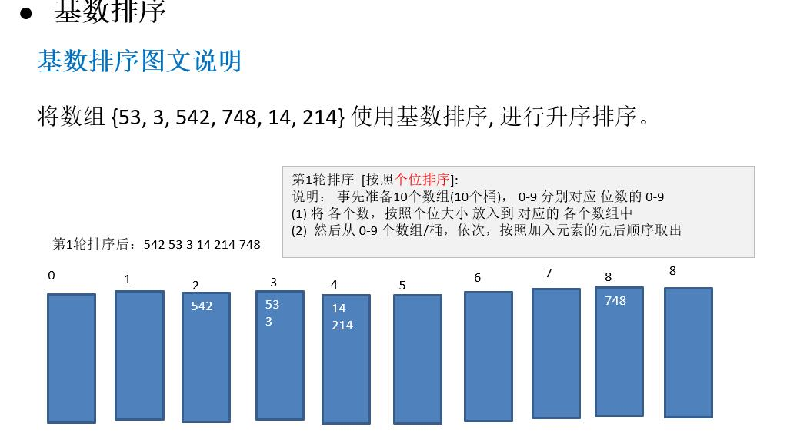
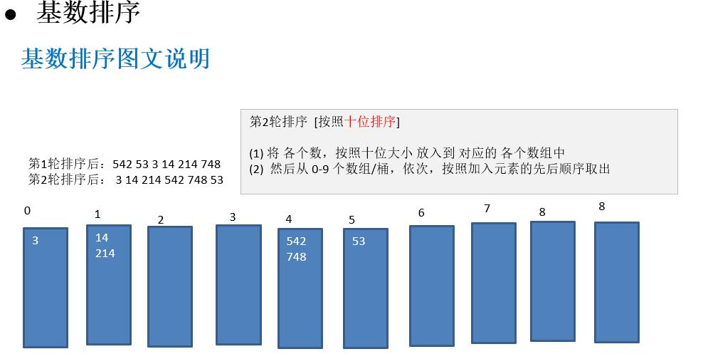
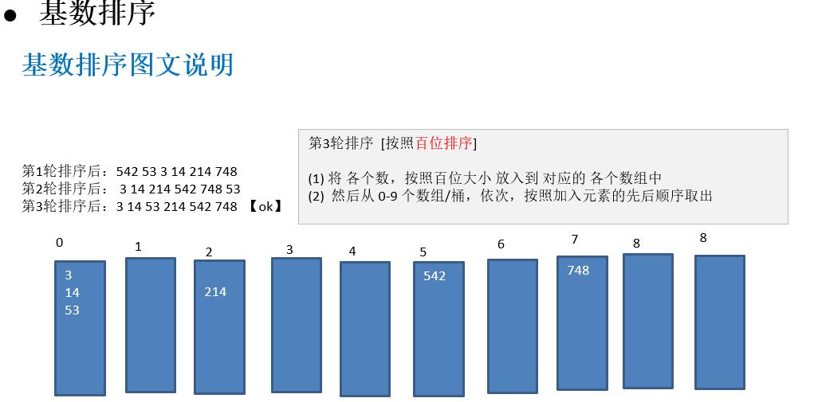

# 基数排序

- 基数排序（radix sort）属于“分配式排序”（distribution sort），又称“桶子法”（bucket sort）或bin sort
  - 顾名思义，它是通过键值的各个位的值，将要排序的元素分配至某些“桶”中，达到排序的作用
- 基数排序法是属于稳定性的排序，基数排序法的是效率高的稳定性排序法
- 基数排序(Radix Sort)是桶排序的扩展


基本思想



--






代码

```java
//基数排序方法
    public static void radixSort(int[] arr) {
        //1. 得到数组中最大的数的位数
        int max = arr[0];
        for (int i = 1 ; i < arr.length ; i ++){
            if (arr[i] > max){
                max = arr[i];
            }
        }
        //2. 得到最大数是几位数
        int max_Length = (max + "").length();

        //3. 定义一个二维数组，表示10个桶, 每个桶就是一个一维数组
        //基数排序是使用空间换时间的经典算法
        int[][] bucket = new int[10][arr.length];

        //4 .为了记录每个桶中，实际存放了多少个数据,定义一个一维数组来记录各个桶的每次放入的数据个数
        int[] bucket_Element_Counts = new int[10];

        //5. 循环遍历将数组中的元素添加到桶中
        //第一个循环是将数组中的每个元素的第i位数放到对应桶中
        //比如 [12,3,4,56,789]
        //最大位数为多少就循环多少次，第一次个位，第二次十位...
        for (int i = 0, n = 1 ; i < max_Length ; i ++,n *= 10){
            //第二个循环是将元素加入到桶中
            for (int j = 0 ; j < arr.length ; j ++){
                //计算对应位的值
                // [12 / 1 % 10 = 2]  [123 / 10 % 10 = 2]
                int digitOfElement = arr[j] / n % 10;

                //将元素放入桶中
                bucket[digitOfElement][bucket_Element_Counts[digitOfElement]] = arr[j];
                //添加一个元素后就加一，表示对应的桶多了一个元素
                bucket_Element_Counts[digitOfElement]++;
            }

            //6. 将桶中的数据按顺序取出来

            int index = 0 ;
            ////遍历每一桶，并将桶中是数据，放入到原数组
            for (int k = 0 ; k < bucket_Element_Counts.length ; k ++){
                //将桶中的数据取出
                if (bucket_Element_Counts[k]!=0){
                    //如果不为0，说明里面有元素
                    for (int l =0 ; l < bucket_Element_Counts[k] ; l ++){
                        arr[index++]  = bucket[k][l];
                    }
                }
                //第i+1轮处理后，需要将每个 bucketElementCounts[k] = 0
                //即，说明里面没有元素了
                //不然会影响下一个循环，会造成溢出
                bucket_Element_Counts[k] = 0;
            }

        }
```

