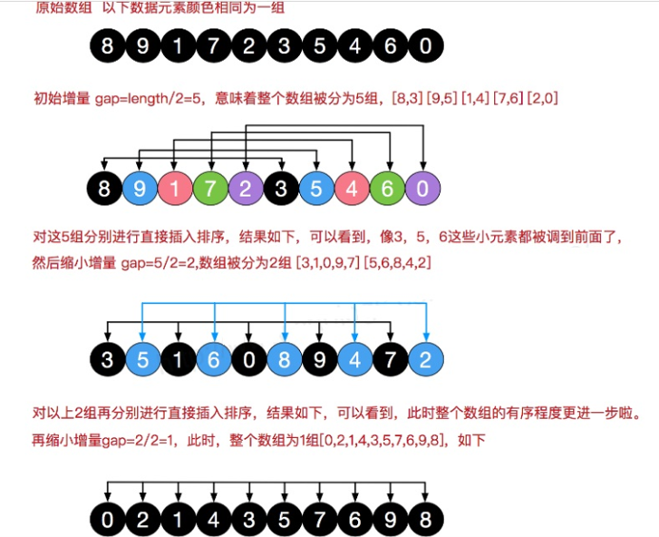

# 希尔排序

> 简单的插入排序可能存在的问题，那就是当最小的数都在最后时，那么循环就要执行很多次

希尔排序也是一种**插入排序**，它是简单插入排序经过改进之后的一个**更高效的版本**，也称为缩小增量排序。


**基本思想**

- 希尔排序是把记录按下标的一定增量分组，对每组使用直接插入排序算法排序；
- 随着增量逐渐减少，每组包含的关键词越来越多，当增量减至1时，整个文件恰被分成一组，算法便终止





代码

```java
/**
     * 利用交换法实现希尔排序
     * @param arr
     * @return
     */
    private static int[] ShellSortByChange(int[] arr){
        //中间变量
        int temp = 0 ;
        /**
         * 将给定的变量进行分组
         * 分组的数量为 length / 2 ,当前数组长度为10 , 所以分 5组,每组2个
         * 第一次分5组，第二次分2组 ， 第三次分1组，最后直到排好序
         */
        for (int gap = arr.length / 2 ; gap > 0 ; gap /=2){
            /**
             * i = gap -> 需要分几组
             * 第一次分5组，执行5次
             * 第二次分2组，每组5个，执行2次
             * 这一个循环是解决每组有多少元素
             */
            for (int i = gap ; i < arr.length ; i ++){
                //遍历分好组的内容，交换排序
                for (int j = i - gap ; j >=0 ; j-=gap){
                    // 如果当前元素大于加上步长后的那个元素，说明交换
                    if (arr[j] > arr[j + gap]) {
                        temp = arr[j];
                        arr[j] = arr[j + gap];
                        arr[j + gap] = temp;
                    }
                }
            }
        }
        return arr;
    }
    
    private static int[] ShellSortByMove(int[] arr){
        /**
         *  增量gap, 并逐步的缩小增量
         */
        for (int gap = arr.length / 2 ; gap > 0 ; gap /=2){
            /**
             * 从第gap个元素，逐个对其所在的组进行直接插入排序
             */
            for (int i = gap ; i < arr.length ; i ++){
                //暂时保留当前元素下标
                int j = i;
                int temp = arr[j];

                if (arr[j] < arr[j - gap]) {
                    while (j - gap >= 0 && temp < arr[j - gap]) {
                        //移动
                        arr[j] = arr[j-gap];
                        j -= gap;
                    }
                    //当退出while后，就给temp找到插入的位置
                    arr[j] = temp;
                }
            }
        }
        return arr;
    }

```

