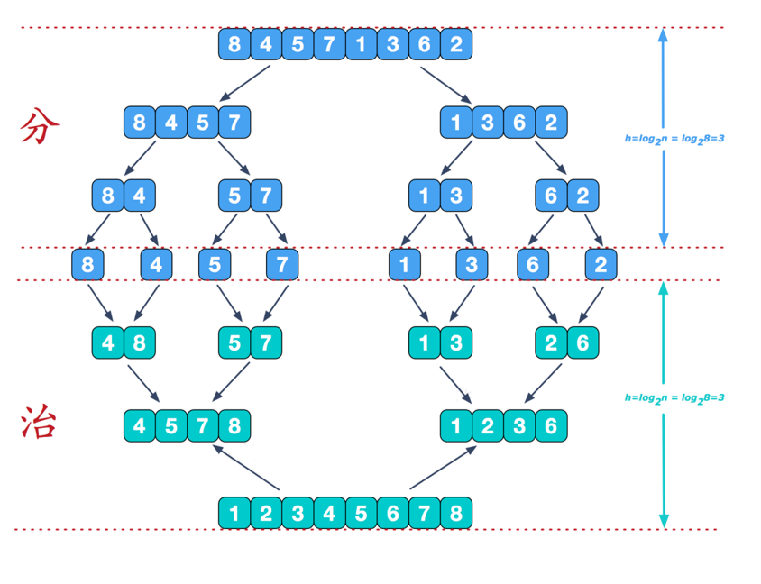
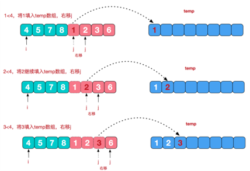
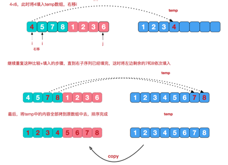

# 并归排序

归并排序（MERGE-SORT）是利用归并的思想实现的排序方法，该算法采用经典的分治（divide-and-conquer）策略

（分治法将问题分(divide)成一些小的问题然后递归求解，而治(conquer)的阶段则将分的阶段得到的各答案"修补"在一起，即分而治之)




合



--




代码

```java
/**
     * @param arr 需要拆分的数组
     * @param left 左起始索引
     * @param right 右起始索引
     * @param temp 临时数组
     */
    public static void mergeSort(int[] arr , int left , int right  , int[] temp){
        if (left<right){
            //中间索引
            int mid = (left + right) / 2;
            //向左递归进行分解
            mergeSort(arr, left, mid, temp);
            //向右递归进行分解
            mergeSort(arr, mid + 1, right, temp);
            //合并
            merge(arr, left, mid, right, temp);
        }
    }

    /**
     * @param arr 需要合并的数组
     * @param left 左起始索引
     * @param mid 中间索引
     * @param right 右边起始索引
     * @param temp 临时数组
     */
    public static void merge(int[] arr, int left, int mid, int right, int[] temp) {
        int l = left;
        int r = mid + 1;
        // 指向temp数组的当前索引
        int index = 0;

        //第一步，把左右两边的数据存放在 temp 数组上
        //当左边索引没到中间和右边索引没到右端
        while (l <= mid && r <= right){
            //如果左边的数小
            if (arr[l] <= arr[r]){
                temp[index] = arr[l];
                index++;
                l++;
            }else{
                //反之，如果左边的数大
                temp[index] = arr[r];
                index++;
                r++;
            }
        }

        //第二步，将第一步剩下的数据依次放入temp中
        while (l <= mid){
            temp[index] = arr[l];
            index++;
            l++;
        }
        while( r <= right) {
            //右边的有序序列还有剩余的元素，就全部填充到temp
            temp[index] = arr[r];
            index ++;
            r ++;
        }

        //拷贝
        //注意，并不是每次都拷贝所有
        index = 0;
        int tempLeft = left; //
        //第一次合并 tempLeft = 0 , right = 1 //  tempLeft = 2  right = 3 // tL=0 ri=3
        //最后一次 tempLeft = 0  right = 7
        while(tempLeft <= right) {
            arr[tempLeft] = temp[index];
            index += 1;
            tempLeft += 1;
        }
```

