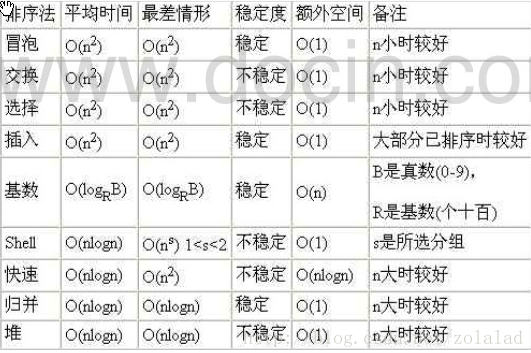
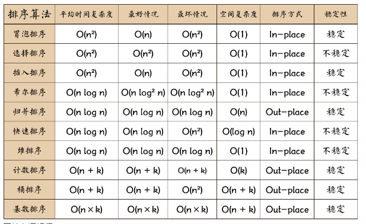

# 排序算法概述

排序也称排序算法 (Sort Algorithm)，排序是将一 组数据，依指定的顺序进行排列的过程

## 分类

### 内部排序

> 指将需要处理的所有数据都加载到内部存储器中进行排序

- 插入排序
  - 直接插入排序
  - 希尔排序
- 选择排序
  - 简单选择排序
  - 堆排序
- 交换排序
  - 冒泡排序
  - 快速排序
- 归并排序
- 基数排序

### 外部排序

> 数据量过大，无法全部加载到内存中，需要借助外部存储进行排序


# 时间频度

一个算法花费的时间与算法中语句的执行次数成正比例，哪个算法中语句执行次数多，它花费时间就多。

**一个算法中的语句执行次数称为语句频度或时间频度**。记为T(n)


## 特征

- n增大时，可忽略常数项
- n增大时，可忽略低次幂项
- n增大时，可忽略系数


# 时间复杂度

一般情况下，算法中的基本操作语句的重复执行次数是问题规模n的某个函数，用T(n)表示，若有某个辅助函数f(n)，使得当n趋近于无穷大时，T(n) / f(n) 的极限值为不等于零的常数，则称f(n)是T(n)的同数量级函数。

记作 T(n)=Ｏ( f(n) )，称Ｏ( f(n) ) 为算法的渐进时间复杂度，简称时间复杂度

T(n) 不同，但时间复杂度可能相同


## 常见时间复制度

1，常数阶O(1)

```java
int i;
int j;
int sum = i + j;
```

2，对数阶O(log2n)

```java
int i = 1;
while(i<n){
	i = i*2;
}
```

3，线性阶O(n)

```java
for(int i = 0 ; i < n ; i ++){
	
}
```

4，线性对数阶O(nlog2n)

```java
for(int i = 0 ; i < n ; i ++){
	int j = 1;
    while(i<n){
        j = j*2;
    }	
}
```

5，平方阶O(n^2)

```java
for(int i = 0 ; i < n ; i ++){
	for(int i = 0 ; i < n ; i ++){
	}
}
```

6，立方阶O(n^3)

7，k次方阶O(n^k)

8，指数阶O(2^n)

> 常见的算法时间复杂度由小到大依次为：Ο(1)＜Ο(log2***n***)**＜**Ο(***n)***＜***Ο(****nlog***2**n**)**＜***Ο(****n***2**)***＜****Ο(***n**3***)***＜**Ο(**n***k***) **＜**Ο(***2***n**)** 
>
> 随着问题规模n的不断增大，上述时间复杂度不断增大，算法的执行效率越低

## 平均/最坏时间复杂度

平均时间复杂度：是指所有可能的输入实例均以等概率出现的情况下，该算法的运行时间

最坏情况下的时间复杂度称 最坏时间复杂度




--




**相关术语解释：**

- **稳定**：如果a原本在b前面，而a=b，排序之后a仍然在b的前面；
- **不稳定**：如果a原本在b的前面，而a=b，排序之后a可能会出现在b的后面；
- **内排序**：所有排序操作都在内存中完成；
- **外排序**：由于数据太大，因此把数据放在磁盘中，而排序通过磁盘和内存的数据传输才能进行；
- **时间复杂度：** 一个算法执行所耗费的时间。
- **空间复杂度**：运行完一个程序所需内存的大小。
- **n:** 数据规模
- **k:** “桶”的个数
- **In-place:**  不占用额外内存
- **Out-place:** 占用额外内存


# 空间复杂度

> 一个算法的空间复杂度(Space Complexity)定义为该算法所耗费的存储空间，它也是问题规模n的函数

空间复杂度(Space Complexity)是对一个算法在运行过程中临时占用存储空间大小的量度。

有的算法需要占用的临时工作单元数与解决问题的规模n有关，它随着n的增大而增大，当n较大时，将占用较多的存储单元，例如快速排序和归并排序算法就属于这种情况


在做算法分析时，**主要讨论的是时间复杂度**