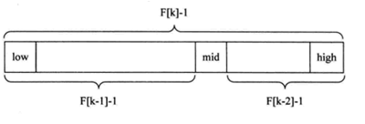

# 斐波那契(黄金分割法)查找算法

斐波那契查找原理与前插值、二分相似，仅仅改变了中间结点（mid）的位置，mid不再是中间或插值得到，而是位于黄金分割点附近，即

```
mid=low+F(k-1)-1 （F代表斐波那契数列）
```

如下图所示




对F(k-1)-1的理解

由斐波那契数列 F[k]=F[k-1]+F[k-2] 的性质，可以得到 （F[k]-1）=（F[k-1]-1）+（F[k-2]-1）+1 。

该式说明：只要顺序表的长度为F[k]-1，则可以将该表分成长度为F[k-1]-1和F[k-2]-1的两段，即如上图所示。从而中间位置为mid=low+F(k-1)-1      


类似的，每一子段也可以用相同的方式分割

但顺序表长度n不一定刚好等于F[k]-1，所以需要将原来的顺序表长度n增加至F[k]-1。

这里的k值只要能使得F[k]-1恰好大于或等于n即可，由以下代码得到,顺序表长度增加后，新增的位置（从n+1到F[k]-1位置），都赋为n位置的值即可


代码

```java
package tutu.demo.search;

import java.util.Arrays;

/**
 * 斐波那契(黄金分割法)查找算法
 * k-=1 和  k-=2 理解还不到位
 */
public class FibonacciSearch {
    public static int maxSize = 20;

    //因为后面我们mid=low+F(k-1)-1，需要使用到斐波那契数列，因此我们需要先获取到一个斐波那契数列
    //非递归方法得到一个斐波那契数列
    public static int[] fib() {
        int[] f = new int[maxSize];
        //前两个数必须为一
        f[0] = 1;
        f[1] = 1;
        for (int i = 2; i < maxSize; i++) {
            f[i] = f[i - 1] + f[i - 2];
        }
        return f;
    }

    /**
     * 使用非递归的方式编写 斐波那契查找算法
     *
     * @param a   需要查找的数组
     * @param key 需要查找的值
     * @return
     */
    public static int fibSearch(int[] a, int key) {
        int low = 0;
        int high = a.length - 1;
        //表示斐波那契分割数值的下标
        int k = 0;
        //存放mid值
        int mid = 0;
        //获取到斐波那契数列
        int f[] = fib();

        //获取到斐波那契分割数值的下标
        while (high > f[k] - 1) {
            k++;
        }
        //因为 f[k] 值 可能大于 a 的 长度，因此我们需要使用Arrays类，构造一个新的数组，并指向temp[]
        //不足的部分会使用0填充
        int[] temp = Arrays.copyOf(a, f[k]);

        //实际上需求使用a数组最后的数填充 temp
        //temp = {1,8, 10, 89, 1000, 1234, 0, 0}  => {1,8, 10, 89, 1000, 1234, 1234, 1234,}
        for (int i = high + 1; i < temp.length; i++) {
            temp[i] = a[high];
        }

        while (low <= high) {
            mid = low + f[k - 1] - 1;
            if (key < temp[mid]) {
                //左查
                high = mid - 1;
                //目标数组移动斐波那契下标也要移动
                k--;
            } else if (key > temp[mid]) {
                //右查
                low = mid + 1;
                //为什么是k -=2
                //说明
                //1. 全部元素 = 前面的元素 + 后边元素
                //2. f[k] = f[k-1] + f[k-2]
                //3. 因为后面我们有f[k-2] 所以可以继续拆分 f[k-1] = f[k-3] + f[k-4]
                //4. 即在f[k-2] 的前面进行查找 k -=2
                //5. 即下次循环 mid = f[k - 1 - 2] - 1
                k -= 2;
            } else { //找到
                //需要确定，返回的是哪个下标
                if (mid <= high) {
                    return mid;
                } else {
                    return high;
                }
            }
        }
        return -1;
    }

    public static void main(String[] args) {
        int[] arr = {1,8,10,89,1000,1234};
        System.out.println("index=" + fibSearch(arr, 89));// 0
    }
}

```

