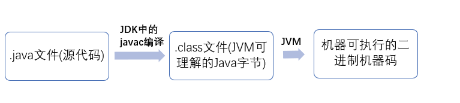

# JAVA语言特点

1，简单

2，平台无关性

3，多线程

4，面向对象

5，安全性

6，可靠性

6，支持网络编程

7，编译与解释并存


# 两大基本数据类型

> java是一种强类型语言


## 引用数据类型

类、接口类型、数组类型、枚举类型、注解类型，字符串型

```java
 A a =new A();
 //变量a的值为它所引用对象的地址
```

4种引用类型

强引用，软引用，弱引用，虚引用

强引用

只要强引用存在，垃圾回收器将永远不会回收被引用的对象，哪怕内存不足时，JVM也会直接抛出`OutOfMemoryError`，不会去回收

```java
//java中默认声明的就是强
//只要obj还指向Object对象，Object对象就不会被回收
Object obj = new Object(); 
```


软引用

软引用是用来描述一些非必需但仍有用的对象

**在内存足够的时候，软引用对象不会被回收，只有在内存不足时，系统则会回收软引用对象，如果回收了软引用对象之后仍然没有足够的内存，才会抛出内存溢出异常**


弱引用

弱引用的引用强度比软引用要更弱一些，**无论内存是否足够，只要 JVM 开始进行垃圾回收，那些被弱引用关联的对象都会被回收**

```java
//JDK1.2 之后，用 java.lang.ref.WeakReference 来表示弱引用
package java.lang.ref;

public class WeakReference<T> extends Reference<T> {
    public WeakReference(T var1) {
        super(var1);
    }

    public WeakReference(T var1, ReferenceQueue<? super T> var2) {
        super(var1, var2);
    }
}
```


```java
//所得到的结果全是null，垃圾回收了对象
private static void testWeakReference() {
		for (int i = 0; i < 10; i++) {
			byte[] buff = new byte[1024 * 1024];
			WeakReference<byte[]> sr = new WeakReference<>(buff);
			list.add(sr);
		}
		
		System.gc(); //主动通知垃圾回收
		
		for(int i=0; i < list.size(); i++){
			Object obj = ((WeakReference) list.get(i)).get();
			System.out.println(obj);
		}
	}
```


虚引用

虚引用是最弱的一种引用关系，如果一个对象仅持有虚引用，那么它就和没有任何引用一样，它随时可能会被回收


## 基本数据类型

> 或叫做原生类、内置类型

八种基本数据类型

`整型`，`长整型`，`短整型`，`字节(byte)`，`单精度浮点型`，`双精度浮点型`，`字符型`，`boolean型`

| 序号 | 数据类型        | 位数（bit） | 默认值 | 取值范围       |
| ---- | --------------- | ----------- | ------ | -------------- |
| 1    | byte(字节)      | 8           | 0      | -2^7 - 2^7-1   |
| 2    | short(短整数)   | 16          | 0      | -2^15 - 2^15-1 |
| 3    | int(整数)       | 32          | 0      | -2^31 - 2^31-1 |
| 4    | long(长整数)    | 64          | 0      | -2^63 - 2^63-1 |
| 5    | float(单精度)   | 32          | 0.0    | -2^31 - 2^31-1 |
| 6    | double(双精度)  | 64          | 0.0    | -2^63 - 2^63-1 |
| 7    | char(字符)      | 16          | 空     | 0 - 2^16-1     |
| 8    | boolean(布尔值) | 1           | false  | true、false    |

附加：String的初始值是null，局部变量没有默认值

额外注意：

> 1，java规定了每种基础类型所占存储空间的大小，不会随着硬件的改变而改变，是java可移植特点的表现
>
> 2，基本数据类型直接存放在 Java 虚拟机栈中的局部变量表


### 符号问题

java所有的基本数据类型不存在无符号这样的说法（都是有符号的），取值范围固定，不会随着硬件的改变而改变


### 整型

| 整型    |       |
| ------- | ----- |
| `long`  | 8字节 |
| `short` | 2字节 |
| `byte`  | 1字节 |
| `int`   | 4字节 |

> 32位的long占4字节，64位的占8位，在数值后要加上“L”，否者视为整型


#### 整数溢出问题

> int 类型在 Java 中是“有符号”的。所谓“有符号”就是有正负。
>
> 在计算机中用二进制表示所有的信息，这个符号的区别就看首位。
>
> **首位如果是 0，就是正的，1 就是负的。正与负的区别也因此就在于取反加一**


所谓数值溢出就会出现这个现象

Java 中的 ` int` 总共就 32 位，正数上限的情况首位也只能是 0，其他位都可以是 1（就是 2^31-1 的情况）。但是如果正数过大了，例如 2^31，计算机不得不把首位变成 1，并且很快就忘了这是溢出情况，把它按照正常的方式输出了，于是就成了负的，它没有办法自动处理超过溢出的情况，因为 32 位是固定的，它不能因为溢出而临时扩展到 33 位之类的


```java
2^31 - 1 = 0111 1111 1111 1111 1111 1111 1111 1111 = 2147483647
2^31 = 2^31 - 1 + 1 = 1000 0000 0000 0000 0000 0000 0000 0000 = -2147483648
```


存储数值超过了整形数值2^31-1，导致数据**向上溢出**

整数数值小于了-2^31，导致数值**向下溢出**


#### 进制

1，十六进制，前缀为0x或者0X

2，八进制，前缀为0

3，二进制，前缀为0b或者0B


> 注意
>
> java没有任何无符号形式的数据类型
>
> **无符号即为** **纯正数**，可以理解为每个数据类型都有符号


**大数值**

java.math的类：BigInteger 和 BigDecimal


### 浮点型

知识点一：

浮点数值适用于无法接受舍入误差的计算中，浮点数值采用二进制系统表示，二进制无法准确的表示分数1/10

如果需要可以使用`BigDecimal类`

```java
double aa =  12/10;
System.out.println(aa);
//输出结果为1.0
```

知识点二：

| 浮点型                      |       |
| --------------------------- | ----- |
| float（单精度类型）后缀F或f | 4字节 |
| double（双精度类型）        | 8字节 |

知识点三：

java常用的内置常数：double变量初始化为无穷大

```java
Double.POSITIVE_INFINITY = 1.0 / 0.0
//输出：Infinity
Double.POSITIVE_NEGATIVE_INFINITY = -1.0/0.0
//输出：-Infinity
Double.NaN
//非数字
```


#### 精度丢失问题

```java
float a = 1.0f - 0.9f;
float b = 0.9f - 0.8f;
System.out.println(a);// 0.100000024
System.out.println(b);// 0.099999964
System.out.println(a == b);// false
```

为了解决这样的精度丢失问题，通常使用BigDecimal来定义浮点数的值，再进行运算

```java
BigDecimal a = new BigDecimal("1.0");
BigDecimal b = new BigDecimal("0.9");
BigDecimal c = new BigDecimal("0.8");

BigDecimal x = a.subtract(b); 
BigDecimal y = b.subtract(c); 

System.out.println(Objects.equals(x, y)); //true
```

保留几位小数

```java
BigDecimal m = new BigDecimal("1.255433");
BigDecimal n = m.setScale(3,BigDecimal.ROUND_HALF_DOWN);
System.out.println(n);// 1.255
```


注意


#### 0.1*3 与 0.3

不相等的原因是，十进制的系统，表示分数时只能使用10的质子数作为分母

也就四会2,4,5,8,10，其他的数值不行，都是循环小数


### 字符型

1，字符型进行算数运算，运算的是ASCCL码

> **可以表示为十六进制**，从`\u0000`到`Uffff`（理解为可以用十六进制表示）

2，java采用Unicode编码方式，无论是中文还是英文字母，都占2字节


常用ASCII码值：

1，空格为32；

2，数字0为48；

3，“A”为65；

4，“a”值为97；


#### 字符型与String的区别

（1）一个单引号，一个双引号

（2）字符常量相当于一个整型值( ASCII 值),可以参加表达式运算; 字符串常量代表一个地址值(该字符串在内存中存放位置)

（3） 字符常量只占 2 个字节（在java中只占2字节）; 字符串常量占若干个字节

> 强烈不建议使用char类型，除非确实需要处理UTF-16代码单元，最好是将字符串作为抽象数据类型处理
>
> --《java核心技术 卷一》


#### 字节和字符的区别

字节是存储容量的基本单位，

字符是数子，字母，汉子以及其他语言的各种符号。

1 字节=8 个二进制单位：1字节=8位

一个一个字符由一个字节或多个字节的二进制单位组成。

#### 转义字符

|        |      |        |
| ------ | ---- | ------ |
| \b     | 退格 | \u0008 |
| \t     | 制表 | \u0009 |
| \n     | 换行 | \u000a |
| \r     | 回车 | \u000d |
| 双引号 |      | \u0022 |
| 单引号 |      | \u0027 |
| 反斜杠 |      | \u005c |

 

​																																																																																																																																																																																																																																																																																			

### Boolean类型

两个值：false，true


### String类

一，String对象是不可变的，当创建一个字符串之后，会被放在常量池中，使用的实际上是对应的引用，每一个修改String值得方法，都是创建一个新的String对象

> 因为是用final修饰的字符串数组

二，String做参数，传递的是String的引用

三，String具有只读性，任何引用都不能改变它的值

四，“+”操作符，对字符串进行连接，实际上每一次的连接都是创建一个新对象再和下一个连接，很消耗内存，程序性能不好，实际上底层会通过StringBuilder实例的append实现。

五，==判断的是对象引用是否是同一个引用，判断字符串相等要用equals方法


**Pattern类和Marcher对象**

在JDK 1.4中，Java增加了对正则表达式的支持

java与正则相关的工具主要在`java.util.regex`包中；此包中主要有两个类：Pattern、Matcher

​			

#### StringBuilder、StringBuffer

StringBuffer

1，继承自 AbstractStringBuilder

> 在 `AbstractStringBuilder` 中也是使用字符数组保存字符串`char[]value` 
>
> 但是没有用 `final` 关键字修饰，所以这两种对象都是可变的。

2，和 `String` 类不同的是，`StringBuffer` 和 `StringBuilder` 类的对象能够被多次的修改，并且不产生新的未使用对象。

3，对方法添加了同步锁，所以是**线程安全**的


StringBulider类

1，不论进行几次修改，都只是创建一个`StringBulider`对象，

2，显示的创建`StringBulider`还可以预先指定大小，避免措辞重新分配缓存

3，`StringBuilder` 类在 Java 5 中被提出，它和 `StringBuffer` 之间的**最大不同**在于 `StringBuilder` 的方法**不是线程安全的**。

4，由于 `StringBuilder` 相较于 `StringBuffer` 有速度优势，所以多数情况下建议使用 `StringBuilder` 类，但同时存在线程不安全的风险


#### 比较

**1，性能**

```
StringBuilder > StringBuffer > String
```

**2，何时使用**

```
String适用于少量的字符串操作的情况

StringBuilder 适用于单线程下在字符缓冲区进行大量操作的情况 

StringBuffer适用多线程下在字符缓冲区进行大量操作的情况
```

**3，缓存**

```java
// StringBuffer toString 方法会进行对象缓存，以减少元素复制开销
public synchronized String toString() {
    if (toStringCache == null) {
        toStringCache = Arrays.copyOfRange(value, 0, count);
    }
    return new String(toStringCache, true);
}
// StringBuilder 返回新对象
public String toString() {
	return new String(value, 0, count);
}
```

4，都是final，不允许继承

5，StringBuffer是线程安全的，StringBuilder是线程不安全的，但是两者方法的区别不大，只是StringBuffer添加了Synchronized，也同时出于这个影响，stirngBuilder有更好的性能


#### 面试题

**（1）String 转 Int 类型需要注意什么**

注意两个问题

1，当String不是数字时，会报错

2，当String的值超出int范围时，会转换为long


**（2）String重写hashCode和toString的原因**

**toString 源码**

重写的原因是String对象就是String类，不需要再转换为String了

```java
public String toString() {
  	return this;
}
```

**hashCode 源码**

重写的原因是因为，Object中的equals方法比较的是对象的内存地址，而String类型需要比较的是对象的值

而equals方法依赖的就是对象的hash值

所以Object中的hashCode的方法不再适用

Object中的hasCode返回的是对象的物理内存地址，String返回的是经过计算的ASCII码

```java
/** String 类型的 hash 值 默认 0 */
private int hash;
/** 用于字符存储的值. */
private final char value[];

public int hashCode() {
    int h = hash;
    if (h == 0 && value.length > 0) {
      char val[] = value;
      for (int i = 0; i < value.length; i++) {
        // 通过String所有位的ASCII码计算生成
        h = 31 * h + val[i];
      }
      hash = h;
    }
    return h;
}
```

同时也要注意 重写hashcode 和 equals 的知识点

- 在重写了 hashcode 方法后，equals 也需要重写，这是一个语法糖，强制要求

```java
public boolean equals(Object anObject) {
  if (this == anObject) {
    return true;
  }
  if (anObject instanceof String) {
    // 很明显看得到，String 的 equals 方法是一个个的比较String中的字符
    String anotherString = (String)anObject;
    int n = value.length;
    if (n == anotherString.value.length) {
      char v1[] = value;
      char v2[] = anotherString.value;
      int i = 0;
      while (n-- != 0) {
        if (v1[i] != v2[i])
          return false;
        i++;
      }
      return true;
    }
  }
  return false;
}

```


**（3）String str=“a”和 new String(“a”);** 

产生几个对象？

前者可能产生1个或者0个，后者可能产生1个或则2个

前者如果之前有存在过该字符串，那么就会使用原来的引用，不会继续创建，如果不存在则会创建一个

后者同理，使用了关键字new，那么肯定就会有个对象存在，但是也因为string的特点，字符串“a”不存在则会在常量池中创建一个，存在则使用原有的引用


## 基本类型面试题

**（1）基本类型和引用类型的区别**

基本类型保存原始值
引用类型保存的是引用值（引用值就是指对象在堆中所 处的位置/地址）


**（2）数值间的转换次序**

 **规则**：不是基本数据类型可以任意转换，**占位少的可以转换为占位多的(自动)**，占位多的需要通过强制类型转换，**导致数据丢失**


**即**：**`double`>`float`>`long`>`int`>`short`>`char`**


**信息丢失问题**

当两个不同类型的数进行基本运算符操作时，精度小的数值类型首先会向精度大的数值类型进行转换，超出的高位部分将被丢弃


**转换规则**

1.类型范围小的转换为大的

2.明确类型的表达式，会根据表达式的大小转换

3.都是数字的，转换为范围大的


**强制类型转换**

虽然int会自动转换为double，但是有时候也需要double转换为int 的时候，所以就需要强制类型转换，可能会丢失一些信息

```java
double x =  9.777;
int nx = (int)x //nx = 9

int nx = (int)Math.round(x);//nx = 10
```


**（3）==与equals**

- 对于基本数据类型来说，==比较的是值。对于引用数据类型来说，==比较的是对象的内存地址。

> 因为 Java 只有值传递，所以，对于 == 来说，不管是比较基本数据类型，还是引用数据类型的变量，其本质比较的都是值，只是引用类型变量存的值是对象的地址

- **`equals()`** 用来判断两个对象是否相等。

> StringBuffer和StringBuilder比较特殊，==和equals都是比较的地址


额外注意：

`equals()` 方法存在两种使用情况：

- **类没有覆盖 `equals()`方法** ：通过`equals()`比较该类的两个对象时，等价于通过“==”比较这两个对象，使用的默认是 `Object`类`equals()`方法。
- **类覆盖了 `equals()`方法** ：一般我们都覆盖 `equals()`方法来比较两个对象中的属性是否相等；若它们的属性相等，则返回 true(即，认为这两个对象相等)。
- `String` 中的 `equals` 方法是被重写过的，因为 `Object` 的 `equals` 方法是比较的对象的内存地址，而 `String` 的 `equals` 方法比较的是对象的值

> 除了String类以外，还有Integer以及Date类重写了equals方法


**（4）hashCode()与 equals()**

> 为什么重写 `equals` 时必须重写 `hashCode` 方法？

hashCode（）:获取哈希码，也称为散列码

那么，如果两个对象相等，其哈希吗一定是相同的，那么equals的值一定是true，但是，不一定两个对象有相同的hascode，他们就一定相等，所以，equals方法被修改了，hascode就需要被覆盖。

> hashcode相同，为什么？
>
> 计算hashcode的方法，可能会不同的数字算出相同的hascode，越不理想的哈希算法越容易产生碰撞

因为在散列表中，hashCode()相等即两个键值对的哈希值相等，然而哈希值相等，并不一定能得出键值对相等。

1、两个对象用equals()比较返回true，那么两个对象的hashCode()方法必须返回相同的结果。

2、两个对象用equals()比较返回false，不要求hashCode()方法也一定返回不同的值，但是最好返回不同值，以提搞哈希表性能。

3、重写equals()方法，必须重写hashCode()方法，以保证equals方法相等时两个对象hashcode返回相同的值。

Objects.equals()

```java
Objects.equals(null,"SnailClimb");// false
```

其源代码为

```java
public static boolean equals(Object a, Object b) {
    // 可以避免空指针异常。如果a==null的话此时a.equals(b)就不会得到执行，避免出现空指针异常。
    return (a == b) || (a != null && a.equals(b));
}
```


**（5）重写equals的有原则**

**对称性：**

如果`x.equals（y）`返回是“true”，那么`y.equals（x）`也应该返回是“true”。

**自反性：**

`x.equals（x）`必须返回是“true”。

**传递性：**

如果`x.equalsly）`返回是“true”，而且`y.equals（z）`返回是“true”，那么`z.equals（x）`也应该返回是“true”。

**一致性：**

如果`x.equals（y）`返回是“true”，只要x和y内容一直不变，不管重复`x.equals（y）`多少次，返回结果都是“true”。

**其他：**

任何情况下，`x.equals（null）`，永远返回是“false”
`x.equals（与x不同类型的对象）` 永远返回是“false”


# 枚举类型

```JAVA
enum Size{
	SMALL,MEDIUM,LARGE,EXTRA_LARGE
}

Size s = Size.MEDIUM;

```

或者是

```java
public enum  ResultEnum {
    /**
     * 返回结果枚举，每一个枚举代表一个状态
     */
    SUCCESS(20000, "操作成功")
    ;
    private Integer code;
    private String msg;
    ResultEnum(Integer code , String msg ){
        this.code = code;
        this.msg = msg;
    }
}
```

1，使用`==`来比较枚举类型


EnumSet

`EnumSet` 是一种专门为枚举类型所设计的 `Set` 类型。

EnumMap

`EnumMap`是一个专门化的映射实现，用于将枚举常量用作键。与对应的 `HashMap` 相比，它是一个高效紧凑的实现，并且在内部表示为一个数组:

```
EnumMap<Pizza.PizzaStatus, Pizza> map;
```

### 单例模式

```java
public enum SomeThing {
    INSTANCE;
    // Resource是需要使用的资源
    // 具体可以表现为网络连接，数据库连接，线程池等等。 
    private Resource instance;
    SomeThing() {
        instance = new Resource();
    }
    public Resource getInstance() {
        return instance;
    }
}
SomeThing.INSTANCE.getInstance();//调用
```


# 关键字与标识符

1，需要大量地为程序、类、变量、方法等取名字，于是就有了标识符，简单来说，**标识符**就是一个名字。

2，但是有一些标识符，Java 语言已经赋予了其特殊的含义，只能用于特定的地方，这种特殊的标识符就是关键字。因此，**关键字**是被赋予特殊含义的标识符。

常用关键字

|                      |          |            |          |              |            |           |        |
| -------------------- | -------- | ---------- | -------- | ------------ | ---------- | --------- | ------ |
| 访问控制             | private  | protected  | public   |              |            |           |        |
| 类，方法和变量修饰符 | abstract | class      | extends  | final        | implements | interface | native |
|                      | new      | static     | strictfp | synchronized | transient  | volatile  |        |
| 程序控制             | break    | continue   | return   | do           | while      | if        | else   |
|                      | for      | instanceof | switch   | case         | default    |           |        |
| 错误处理             | try      | catch      | throw    | throws       | finally    |           |        |
| 包相关               | import   | package    |          |              |            |           |        |
| 基本类型             | boolean  | byte       | char     | double       | float      | int       | long   |
|                      | short    | null       | true     | false        |            |           |        |
| 变量引用             | super    | this       | void     |              |            |           |        |
| 保留字               | goto     | const      |          |              |            |           |        |


# 变量

变量命名规则：必须为合法的标识符,变量名必须是一个以字母开头，并且由字母或数字组成的序列

> 标识符由任意的字母，下划线，美元符号，数字组成，并且第一个不能为数字，也不能用关键字
>
> 不建议使用美元符


## 实例变量

​	1，定义在类中，方法体外的变量

​	2，也称为**对象变量**，即没有加static的变量，在创建对象的时候就实例化了

**成员变量**（归属于实例变量）

​	1，可以被整个类访问，以及方法，构造方法，特定类的语句块

​	2，成员变量有默认值，即在分配了内存空间后所有成员变量会初始化，没有赋值的会给成员变量对应类型的值，数据类型不同则默认值不同


## 局部变量

1，在**方法、构造方法或者语句块中定义的变量**被称为局部变量

2，**方法结束后，变量就会自动销毁**

3， 用的时候是直接入栈的，如果没有赋值，这个变量就没有初始值，也就无法操作，**所以局部变量要初始化**


## 类变量

1，独立于方法之外的变量，**用 static 修饰**，类变量也叫**静态变量**

2，**静态方法只能访问静态成员变量**

3，**静态成员可以被该类所有方法访问**


### 类变量面试题

**（1）static方法是否可覆盖**

static 方法不能被覆盖，因为方法覆盖是基于运行时动态绑定的，而 static 方法是编译时静态绑定的。

static 方法跟类的任何实例都不相关，所以概念上不适用。

==**在Java中，static方法和final方法（private方法属于final方法）是前期绑定，而其他所有的方法都是后期绑定了**==

> 《Java编程思想》中所说：
>
> “一旦你了解了多态机制，可能就会认为所有事物都可以多态地发生。然而，只有普通方法的调用可以是多态的。如果你直接访问某个域，（不管是否是静态[static](https://so.csdn.net/so/search?q=static&spm=1001.2101.3001.7020)），这个访问就将在编译期间进行解析。”


**（2）static 变量并发下怎么保证安全**

虽然说是static变量如何保证线程安全，其实就是全局变量的线程安全问题，所以该问题可以参考并发那边的知识

简单来说：1：锁 单例访问  2：关键字修饰


# final 常量

1，使用关键字final指示

2，常量通常用大写

3，不能修饰抽象类，因为抽象类一般都是需要被继承的，final修饰后就不能继承了，被修饰的类**可以被重载不能重写**

4，如果是**基本数据类型的变量**，则其数值**一旦在初始化之后便不能更改**；

5，如果是**引用类型的变量**，则在对其**初始化之后便不能再让其指向另一个对象**


final方法

1，声明 final 方法的主要目的是**防止该方法的内容被修改**，类中的 final 方法可**以被子类继承，但是不能被子类修改**


额外知识点

> 堆区：只存放类对象（类中的成员变量），线程共享；
>
> 方法区：又叫静态存储区，存放class文件和静态数据，线程共享;
>
> 栈区：存放方法局部变量，基本类型变量区、执行环境上下文、操作指令区，线程不共享;       


常量：编译期常量和非编译期常量

​	编译期常量：在程序编译阶段【不需要加载类的字节码】，就可以确定常量的值

​	非编译期常量：在程序运行阶段【需要加载类的字节码】，可以确定常量的值

> ```java
> static final int c = 0;//编译期常量，不需要类加载
> 
> static final Integer d = new Integer(2);//非编译期常量，需要类加载，报错！！
> ```


## 面试题

**（1）final和static的区别**

考察这个知识点只需要考虑其修饰不同的类型时的表现

static

1. 修饰变量：静态变量在类加载时被初始化，JVM智慧分配一次内存，只会存在一次，所有类共享静态变量
2. 修饰方法：类加载时存在，不能用abstract修饰，静态方法才能访问静态变量
3. 修饰代码块：类加载完之后就会执行代码块中的内容：父类静态代码块>>子类静态代码块>>父类构造方法>>子类构造方法


final

修饰变量

1. 编译器常量：只能是基础类型，在类加载过程就完成初始化
2. 运行时常量：引用不可变
3. 修饰方法：不能被继承，不能被子类修改
4. 修饰类：不能被继承
5. 修饰形参：形参不可变


**（2）final的实现原理**

写final域会要求编译器在final域写之后，构造函数返回前插入一个StoreStore屏障。

读final域的重排序规则会要求编译器在读final域的操作前插入一个LoadLoad屏障


**（3）final 对并发应用有什么帮助？**

不可变对象(Immutable Objects)即对象一旦被创建它的状态（对象的数据，也即对象属值）就不能改变，反之即为可变对象(Mutable Objects)。

例如：String、基本类型的包装类、BigInteger 和 BigDecimal 等

不可变对象保证了对象的内存可见性，对不可变对象的读取不需要进行额外的同步手段，提升了代码执行效率。


**（4）如何理解 static final修饰的变量**

1，一个既是static又是final 的字段只占据一段不能改变的存储空间，它必须在定义的时候进行赋值，否则编译器将不予通过

2， 因为static关键字所修饰的字段并不属于一个对象，而是属于这个类的。也可简单的理解为static final所修饰的字段仅占据内存的一个一份空间，一旦被初始化之后便不会被更改


**（5）final域重排序规则**

**写final域重排序规则**

写final域的重排序规则禁止对final域的写重排序到构造函数之外
编译器会在final域写之后，构造函数return之前，插入一个storestore屏障。这个屏障可以禁止处理器把final域的写重排序到构造函数之外。因此，写final域的重排序规则可以确保：在对象引用为任意线程可见之前，对象的final域已经被正确初始化过了，而普通域就不具有这个保障。

**读final域重排序规则**

读final域重排序规则为：在一个线程中，初次读对象引用和初次读该对象包含的final域，JMM会禁止这两个操作的重排序。(注意，这个规则仅仅是针对处理器)，处理器会在读final域操作的前面插入一个LoadLoad屏障。实际上，读对象的引用和读该对象的final域存在间接依赖性，一般处理器不会重排序这两个操作。


final域为引用类型时又是怎么控制重排序的问题？

为什么final引用不能从构造函数中“溢出”？


# 流程控制

```
if……else
while（）
do……while（）
switch（）
```

注意：

1，switch语句后的控制表达式只能是`short`、`char`、`int`、`byte`整数类型和枚举类型，不能是`float`，`double`和`boolean`类型。

2，**String类型是java7开始支持**


# 循环

```
for循环，for……each循环，while循环
```

**执行顺序**:

1. 初始化语句, 仅在循环开始前执行一次;
2. 布亇表达式, 用于决定是否继续执行正文过程, 表达式中异常则结束循环;
3. 正文过程, 如果过程中存在break, return或者异常, 循环结束(不会执行更新语句), 如果遇到continue, 则会执行更新语句后进入下一轮循环;
4. 更新语句, 注意更新语句不做逻辑真假判断, 到这里一轮循环结束;
5. 布亇表达式, 进入新一轮循环;


while的终端控制流程语句

```java
read_data：
while(){
	...
	beak read_data;
}
```


# 数组

## 声明方式

```
int data[];
int[] data;
```

## 数组的初始化

```
int[] a = new int[5];
int a[] = new int[5];
int[] a = {1,2,3,4}
```

当使用一下方式创建数组时可以不创建新的变量

> 数组拷贝，是数组同时指向一个地方
>
> 改变一个数据，同样也会改变另一个数组

```java
int[] arr = new int[]{1,2,3,4}

arr2 = arr1
```

额外

**真数组：** 数组元素在内存中是一个接着一个线性存放的，通过第一个元素就能访问随后的元素，避免了数据覆盖的可能性，和数据类型覆盖并没有关系，实现了真数组为Java语言健壮性的特点之一


## 多维数组

```java
int a[][] = new int[7][];

//相当于，每一个元素填充了一个包含10个数据的数组
int arr[] = new int[10];
arr[1] = new int[10];
```


# 运算符

## 算术运算符

| /         | 取整数                                              |
| --------- | --------------------------------------------------- |
| %         | 取余数                                              |
| +         |                                                     |
| -         |                                                     |
| *         |                                                     |
| 自增/自减 | a++	:	运行完了后再加<br>++a ： 加完了后再运行 |

**注意**：数据类型的转化

1.int类型+String类型：转化为String类型


## 关系运算符

==，!=，>，<，>=，<=


## 位运算符

位运算符的运算是在二进制的基础上进行的

A=60	转化为二进制：0011 1100

B=13	转化为二进制：0000 1101

| ＆   | 如果相对应位都是1，则结果为1，否则为0        | A＆B：12,即0000 1100      |
| ---- | -------------------------------------------- | ------------------------- |
| \|   | 如果相对应位都是 0，则结果为 0，否则为 1     | A \| B：61,即 0011 1101   |
| ^    | 如果相对应位值相同，则结果为0，否则为1       | A ^ B：49,即 0011 0001    |
| 〜   | 对二进制的每一位数进行翻转                   | 〜A：-61,即1100 0011      |
| <<   | 按位左移运算符，向左移指定位数               | A << 2：240，即 1111 0000 |
| >>   | 按位右移运算符。向右移指定位数               | A >> 2：15即 1111         |
| >>>  | 按位右移补零操作符，移动得到的空位以零填充。 | A>>>2：15即0000 1111      |


 **注意**：当 `&` 和 `|` 用于布尔值，得到的也是布尔值，在得到结果前，会计算两个操作数的值


### Java移位运算符？

java中有三种移位运算符

- `<<` :左移运算符,`x << 1`,相当于x乘以2(不溢出的情况下),低位补0
- `>>` :带符号右移,`x >> 1`,相当于x除以2,正数高位补0,负数高位补1
- `>>>` :无符号右移,忽略符号位,空位都以0补齐

 

## 逻辑运算符

| &&    |      | A && B为假    |
| ----- | ---- | ------------- |
| \| \| |      | A \| \| B为真 |
| ！    |      | A && B为真    |

**短路逻辑运算符**

当使用与逻辑运算符时，在两个操作数都为true时，结果才为true，但是当得到第一个操作为false时，其结果就必定是false，这时候就不会再判断第二个操作了


## 赋值运算符

| =       |                    | C = A + B将把A + B得到的值赋给C          |
| ------- | ------------------ | ---------------------------------------- |
| + =     |                    | C + = A等价于C = C + A                   |
| - =     |                    | C - = A等价于C = C - A                   |
| * =     |                    | C * = A等价于C = C * A                   |
| / =     |                    | C / = A，C 与 A 同类型时等价于 C = C / A |
| （％）= |                    | C％= A等价于C = C％A                     |
| << =    | 左移位赋值运算符   | C << = 2等价于C = C << 2                 |
| >> =    | 右移位赋值运算符   | C >> = 2等价于C = C >> 2                 |
| ＆=     | 按位与赋值运算符   | C＆= 2等价于C = C＆2                     |
| ^ =     | 按位异或赋值操作符 | C ^ = 2等价于C = C ^ 2                   |
| \| =    | 按位或赋值操作符   | C \| = 2等价于C = C \| 2                 |


## 条件运算符

条件运算符也被称为三元运算符

```java
variable x = (expression) ? value if true : value if false
```

**注意！**

当三元操作遇到可以转换为数字的类型，会自动做类型提升

```java
Object a = true ? Interge(1) : Double(2);
```

实际上会自动转换为

```java
Object a = true ? Double(1) : Double(2);
```

也就是输出 

```java
a = 1.0
```


## `instanceof` 运算符

该运算符用于操作对象实例，检查该对象是否是一个特定类型（类类型或接口类型）

```java
String name = "James"; 
boolean result = name instanceof String;  // 由于 name 是 String 类型，所以返回真
```


## Java运算符优先级

- `!` >` ~` >` 二元运算` >`一元运算 `
- \`*` >` /` >`%`
- `<<` 大于 `>>` 大于 `>>>`
- `<` 大于 `<=` 大于` >` 大于 `>=` 大于`instanceof`


## 运算时的类型转	换错误

### short s1 = 1; s1 = s1 + 1; 

报错原因：s1+1时会进行类型的升级，Int大于short，所以会转为int类型，而将int类型的值赋值给short类型时就会报错，高级的不能转为低级的 


### short s1 = 1; s1 += 1;

+= 是java语言规定的运算符，java编译器会对它进行特殊处理，因此可以正确编译


# 注解

### 什么是注解

Annotation（注解）是 Java （JDK1.5）提供的一种对元程序中元素关联信息和元数据（metadata）的途径和方法。

Annatation(注解)是一个接口，程序可以通过反射来获取指定程序中元素的 Annotation对象，然后通过该 Annotation 对象来获取注解中的元数据信息

注解是JDK1.5版本开始引入的一个特性，==用于对代码进行说明==，可以对包、类、接口、字段、方法参数、局部变量等进行注解

### 作用

- ==生成文档==，通过代码里标识的元数据生成javadoc文档。
- ==编译检查==，通过代码里标识的元数据让编译器在编译期间进行检查验证
- ==编译时动态处理==，编译时通过代码里标识的元数据动态处理，例如动态生成代码。
- ==运行时动态处理==，运行时通过代码里标识的元数据动态处理，例如使用反射注入实例。


### 分类

**Java自带的标准注解**，包括`@Override`、`@Deprecated`和`@SuppressWarnings`，分别用于标明重写某个方法、标明某个类或方法过时、标明要忽略的警告，用这些注解标明后编译器就会进行检查。

**元注解**，元注解是用于定义注解的注解，包括`@Retention`、`@Target`、`@Inherited`、`@Documented`

- `@Retention`用于标明注解被保留的阶段
- `@Target`用于标明注解使用的范围
- `@Inherited`用于标明注解可继承
- `@Documented`用于标明是否生成javadoc文档

**自定义注解**，可以根据自己的需求定义注解，并可用元注解对自定义注解进行注解


### 注解处理器

如果没有用来读取注解的方法和工作，那么注解也就不会比注释更有用处了。使用注解的过程中，很重要的一部分就是创建于使用注解处理器。Java SE5扩展了反射机制的API，以帮助程序员快速的构造自定义注解处理器


注解

```java
@Target(ElementType.FIELD)
@Retention(RetentionPolicy.RUNTIME)
@Documented
public @interface FruitProvider {
    /**供应商编号*/
    public int id() default -1;
    /*** 供应商名称*/
    public String name() default ""；
    /** * 供应商地址*/
    public String address() default "";
}
```

使用

```java
public class Apple {
    @FruitProvider(id = 1, name = "陕西红富士集团", address = "陕西省西安市延安路")
    private String appleProvider;
    public void setAppleProvider(String appleProvider) {
        this.appleProvider = appleProvider;
    }
    public String getAppleProvider() {
        return appleProvider;
    }
}
```

注解处理器

```java
public class FruitInfoUtil {
    public static void getFruitInfo(Class<?> clazz) {
        String strFruitProvicer = "供应商信息：";
        Field[] fields = clazz.getDeclaredFields();//通过反射获取处理注解
        for (Field field : fields) {
            if (field.isAnnotationPresent(FruitProvider.class)) {
                FruitProvider fruitProvider = (FruitProvider) field.getAnnotation(FruitProvider.class);
                //注解信息的处理地方
                strFruitProvicer = " 供应商编号：" + fruitProvider.id() + " 供应商名称："
                    + fruitProvider.name() + " 供应商地址："+ fruitProvider.address();
                System.out.println(strFruitProvicer);
            }
        }
    }
}
public class FruitRun {
    public static void main(String[] args) {
        FruitInfoUtil.getFruitInfo(Apple.class);
        /***********输出结果***************/
        // 供应商编号：1 供应商名称：陕西红富士集团 供应商地址：陕西省西安市延
    }
}
```


## 递归

递归：指在当前方法内调用自己 

递归的分类: 递归分为两种，直接递归和间接递归


 直接递归称为方法自身调用自己

 间接递归可以A方法调用B方法，B方法调用C方法，C方法调用A方法


 **注意事项**： 递归一定要有条件限定，保证递归能够停止下来，否则会发生栈内存溢出


 在递归中虽然有限定条件，但是递归次数不能太多。否则也会发生栈内存溢出。

 构造方法,禁止递归

```
Exception in thread "main" java.lang.StackOverflowError
```


## 字符编码和字符集

**字符编码**（Character Encoding）: 就是一套自然语言的字符与二进制数之间的对应规则。

计算机中储存的信息都是用二进制数表示的，而我们在屏幕上看到的数字、英文、标点符号、汉字等字符是二进制数转换之后的结果


按照某种规则，将字符存储到计算机中，称为**编码**

反之，将存储在计算机中的二进制数按照某种规则解析显示出来，称为**解码**。


**编码表**：生活中文字和计算机中二进制的对应规则

**字符集**：也叫编码表。是一个系统支持的所有字符的集合，包括各国家文字、标点符号、图形符号、数字等。

> 常见字符集有ASCII字符集、GBK字符集、Unicode字符集
>
> Windows系统中创建的文本文件时，由于Windows系统的默认是GBK编码，就会出现乱码


String类的构造方法提供了把字节数组转换成字符的方法

`public String(byte[] bytes)`

`public String(byte[] bytes, String charsetName)`

同时提供了`public byte[] getBytes()`和`public byte[] getBytes(String charsetName)`方法来把字符串转换为字节数组，有参方法用来指定字符集。

```java
// 编码和解码要统一
byte[] bytes = "我真的是个好人".getBytes("utf-8");
String s = new String(bytes, "utf-8");
```


## 权限修饰符

| 修饰符    | 类中 | 同一个包中 | 子类中 | 任何地方 |
| --------- | ---- | ---------- | ------ | -------- |
| public    | YES  | YES        | YES    | YES      |
| protected | YES  | YES        | YES    |          |
| default   | YES  | YES        |        |          |
| private   | YES  |            |        |          |


注意：

1，**声明时没有写访问修饰符默认是default，default不能修饰变量**

2，default才能做到完全在同一个包中，protected修饰的类的子类可能在其他包下mn	


### 面试题

-----

#### String 能被继承吗？为什么？

不可以，因为 String 类有 final 修饰符，而 final 修饰的类是不能被继承的，实现细节不允许改变

-----

#### String str=“abc”和 String str=new String(“abc”); 产生几个对象？

1.前者 1 或 0，后者 2 或 1，先看字符串常量池，如果字符串常量池中没有，都在常量池中创建一个，如果有，前者直接引用，后者在堆内存中还需创建一个“abc”实例对象：String str

2.对于基础类型的变量和常量：变量和引用存储在栈中，常量存储在常量池中。String 是常量

3.为了提升 jvm（JAVA 虚拟机）性能和减少内存开销，避免字符的重复创建 项目中还是不要使用 new String 去创建字符串，最好使用 String 直接赋值。

-----

#### String 类的常用方法都有那些？

```java
indexOf()：返回指定字符的索引。
charAt()：返回指定索引处的字符。
replace()：字符串替换。
trim()：去除字符串两端空白。
split()：分割字符串，返回一个分割后的字符串数组。
getBytes()：返回字符串的 byte 类型数组。
length()：返回字符串长度。
toLowerCase()：将字符串转成小写字母。
toUpperCase()：将字符串转成大写字符。
substring()：截取字符串。
equals()：字符串比较
```

------

#### a = a + b 与 a += b 的区别

- += 隐式的将加操作的结果类型强制转换为持有结果的类型
- 如果两这个整型相加，如 byte、short 或者 int，首先会将它们提升到 int 类型，然后在执行加法操作

------

####  3*0.1 == 0.3 将会返回什么? 

false，因为有些浮点数不能完全精确的表示出来

> double 和 float基本数据类型存在着精度缺失问题

可以是用 `BigDecimal` 来解决

------

#### s-hort s1 = 1; s1 = s1 + 1;有什么错? 

对于 short s1=1;s1=s1+1 来说，在 s1+1 运算时会自动提升表达式的类型为 int， 那么将 int 赋予给 short 类型的变量 s1 会出现类型转换错误。

-----

#### short s1 = 1; s1+=1;有什么错?

对于 short s1=1;s1+=1 来说 +=是 java 语言规定的运算符，java 编译器会对它进行特殊处理，因

此可以正确编译

-----

#### 能在 Switch 中使用 String 吗?

从 Java 7 开始，我们可以在 switch case 中使用字符串，但这仅仅是一个语法糖。

内部实现在 switch 中使用字符串的 hash code


## JVM

JAVA虚拟机是运行java字节码的虚拟机

### 字节码

在 Java 中，JVM 可以理解的代码就叫做`字节码`（即扩展名为 `.class` 的文件），它不面向任何特定的处理器，只面向虚拟机。

Java 语言通过字节码的方式，在一定程度上解决了传统解释型语言执行效率低的问题，同时又保留了解释型语言可移植的特点。所以 Java 程序运行时比较高效，而且，由于字节码并不针对一种特定的机器，因此，Java 程序无须重新编译便可在多种不同操作系统的计算机上运行。



**总结：**

Java 虚拟机（JVM）是运行 Java 字节码的虚拟机。JVM 有针对不同系统的特定实现（Windows，Linux，macOS），目的是使用相同的字节码，它们都会给出相同的结果。

**字节码和不同系统的 JVM 实现是 Java 语言“一次编译，随处可以运行”的关键所在。**

## JDK与JRE

JDK 是 Java Development Kit 缩写，它是功能齐全的 Java SDK。它拥有 JRE 所拥有的一切，还有**编译器**（javac）和**工具**（如 javadoc 和 jdb）。它能够创建和编译程序。

JRE 是 Java **运行时环境**。它是运行已编译 Java 程序所需的所有内容的集合，包括 **Java 虚拟机**（JVM），**Java 类库**，B和其他的一些基础构件。但是，它不能用于创建新程序。

**总结：**

JDK就是编辑所需相关，JRE就是运行所需相关


## 编译与解释并存

1，高级编程语言按照程序的执行方式分为编译型和解释型两种。编译型语言是指编译器针对特定的操作系统将源代码一次性翻译成可被该平台执行的机器码；解释型语言是指解释器对源程序逐行解释成特定平台的机器码并立即执行。

2，Java 语言既具有编译型语言的特征，也具有解释型语言的特征，因为 Java 程序要经过先编译，后解释两个步骤，由 Java 编写的程序需要先经过编译步骤，生成字节码（`\*.class` 文件），这种字节码必须由 Java 解释器来解释执行。因此，我们可以认为 Java 语言编译与解释并存。

3，格外注意的是 .class->机器码 这一步。在这一步 JVM 类加载器首先加载字节码文件，然后通过解释器逐行解释执行，这种方式的执行速度会相对比较慢。而且，有些方法和代码块是经常需要被调用的(也就是所谓的热点代码)，所以后面引进了 **JIT 编译器**，而 JIT 属于运行时编译。**当 JIT 编译器完成第一次编译后，其会将字节码对应的机器码保存下来，下次可以直接使用。**而我们知道，机器码的运行效率肯定是高于 Java 解释器的。这也解释了我们为什么经常会说 Java 是编译与解释共存的语言。

4，HotSpot 采用了惰性评估(Lazy Evaluation)的做法，根据二八定律，消耗大部分系统资源的只有那一小部分的代码（热点代码），而这也就是 JIT 所需要编译的部分。JVM 会根据代码每次被执行的情况收集信息并相应地做出一些优化，因此执行的次数越多，它的速度就越快。**JDK 9** 引入了一种新的**编译模式 AOT(Ahead of Time Compilation)**，它是直接将字节码编译成机器码，这样就避免了 JIT 预热等各方面的开销。JDK 支持分层编译和 AOT 协作使用。但是 ，AOT 编译器的编译质量是肯定比不上 JIT 编译器的。


## JAVA与C++

1，都是面向对象，支持封装，继承，多态

2，java不支持指针，不提供指针直接访问内存，内存更加安全

3，java的类是单继承，C++支持多继承

4，java有自动内存管理垃圾回收机制（GC），不需要手动释放内存

5，C ++同时支持方法重载和操作符重载，但是 Java 只支持方法重载（操作符重载增加了复杂性）


## 复制

### 深拷贝与浅拷贝

1. **浅拷贝**：对基本数据类型进行值传递，对引用数据类型进行引用传递般的拷贝，此为浅拷贝。
2. **深拷贝**：对基本数据类型进行值传递，对引用数据类型，创建一个新的对象，并复制其内容，此为深拷贝。

深拷贝需要实现 `Cloneable` 并重写 `clone()` 方法

```java
public class Subject implements Cloneable {
    @Override
    protected Object clone() throws CloneNotSupportedException {
        //Subject 如果也有引用类型的成员属性，也应该和 Student 类一样实现
        return super.clone();
    }
}
public class Student implements Cloneable {
    //引用类型，setter和getter省略
    private Subject subject;
    @Override
    public Object clone() {
        //深拷贝
        try {
            // 直接调用父类的clone()方法
            Student student = (Student) super.clone();
            student.subject = (Subject) subject.clone();
            return student;
        } catch (CloneNotSupportedException e) {
            return null;
        }
    }
}
```


### 直接赋值赋值

```
A a1 = a2
```


### 浅拷贝

复制引用但不复制引用的对象

创建一个新对象，然后将当前对象的非静态字段复制到该新对象，如果字段是值类型的，
那么对该字段执行复制；如果该字段是引用类型的话，则复制引用但不复制引用的对象。
因此，原始对象及其副本引用同一个对象


```java
class Resume implements Cloneable{
    public Object clone() {
        try {
            return (Resume)super.clone();
        } catch (Exception e) {
            e.printStackTrace();
            return null;
        }
    }
}
```


### 深拷贝

深拷贝不仅复制对象本身，而且复制对象包含的引用指向的所有对象


```java
class Student implements Cloneable {
    String name;
    int age;
    Professor p;
    Student(String name, int age, Professor p) {
        this.name = name;
        this.age = age;
        this.p = p;
    }
    public Object clone() {
        Student o = null;
        try {
            o = (Student) super.clone();
        } catch (CloneNotSupportedException e) {
            System.out.println(e.toString());
        }
        o.p = (Professor) p.clone();
        return o;
    }
}
```


## 序列化

在 Java 语言里深复制一个对象，常常可以先使对象实现 Serializable 接口，然后把对
象（实际上只是对象的一个拷贝）写到一个流里，再从流里读出来，便可以重建对象。


## 序列化

### 定义

Java序列化就是指把Java对象转换为字节序列（二进制字节流）的过程

Java反序列化就是指把字节序列恢复为Java对象的过程


> 用一个字节序列可以表示一个对象，该字节序列包含该`对象的数据`、`对象的类型`和`对象中存储的属性`等信息
>
> 字节序列写出到文件之后，相当于文件中**持久保存**了一个对象的信息
>
> 反之，该字节序列还可以从文件中读取回来，重构对象，对它进行反序列化，对象的数据`、`对象的类型`和`对象中存储的数据`信息，都可以用来在内存中创建对象


一个对象要想序列化，必须满足两个**条件**:

一：该类必须实现`java.io.Serializable ` 接口，`Serializable` 是一个标记接口，不实现此接口的类将不会使任何状态序列化或反序列化，会抛出`NotSerializableException` 。

二：该类的所有属性必须是可序列化的。如果有一个属性不需要可序列化的，则该属性必须注明是瞬态的，使用`transient` 关键字修饰。

> 也就是说可以使用  transient 来修饰那些不想序列化的的变量


### 作用

序列化

1，在传递和保存对象时.保证对象的完整性和可传递性

2，对象转换为有序字节流,以便在网络上传输或者保存在本地文件中

反序列化

1，根据字节流中保存的对象状态及描述信息，通过反序列化重建对象


**总结：**

- 序列化机制的核心作用就是对象状态的保存与重建
- **序列化的主要目的是通过网络传输对象或者说是将对象存储到文件系统、数据库、内存中。**


**例子：**

**1，**json/xml的数据传递

**2，**Serializable接口

Serializable是Java提供的序列化接口，是一个空接口，**为对象提供标准的序列化与反序列化操作**


**实现方式**

①若Student类仅仅实现了**Serializable接口**，则可以按照以下方式进行序列化和反序列化。

> `ObjectOutputStream`采用默认的序列化方式，对Student对象的非transient的实例变量进行序列化。     
>
> `ObjcetInputStream`采用默认的反序列化方式，对Student对象的非transient的实例变量进行反序列化。

 

②若Student类仅仅实现了Serializable接口，并且还定义了`readObject(ObjectInputStream in)`和`writeObject(ObjectOutputSteam out)`，则采用以下方式进行序列化与反序列化。

> `ObjectOutputStream`调用Student对象的`writeObject(ObjectOutputStream out)`的方法进行序列化。
>
> `ObjectInputStream`会调用Student对象的`readObject(ObjectInputStream in)`的方法进行反序列化。

 

③若Student类实现了`Externalnalizable`接口，且Student类必须实现`readExternal(ObjectInput in)`和`writeExternal(ObjectOutput out)`方法，则按照以下方式进行序列化与反序列化

> `ObjectOutputStream`调用Student对象的`writeExternal(ObjectOutput out))`的方法进行序列化。 
>
> `ObjectInputStream`会调用Student对象的`readExternal(ObjectInput in)`的方法进行反序列化。

## 内部类

即定义在一个类的内部

```JAVA
public class A {
     class B{}
}
```

1，可以定义非静态属性和方法，不可以定义static修饰的属性和方法，可以定义static final修饰的编译期变量，除非用static修饰这个内部类

> 为什么不可以定义static修饰的属性和方法？
>
> ​	首先内部类是外部类的一个成员，只有当外部类初始化的时候，内部类才能初始化，静态变量属于类级别，在类加载的时候就初始化
>
> ​	但是可以使用 static final 修饰的常量，即编译期常量


### 一，成员内部类

1，可以无条件的访问外部类的所有成员属性和成员方法（包括private和静态成员）

方式：

1-直接写属性名，其实本质还是外部类.this.属性

```java
private int aa = 1;
    class Inner{
        public void get(){
            System.out.println(aa);
        }
    }
//等同于
		public void get(){
            System.out.println(外部类.this.aa);
        }
//这种写法适用于当需要访问和外部类同名的成员时
```

反编译后的源码

```java
public class Outter
{
    private int a;
    
    public Outter() {
        this.a = 3;
    }
    
    class Inner
    {
        public void get() {
            System.out.println(Outter.this.a);
        }
    }
}
```


2，外部类访问内部类时需要创建成员内部类对象做引用

```
外部类.内部类 in = new 外部类().new 内部类();
```

3，内部类具有访问private，protected的权限


### 二，局部内部类

定义：定义在方法中的内部类


1、内部类不能被public、private、static修饰；

2、在外部类中不能创建内部类的实例；

3、内部类访问包含他的方法中的变量必须有final修饰；

4、外部类不能访问局部内部类，只能在方法体中访问局部内部类，且访问必须在内部类定义之后。


> 为什么必须有final修饰呢？


 首先需要知道的一点是:内部类和外部类是处于同一个级别的,内部类不会因为定义在方法中就会随着方法的执行完毕就被销毁.

这里就会产生问题：当外部类的方法结束时，局部变量就会被销毁了，但是内部类对象可能还存在(只有没有人再引用它时，才会死亡)。这里就出现了一个矛盾：内部类对象访问了一个不存在的变量。为了解决这个问题，就将局部变量复制了一份作为内部类的成员变量，这样当局部变量死亡后，内部类仍可以访问它，实际访问的是局部变量的”copy”。这样就好像延长了局部变量的生命周期

### 三，匿名内部类

1，唯一没有构造器的类

2，一般使用匿名内部类编写监听事件的代码

3，不能有访问修饰符和static修饰符

```java
public class O {
    class A{}
    public void a(A a){
        new Inner().get();
    } 
    public void b(){
        O o = new O();
        o.a(new A());
    }
}

```


### 四，静态内部类

```java
 static class ss{
        public void get(){
            System.out.println(aa);
        }
    }
```

1，不需要依赖于外部类

2，不能使用外部类非static的成员和方法	


# 包装类

Java中的基本数据类型没有方法和属性，而包装类就是为了让这些拥有方法和属性

## 分类

每个基本数据类型都对应着一个包装类

## 转换

### 装箱

基本数据类型转换为包装类

```java
int i = 1;
//自动装箱
Intager ii = i;
//手动装箱
Intager ii = new Intager(i);
```


### 拆箱

包装类转换为基本数据类型

```java
Intager i = 1;
//自动拆箱
int ii = i;
//手动拆箱
int ii=i.intValue();
```


从字节码中，我们发现装箱其实就是调用了 包装类的`valueOf()`方法，拆箱其实就是调用了 `xxxValue()`方法。

因此，

- `Integer i = 10` 等价于 `Integer i = Integer.valueOf(10)`
- `int n = i` 等价于 `int n = i.intValue()`;


## 常量池

==大部分的包装类实现了**常量池技术**==

`Byte`,`Short`,`Integer`,`Long` 这 4 种包装类默认创建了数值 **[-128，127]** 的相应类型的缓存数据，

`Character` 创建了数值在[0,127]范围的缓存数据，

`Boolean` 直接返回 `True`  或者`False`。

两种浮点数类型的包装类 `Float`,`Double` 并没有实现常量池技术。

拓展

> 常量池在java用于保存在编译期已确定的，已编译的class文件中的一份数据。它包括了关于类，方法，接口等中的常量，也包括字符串常量，如String s = "java"这种申明方式；当然也可扩充，执行器产生的常量也会放入常量池，故认为常量池是JVM的一块特殊的内存空间。
>
> Java是一种动态链接的语言，常量池的作用非常重要，常量池中除了包含代码中所定义的各种基本类型（如int、long等等）和对象型（如String及数组）的常量值外，还包含一些以文本形式出现的符号引用，比如：
>
> 类和接口的全限定名；
>
> 字段的名称和描述符；
>
> 方法的名称和描述符。
>
> 常量池其实也就是一个内存空间，不同于使用new关键字创建的对象所在的堆空间


#### 常量池的经典题目

> 如果超出对应范围仍然会去创建新的对象，缓存的范围区间的大小只是在性能和资源之间的权衡

```java
Integer i1 = 40;
Integer i2 = new Integer(40);
System.out.println(i1==i2); // 答案是false
```

`Integer i1=40` 这一行代码会发生装箱，也就是说这行代码等价于 `Integer i1=Integer.valueOf(40)` 。

因此，`i1` 直接使用的是常量池中的对象。而`Integer i1 = new Integer(40)` 会直接创建新的对象。


这里就要注意

**所有整型包装类对象之间值的比较，全部使用 equals 方法比较**。


## 常用的API

```java
Integer.toString()//将整型转换为字符串
Integer.parseInt()//将字符串转换为int类型
valueOf()//方法把字符串转换为包装类然后通过自动拆箱
```


## Integer 和 Int 的区别

1. 一个包装类，一个基本数据类型
2. 一个使用需要实例化，另一个不需要
3. 使用Integer时，实际使用的是指向该对象的引用，而Int则是直接存储数据值
4. Integer的默认值是NULL，Int默认值是0
5. Integer在比较问题上，若变量处于-128~127之间，那么Integer会对该数值缓存，使用==判断比较的是值
6. 在编译时Integer = 100 ，会被翻译为：Integer i = Integer.ValueOf(100)；


## 事件处理

### 一，概念

**事件**：用户对组件的一个操作，称之为一个事件

**事件源：**发生事件的组件就是事件源

**事件监听器（处理器）**：监听并负责处理事件的方法


### 二，执行顺序

1、给事件源注册监听器

2、事件被触发

3、组件产生一个相应的事件对象，并把此对象传递给与之关联的事件监听器

4、事件处理器执行相关的代码来处理该事件


### 三，使用

匿名监听器

```java
button.addActionListener(new ActionListener() {
            @Override
            public void actionPerformed(ActionEvent actionEvent) {

            }
        });
```


监听器

```java
public class mylistener implements ActionListener {
    @Override
    public void actionPerformed(ActionEvent actionEvent) {
        System.out.println("我是监听器");
    }
}


button.addActionListener(actionEvent -> new mylistener());
button.addActionListener(new mylistener());
```


### 四，分类

动作事件（`ActionEvent`）

接口：`ActionListener`


焦点事件（`FocousEvent`）

接口：`FocusListener`


键盘事件（`KeyEvent`）

接口：`KeyListener`


鼠标事件

接口：`MouseListener`


窗口事件


选项事件

表格模型事件


# 异常

**异常** ：指的是程序在执行过程中，出现的非正常的情况，最终**会导致JVM的非正常停止**

**注意**：	

1.在Java等面向对象的编程语言中，**异常本身是一个类**，产生异常就是创建异常对象并抛出了一个异常对象

2.java处理异常的方式是中断处理

3.异常指的并不是语法错误,语法错了,编译不通过,不会产生字节码文件,根本不能运行.


异常产生过程

1. 方法处发生异常
2. JVM会产生一个异常对象：包括异常的名称，内容，产生位置
3. JVM将异常发送给方法的调用者（调用者无法处理，又会向上一级发送异常对象，即JVM）
4. JVM接受到异常对象，打印对象信息，并终止程序


### 分类

**`Throwable`体系：**

异常的根类是**`Throwable`**，其下有两个子类：**Error**与**Exception**

**Error**:严重错误Error，无法通过处理的错误，只能事先避免。

**Exception**:表示异常，异常产生后程序员可以通过代码的方式纠正，使程序继续运行，是必须要处理的


### 异常(Exception)的分类

**编译时期异常**:checkedException	

在编译时期,就会检查,如果没有处理异常,则编译失败。(如日期格式化异常)

除了`RuntimeException`及其子类以外，其他的`Exception`类及其子类都属于受检查异常 。

> 常见的受检查异常有： IO 相关的异常、`ClassNotFoundException` 、`SQLException`...。


**运行时期异常**:runtimeException(非检查异常)

在运行时期,检查异常.在编译时期,运行异常不会编译器检测(不报错)。(如数学异常3/0)

`RuntimeException` 及其子类都统称为非受检查异常

> 例如：`NullPointerException`、`NumberFormatException`（字符串转换为数字）、`ArrayIndexOutOfBoundsException`（数组越界）、`ClassCastException`（类型转换错误）、`ArithmeticException`（算术错误）等。


### 常用API

```java
//返回异常发生时的简要描述
public String getMessage()
//返回异常的发生的详细信息
public String toString()
//返回异常对象的本地化信息。使用 Throwable 的子类覆盖这个方法，可以生成本地化信息。
//如果子类没有覆盖该方法，则该方法返回的信息与 getMessage（）返回的结果相同
public string getLocalizedMessage()
//在控制台上打印 Throwable 对象封装的异常信息    
public void printStackTrace()
```


### 异常处理

Java异常处理的五个关键字：**try、catch、finally、throw、throws**


**抛出异常throw**

**用在方法内**，用来抛出一个异常对象，将这个异常对象传递到调用者处，**并结束当前方法的执行**

```
使用格式：
throw new 异常类名(参数)
```

**注意**：

如果产生了问题，我们就会throw将问题描述类即异常进行抛出，**也就是将问题返回给该方法的调用者。**


那么对于调用者来说，有两种处理方法：

1，一种是进行捕获处理

2，另一种就是继续将问题声明出去，使用throws声明处理


**声明异常throws**

运用于方法声明之上,用于表示当前方法不处理异常,而是提醒该方法的**调用者**来处理异常(抛出异常

```
声明异常格式：
修饰符 返回值类型 方法名(参数) throws 异常类名1,异常类名2…{   }	
```


**捕获异常try…catch**

1. 该方法不处理,而是声明抛出,由该方法的调用者来处理(throws)。

2. 在方法中使用try-catch的语句块来处理异常。
3. catch和finally不能同时省略

```java
try{
//编写可能会出现异常的代码
}catch(Exception  e){
     //处理异常的代码
     //记录日志/打印异常信息/继续抛出异常
}finally(){
    
}
```

**注意**:

* 这种异常处理方式，要求**多个catch中的异常不能相同**，并且若catch中的多个异常之间有子父类异常的关系，那么**子类异常要求在上面的catch处理**，**父类异常在下面的catch处理**
* **运行时异常**被抛出可以不处理。即不捕获也不声明抛出
* **如果finally有return语句,永远返回finally中的结果,避免该情况**
* **（如果try语句中有return，返回的是try语句中的返回值，并且不受catch其他语句影响返回值）**

* 如果父类抛出了多个异常,子类重写父类方法时,抛出和父类相同的异常或者是父类异常的子类或者不抛出异常

* **父类方法没有抛出异常，子类重写父类该方法时也不可抛出异常**。此时子类产生该异常，只能捕获处理，不能声明抛出


### try-with-resouces

在编写代码时，很容易发现，我们使用了某些资源后需要去关闭，即很多的close方法，在try-catch-finally中，一般都是在finally中调用，如果忘记关也会伴随着很严重的后果

jdk1.7就引入了try-with-resouces

```java
try (Scanner scanner = new Scanner(new File("test.txt"))) {
    while (scanner.hasNext()) {
        System.out.println(scanner.nextLine());
    }
} catch (FileNotFoundException fnfe) {
    fnfe.printStackTrace();
}
```


### 自定义异常

- 所有异常都必须是 Throwable 的子类。
- 如果希望写一个检查性异常类，则需要继承 Exception 类。
- 如果你想写一个运行时异常类，那么需要继承 RuntimeException 类。

```
格式：
class MyException extends Exception{
//定义有参构造方法
    public RegistException(String message) {
        super(message);
    } }
//只继承Exception 类来创建的异常类是检查性异常类。


if(exprl){
    throw new MuException()
}
```


# 反射

## 动态语言

动态语言，是指程序在运行时可以改变其结构：新的函数可以引进，已有的函数可以被删除等结构上的变化。

运行时可改变结构

> 比如常见的 JavaScript 就是动态语言，
>
> 除此之外 Ruby,Python 等也属于动态语言，
>
> 而 C、C++则不属于动态语言。

从反射角度说 JAVA 属于半动态语言。


## 概念

==**对于任何一个对象，我们都能够对它的方法和属性进行调用**==。我们把这种==**动态获取对象信息和调用对象方法**==的功能称之为**反射机制**。

反射就像一个掌控全局的角色，不论程序在那里，谁执行的，它都知道

> 我们使用的一些主流框架中反射技术应用是非常广泛的.
>
> 所谓反射其实是获取类的字节码文件，也就是.class文件，那么我们就可以通过Class这个对象进行获取


- **优点** ： 可以让咱们的代码更加灵活、为各种框架提供开箱即用的功能提供了便利
- **缺点** ：让我们在运行时有了分析操作类的能力，这同样也增加了安全问题。另外，反射的性能也要稍差点，不过，对于框架来说实际是影响不大的


> 比如可以无视泛型参数的安全检查（泛型参数的安全检查发生在编译时）


## 实现反射的方式

> java.lang.reflect 包实现了反射机制

第一种：通过Object类的getClass方法 

```
Class cla = foo.getClass();
```

第二种：通过对象实例方法获取对象 

```
Class cla = foo.class;
```

第三种：通过Class.forName方式 

```java
Class cla = Class.forName("全类名");
cla.newInstance()//初始化对象，接着就是使用对象了
```

第四种：通过**`xxxClassLoader.loadClass()`**类加载器加载

```java
//通过类加载器获取 Class 对象不会进行初始化，意味着不进行包括初始化等一些列步骤，静态块和静态对象不会得到执行
Class cla = Classloader.loadClass("全类名");
```


### forName和loadClass的区别

1，forName在类加载的时候会回执静态代码块

2，LoadClass只有在调用newInstance的时候回执

3，ForName会对类进行初始化，而LoadClass是装载，只有在第一次调用的时候才会初始化

4，forName使用调用者的类加载器加载，

5，LoadClass是一个实例方法，需要自己声明加载器


## 使用

```java
package tutu.demo;

import java.lang.reflect.Constructor;
import java.lang.reflect.Field;
import java.lang.reflect.InvocationTargetException;
import java.lang.reflect.Method;

public class Testreflect {
    public static void main(String[] args) {
        Class Student = null;
        try {
            //初始化
            Student = Class.forName("tutu.demo.Student");
        } catch (ClassNotFoundException e) {
            e.printStackTrace();
        }
        System.out.println("获取对象的所有公有属性");
        //获取对象的所有公有属性
        Field[] fields = Student.getFields();
        for (Field f: fields) {
            System.out.println(f);
            //也就是把和这个类相关的所有的公有属性获取了
            //public java.lang.String tutu.demo.Student.className
            //public java.lang.String tutu.demo.Person.name
            //public int tutu.demo.Person.age
        }

        System.out.println("获取对象的所有属性，不包含继承的");
        //Declared Fields 声明字段
        Field[] declaredFields = Student.getDeclaredFields();
        for (Field f : declaredFields) {
            System.out.println(f);
        }

        System.out.println("获取对象的所有公共方法");
        Method[] methods = Student.getMethods();
        for (Method m : methods) {
            System.out.println(m);
        }

        System.out.println("获取对象的对象的所有方法，不包含继承的");
        Method[] declaredMethods = Student.getDeclaredMethods();
        for (Method dm : declaredMethods) {
            System.out.println(dm);
        }

        System.out.println("获取对象公共构造器");
        Constructor[] constructors = Student.getConstructors();
        for (Constructor c : constructors) {
            System.out.println(c);
        }

        System.out.println("获取对象所有构造器");
        Constructor[] declaredConstructors = Student.getDeclaredConstructors();
        for (Constructor dc : declaredConstructors) {
            System.out.println(dc);
        }

        System.out.println("实例化对象");
        try {
            //第一种方式，通过newInstance()方法创建对象，然后在使用set方法赋值
            //类似于new() , 把对象实例化，操作对象
            //Object s = Student.newInstance();
            Class c = Class.forName("tutu.demo.Student");
            Student stu1 = (Student) c.newInstance();
            stu1.setAddress("湖南");
            System.out.println(stu1);


            //第二种方式，获取构造器
            //c.getConstructor(Class<E>...classes)
            //反射需要的是Class类型去构造方法
            Constructor<Student> constructor = c.getConstructor(String.class, int.class, String.class, String.class);
            Student stu2 = constructor.newInstance("涂", 20, "软件2班", "湖南");
            System.out.println(stu2);

            System.out.println("获取方法并且执行");
            Method show = c.getMethod("showInfo");
            Object object = show.invoke(stu2);
            System.out.println(object);

        } catch (InstantiationException e) {
            e.printStackTrace();
        } catch (IllegalAccessException e) {
            e.printStackTrace();
        } catch (ClassNotFoundException e) {
            e.printStackTrace();
        } catch (NoSuchMethodException e) {
            e.printStackTrace();
        } catch (InvocationTargetException e) {
            e.printStackTrace();
        }
    }
}
```


## 哪里运用到了反射

1，使用JDBC连接数据库时使用Class.forName()通过反射加载数据库的驱动程序；

2，pring框架也用到很多反射机制，最经典的就是xml的配置模式，Spring 通过 XML 配置模式装载 Bean 的过程

​	1) 将程序内所有 XML 或 Properties 配置文件加载入内存中; 

​	2) Java类里面解析xml或properties里面的内容，得到对应实体类的字节码字符串以及相关的属性信息; 

​	3) 使用反射机制，根据这个字符串获得某个类的Class实例; 

​	4) 动态配置实例的属性。

3，解析泛型


# 面试题

### 请你分析Java异常类层次结构?

### 你遇到过哪些异常

NullPointerException(空指针异常)、IndexOutOfBoundsException(下标越界异常）、IOException、SQLException

###  throw和throws的区别？

- 前者抛出异常，后者声明异常
- throws 用在函数外，后面跟的是异常类，==可以跟多个==；而 throw 用在函数内，后面跟的是异常对象。==一个函数外，一个函数内==
- throws 用来声明异常，让调用者只知道该功能可能出现的问题，可以给出预先的处理方式；throw抛出具体的问题对象，执行到throw，功能就已经结束了，跳转到调用者，并将具体的问题对象抛给调用者。==一个声明可能的异常，一个是直接抛出==
- 两者都是消极处理异常的方式，只是抛出或者可能抛出异常，但是不会由函数去处理异常，真正的处理异常由函数的上层调用处理。都是消息处理异常

### 异常的底层？

==ExceptionTable==

```java
public static void simpleTryCatch() {
   try {
       testNPE();
   } catch (Exception e) {
       e.printStackTrace();
   }
```

javap来分析

```java
//javap -c Main
 public static void simpleTryCatch();
    Code:
       0: invokestatic  #3                  // Method testNPE:()V
       3: goto          11
       6: astore_0
       7: aload_0
       8: invokevirtual #5                  // Method java/lang/Exception.printStackTrace:()V
      11: return
    Exception table:
       from    to  target type
           0     3     6   Class java/lang/Exception
```

异常表中包含了一个或多个异常处理者(Exception Handler)的信息，这些信息包含如下

- **from** 可能发生异常的起始点
- **to** 可能发生异常的结束点
- **target** 上述from和to之前发生异常后的异常处理者的位置
- **type** 异常处理者处理的异常的类信息


### finally中的return问题

追查代码可以知道，**finally语句在return语句执行之后return返回之前执行的**

```java
public class tryDemo {
    public static int show() {
        try {
            int a = 8/0;
            return 1;
        }catch (Exception e) {
            return 2;
        }finally{
            System.out.println("finally模块被执行");
        }
    }
    public static void main(String args[]) {
        System.out.println(show());
    }
}
```

当finally也有返回值时，***不会再去返回try或者catch中的返回值\***

```java
public static int show() {
    int result = 0;
    try {
        return result;
    }finally{
        result = 1;
    }
}
```

但是，finally不会对返回变量做出修改

```java
public static Object show() {
    Object obj = new Object();
    try {
        return obj;
    }finally{
        obj = null;// 返回还是obj
    }
}
```

原因是：try或catch中的return要返回的值在finally执行之前会拷贝一份

> 如果在finally中直接修改引用地址或者修改基本数据类型，那么返回的就是拷贝之前的，
>
> 如果在finally中修改要返回的某个对象中的属性，则可以看见是返回修改过后的

同时，final修饰的是可以修改的


### 说一说什么是反射

==**对于任何一个对象，我们都能够对它的方法和属性进行调用**==。我们把这种==**动态获取对象信息和调用对象方法**==的功能称之为**反射机制**。

说简单一点就是：动态获取对象信息