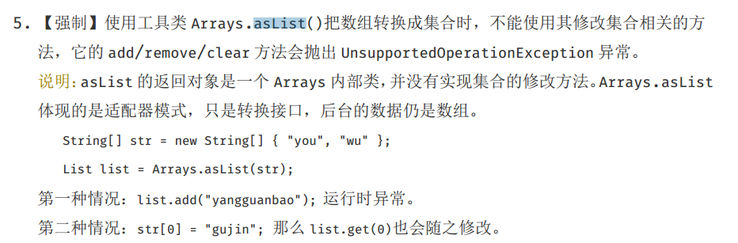

# List

> 继承了Collection接口


## ArrayList

> 实现了List接口的可扩容数组（动态数组），底层是`Object[]`数组
>
> 访问快，修改慢


### 特点

- ArrayList可实现所有的列表操作
- ArrayList提供了内部存储List的方法，能够完全替代Vector（已经淘汰）

> Vector类 是在 java 中可以实现自动增长的对象数组

- ArrayList线程不安全
- ArrayList扩容按照50%扩容


### 优缺点

优点：底层数组，随机访问，查的时候很快；顺序添加数据也很快。

缺点：删除操作效率较低，删除、插入数据会使用到复制操作，代价比较高、线程不安全


### 底层实现

1，实现了List接口,顺序存储
2，底层是Object数组【elementData 】实现
3，是线程不安全的
4，数组超过空间容量大小会进行扩容，扩大为原来的1.5倍


### 扩容机制

当容量不满足时，就会执行 【ensureCapacity】方法进行扩容

复制原来的旧元素进新的数组，这样的开销是巨大的，所以我们使用ArrayList时要注意避免

在实际添加大量元素前，我也可以使用【ensureCapacity】来手动增加ArrayList实例的容量，以减少递增式再分配的数量

源码流程

通过源码不难发现，ArrayList的扩容，就是确定好容量，在创建一个新数组复制过去

所以ArrayList的扩容代价是很大的，需要在初始化的时候就确定好

```java
/**
     * 增加这个 <tt>ArrayList</tt> 实例的容量，如果必要的，以确保它至少可以容纳元素的数量由最小容量参数指定。
     * 扩容第一步
     * @param   minCapacity   所需的最小容量
     */
public void ensureCapacity(int minCapacity) {
    // 如果不是默认元素表，则为任何大小
    // 大于默认空表的默认值。 它已经应该是默认大小
    int minExpand = (elementData != DEFAULTCAPACITY_EMPTY_ELEMENTDATA) ? 0 : DEFAULT_CAPACITY;
    if (minCapacity > minExpand) {
      ensureExplicitCapacity(minCapacity);
    }
}
```

-

```java
/**
     * 扩容第二步
     * @param minCapacity
     */
private void ensureExplicitCapacity(int minCapacity) {
    // 抽象父类的参数，用来记录此列表在结构上被修改的次数
    // 和迭代器中的快速失败有关
    modCount++;

    // overflow-conscious code
    // 如果最小的容量能装的下缓存中的数组，那么就扩容
    if (minCapacity - elementData.length > 0)
      grow(minCapacity);
}
```

-

```java
/**
     * 增加容量以确保它至少可以容纳由最小容量参数指定的元素数。
     * 扩容第三步
     * @param minCapacity the desired minimum capacity
     */
private void grow(int minCapacity) {
    // overflow-conscious code
    int oldCapacity = elementData.length;
    int newCapacity = oldCapacity + (oldCapacity >> 1);
    if (newCapacity - minCapacity < 0)
      newCapacity = minCapacity;
    if (newCapacity - MAX_ARRAY_SIZE > 0)
      newCapacity = hugeCapacity(minCapacity);
    // minCapacity 通常接近 size：
    elementData = Arrays.copyOf(elementData, newCapacity);
}
```


### Fail-Fast机制

通过记录modCount参数来实现

检测到 modCount！=expectedmodCount 这个条件。
如果集合发生变化时修改 modCount 值刚好又设置为了 expectedmodCount 值，则异常不会抛出。

不能依赖于这个异常是否抛出而进行并发操作的编程，这个异常只建议用于检测并发修改的 bug


####  Array和ArrayList有什么区别？

- 定义上：Array 可以包含基本类型和对象类型，ArrayList 只能包含对象类型。
- 容量上：Array 大小固定，ArrayList 的大小是动态变化的。
- 操作上：ArrayList 提供更多的方法和特性，如：addAll()，removeAll()，iterator()等等。
- 使用基本数据类型或者知道数据元素数量的时候可以考虑 Array;ArrayList 处理固定数量的基本类型数据类型时会自动装箱来减少编码工作量，但是相对较慢


#### 和Vector有什么异同点

1，Vector是线程同步的，也就是线程安全的，ArrayList线程不安全
2，扩容机制不一样，Vector扩容一倍，ArrayList扩容一半
3，都是基于数组的实现，但是Vector使用了synchronized，不考虑安全的情况下，ArrayList的效率更高

- 两者都是基于索引的，都是基于数组的。
- 两者都维护插入顺序，我们可以根据插入顺序来获取元素。
- ArrayList 和 Vector 的迭代器实现都是 fail-fast 的。
- ArrayList 和 Vector 两者允许 null 值，也可以使用索引值对元素进行随机访问。
- 不同点：Vector 是同步，线程安全，而 ArrayList 非同步（异步），线程不安全。对于 ArrayList，如果迭代时改变列表，应该使用 CopyOnWriteArrayList。
  但是，ArrayList 比 Vector 要快，它因为有同步，不会过载。
- 在使用上，ArrayList 更加通用，因为 Collections 工具类容易获取同步列表和只读列表。
- 扩容上，arraylist扩100%，而vector扩50%


#### 使用迭代器会出现什么问题？

并发修改的问题
Fail-Fast机制


#### 如何实现数组和List 之间的转换？

数组转 List：使用 Arrays. asList(array) 进行转换
List 转数组：使用 List 自带的 toArray() 方法


#### 多线程下如何使用

ArrayList 不 是 线 程 安 全 的 ， 如 果 遇 到 多 线 程 场 景 ， 可 以 通 过 Collections 的synchronizedList 方法将其转换成线程安全的容器后再使用

```java
List<String> synchronizedList = Collections.synchronizedList(list);
```

使用方式

```java
synchronized (synchronizedList) {
    Iterator i = list.iterator(); 
    while (i.hasNext())
    foo(i.next());
}
```


额外注意

`Arrays.asList()`将数组转换为集合后,底层其实还是数组



那么如何正确的创建`Arraylist`呢

1，java8的stream

```java
Integer [] myArray = { 1, 2, 3 };
List myList = Arrays.stream(myArray).collect(Collectors.toList());
//基本类型也可以实现转换（依赖boxed的装箱操作）
int [] myArray2 = { 1, 2, 3 };
List myList = Arrays.stream(myArray2).boxed().collect(Collectors.toList());
```

2，**使用 Guava**

```java
//对于不可变集合，你可以使用ImmutableList类及其of()与copyOf()工厂方法：（参数不能为空）
List<String> il = ImmutableList.of("string", "elements");  
List<String> il = ImmutableList.copyOf(aStringArray);  
//对于可变集合，你可以使用Lists类及其newArrayList()工厂方法：
List<String> l2 = Lists.newArrayList(aStringArray);              
List<String> l3 = Lists.newArrayList("or", "string", "elements"); 
```

3, **Java9 的 `List.of()`方法**

```java
Integer[] array = {1, 2, 3};
List<Integer> list = List.of(array);
System.out.println(list); /* [1, 2, 3] */
/* 不支持基本数据类型 */
```


## LinkedList

> LinkedList是一个双向链表，
>
> 双向链表 ( JDK1.6 之前为循环链表，JDK1.7 取消了循环 )
>
> 修改快，查询慢

- LinkedList线程不安全，要想安全使用同样需要进行外部加锁

```
List list = Collections.synchronizedList(new LinkedList(...))
```

- 允许存放任何元素（包括null）

基于双向链表实现，只能顺序访问，但是可以快速地在链表中间插入和删除元素。不仅如此，LinkedList 还可以用作栈、队列和双向队列


### 底层实现

1，继承了List接口和Deque接口，既可以看作一个顺序容器，又可以看作一个队列(*Queue*)，同时又可以看作一个栈(*Stack*)
2，维护了两个指针，first头指针，last尾指针
3，内部维护一个私有内部类Node，用作链表结点


#### Arraylist与LinkedList区别

- **线程安全：** `ArrayList` 和 `LinkedList` 都是不同步的，也就是不保证线程安全；

- **底层数据结构：**

  - `Arraylist` 底层使用的是 **`Object` 数组**
  - `LinkedList` 底层使用的是 **双向链表** 数据结构

- **插入和删除是否受元素位置的影响：** 

  - ① **`ArrayList` 采用数组存储，所以插入和删除元素的时间复杂度受元素位置的影响。**

    > 比如：执行`add(E e)`方法的时候， `ArrayList` 会默认在将指定的元素追加到此列表的末尾，这种情况时间复杂度就是 O(1)。
    >
    > 但是如果要在指定位置 i 插入和删除元素的话（`add(int index, E element)`）时间复杂度就为 O(n-i)
    >
    > 因为在进行上述操作的时候集合中第 i 和第 i 个元素之后的(n-i)个元素都要执行向后位/向前移一位的操作

  - ② **`LinkedList` 采用链表存储，所以对于`add()`方法的插入，删除元素时间复杂度不受元素位置的影响，近似 O(1)**

    > 如果是要在指定位置`i`插入和删除元素的话时间复杂度近似为`o(n))`因为需要先移动到指定位置再插入。

- **是否支持快速随机访问：** 

  - `LinkedList` 不支持高效的随机元素访问，而 `ArrayList` 支持。
  - 快速随机访问就是通过元素的序号快速获取元素对象(对应于`get(int index)`方法)。

- **内存空间占用：**

  - ArrayList 的空 间浪费主要体现在在 list 列表的结尾会预留一定的容量空间
  - 而 LinkedList 的空间花费则体现在它的每一个元素都需要消耗比 ArrayList 更多的空间（因为要存放直接后继和直接前驱以及数据）


## Vector

> Vector和ArrayList一样，基于数组实现
>
> 底层是`Object[]`数组

特点

- Vector是线程安全的，它对内部的每个方法都是暴力上锁，避免安全问题，开销大，效率低于ArrayList
- Vector扩容按照100%扩容


## Stack

> Stack继承了Vector类

第一次创建栈，不包含任何元素

一个更完善、可靠性更强的LIFO栈操作由Deque接口和他的实现提供，优先使用这个类

Java已不推荐使用Stack，而是推荐使用更高效的ArrayDeque

```java
Deque<Integer> stack = new ArrayDeque<Integer>()
```


### Vetor Arraylist Linkedlist 区别

ArrayList 就是动态数组，是 Array 的复杂版本，动态的增加和减少元素.当更多的元素加入到ArrayList 中时,其大小将会动态地增长。它的元素可以通过 get/set 方法直接访问，因为 ArrayList 本质上是一个数组。初始容量为 10。

1.插入元素的时候可能扩容，删除元素时不会缩小容量。

2.扩容增长为 Arraylist 增长原来的 0.5 倍 

3.而 Arraylist 没有设置增长空间的方法。

4.线程不同步Vector 和 ArrayList 类似, 区别在于 Vector 是同步类(synchronized). 因此,开销就比ArrayList 要大。初始容量为 10。实现了随机访问接口，可以随机访问。

Vector 是内部是以动态数组的形式来存储数据的。

1.Vector 还可以设置增长的空间大小，

2.及 Vector 增长原来的 1 倍

3.vector 线程同步

LinkedList 是一个双链表,在添加和删除元素时具有比 ArrayList 更好的性能.但在 get 与 set 方面弱于 ArrayList.当然,这些对比都是指数据量很大或者操作很频繁的情况下的对比。

它还实现了 Queue接口,该接口比 List 提供了更多的方法,包括 offer(),peek(),poll()等.
ArrayList 和 LinkedList 的使用场景，其中 add 方法的实现 ArrayList,LinkedList 的实现以及插入，查找，删除的过程

具体的分析划分为几点就是：

- 扩容的机制（包括扩容的方式，扩容的比例）
- 是否支持随机访问
- 增删改流程
- 线程是否安全
- 内存占用
- 底层数据结构

