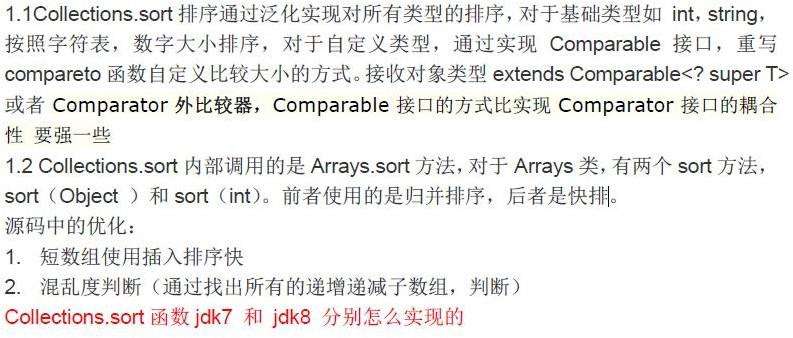

# List,Set,Map区别

> 这种感觉类似于时这几种数据结构间的比较，而不是单纯的指JAVA中的List/Set/Map

- `List`(对付顺序的好帮手)： 存储的元素是有序的、可重复的。
  - 一个有序（元素存入集合的顺序和取出的顺序一致）容器，元素可以重复，可以插入多个 null 元素，元素都有索引。常用的实现类有 ArrayList、LinkedList 和 Vector。

- `Set`(注重独一无二的性质): 存储的元素是无序的、不可重复的。
  - 一个无序（存入和取出顺序有可能不一致）容器，不可以存储重复元素，只允许存入一个 null 元素，必须保证元素唯一性。Set 接口常用实现类是 HashSet、LinkedHashSet以及 TreeSet。

- `Map`(用 Key 来搜索的专家): 使用键值对（kye-value）存储，Key 是无序的、不可重复的，value 是无序的、可重复的，每个键最多映射到一个值
  - Map 是一个键值对集合，存储键、值和之间的映射。 Key 无序，唯一；value 不要求有序，允许重复。Map 没有继承于 Collection 接口，从 Map 集合中检索元素时，只要给出键对象，就会返回对应的值对象。


# 集合类的整体架构，每个集合类型的特点以及底层构建

- 先说明有集合类的分类，有哪些集合类， 继承关系怎么样

JAVA中的容器中的顶层父类主要包括：map和collection

map的特点

collection往下又有几个集合类：list、set、queue

list中主要是有ArrayList、LinkedList，其特点

set的特点

queue的特点

- 每个类的集合类的特点是什么：比如list有序，可重复，set无序，不可重复
- 介绍迭代器，遍历集合的作用，以及需要注意修改的并发问题


# 哪些集合是线程安全的

1. `ConcurrentHashMap`: 可以看作是线程安全的 `HashMap`
2. `CopyOnWriteArrayList`:可以看作是线程安全的 `ArrayList`，在读多写少的场合性能非常好，远远好于 `Vector`.
3. `ConcurrentLinkedQueue`:高效的并发队列，使用链表实现。可以看做一个线程安全的 `LinkedList`，这是一个非阻塞队列。
4. `BlockingQueue`: 这是一个接口，JDK 内部通过链表、数组等方式实现了这个接口。表示阻塞队列，非常适合用于作为数据共享的通道。
5. `ConcurrentSkipListMap` :跳表的实现。这是一个`Map`，使用跳表的数据结构进行快速查找。
5. `Vector`
5. `Statck`（因为其继承了Vector）
5. `Hashtable`


# 怎么确保一个集合不能被修改？

```java
Collections. unmodifiableCollection(Collection c) 
```

来创建一个只读集合，这样改变集合的任何操作都会抛出 Java. lang. UnsupportedOperationException 异常

> 思考：
>
> 使得其不能被修改的原理是什么呢？


# 排序问题

Comparable和Comparator接口被用来对对象集合或者数组进行排序。

Comparable接口被用来提供对象的自然排序，可使用它来提供基于单个逻辑的排序。

Comparator接口被用来提供不同的排序算法，可根据制定字段选择需要使用的Comparator来对指定的对象集合进行排序


Comparable 接口：使用 Array 或 Collection 的排序方法时，自定义类需要实现 Java 提供Comparable 接口的 compareTo(TOBJ)方法，它被排序方法所使用，应该重写这个方法

如果“this”对象比传递的对象参数更小、相等或更大时，它返回一个负整数、0 或正整数。

==一般是用在要排序的对象===


使用 Comparator 接口的情景：在大多数实际情况下，我们想根据不同参数进行排序。

> 比如， 作为一个 CEO，我想对雇员基于薪资进行排序，同时年龄大的优先放在排序前面。

使用 Comparator 接口的情景。因为 Comparable.compareTo(Object o)方法实现只能基于一个字段进行排序，不能根据需要选择对象字段来对对象进行排序。


Comparator 接口：可以实现两个对象的特定字段的比较（比如，比较员工这个对象的年龄），该接口的 

> compare(Objecto1, Object o2）方法的实现需要传递两个对象参数
>
> 若第一个参数小于、等于、大于第二个参数，返回负整数、0、正整数


==一般是用在要排序的集合==


- `comparable` 接口实际上是出自`java.lang`包 它有一个 `compareTo(Object obj)`方法用来排序
- `comparator`接口实际上是出自 java.util 包它有一个`compare(Object obj1, Object obj2)`方法用来排序

定制排序

```java
// 定制排序的用法
Collections.sort(arrayList, new Comparator<Integer>() {
    @Override
    public int compare(Integer o1, Integer o2) {
        return o2.compareTo(o1);
    }
});


//也可以使用Lambda表达式
TreeMap<Person,String> treemap = new TreeMap<>((Person1,Person2)->{
    int num = person1.getAge() - person2.getAge();
  	return Integer.compare(num, 0);
});
//对比
TreeMap<Person, String> treeMap = new TreeMap<>(new Comparator<Person>() {
    @Override
    public int compare(Person person1, Person person2) {
        int num = person1.getAge() - person2.getAge();
        return Integer.compare(num, 0);
	}
});

/**
	*问题：为什么老师返回return 8 ，排序的结果不一样呢？
/

```

重写 compareTo 方法实现按年龄来排序

```java
// person对象没有实现Comparable接口，所以必须实现，这样才不会出错，才可以使treemap中的数据按顺序排列
// 前面一个例子的Integer类已经默认实现了Comparable接口，所以不需要另外实现了
public  class Person implements Comparable<Person> {
    private String name;
    private int age;

    /**
     * 重写compareTo方法实现按年龄来排序
     */
    @Override
    public int compareTo(Person o) {
        if (this.age > o.getAge()) {
            return 1;
        }
        if (this.age < o.getAge()) {
            return -1;
        }
        return 0;
    }
}
//在遍历封装了Person对象的集合时，会自动按照排序方式来排序
```


# 在集合遍历时要修改集合怎么做

有的集合时不能在遍历时修改集合属性的，会抛出异常

使用迭代器

Iterator 的特点是只能单向遍历，但是更加安全，因为它可以确保，在当前遍历的集合元素被更改的时候，就会抛出 ConcurrentModificationException 异常。


# 无序性和不可重复性

- 无序性不等于随机性 ，无序性是指存储的数据在底层数组中并非按照数组索引的顺序添加 ，而是根据数据的哈希值决定的
- 不可重复性是指添加的元素按照 equals()判断时 ，返回 false，需要同时重写 equals()方法和 HashCode()方法


# Collections.sort 内部原理

compareTo()方法，当插入元素时会回调该方法比较元素的大小。


TreeMap 要求存放的键值对映射的键必须实现 Comparable 接口从而根据键对元素进行排序


Collections 工具类的 sort 方法有两种重载的形式

第一种要求传入的待排序容器中存放的对象比较实现 Comparable 接口以实现元素的比较；
第二种不强制性的要求容器中的元素必须可比较，但是要求传入第二个参数，参数是Comparator 接口的子类型（需要重写 compare 方法实现元素的比较），相当于一个临时定义的排序规则，其实就是通过接口注入比较元素大小的算法，也是对回调模式的应用。





# **Iterator 和 ListIterator 的区别是什么？**

Iterator 可用来遍历 Set 和 List 集合，但是 ListIterator 只能用来遍历 List。

Iterator 对集合只能是向后遍历，ListIterator 既可以前向也可以后向。

ListIterator 实现了 Iterator 接口，并包含其他的功能，比如：增加元素，替换元素，获取前一个和后一个元素的索引，等等。


# **快速失败(fail-fast)和安全失败(fail-safe)的区别是什么？**

Iterator 的安全失败是基于对底层集合做拷贝，因此，它不受源集合上修改的影响 。

java.util包下 面的 所有的 集合 类都 是快速 失败 的， 

而java.util.concurrent 包下面的所有的类都是安全失败的。

快速失败的迭代器会抛出 ConcurrentModificationException 异常，而安全失败的迭代器永远不会抛出这样的异常。


# **Enumeration 接口和 Iterator 接口的区别有哪些？**

Enumeration 速度是 Iterator 的 2 倍，同时占用更少的内存。

但是， Iterator 远远比Enumeration 安全， 因为其他线程不能够修改正在被iterator 遍历的集合里面的对象。

同时，Iterator 允许调用者删除底层集合里面的元素，这对 Enumeration 来说是不可能的。


# **使用 ArrayList 的迭代器会出现什么问题？**

> 需要代码实现

迭代器 next 方法用于返回当前的元素，并把指针指向下一个元素，值得注意的是，每次使用next 方法的时候，都会判断创建迭代器获取的这个容器的计数器 modCount 是否与此时 的 不 相等 ， 不 相 等 说 明 集 合 的 大 小 被 修 改 过 ， 如 果 是 会 抛 出ConcurrentModificationException 异常，如果相等调用 get 方法返回元素即可


# **说一下：集合框架底层数据结构**

List
Arraylist： Object 数组

Vector： Object 数组

LinkedList： 双向循环链表（1.8版本前后的区别）


Set
HashSet：基于 HashMap 实现的

LinkedHashSet ： LinkedHashSet 继 承 与 HashSet ， 并 且 其 内 部 是 通 过LinkedHashMap 来实现的。

TreeSet： 红黑树(自平衡的排序二叉树。


Map
HashMap： JDK1.8 之前 HashMap 由数组+链表组成的，数组是 HashMap 的主体，JDK1.8 以后在解决哈希冲突时有了较大的变化，当链表长度大于阈值时，将链表转化为红黑树，以减少搜索时间

LinkedHashMap：LinkedHashMap 继承自 HashMap，所以它的底层仍然是基于拉链式散列结构即由数组和链表或红黑树组成。另外，LinkedHashMap 在上面结构的基础上，增加了一条双向链表，使得上面的结构可以保持键值对的插入顺序。同时通过对链表进行相应的操作，实现了访问顺序相关逻辑。

HashTable： 数组+链表组成的，数组是 HashMap 的主体，链表则是主要为了解决哈希冲突而存在的

TreeMap： 红黑树（自平衡的排序二叉树）


# **怎么确保一个集合不能被修改？**

可以使用 Collections. unmodifiableCollection(Collection c) 方法来创建一个只读集合，这样改变集合的任何操作都会抛出 Java. lang. UnsupportedOperationException 异常


```java
List<String> list = new ArrayList<>();
list. add("x");
Collection<String> clist = Collections. unmodifiableCollection(list);
clist. add("y"); // 运行时此行报错
```


