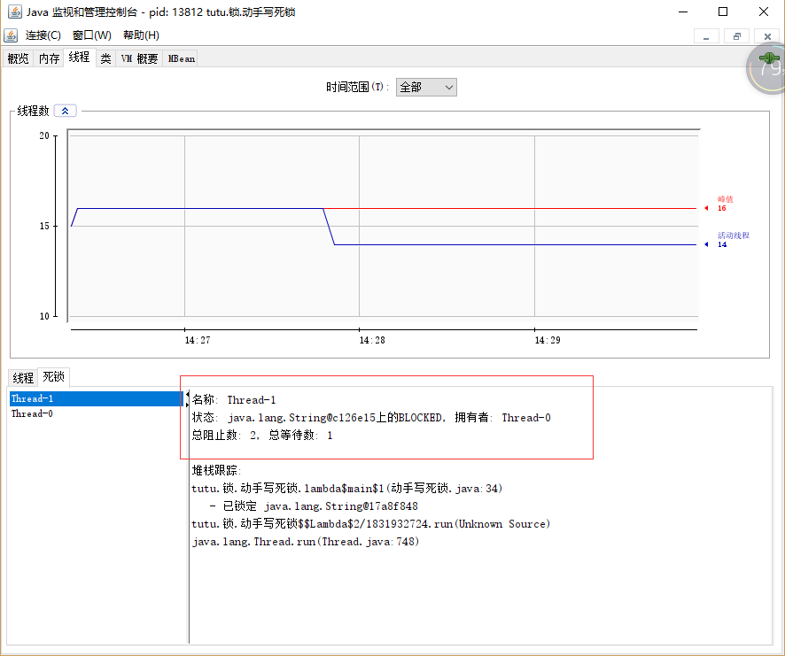
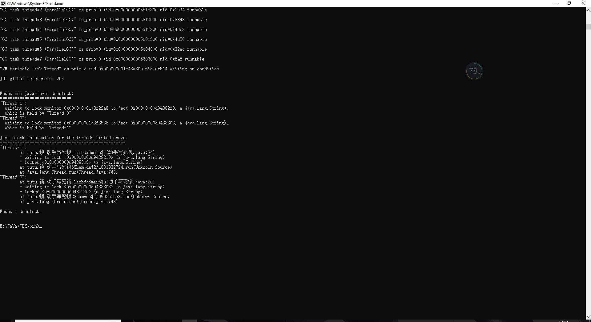

# JAVA面试


## 1，Exception和Error有什么区别？

虽然 Exception 和 Error 都继承于 Throwable，但两者有本质区别

Error 类

是指 java 运行时系统的内部错误和资源耗尽错误。应用程序不会抛出该类对象。如果出现了这样的错误，除了告知用户，剩下的就是尽力使程序安全的终止。

Exception 类

分为可检查（checked）异常和不检查（unchecked）异常【即运行时异常】，可检查异常在源代码里必须显式地进行捕获处理，这是编译期检查的一部分，不进行捕获就无法编译


## 2，谈谈final、finally、 finalize有什么不同？

final

是关键字，可以用来修饰方法，变量，参数，类，所修饰的变量，被修饰的对象不可变。

finally

是一个语法糖，配合try-catch使用，不论是否发生异常，都会执行，同时这里也涉及return的语句执行问题，rry语句中的有return，那么会在方法返回之前执行finally语句，如果finally中也有return，那么会替换try中的return结果

finalize

finalize是在垃圾回收器准备回收对象内存时，调用来清理一些特殊的内存，当然存在特例，就是该对象可能重新被引用，也就是复活，但finalize只会执行一次，防止无线复活，抛开特例不讲，在调用finalize进行一些清除操作后，在下一次的垃圾回收时，就会真正释放对象占用的内存空间。

> JNI(Java Native Interface)调用non-Java 程序（C 或 C++），finalize()的工作就是回收这部分的内存


## 3，强引用，弱引用，虚引用，软引用的区别是什么？

对于这些引用，没有怎么直接使用过，缺少对应的实践经验，但理解其理论知识

强引用也就是使用new关键字创建的，只要被强引用，就不能会垃圾回收

弱引用不同，只能挺到下一次的垃圾回收

虚引用，一个对象是否有虚引用，不会有什么影响，最多在垃圾回收时收到一个系统通知

软引用就是只会在内存不足时，才会被回收


## 4，String、StringBuffer、StringBuilder的区别？

1，都是被final修饰，不能被继承


2，长度可变问题

String的长度是不可变的，String底层是一个final类型的字符数组，所以String的值是不可变的，每次对String的操作都会生成新的String对象，造成内存浪费

```java
private final char value[];
```

StringBuffer、StringBuilder的长度可变

```java
char[] value; // 继承了AbstractStringBuilder，底层都是可变的字符数组
```

在看看为什么是可变的，在append方法中有个：ensureCapacityInternal 方法，将原来的char数组扩容，并且复制之前的元素进新的数组

```java
private void ensureCapacityInternal(int minimumCapacity) {
    if (minimumCapacity - value.length > 0) {
        value = Arrays.copyOf(value,
                newCapacity(minimumCapacity));
    }
}
```

3，StringBuffer是线程安全的，StringBuilder则是线程不安全的，并不是他们的代码有所改变，而是StringBuffer在方法上添加了Synchronized，保证线程安全

4，StringBuilder有更好的性能，没有了锁机制，不会有阻塞，但是有安全问题


## 5，动态代理是基于什么原理？

动态代理是基于反射实现的

> 回答不全


## 6，Int和Integer的区别？

1，Int是基本数据类型，Integer是类

2，Integer需要实例化，而int可以直接使用

3，Integer实际是对象的引用，当new一个Integer时，实际上是生成一个指针指向此对象；而int则是直接存储数据值 

4，Integer的初始值是null，int的初始值是0

5，在使用==判断相等时，Integer会对-127~128进行缓存，是直接比值，超出范围是比地址


## 7，对比Vector、ArrayList、LinkedList的区别？

1，底层实现

Vector和ArrayList的底层是基于数组实现的，而LinkedList是一个双向链表，维护了头尾两指针

2，添加删除操作，效率问题

对于添加删除的操作，Vector和ArrayList的底层是基于数组的，所以效率很低，需要移动大量元素，但支持随机查找，查询效率高

相反，LinkedList基于链表的特性石特添加删除很快，但是对于查询而言效率偏低，

3，安全问题

ArrayList、LinkedList是线程不安全的，Vector是线程安全的。

ArrayList有一个快速失败机制，并发修改集合时会报错，但这不是保证线程安全，而是提示该集合是不安全的BUG

Vector方法中使用了Synchronized，因此是线程安全的

4，扩容机制

ArrayList是扩容一半，而Vector则是成倍扩容，扩容方式是创建新的数组，将原数组元素复制

5，内存占用

LinkedList内部维护的一个个的结点，因此内存占用更多


## 8，对比HashTable、HashMap、TreeMap有什么区别？

1，底层实现

2，扩容机制

3，安全


## 9，如何保证线程安全？

1，互斥同步

Synchronized的使用，以及JDK自带的锁机制

2，非阻塞同步

CAS，原子类

3，不同步实现线程安全

ThreadLocal，可重入代码的使用

> 可重入代码指可被多个函数或程序调用的一段代码(通常是一个函数,而且它保证在被任何一个函数调用时都以同样的方式运行


## 10，ConcurrentHashMap是如何实现线程安全的？

这得分2个版本，1.7以前和之后的版本

之前

是通过Segment数组来实现线程安全的，ConcurrentHashMap内部维护了一个Segment数组，每一个Segment元素对应着一个类似于HashTable，实现线程安全就是对该segment数组进行加锁，其他线程需要访问segment数组元素则会被阻塞。

之后

ConcurrentHashMap的内部结构发生了很大的变化，总的来说是数组+链表+红黑树，锁是由CAS+Synchronized实现

线程安全的实现方式是，通过CAS修改状态值，从而拿到锁，在通过Synchronized加锁，进行操作，并不会因为Synchronized而影响效率，因为1.8之后对Synchronized进行了一些锁优化


## 11，JAVA提供了哪些IO方式？NIO如何实现多路复用？

AIO BIO NIO

首先所接触的就是java.io中提供的一些io实现，文件，输入输出流之类的，也就是BIO，java.nio包下引入了NIO框架

IO 不仅仅是对文件的操作，网络编程中，比如 Socket 通信，都是典型的 IO 操作目标。


其实现要点是：

- 服务器端启动 ServerSocket，端口 0 表示自动绑定一个空闲端口。
- 调用 accept 方法，阻塞等待客户端连接。
- 利用 Socket 模拟了一个简单的客户端，只进行连接、读取、打印。
- 当连接建立后，启动一个单独线程负责回复客户端请求。


> 扩展：零拷贝问题


## 12，JAVA有哪几种文件拷贝方式？哪一种最高效？


## 13，接口和抽象类的区别？

1，抽象类可以有非抽象方法，接口能有方法的声明，没有方法体

2，抽象类中可以有普通的属性，而接口只能有常量

3，接口可以实现多继承，抽象类只能单继承，

4，抽象类中的抽象方法，需要有子类实现，如果子类不实现，则子类也需要定义为抽象的。接口必须全部实现


## 14，谈谈设计模式？

1，7大原则

2，哪些地方用到了设计模式


## 15，Synchronized和ReentrantLock有什么区别？

- synchronized 竞争锁时会一直等待；ReentrantLock 可以尝试获取锁，并得到获取结果
- synchronized 获取锁无法设置超时；ReentrantLock 可以设置获取锁的超时时间
- 锁类型
  - synchronized 无法实现公平锁，属于可重入的独占锁；ReentrantLock 可以满足公平锁，也可以实现飞公平锁
  - 实现的原理就是ReentrantLock的两个内部类：NonfairSync（非公平锁）和FairSync（公平锁）
- 等待唤醒
  - synchronized 控制等待和唤醒需要结合加锁对象的 wait 和 notify ；
  - ReentrantLock 控制等待和唤醒需要结合 Condition 的 await  和 signal 、signalAll 方法
- 实现
  - synchronized 是 JVM 层面实现的
  - ReentrantLock 是 JDK 代码层面实现
- 锁的释放
  - synchronized 在加锁代码块执行完或者出现异常，自动释放锁
  - ReentrantLock 不会自动释放锁，需要在 finally{} 代码块显示释放

## 16，synchronized底层如何实现？什么是锁的升级、降级？


## 17，一个线程两次调用start()方法会出现什么情况？

```java
public class 线程启动两次 {
    public static void main(String[] args) {
        Thread t1 = new Thread(()->{
            System.out.println("?");
        });
        t1.start();
        t1.start();
    }
}
```

报错信息

> Exception in thread "main" java.lang.IllegalThreadStateException
> 	at java.lang.Thread.start(Thread.java:708)
> 	at tutu.线程启动两次.main(线程启动两次.java:13)

==这个题目涉及的考点是线程的生命周期和状态转移==

> IllegalThreadStateException 是运行时异常

Java的线程是不允许启动两次的，第二次调用必然会抛出IllegalThreadStateException，这是一种运行时异常，多次调用start被认为是编程错误。

关于线程生命周期的不同状态，在Java 5以后，线程状态被明确定义在其公共内部枚举类型java.lang.Thread.State中，分别是：

- 新建（NEW），表示线程被创建出来还没真正启动的状态，可以认为它是个Java内部状态。
- 就绪（RUNNABLE），表示该线程已经在JVM中执行，当然由于执行需要计算资源，它可能是正在运行，也可能还在等待系统分配给它CPU片段，在就绪队列里面排队。 在其他一些分析中，会额外区分一种状态RUNNING，但是从Java API的角度，并不能表示出来。
- 阻塞（BLOCKED），这个状态和我们前面两讲介绍的同步非常相关，阻塞表示线程在等待Monitor lock。比如，线程试图通过synchronized去获取某个锁，但是其他线程已经独占了，那么当前线程就会处于阻塞状态。
- 等待（WAITING），表示正在等待其他线程采取某些操作。一个常见的场景是类似生产者消费者模式，发现任务条件尚未满足，就让当前消费者线程等待（wait），另外的生产者线程去准备任务数据，然后通过类似notify等动作，通知消费线程可以继续工作了。Thread.join()也会令线程进入等待状态。
- 计时等待（TIMED_WAIT），其进入条件和等待状态类似，但是调用的是存在超时条件的方法，比如wait或join等方法的指定超时版本，如下面示例：
  public final native void wait(long timeout) throws InterruptedException;
- 终止（TERMINATED），不管是意外退出还是正常执行结束，线程已经完成使命，终止运行，也有人把这个状态叫作死亡。


**在第二次调用start()方法的时候，线程可能处于终止或者其他（非NEW）状态，但是不论如何，都是不可以再次启动的**

面试官可能会以此为契机，从各种不同角度考察你对线程的掌握：

- 相对理论一些的面试官可以会问你线程到底是什么以及Java底层实现方式？
- 线程状态的切换，以及和锁等并发工具类的互动？
- 线程编程时容易踩的坑与建议等？


## 18，什么情况下Java程序会产生死锁？如何定位、修复？

==第一问的开点涉及到死锁的产生条件，java中死锁的产生==

==如何定位、修复就是涉及到锁的检测，解除==

不能只了解这几点，还有死锁的预防，什么是死锁，如何写一个死锁等

死锁的产生条件就是多个线程去竞争资源而导致的相互阻塞的状态，没有外力干扰就会一直等待。大多是聚焦在多线程场景中的死锁，指两个或多个线程之间，由于互相持有对方需要的锁，而永久处于阻塞的状态。

在java中就体现在使用synchronized对资源加锁时产生死锁

```java
public static void main(String[] args) {
    new Thread(()->{
        synchronized (l1){
            System.out.println("T1拿到l1");
            try {
                Thread.sleep(2000);
            } catch (InterruptedException e) {
                e.printStackTrace();
            }
            synchronized (l2){
                System.out.println("T1拿到l2");
            }
        }
    }).start();

    new Thread(()->{
        synchronized (l2){
            System.out.println("T2拿到l2");
            try {
                Thread.sleep(2000);
            } catch (InterruptedException e) {
                e.printStackTrace();
            }
            synchronized (l1){
                System.out.println("T1拿到l1");
            }
        }
    }).start();
}
```

java中对于死锁的检测可以使用jdk自带的工具：jconsole



可以看到Thread-1 需要的在 Thread-0 手上，导致死锁


同时可以使用 jstack + 线程id 查看



那么如何修复呢？

如果程序运行时发生了死锁，绝大多数情况下都是无法在线解决的，只能重启，修正程序本身问题。所以，代码开发阶段互相审查，或者利用工具进行预防性

查，往往也是很重要的。


## 19，Java并发包提供了哪些并发工具类？


## 20，并发包中的ConcurrentLinkedQueue和LinkedBlockingQueue有什么区别？

边界问题

ConcurrentLinkedQueue是一个无边界的线程安全队列

LinkedBlockingQueue是一个有边界的线程安全队列

> 其初始化的方法里就维护了一个初始化的容量

是否阻塞

ConcurrentLinkedQueue是非阻塞的，通过CAS来保证线程安全

LinkedBlockingQueue维护两个ReentrantLock变量，lock方法实现阻塞

SIZE的准确性

ConcurrentLinkedQueue通过CAS保证线程安全的，是不阻塞的，size是随时可变的

LinkedBlockingQueue是阻塞的，所以只会有一个线程会对Size进行修改，size的值更加精准。


## 21，Java并发类库提供的线程池有哪几种？ 分别有什么特点？

Executors 目前提供了 5 种不同的线程池创建配置：

- newCachedThreadPool
  - 它是一种用来处理大量短时间工作任务的线程池，具有几个鲜明特点：它会试图缓存线程并重用，当无缓存线程可用时，就会创建新的工作线程；
  - 如果线程闲置的时间超过 60 秒，则被终止并移出缓存
  - 长时间闲置时，这种线程池，不会消耗什么资源
  - 其内部使用 SynchronousQueue 作为工作队列
- newFixedThreadPool(int nThreads)
  - 重用指定数目（nThreads）的线程，其背后使用的是无界的工作队列，任何时候最多有 nThreads 个工作线程是活动的
  - 这意味着，如果任务数量超过了活动队列数目，将在工作队列中等待空闲线程出现
  - 如果有工作线程退出，将会有新的工作线程被创建，以补足指定的数目 nThreads

- newSingleThreadExecutor
  - 它的特点在于工作线程数目被限制为 1，操作一个无界的工作队列，所以它保证了所有任务的都是被顺序执行，最多会有一个任务处于活动状态，并且不允许使用者改动线程池实例，因此可以避免其改变线程数目。

- newSingleThreadScheduledExecutor() 和 newScheduledThreadPool(int corePoolSize)，
  - 创建的是个 ScheduledExecutorService，可以进行定时或周期性的工作调度，区别在于单一工作线程还是多个工作线程

- newWorkStealingPool(int parallelism)
  - 这是一个经常被人忽略的线程池，Java 8 才加入这个创建方法，其内部会构建ForkJoinPool，利用Work-Stealing算法，并行地处理任务，不保证处理顺序


拓展知识点就是

- Executor 框架的组成源码
- 几个线程池是怎么实现的？


## 22，AtomicInteger底层实现原理是什么？如何在自己的产品代码中应用CAS操作？

很多时候都是通过AtomicInteger来理解CAS，所以其底层的原理就是CAS操作，提供了原子性的访问和更新操作，内部封装了Unsafe类调用对应的CAS方法

> CAS理解起来就是类似于乐观锁
>
> 首先比较当前数值，数值没有改变，那就证明没有并发修改，则更新成功

内部维护了一个 volatile 字段，保证可见性，也是通过这个字段来保存值

```java
private volatile int value;
```


### 23，请介绍类加载过程，什么是双亲委派模型？

1，首先是类加载的概念

类加载就是JVM将Class文件加载进内存，并对数据进行一些列操作转换为JVM可直接使用的java类型

同时注意，类加载不是在类要使用时才会加载，JVM允许某些类预先加载，这需要配置

2，类加载的过程

（1）加载

通过全限定类名加载二进制流进内存，将这个字节流所代表的静态存储结构转化为方法区的运行时数据结构，在内存中生成一个代表这个类的java.lang.Class对象，作为方法区这个类的各种数据的访问入口

> 静态存储结构也就是 类信息，常量，静态变量

> 方法区存放其Class对象引用

这里有点迷糊了，到底是放在堆中呢，还是放在方法区

（2）连接

1，验证

验证结构是否正确

2，准备

为静态变量分配内存，并默认初始值

3，解析

符号引用转为直接引用

（3）初始化

类初始化是类加载的最后一步，除了加载阶段，用户可以通过自定义的类加载器参与，其他阶段都完全由虚拟机主导和控制。

主要工作：为静态变量赋程序设定的初值

（4）使用

（5）卸载 

3，类加载器

刚刚所讲的流程，都是由类加载器完成的

JAVA中的类加载有2种，引导类加载器和用户自定义加载器

> 分类的方式有很多，这里只是个人认为的分类方式

再分细一点就是

（1）BootstrapClassLoader

启动类加载器，只加载包名为java、javax、sun等开头的类，加载java的核心类

（2）ExtensionClassLoader

扩展类加载器，从java.ext.dirs系统属性所指定的目录中加载类库，或从JDK的安装目录的jre/lib/ext子目录（扩展目录）下加载类库。

（3）SystemClassLoader

系统类加载器，一般来说，JAVA应用的类都是有系统类加载器加载

> 其不是父子关系，是一种层级关系

4，双亲委派机制

类加载器的一个加载流程

5，沙箱安全机制

6，如何自定义类加载器

7，如何破坏双亲委派机制

这个只记得分版本讨论，以前的版本是需要继承ClassLoader，并实现很多方法的

现在只需要继承ClassLoader（或者URIClassLoader），重写loaderClass方法

### 24，有哪些方法可以在运行时动态生成一个Java类？

运行时动态生成也就是说的反射生成类对象

### 25，谈谈JVM内存区域的划分，哪些区域可能发生OutOfMemoryError?

堆，大小不合理

方法区，元空间，

虚拟机栈和本地方法栈：不断的压栈操作，会抛出StackOverFlowError，在JVM试图扩展时，就会有OOM异常

### 26，如何监控和诊断JVM堆内和堆外内存使用？

### 27，Java常见的垃圾收集器有哪些？

### 28，谈谈你的GC调优思路?

### 29，Java内存模型中的happen-before是什么？

A happens-before B,定义1要求A执行结果对B可见，并且A操作的执行顺序在B操作之前，但与此同时利用定义中的第二条，A,B操作彼此不存在数据依赖性，两个操作的执行顺序对最终结果都不会产生影响，在不改变最终结果的前提下，允许A，B两个操作重排序，即happens-before关系并不代表了最终的执行顺序。


### 30，Java程序运行在Docker等容器环境有哪些新问题？

### 31，你了解Java应用开发中的注入攻击吗？

### 32，如何写出安全的Java代码？

1，使用安全的类

2，加锁

3，

### 33，后台服务出现明显“变慢”，谈谈你的诊断思路？

1，


### 34，有人说“Lambda能让Java程序慢30倍”，你怎么看？

### 35，JVM优化Java代码时都做了什么？

### 36，谈谈MySQL支持的事务隔离级别，以及悲观锁和乐观锁的原理和应用场景？

事务的隔离界别：未提交读，可重复读，提交读，可串行化

会有一些并发的一致性问题：脏读，幻读，不可重复度，丢失修改

### 37，谈谈Spring Bean的生命周期和作用域？

### 38，对比Java标准NIO类库，你知道Netty是如何实现更高性能的吗？

### 39，谈谈常用的分布式ID的设计方案？Snowflake是否受冬令时切换影响？


