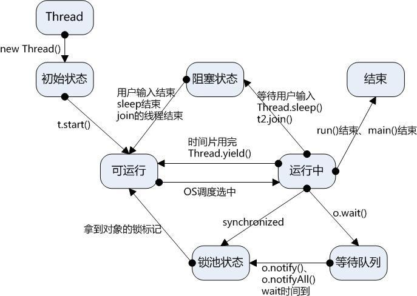
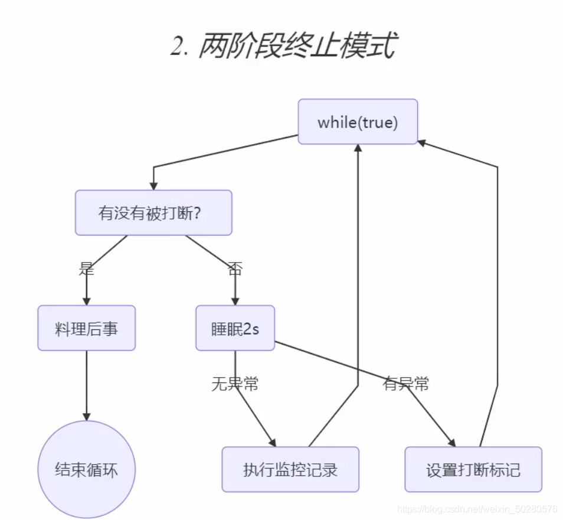
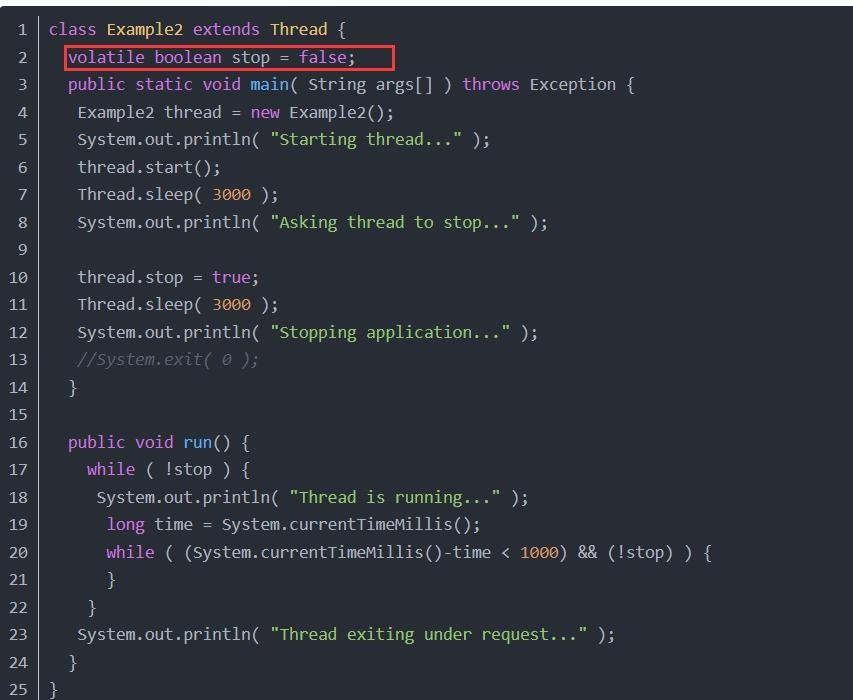
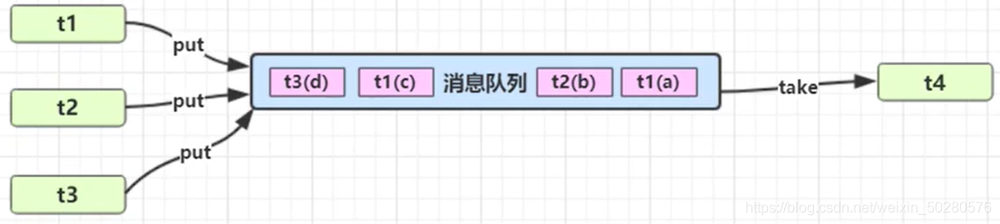
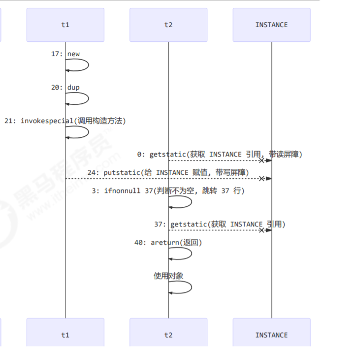
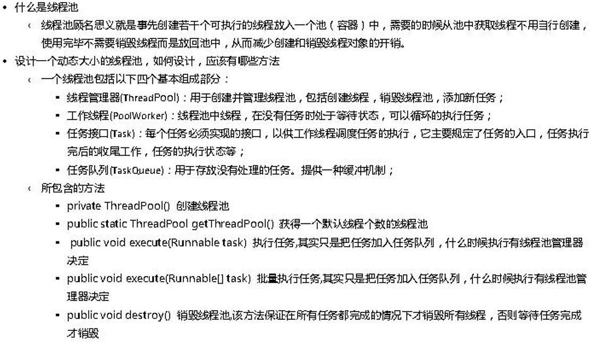

# 线程的创建方式

（1）直接使用`Thread`

```java
Thread t1 = new Thread("t1") {
    @Override
    // run 方法内实现了要执行的任务
    public void run() {
    
    }
};
t1.start();

// 或者继承Thread
Class myThread extend Thread{}
```

（2）使用`Runable`

```java
// 创建任务对象
Runnable task2 = new Runnable() {
    @Override
    public void run() {
    
    }
};
// 参数1 是任务对象; 参数2 是线程名字，推荐给线程起个名字
Thread t2 = new Thread(task2, "t2");
t2.start();

// 或者实现Runable接口
Class myThread implements Runable{}
```

`Runable`和 `Thread`的关系（区别）

> 用 Runable 让任务类脱离了 Thread 继承体系，更灵活  
>
> Runable适合多个相同的程序代码的线程去处理同一个资源
>
> runnable 是轻量级的对象，重复 new 不会耗费太大资源，而 Thread 则不然，它是重量级对象，而且线程执行完就完了，无法再次利用

start 方法主要是调用本地c++库中的navit 方法

（3）`FutureTask `： Callable 接口

```java
public static void main(String[] args) throws ExecutionException, InterruptedException {
    // 可以返回数据
    FutureTask futureTask = new FutureTask<>(new Callable<Integer>() {
    @Override
    public Integer call() throws Exception {
        log.debug("多线程任务");
        Thread.sleep(100);
        return 100;
    }
    });
    // 主线程阻塞，同步等待 task 执行完毕的结果
    new Thread(futureTask,"我的名字").start();
    log.debug("主线程");
    log.debug("{}",futureTask.get());
}

// 或者继承Callable接口
```


# 为什么要有多线程？

多线程的引入，是为了平衡速度的差异

操作系统增加了进程、线程，以分时复用 CPU，进而均衡 CPU 与 I/O 设备的速度差异

引入多线程还可以充分的利用CPU执行快的特点，并行执行任务

某些任务需要长时间执行的时候（比如IO），CPU不能去等待其执行，造成资源的浪费。


# 并发的三大问题

1，可见性：一个线程对共享变量的修改，另外一个线程能够立刻看到

缓存所带来的问题

例子：程序执行拿到某个变量的值后对其进行修改后，放入了CPU的缓存中，但是没有立即放入到内存中。另一个线程此时获取变量的值，但是拿到的却是修改之前的数值，这边是可见性的问题。

2，原子性：即一个操作或者多个操作 要么全部执行并且执行的过程不会被任何因素打断，要么就都不执行。

分时复用带来的问题

例子：i++，由于CPU分时复用（**线程切换**）的存在，线程1执行了第一条指令后，就切换到线程2执行，假如线程2执行了这三条指令后，再切换会线程1执行后续两条指令，将造成最后写到内存中的i值是2而不是3。

3，有序性：程序执行的顺序需要按照代码的先后顺序执行

指令重排带来的问题

即虽然多线程存在并发和指令优化等操作，在本线程内观察该线程的所有执行操作是有序的。


# 二，线程运行

## 栈与栈帧

每当线程运行启动时，jvm虚拟机会给线程分配一块栈内存

- 每个栈由多个栈帧（Frame）组成，对应着每次方法调用时所占用的内存  
- 每个线程只能有一个活动栈帧，对应着当前正在执行的那个方法


## 上下文切换

线程执行时会发生一些事情，导致cpu不在执行当前线程，从而导致线程的切换

- 时间片用完
- 垃圾回收
- 更高级的线程抢占
- 线程自己调用了相关的方法，主动挂起

> 当上下文切换（Context Switch）时，操作系统会保留当前线程的状态，频繁的上下文切换会影响性能
>
> 状态包括程序计数器、虚拟机栈中每个栈帧的信息，如局部变量、操作数栈、返回地址等  


## 线程优先级

- 线程优先级会提示（hint）调度器优先调度该线程，但它仅仅是一个提示，调度器可以忽略它
- 如果 `cpu `比较忙，那么优先级高的线程会获得更多的时间片，但` cpu` 闲时，优先级几乎没作用  
- 简单来说优先级不能控制线程的执行顺序，仅仅是提示

设置优先级

```java
Thread t1 = new Thead(new Runable(),"t1");
t1.setPriority(1-10);
```


## 常用方法

| 方法名           | Static | 功能                                                         | 备注                                                         |
| ---------------- | ------ | ------------------------------------------------------------ | ------------------------------------------------------------ |
| start            |        | 启动一个新线程                                               | start 方法只是让线程进入就绪状态，里面代码不一定立刻运行，只有当 CPU 将时间片分给线程时，才能进入运行状态，执行代码。<br />每个线程的 start 方法只能调用一次，调用多次就会出现 IllegalThreadStateException |
| run              |        | 新线程启动会调用的方法                                       | 如果在构造 Thread 对象时传递了 Runnable 参数，则线程启动后会调用 Runnable 中的 run 方法，否则默认不执行任何操作。<br />但可以创建 Thread 的子类对象，来覆盖默认行为 |
| join             |        | 等待线程运行结束                                             |                                                              |
| join(long n)     |        | 等待线程运行结束,最多等待 n 毫秒                             |                                                              |
| getId            |        | 获取线程长整型的 id，id唯一                                  |                                                              |
| getName          |        | 获取线程名                                                   |                                                              |
| setName(String)  |        | 修改线程名                                                   |                                                              |
| getPriority      |        | 获取线程优先级                                               |                                                              |
| setPriority(int) |        | 修改线程优先级                                               | java中规定线程优先级是1~10 的整数，较大的优先级能提高该线程被 CPU 调度的机率 |
| getState         |        | 获取线程状态                                                 | Java 中线程状态是用 6 个 enum 表示<br />分别为：NEW, RUNNABLE, BLOCKED, WAITING, TIMED_WAITING, TERMINATED |
| isInterrupted    |        | 判断是否被打断                                               | 不会清除 打断标记                                            |
| isAlive          |        | 线程是否存活（还没有运行完毕）                               |                                                              |
| interrupt        |        | 打断线程                                                     | 如果被打断线程正在 sleep，wait，join 会导致被打断的线程抛出 InterruptedException，并清除 打断标记 ；如果打断的正在运行的线程，则会设置 打断标记，park 的线程被打断，也会设置 打断标记 |
| interrupted      | static | 判断当前线程是否被打断                                       | 会清除 打断标记                                              |
| currentThread    | static | 获取当前正在执行的线程                                       |                                                              |
| sleep(long n)    | static | 让当前执行的线程休眠n毫秒，休眠时让出 cpu 的时间片给其它线程 |                                                              |
| yield()          | static | 提示线程调度器让出当前线程对CPU的使用                        | 主要是为了测试和调试                                         |

---


## 线程状态



### 阻塞

等待阻塞：运行的线程执行 wait()方法，JVM 会把该线程放入等待池中。(wait 会释放持有的锁)

同步阻塞：运行的线程在获取对象的同步锁时，若该同步锁被别的线程占用， 则 JVM会把该线程放入锁池中。

其他阻塞：运行的线程执行 sleep()或 join()方法，或者发出了 I/O 请求时，JVM 会把该线程置为阻塞状态。

当 sleep()状态超时、join()等待线程终止或者超时、或者 I/O 处理完毕时，线程重新转入就绪状态。

> sleep 是不会释放持有的锁


## sleep 与 yield  

sleep

1. 调用 sleep 会让当前线程从 *Running* 进入 *Timed Waiting* 状态（阻塞）
2. 其它线程可以使用 interrupt 方法打断正在睡眠的线程，这时 sleep 方法会抛出 `InterruptedException`
3. 睡眠结束后的线程未必会立刻得到执行，重新进入到就绪状态
4. 建议用 `TimeUnit` 的 sleep 代替 Thread 的 sleep 来获得更好的可读  

```java
//对Thread.sleep方法的包装，实现是一样的，只是多了时间单位转换和验证
public void sleep(long timeout) throws InterruptedException {
    if (timeout > 0) {
        long ms = toMillis(timeout);
        int ns = excessNanos(timeout, ms);
        Thread.sleep(ms, ns);
    }
}
```


yield

1. 调用 yield 会让当前线程从 *Running* 进入 *Runnable* 就绪状态，然后调度执行其它线程，让当前运行线程回到可运行状态
2. 暂停当前正在执行的线程对象(及放弃当前拥有的cup资源), 并执行其他线程
3. 具体的实现依赖于操作系统的任务调度器  


## wait与Notify

- 调用wait方法后，线程会进入WaitSet中，变为Waiting状态

  > 这里要注意
  >
  > waiting和bocked状态都是阻塞状态，cpu不会分配时间片给该线程
  >
  > 但两者还是有区别的
  >
  > 1，BLOCKED 线程是在竞争对象时，发现 Monitor 的 Owner 已经是别的线程了，此时就会进入 EntryList 中，并处于 BLOCKED 状态
  > 2，WAITING 线程是获得了对象的锁，但是自身因为某些原因需要进入阻塞状态时，锁对象调用了 wait 方法而进入了 WaitSet 中，处于 WAITING 状态3，BLOCKED 线程会在锁被释放的时候被唤醒，但是处于 WAITING 状态的线程只有被锁对象调用了 notify 方法，才会被唤醒


- 只有线程获取了锁，才能调用wait 和 notify 方法

会报错

```java
// 非法监视
Exception in thread "main" java.lang.IllegalMonitorStateException
	at java.lang.Object.wait(Native Method)
	at java.lang.Object.wait(Object.java:502)
	at com.tutu.ChapterOne.Test_wait_notity.s(Test_wait_notity.java:15)
	at com.tutu.ChapterOne.Test_wait_notity.main(Test_wait_notity.java:11)
```

- notifyAll会唤醒所有的waiting状态的线程，这个时候线程就会重新去竞争锁，没有竞争到的就是进入阻塞

使用wait和notify

使用的时候需要注意“虚假唤醒”的问题，即：唤醒的不是我想要唤醒的线程

所以在使用时，一般都是将调用wait的地方使用while

```java
synchronized (lock) {
	while(条件) {
        //不满足条件，一直等待，避免虚假唤醒
		lock.wait();
	}
	//满足条件后再运行
}

synchronized (lock) {
	//唤醒所有等待线程
	lock.notifyAll();
}
```


## wait与sleep

区别

- Sleep是Thread的方法，wait是Object的方法（即：所有对象的方法）
- Sleep不会释放锁资源，Wait会释放锁资源，但他们都是会释放CPU资源
- Sleep 不需要与 synchronized 一起使用，而 Wait 需要与 synchronized 一起使用（对象被锁以后才能使用）
- 使用 wait 一般需要搭配 notify 或者 notifyAll 来使用，不然会让线程一直等待。

sleep 方法属于 Thread 类中方法，表示让一个线程进入睡眠状态，等待一定的时间之后，自动醒来进入到可运行状态，不会马上进入运行状态，因为线程调度机制恢复线程 的运行也需要时间，一个线程对象调用了 sleep 方法之后，并不会释放他所持有的所有对象锁，所以也就不会影响其他进程对象的运行。

但在 sleep 的过程中过程中有可能被其他对象调用它的 interrupt(),产生InterruptedException 异常，如果你的程序不捕获这个异常，线程就会异常终止，进入TERMINATED 状态，如果你的程序捕获了这个异常，那么程序就会继续执行 catch 语句块(可能还有 finally 语句块)以及以后的代码。

注意 sleep()方法是一个静态方法，也就是说他只对当前对象有效，通过 t.sleep()让 t对象进入 sleep，这样的做法是错误的，它只会是使当前线程被 sleep 而不是 t 线程

wait 属于 Object 的成员方法，一旦一个对象调用了 wait 方法，必须要采用 notify() 和 notifyAll()方法唤醒该进程;

如果线程拥有某个或某些对象的同步锁，那么在调用了 wait() 后，这个线程就会释放它持有的所有同步资源，而不限于这个被调用了 wait()方法的对象。wait()方法也同样会在 wait过程中有可能被其他对象调用 interrupt()方法而产生异常

## join方法

程序中会有一个线程需要等待另一个线程的结果，才能继续进行，即，同步执行

所以就有了join方法

同样可以在join加入参数，代表等待超时时间

```java
public class n2 {
    static int r1 = 0;
    static int r2 = 0;
    public static void main(String[] args) throws InterruptedException {
        Thread t1 = new Thread(() ->{
            try {
                Thread.sleep(1000);
            } catch (InterruptedException e) {
                e.printStackTrace();
            }
            r1 = 10;
        });
        Thread t2 = new Thread(() ->{
            try {
                Thread.sleep(1000);
            } catch (InterruptedException e) {
                e.printStackTrace();
            }
            r2 = 10;
        });
        t1.start();
        t2.start();
        // 这里就是main线程要等待t1，和t2执行完
        t1.join();
        t2.join();
        log.info("{}",r1+r2);
    }
}
```


## interrupt 方法  

interrupt方法，会打断sleep，wait，join 的线程  

```JAVA
Thread t1 = new Thread(()->{
    try {
    	Thread.sleep(1);
    } catch (InterruptedException e) {
    	e.printStackTrace();
    }
}, "t1");
t1.start();
t1.interrupt();
log.debug(" 打断状态: {}", t1.isInterrupted());
```

打印信息

```java
// 打断正常执行的线程不会出现InterruptedException异常
java.lang.InterruptedException: sleep interrupted
	at java.lang.Thread.sleep(Native Method)
	at com.tutu.ChapterOne.n3.lambda$main$0(n3.java:11)
	at java.lang.Thread.run(Thread.java:748)
18:23:05.888 [main] DEBUG com.tutu.ChapterOne.n3 -  打断状态: true
```

---

打断park线程

```java
LockSupport.park();//挂起当前线程，除非线程获得了许可证
```

代码

```java
private static void f1() throws InterruptedException {
Thread t1 = new Thread(() -> {
    log.debug("park...");
    // 这里需要注意，如果打断标记已经是 true, 则 park 会失效
    // 也就是说再次执行park方法就没有用了
    // 可以使用 Thread.interrupted() 清除打断状态
    LockSupport.park();
    log.debug("unpark...");
    log.debug("打断状态：{}", Thread.currentThread().isInterrupted());
}, "t1");
t1.start();
Thread.sleep(1000);
t1.interrupt();
}
```

打印信息

```java
18:42:43.374 [t1] DEBUG com.tutu.ChapterOne.n4 - park...
// 可以看到等待一秒后才会继续执行
18:42:44.372 [t1] DEBUG com.tutu.ChapterOne.n4 - unpark...
18:42:44.372 [t1] DEBUG com.tutu.ChapterOne.n4 - 打断状态：true
```


## park & unpark

> park & unpark 是 LockSupport 线程通信工具类的静态方法。

```java
// 暂停当前线程
LockSupport.park();
// 恢复某个线程的运行
LockSupport.unpark;
```


## 模式之两阶段终止

Two Phase Termination，就是考虑在一个线程T1中如何优雅地终止另一个线程T2

这里的优雅指的是给T2一个料理后事的机会（如释放锁）。



代码

```java
/**
 * 使用 interrupt 进行两阶段终止模式
 */
@Slf4j(topic = "c.Code_13_Test")
public class n5 {
    public static void main(String[] args) throws InterruptedException {
        TwoParseTermination twoParseTermination = new TwoParseTermination();
        twoParseTermination.start();
        Thread.sleep(3000);
        twoParseTermination.stop();
    }

    @Slf4j(topic = "c.TwoParseTermination")
    static class TwoParseTermination {
        private Thread monitor;
        // 启动线程
        public void start() {
            monitor = new Thread(() -> {
                while (true) {
                    // currentThread 当前线程
                    Thread thread = Thread.currentThread();
                    // 判断是否被打断
                    if(thread.isInterrupted()) { // 调用 isInterrupted 不会清除标记
                        log.info("打断后处理后续手续 ...");
                        break;
                    } else {
                        try {
                            Thread.sleep(1000);
                            log.info("执行监控的功能 ...");
                        } catch (InterruptedException e) {
                            // 如果在休眠时被打断
                            log.info("设置打断标记 ...");
                            thread.interrupt();
                            e.printStackTrace();
                        }
                    }
                }
            }, "monitor");
            monitor.start();
        }
        // 终止线程
        public void stop() {
            monitor.interrupt();
        }
    }
}
```

输出

```java
18:55:31.452 [monitor] INFO c.TwoParseTermination - 执行监控的功能 ...
18:55:32.458 [monitor] INFO c.TwoParseTermination - 执行监控的功能 ...
// 这个时候外部停止monitor线程，就会打断当前线程
18:55:33.448 [monitor] INFO c.TwoParseTermination - 设置打断标记 ...
// 再一个循环，这个时候发现已经被打断了
18:55:33.449 [monitor] INFO c.TwoParseTermination - 打断后处理后续手续 ...
java.lang.InterruptedException: sleep interrupted
	at java.lang.Thread.sleep(Native Method)
	at com.tutu.ChapterOne.n5$TwoParseTermination.lambda$start$0(n5.java:30)
	at java.lang.Thread.run(Thread.java:748)
```

使用volatile改进

```java
/**
 * 使用 interrupt 进行两阶段终止模式
 */
@Slf4j(topic = "c.Code_13_Test")
public class n5 {
    public static void main(String[] args) throws InterruptedException {
        TwoParseTermination twoParseTermination = new TwoParseTermination();
        twoParseTermination.start();
        Thread.sleep(3000);
        twoParseTermination.stop();
    }
	private volatile static boolean flog = true
    @Slf4j(topic = "c.TwoParseTermination")
    static class TwoParseTermination {
        private Thread monitor;
        // 启动线程
        public void start() {
            monitor = new Thread(() -> {
                while (true) {
                    // currentThread 当前线程
                    Thread thread = Thread.currentThread();
                    // 判断是否被打断
                    if(flog) { // 调用 isInterrupted 不会清除标记
                        log.info("打断后处理后续手续 ...");
                        break;
                    } else {
                        try {
                            Thread.sleep(1000);
                            log.info("执行监控的功能 ...");
                        } catch (InterruptedException e) {
                            // 如果在休眠时被打断
                            log.info("设置打断标记 ...");
                            thread.interrupt();
                            e.printStackTrace();
                        }
                    }
                }
            }, "monitor");
            monitor.start();
        }
        // 终止线程
        public void stop() {
            flog = false;
        }
    }
}
```


## 守护线程

默认情况下，Java 进程需要等待所有线程都运行结束，才会结束。有一种特殊的线程叫做守护线程，只要其它非守护线程运行结束了，即使守护线程的代码没有执行完，也会强制结束  


所谓守护线程是指在程序运行的时候在后台提供一种通用服务的线程，比如垃圾回 收线程就是一个很称职的守护者，并且这种线程并不属于程序中不可或缺的部分。因 此， 当所有的非守护线程结束时，程序也就终止了，同时会杀死进程中的所有守护线程。反过来 说，只要任何非守护线程还在运行，程序就不会终止。

守护线程应该永远不去访问固有资源，如文件、数据库，因为它会在任何时候甚至在一个操作的中间发生中断


```java
@Slf4j
public class n6 {
    public static void main(String[] args) throws InterruptedException {
        log.debug("开始运行...");
        Thread t1 = new Thread(() -> {
            log.debug("开始运行...");
            try {
                sleep(2);
            } catch (InterruptedException e) {
                e.printStackTrace();
            }
            log.debug("运行结束...");
        }, "daemon");
        // 设置该线程为守护线程
        // 这个时候t1就是main的守护线程，当main结束的时候，t1也会直接结束
        t1.setDaemon(true);
        t1.start();
        sleep(1);
        log.debug("运行结束...");
    }
}
```


##  中断线程

中断线程有很多方法：

（1）使用退出标志，使线程正常退出，也就是当 run 方法完成后线程终止。
（2）通过 return 退出 run 方法（3）通过对有些状态中断抛异常退出thread.interrupt() 中断。
（4）使用 stop 方法强行终止线程（过期）

中断线程可能出现的问题：

使用：Thread.interrupt()并不能使得线程被中断，线程还是会执行。

最靠谱的方法就是设置一个全局的标记位，然后再 Thread 中去检查这个标记位，发现标记位改变则中断线程。




# 三，共享模型之管程


## synchronized

> 独立拆分出来


## Lock

### Lock 优势

Lock 接口比同步方法和同步块提供了更具扩展性的锁操作。他们允许更灵活的结构，可以具有完全不同的性质，并且可以支持多个相关类的条件对象。

（与synchronized的区别中的一点就是后者只支持一个）

它的优势有：

（1）可以使锁更公平

（2）可以使线程在等待锁的时候响应中断

（3）可以让线程尝试获取锁，并在无法获取锁的时候立即返回或者等待一段时间

（4）可以在不同的范围，以不同的顺序获取和释放锁

整体上来说 Lock 是 synchronized 的扩展版，Lock 提供了

（1）无条件的、可轮询的(tryLock方法)、

（2）定时的(tryLock 带参方法)、

（3）可中断的(lockInterruptibly)、

（4）可多条件队列的(newCondition 方法)锁操作。

另外 Lock 的实现类基本都支持非公平锁(默认)和公平锁

synchronized 只支持非公平锁，当然，在大部分情况下，非公平锁是高效的选择


## 轻量级锁

- 轻量级锁的使用场景是：如果一个对象虽然有多个线程要对它进行加锁，但是加锁的时间是错开的（也就是没有人可以竞争的），那么可以使用轻量级锁来进行优化。
- 当有竞争时，就会升级为重量级锁
- 轻量级锁对使用者是透明的，即语法仍然是`synchronized`，假设有两个方法同步块，利用同一个对象加锁

```java
static final Object obj = new Object();
public static void method1() {
     synchronized( obj ) {
         // 同步块 A
         method2();
     }
}
public static void method2() {
     synchronized( obj ) {
         // 同步块 B
     }
}
```

一，线程使用synchronized代码块时，线程会创建锁记录（Lock Record），其会存储被锁对象的Mark Word和对象引用reference


二，让锁记录中的Object reference指向对象，并且尝试用cas(compare and sweep)替换Object对象的Mark Word ，将Mark Word 的值存入锁记录中，如果替换成功，那么对象的对象头储存的就是锁记录的地址和状态00


三，如果替换失败，那么就有两种情况

- 其它线程已经持有了该Object的轻量级锁，那么表示有竞争，将进入锁膨胀阶段
- 自己的线程已经执行了synchronized进行加锁，那么那么再添加一条 Lock Record 作为重入的计数，不同的是，不会在保存被锁对象的Mark Word值，转而为null


四，线程退出synchronized代码块时

- 存储的Mark Word值为null时，代表有重入，这时直接重置锁记录，重入数减一，便完成了退出
- 存储的Mark Word值不为null时，使用cas将Mark Word的值恢复给对象
  - 如果成功，那么线程解锁成功
  - 如果失败，代表轻量级锁进入了锁膨胀或者升级为了重量级锁，需要进入重量级锁的解锁流程


## 锁膨胀

在线程尝试加锁的过程中，发现cas加锁操作不成功，有一种情况就是该对象已经有了轻量级锁，其他线程尝试加锁失败，从而进入锁膨胀，将轻量级锁升级为重量级锁

一，当 Thread-1 进行轻量级加锁时，Thread-0 已经对该对象加了轻量级锁


二，这时 Thread-1 加轻量级锁失败，进入锁膨胀流程

1. 即为对象申请Monitor锁，让Object指向重量级锁地址，然后自己进入Monitor 的EntryList 变成BLOCKED状态


三，当Thread-0 推出synchronized同步块时，使用cas将Mark Word的值恢复给对象头

如果失败，那么会进入重量级锁的解锁过程，即按照Monitor的地址找到Monitor对象，将Owner设置为null，唤醒EntryList 中的Thread-1线程


## 自旋优化

重量级锁竞争的时候，还可以使用自旋来进行优化，如果当前线程自旋成功（即在自旋的时候持锁的线程释放了锁），那么当前线程就可以不用进行上下文切换就获得了锁

> 换句话说，当遇到有线程使用资源时，当前线程会自旋重试，看看使用资源的线程放弃资源了没，如果拥有资源的线程成功解锁，那么自旋的线程就可以直接加锁成功，就不能上下文切换了。
>
> 自旋次数有限制，一定自旋重试后，资源还没解锁，那么当前线程就会进入阻塞状态
>
> 单核的cpu不会有自旋的现象
>
> 在 Java 6 之后自旋锁是自适应的，比如对象刚刚的一次自旋操作成功过，那么认为这次自旋成功的可能性会高，就多自旋几次；反之，就少自旋甚至不自旋
>
> Java 7 之后不能控制是否开启自旋功能


## 偏向锁

在轻量级锁中，同一个线程对同一个对象进行重入锁时，都需要`cas`加锁，，有点消耗性能，为了解决这种现象，java6时引入了偏向锁的概念，即，线程第一次使用`cas`加锁时，会将对象的Mark Word头设置为入锁线程ID，标志着这个对象从属于这个线程，当该对象再次进行重入锁时，只用去验证id是否为自己的，就可以直接加锁，不用在进行`cas`操作了

> 如下图 Mark Word(部分)，状态为Biased代表偏向，状态为01，前面是线程的ID（54）

---

```java
|--------------------------------------------------------------------|------------------|
| Mark Word (64 bits)                                                | State            |
|--------------------------------------------------------------------|------------------|
| unused:25 | hashcode:31 | unused:1 | age:4 | biased_lock:0  | 01   | Normal           |
|--------------------------------------------------------------------|------------------|
| thread:54 | epoch:2 | unused:1 | age:4 | biased_lock:1      | 01   | Biased           |
|--------------------------------------------------------------------|------------------|
```

有偏向锁时对象的创建过程

1，如果开启了偏向锁（默认是开启的），那么对象刚创建之后，Mark Word 最后三位的值101，并且这是它的Thread，epoch，age都是0，在加锁的时候进行设置这些的值.

2，偏向锁默认是延迟的，不会在程序启动的时候立刻生效

> 如果想避免延迟，可以添加虚拟机参数来禁用延迟：-`XX:BiasedLockingStartupDelay=0`来禁用延迟

3，处于偏向锁的对象解锁后，线程 id 仍存储于对象头中

4，禁用偏向锁

> `-XX:-UseBiasedLocking`

额外注意

> 一，调用类的hasCode方法，会撤销该对象的偏向锁
>
> 原因是hascode方法会去获取对象头中的hascode值，然而开启了偏向锁的对象头中没有hascode值，
>
> 所以就会去关闭偏向锁，进入正常的状态
>
> 二，在一个线程享有该对象的偏向锁时，有其他的线程也来使用该对象，对其加锁，就会产生竞争，这个时候就会将偏向锁转为轻量级锁（也就是撤销偏向锁）
>
> 三，如果对象被多个线程访问，但是没有竞争，那么偏向很有可能发生转移，可以不用升级为	轻量级锁
>
> 但是有条件：必须是发生撤销次数超过20次时，才会发生偏向的转移
>
> 在20次之前，都是会升级为轻量级锁，在20次这个阈值时，系统就会将偏向锁指向另外个线程	
>
> 四，在撤销次数超过40次之后，jvm就会觉得自己偏向错了，所以就会将整个类的所有对象都变为不可偏向的，新建的对象同样不可以偏向

## 锁消除

java中有一个JIT即时编译器，会在解释运行代码时进行逃逸分析，发现某些对象不会逃出某些范围，那么就不用需要对其加锁，就会对其进行优化，省略加锁的代码

```java
public void f1(){
	a++
}
public void f2(){
    // 此时o对象不会逃出f2的范围，同时是线程独有的，没有安全问题
	Object o = new Object();
	synchronized(o){
		a++;
	}
}
```


### 4，变量安全问题


#### 成员变量和静态变量

- 如果它们没有共享，则线程安全  
- 如果它们被共享了，根据它们的状态是否能够改变，又分两种情况  
  - 如果只有读操作，则线程安全  
  - 如果有读写操作，则这段代码是临界区，需要考虑线程安全  

#### 局部变量

- 局部变量是线程安全的  
- 部变量引用的对象则未必 
  - 如果该对象没有逃离方法的作用访问，它是线程安全的  
  - 如果该对象逃离方法的作用范围，需要考虑线程安全  


例子

多个线程访问lsit中的数据时，如果list是全局变量，那么很有可能产生安全问题，因为，jvm虚拟机会在堆中创建一个list对象，几个线程会共用这个list

但是如果将list设置为局部变量，那么每个线程就会在堆中使用各自的list，不会残生冲突


### 5，常见的安全类

- String 
- Integer
- StringBuffer 
- Random 
- Vector  
- Hashtable 
- java.util.concurrent 包下的类 


> 注意
>
> 这里说它们是线程安全的是指，多个线程调用它们同一个实例的某个方法时，是线程安全的 
>
> 每个方法是原子的  
>
> 它们多个方法的组合不是原子的 
>
> ```java
> // 这不安全
> // 当线程1去get时，还没有put，就阻塞了
> // 这个时候线程2去get,将key设置为2
> // 线程1在去put时，会吧线程2的结果覆盖，本来正确的是2，结果是1
> if( table.get("key") == null) {
> 	table.put("key", value);
> }
> ```


### 6，分析类是否安全

一

此类不是线程安全的，MyAspect切面类只有一个实例，成员变量start 会被多个线程同时进行读写操作

```java
@Aspect
@Component
public class MyAspect {
    // 是否安全？
    private long start = 0L;

    @Before("execution(* *(..))")
    public void before() {
    	start = System.nanoTime();
    }

    @After("execution(* *(..))")
    public void after() {
    	long end = System.nanoTime();
    	System.out.println("cost time:" + (end-start));
    }
}
```

二

3个类都是线程安全的

类中都没有成员变量访问

UserServiceImpl引用的对象也不是线程共享的，所以是安全的，同理其他的也是一样

```java
public class MyServlet extends HttpServlet {
	private UserService userService = new UserServiceImpl();
    public void doGet(HttpServletRequest request, HttpServletResponse response) {
        userService.update(...);
    }
}

public class UserServiceImpl implements UserService {
    private UserDao userDao = new UserDaoImpl();
    public void update() {
    	userDao.update();
	}
}
public class UserDaoImpl implements UserDao {
    public void update() {
        String sql = "update user set password = ? where username = ?";
        try (Connection conn = DriverManager.getConnection("","","")){} catch (Exception e) {}
    }
}
```

三

这个不是安全的，因为多个线程可能会访问同一个`Connection`，也就是上一个可能还没执行完，就被另外个线程给`close`了

```java
public class UserDaoImpl implements UserDao {
    private Connection conn = null;
    public void update() throws SQLException {
        String sql = "update user set password = ? where username = ?";
        conn = DriverManager.getConnection("","","");
        // ...
        conn.close();
    }
}
```

四

对于可以继承的类，当有些方法会对不安全的变量访问时，如果这个方法不明确（public修饰），可能会发生安全问题

所以对于有些方法，如果不希望改变，就应该设置为（private）

```java
public abstract class Test {
    public void bar() {
        // 是否安全
        SimpleDateFormat sdf = new SimpleDateFormat("yyyy-MM-dd HH:mm:ss");
        foo(sdf);
    }
    public abstract foo(SimpleDateFormat sdf);
    public static void main(String[] args) {
        new Test().bar();
    }
}
```


### 7，多把锁

可能会有这样的情况，同一个房间两个人做不关联的事情，这个时候不能对整个房间加锁，严重影响并发度，这个时候就需要多把锁

这样虽然可以增强并发，但是同样会引来死锁问题

> 同一个线程需要同时获取多把锁

```java
public class A{
	private final Object o1 = new Object();
	private final Object o2 = new Object();
	public void a(){
		synchronized(o1){};
	}
	public void b(){
		synchronized(o2){};
	}
}
```


### 8，活跃性

#### 死锁

死锁也就是在线程争夺资源时出现的僵局，不同的线程都需要资源，但资源又被占用，就这样一直循环等待，没有尽头。

死锁的一种解决方式有：顺序加锁

> 控制其加锁的顺序
>
> 例如：都先锁A，再去锁B，这样就能减少冲突
>
> 但是：容易引起饥饿问题

#### 死锁的检测

第一种：使用命令行

先查看线程id，找到已执行类的id

```
E:\IDEAProject\java_concurrent\src\main\java\com\tutu>jps
```

通过`jstack`查看相关信息

```java
// 部分信息省略
Found one Java-level deadlock:
=============================
"t2":
// 这里说明在t2等待monitor锁
  waiting to lock monitor 0x0000000019a00b98 (object 0x00000000d76bafe0, a java.lang.Object),
// 这里说明谁持有这个锁
  which is held by "t1"
"t1":
  waiting to lock monitor 0x0000000019a03638 (object 0x00000000d76baff0, a java.lang.Object),
  which is held by "t2"
// 以下是展示详细信息
Java stack information for the threads listed above:
===================================================
"t2":
        at com.tutu.deadlock.TestDeadlock.lambda$main$1(TestDeadlock.java:29)
        - waiting to lock <0x00000000d76bafe0> (a java.lang.Object)
        - locked <0x00000000d76baff0> (a java.lang.Object)
        at com.tutu.deadlock.TestDeadlock$$Lambda$2/1989780873.run(Unknown Source)
        at java.lang.Thread.run(Thread.java:748)
"t1":
        at com.tutu.deadlock.TestDeadlock.lambda$main$0(TestDeadlock.java:16)
        - waiting to lock <0x00000000d76baff0> (a java.lang.Object)
        - locked <0x00000000d76bafe0> (a java.lang.Object)
        at com.tutu.deadlock.TestDeadlock$$Lambda$1/2074407503.run(Unknown Source)
        at java.lang.Thread.run(Thread.java:748)
```


第二种：使用图形化工具

```
使用工具：win+r+jconsole
```


#### 活锁

两个线程互相改变对方的结束条件，导致程序一直执行，谁也无法结束

> 例子：一个线程加，一个线程减，两个就会相互制约，到达不了最终的结果


#### 饥饿

一个线程由于优先级太低，始终得不到cpu的调用，但是也不能结束，就一直饿在那里


### 9，ReentrantLock

相对于 synchronized 它具备如下特点

1. 可中断
2. 可以设置超时时间
3. 可以设置为公平锁（也就是说可以防止饥饿问题）
4. 支持多个条件变量，即对与不满足条件的线程可以放到不同的集合中等待

与 synchronized 一样，都支持可重入

> 也就是说同一个线程可以对同一个对象重复加锁


#### 可重入

同一个线程可以对同一个对象重复加锁

- synchronized 内部是一个可重入锁


#### 可打断

如果某个线程处于阻塞状态，可以调用其 interrupt 方法让其停止阻塞，获得锁失败

```java
ReentrantLock lock = new ReentrantLock();
Thread t1 = new Thread(() -> {
try {
    // 加锁，可打断锁
    lock.lockInterruptibly();
} catch (InterruptedException e) {
    e.printStackTrace();
    // 被打断，返回，不再向下执行
    return;
}finally {
    // 释放锁
    lock.unlock();
}
});
// 在上面加了lockInterruptibly后，使用interrupt就能在那里打断，并抛出异常
lock.lock();
// 打断
t1.interrupt();
```


#### 锁超时

```
lock.tryLock(long timeout, TimeUnit unit)
// 返回是否获取锁成功
// 可以指定等待时间，timeout为最长等待时间，TimeUnit为时间单位
```


#### 公平锁

在线程获取锁失败，进入阻塞队列时，先进入的会在锁被释放后先获得锁。这样的获取方式就是公平的。

```java
// 默认是不公平锁，需要在创建时指定为公平锁
ReentrantLock lock = new ReentrantLock(true);
```


#### 条件变量

ReentrantLock 的条件变量比 synchronized 强大之处在于，它是支持多个条件变量的


#### ReentrantLock 源码:待补充


#### Synchronized与ReentrantLock的区别

synchronized 原语和 ReentrantLock 在一般情况下没有什么区别，但是在非常复杂的同步应用中，请考虑使用 ReentrantLock，特别是遇到下面 2 种需求的时候

1，某个线程在等待一个锁的控制权的这段时间需要中断,需要分开处理一些 wait-notify，ReentrantLock 里面的 Condition 应用，能够控制 notify 哪个线程

2，具有公平锁功能，每个到来的线程都将排队等候


## 四，同步模式之保护性暂停

> 即 Guarded Suspension，用在一个线程等待另一个线程的执行结果
>
> - 有一个结果需要从一个线程传递到另一个线程，让他们关联同一个 GuardedObject
> - JDK 中，join 的实现、Future 的实现，采用的就是此模式


---

> 代码是在n1`保护性暂停.java`中

我们查看join的源码发现，其也是使用的这样的模式

```java
public final synchronized void join(long millis)
    throws InterruptedException {
        long base = System.currentTimeMillis();
        long now = 0;

        if (millis < 0) {
            throw new IllegalArgumentException("timeout value is negative");
        }
		
        if (millis == 0) {
            while (isAlive()) {
                wait(0);
            }
        } else {
            while (isAlive()) {
                long delay = millis - now;
                if (delay <= 0) {
                    break;
                }
                wait(delay);
                now = System.currentTimeMillis() - base;
            }
        }
    }
```


## 五，异步模式之生产者/消费者

当然，实际中不可能会有这样的情况，有多少线程发就会有多少线程去处理（给结果），一般是将消息放在队列中，再由一个线程去一个个处理

这样就会有了  异步模式之生产者/消费者

> “异步”的意思就是生产者产生消息之后消息没有被立刻消费，而“同步模式”中，消息在产生之后被立刻消费了。

- 与前面的保护性暂停中的 GuardObject 不同，不需要产生结果和消费结果的线程一一对应
- 消费队列可以用来平衡生产和消费的线程资源
- 生产者仅负责产生结果数据，不关心数据该如何处理，而消费者专心处理结果数据
- 消息队列是有容量限制的，满时不会再加入数据，空时不会再消耗数据
- JDK 中各种阻塞队列，采用的就是这种模式




## 六，同步模式之顺序控制

即，控制线程顺序执行

### wait/notify

线程ABC，A执行了去唤醒B，B执行了去唤醒C，最后在执行C

```java
synchronized(this) {
    while (flag != this.flag) {
        try {
            this.wait();
        } catch (InterruptedException e) {
            e.printStackTrace();
        }
    }
    System.out.print(str);
    // 设置下一个运行的线程标记
    this.flag = nextFlag;
    // 唤醒所有线程
    this.notifyAll();
}
```


### park/unpark

同理，也是顺序唤醒下一个

```java
 LockSupport.park();
 System.out.print(str);
 LockSupport.unpark(nextThread);
```


### await/signal

```java
// 阻塞当前线程，等待被唤醒
current.await();
System.out.print(str);
// 执行完后唤醒下一个线程
nextCondition.signal();
```


# 七，共享模型之内存

## java内存模型

JMM 即 java memory model

它从java层面定义了主存、工作内存抽象概念，底层对应着 CPU 寄存器、缓存、硬件内存、CPU 指令优化等。

主要体现：

1，原子性：保证指令不会收到上下文切换的影响

2，可见性：保证指令不受cpu缓存的影响

3，有序性：保证指令不会受到cpu指令并行优化的影响


### 可见性

```java
// 这里按常规的思路来讲，while的条件改变后会停止死循环，但是实际情况却没有
public class Test1 {
    static boolean run = true;
    public static void main(String[] args) throws InterruptedException {
        Thread t = new Thread(()->{
            while(run){
				//System.out.println(2323);  如果加上这个代码就会停下来
            }
        });
        t.start();
        utils.sleep(1);
        System.out.println(3434);   
        run = false; // 线程t不会如预想的停下来
    }
}
```

原因

1，初始状态， t 线程刚开始从主内存读取了 run 的值到工作内存（也就是自己的内存）。

2，因为t1线程频繁地从主存中读取run的值，JIT即时编译器会将run的值缓存至自己工作内存中的高速缓存中，减少对主存中run的访问以提高效率

3，main 线程虽然修改了 run 的值，并同步至主存，而 t 是从自己工作内存中的高速缓存中读取这个变量 的值，结果永远是旧值


解决办法

1，volatile

```java
//加上这个就代表不会进入缓存中，必须是从主内存获取，效率有所降低 
volatile static boolean run = true;
```

2，synchronized

```java
// 同样也能修改可见性，但是其实加的moniter，是重量级锁，开销大
//面试点
//在Java内存模型中，synchronized规定，线程在加锁时， 先清空工作内存→在主内存中拷贝最新变量的副本到工作内存 →执行完代码→将更改后的共享变量的值刷新到主内存中→释放互斥锁。
synchronized(lock){
	while(run){}
}
```

3，在循环代码块中加入一个打印语句，也能保证变量的可见性

```java
//原因是因为println中也存在synchronized修饰
public void println() {
	this.newLine();
}
private void newLine() {
    try {
        synchronized() {
        this.ensureOpen();
        this.textOut.newLine();
        this.textOut.flushBuffer();
        this.charOut.flushBuffer();
        if (this.autoFlush) {
        	this.out.flush();
    	}
    }
    } catch (InterruptedIOException var4) {
    	Thread.currentThread().interrupt();
    } catch (IOException var5) {
    	this.trouble = true;
    }
}
```


### 可见性与原子性

虽然volatile能保证多个线程之间一个线程变量的修改对另一个线程可见，但是其不具备原子性

所以

☆：**volatile适合于一个线程写，多个线程读的情况**

☆：**synchronized 语句块既可以保证代码块的原子性，也同时保证代码块内变量的可见性。**

例子

> 当有两个线程，一个加，一个减，虽然看是一个操作，但是其实是3个操作
>
> ```
> iconst_1 // 线程1-准备常量1
> iadd // 线程1-自增 线程内i=1
> putstatic i // 线程1-将修改后的值存入静态变量i 静态变量i=1
> ```
>
> 可能会有这样的情况
>
> 线程1在读，线程2也在读，刚好线程2修改了，i变成1，这个时候线程1页修改了
>
> 正确情况是0+1，然后1-1，结果为0
>
> 但实际上是-1


### 模式之Balking

Balking （犹豫）模式用在一个线程发现另一个线程或本线程已经做了某一件相同的事，那么本线程就无需再做了，直接结束返回。

> 例子：模拟一个场景，监控线程其实只需要一个就够了，不可能启动一个线程就多一个监控，浪费资源
>
> 如以下代码

```java
// 这样每次都会去胡藏剑monitor这个线程
public Monitor {
	Thread monitor;
	public void start(){
		monitor = new Thread(()->{});
		monitor.start();
	}
}
```

改进

```java
//这里不能去使用volatile，因为多个线程对同一个变量读写，而volatile不具备原子性
private static boolean run  = false;
public Monitor {
	Thread monitor;
	public void start(){
	synchronized(this){
		if(run){
			return;
		}
		run = true;
	}
		monitor = new Thread(()->{});
		monitor.start();
	}
}
```

实际

- balking模式可以应用在创建线程安全的单例模式中
- 可以在web项目中监控线程的内存情况


### 有序性（重排）

`jvm`在不影响正确性的前提下，会调整语句的执行顺序，这样的特性称为【指令重排】

多线程的情况下会影响正确性

例子

```java
//在这个例子中，可能出现r1为1，4的情况，但也会出现0的情况，那便是指令重排的影响
//ready先执行，线程1页也刚好判断ready，此时就是0+0
//这种现象叫做指令重排，是 JIT 编译器在运行时的一些优化，这个现象需要通过大量测试才能复现，可以使用jcstress工具进行测试。
int num = 0;
boolean ready = false; 
// 线程1 执行此方法
public void actor1(I_Result r) {
    if(ready) {
        r.r1 = num + num;
    } 
    else {
        r.r1 = 1;
    }
}
// 线程2 执行此方法
public void actor2(I_Result r) {
    num = 2;
    ready = true;
}
```

解决

- volatile 修饰的变量，可以禁用指令重排 volatile boolean ready = false; 可以防止变量之前的代码被重排序
- 注意

> 注意：使用synchronized并不能解决有序性问题，但是如果是该变量整个都在synchronized代码块的保护范围内，那么变量就不会被多个线程同时操作，也不用考虑有序性问题！在这种情况下相当于解决了重排序问题
>
> 此处强调生个代码块都在保护范围内

重排序也需要遵守一定规则：

1. 重排序操作不会对存在数据依赖关系的操作进行重排序。比如：a=1;b=a; 这个指令序列，由于第二个操作依赖于第一个操作，所以在编译时和处理器运行时这两个操作不会被重排序。
2. 重排序是为了优化性能，但是不管怎么重排序，单线程下程序的执行结果不能被改变。比如：a=1;b=2;c=a+b这三个操作，第一步（a=1)和第二步(b=2)由于不存在数据依赖关系，所以可能会发生重排序，但是c=a+b这个操作是不会被重排序的，因为需要保证最终的结果一定是c=a+b=3。

## Volatile

### 作用

- 保证内存的可见性
- 防止指令重排
- 不保证原子性

> 比如原子类的实现（AtomicInteger）
>


### 使用条件

1，写入操作不依赖变量的当前值，或者确保只有单个线程去更新变量值

2，该变量没有在其他变量的不变式中


### 注意

1，使用volatile屏蔽了jvm的代码优化


### volatile实现原理

> 相关：
>
> [volatile底层原理详解 - 知乎 (zhihu.com)](https://zhuanlan.zhihu.com/p/133851347)
>
> [(3条消息) 深入理解Volatile关键字及其实现原理_泽宇的博客-CSDN博客_volatile关键字原理](https://blog.csdn.net/zezezuiaiya/article/details/81456060)

volatile 的底层实现原理是内存屏障，Memory Barrier（Memory Fence）

1. 对 volatile 变量的写指令后会加入写屏障
2. 对 volatile 变量的读指令前会加入读屏障

为了提高处理器的执行速度，在处理器和内存之间增加了多级缓存来提升。但是由于引入了多级缓存，就存在缓存数据不一致问题。

但是，对于volatile变量，当对volatile变量进行写操作的时候，JVM会向处理器发送一条lock前缀的指令，将这个缓存中的变量回写到系统主存中。

但是就算写回到内存，如果其他处理器缓存的值还是旧的，再执行计算操作就会有问题，所以在多处理器下，为了保证各个处理器的缓存是一致的，就会实现缓存一致性协议

所以，如果一个变量被volatile所修饰的话，在每次数据变化之后，其值都会被强制刷入主存。而其他处理器的缓存由于遵守了缓存一致性协议，也会把这个变量的值从主存加载到自己的缓存中。这就保证了一个volatile在并发编程中，其值在多个缓存中是可见的。


### 缓存一致性协议

每个处理器通过嗅探在总线上传播的数据来检查自己缓存的值是不是过期了，当处理器发现自己缓存行对应的内存地址被修改，就会将当前处理器的缓存行设置成无效状态，当处理器要对这个数据进行修改操作的时候，会强制重新从系统内存里把数据读到处理器缓存里。


### 可见性的保证

> volatile，在每次访问变量时都会去进行一次刷新，因此每次访问的都是主内存中的最新版本

写屏障（sfence）保证在该屏障之前的，对共享变量的改动，都同步到主存当中

```java
public void actor2(I_Result r) {
    num = 2;
    ready = true; 
    // 写屏障
}
```

而读屏障（lfence）保证在该屏障之后，对共享变量的读取，加载的是主存中最新数据

```java
public void actor1(I_Result r) {
    // 读屏障
    if(ready) {
        r.r1 = num + num;
    } else {
        r.r1 = 1;
    }
}
```


### 有序性保证

写屏障会确保指令重排序时，不会将写屏障之前的代码排在写屏障之后

```java
public void actor2(I_Result r) {
    num = 2;
    ready = true;
    // 写屏障
}
```

读屏障会确保指令重排序时，不会将读屏障之后的代码排在读屏障之前

```java
public void actor1(I_Result r) {
    // 读屏障
    if(ready) {
        r.r1 = num + num;
    } else {
        r.r1 = 1;
    }
}
```


注意：

虽然能保证能够读到最新的结果，但是不保证其他的线程先读了

所以只能保证本线程的代码不被重排序


### 说一说你对volatile的理解

回答出可见性以及指令重排


### Java 中能创建 volatile 数组吗

能，Java 中可以创建 volatile 类型数组，不过只是一个指向数组的引用，而不是整个数组。

意思是，如果改变引用指向的数组，将会受到 volatile 的保护，但是如果多个线程同时改

变数组的元素，volatile 标示符就不能起到之前的保护作用了


### volatile变量和原子变量（atomic变量）有什么区别？

valatile 并不能保证原子性，只能保证可见性和防止指令重排

最常见的count++

尽管是使用volatile修饰，但是内部并不是原子的，分3部分

但是AtomicInteger 类提供的 atomic 方法可以让这种操作具有原子性


### volatile能使得一个非原子操作变成原子操作吗？

volatile保证可见性，无法保证原子性

但存在特例

使用volatile修饰的long和double可以保证其原子性

1，如果使用 volatile 修饰 long 和 double，那么其读写都是原子操作

2，对于 64 位的 long 和 double，如果没有被 volatile 修饰，那么对其操作可以不是

原子的。在操作的时候，可以分成两步，每次对 32 位操作

3，对于 64 位的引用地址的读写，都是原子操作


### volatile 修饰符的有过什么实践？（应用场景）

单例模式

双重检索时，不使用volatile 可能会有指令重排导致返回一个没有初始化的单例，所以就需要volatile 防止重排

### synchronized 和 volatile 的区别是什么？

1，一个加锁，一个无锁

2，volatile修饰变量，synchronized修饰方法、类、变量

3，volatile不能保证原子性，但是synchronized既能保证原子性又能保证可见性

4，synchronized可能会造成阻塞，volatile不会造成阻塞

5，volatile 标记的变量不会被编译器优化；synchronized 标记的变量可以被编译器优化（没懂）


### i++为什么不能保证原子性?


### 说一说你对volatile的理解


##  double-checked locking 问题

最开始的单例模式

```java
public final class Singleton {
    private Singleton() { }
    private static Singleton INSTANCE = null;
    public static Singleton getInstance() {
        // 首次访问会同步，而之后的使用不用进入synchronized
        synchronized(Singleton.class) {
            if (INSTANCE == null) { // t1
                INSTANCE = new Singleton();
            }
        }
        return INSTANCE;
    }
}
```

上面面的代码块的效率是有问题的，因为即使已经产生了单实例之后，之后调用了getInstance()方法之后还是会加锁，这会严重影响性能

```java
public final class Singleton {
    private Singleton() { }
    private static Singleton INSTANCE = null;
    public static Singleton getInstance() {
        //但是最初的判断是没有进synchronized中，所以可能会有有序性的问题
        if(INSTANCE == null) {
            // 首次访问会同步，而之后的使用没有 synchronized
            synchronized(Singleton.class) {
                if (INSTANCE == null) { 
                    INSTANCE = new Singleton();
                }
            }
        }
        return INSTANCE;
    }
}
```

以上的实现特点是：

1. 懒惰实例化
2. 首次使用 getInstance() 才使用 synchronized 加锁，后续使用时无需加锁
3. 有隐含的，但很关键的一点：第一个 if 使用了 INSTANCE 变量，是在同步块之外

那么，就很有可能，赋值与实例化的操作被重排，从而引发问题

如下图可见

线程1先是赋值，再试调用构造方法，而此时刚好线程2调用了getstatic方法，判断对象不为空，直接返回了那个对象，问题也就出现在这里


解决办法就是加上：volatile

```java
private static volatile Singleton INSTANCE = null;
```

那么



##  happens-before

线程解锁 m 之前对变量的写，对于接下来对 m 加锁的其它线程对该变量的读可见

```java
static int x;
static Object m = new Object();
new Thread(()->{
    synchronized(m) {
        x = 10;
    }
},"t1").start();
new Thread(()->{
    synchronized(m) {
        System.out.println(x);
    }
},"t2").start();
```

线程对 volatile 变量的写，对接下来其它线程对该变量的读可见

```java
volatile static int x;
new Thread(()->{
    x = 10;
},"t1").start();
new Thread(()->{
    System.out.println(x);
},"t2").start();
```

线程 start 前对变量的写，对该线程开始后对该变量的读可见

```java
static int x;
x = 10;
new Thread(()->{
    System.out.println(x);
},"t2").start();
```

程结束前对变量的写，对其它线程得知它结束后的读可见

```java
static int x;
Thread t1 = new Thread(()->{
    x = 10;
},"t1");
t1.start();
t1.join();
System.out.println(x);
```

线程 t1 打断 t2（interrupt）前对变量的写，对于其他线程得知 t2 被打断后对变量的读可见

```java
static int x;
public static void main(String[] args) {
    Thread t2 = new Thread(()->{
        while(true) {
            //打断后读取
            if(Thread.currentThread().isInterrupted()) {
                System.out.println(x);
                break;
            }
        }
    },"t2");
    t2.start();
    new Thread(()->{
        sleep(1);
        x = 10;
        // 打断
        t2.interrupt();
    },"t1").start();
    while(!t2.isInterrupted()) {
        Thread.yield();
    }
    System.out.println(x);
}
```

对变量默认值（0，false，null）的写，对其它线程对该变量的读可见


### 设计模式（工作线程）

让有限的线程去


## 设计一个线程池，如何设计，包含什么方法




## 十，JUC


# 面试题


## JAVA是如何解决并发的三大问题

【原子性】
JMM保证基本数据类型的读取和赋值
同时可以通过【synchronized】和【Lock】控制原子

【可见性】
JAVA提供【volatile】控制可见性
同时【synchronized】和【Lock】也可以控制可见性
【因为都会只有一个线程访问】

【有序性】
JAVA里面，可以通过【volatile】关键字来保证【一定】的“有序性”
JMM是通过【Happens-Before 】规则来保证有序性的


## JAVA是如何解决并发问题的？

​	JMM（属于JVM相关的知识点）


## 线程的通信方式

1，volatile 关键词修饰变量，保证所有线程对变量访问的可见性。,
2，synchronized关键词。确保多个线程在同一时刻只能有一个处于方法或同步块中。
3，wait/notify方法
4，IO通信


## java线程的实现方式

​	实现 Runnable
​	继承 Thread
​	实现Callable接口
​	各实现方式的区别
​		实现 Runnable 和 Callable 接口的类只能当做一个可以在线程中运行的任务，不是真正意义上的线程，因此最后还需要通过 Thread 来调用。可以说任务是通过线程驱动从而执行的。


## 指令重排

### 为什么会发生指令重排？

JIT编译器在运行时会做一些优化，

java内存模型允许【编译器】和【处理器】对指令重排序以提高运行性能

需要两个条件成立

1，单线程不会改变运行结果

2，不存在数据依赖


### as-if-serial 和 happens-before 

as-if-serial：保证单线程的执行结果不会改变
happens-before：保证同步执行的多线程程序的执行成果不被改变
两者意义：都是为了在不改变程序执行结果的前提下，尽可能地提高程序执行的并行度

## Happens-Before 规则（JVM相关）

单一线程原则

管程锁定规则

volatile 变量规则

线程启动规则

线程加入规则

线程中断规则

对象终结规则

传递性


## 如何实现线程安全

（1）互斥同步：synchronized 和 reentrantlock

（2）非阻塞同步：CAS和原子类

（3）不同步：也就是设计这样一个场景，不同的线程不会相互干扰执行结果

1，【栈封闭】
2，【线程本地存储】：ThreadLocal
3，【可重入代码】：Reentrant Code

## java 锁机制

## java 中的同步机制

## 锁（重入锁）机制

## 其他解决同步的方 volatile 关键字 ThreadLocal类的实现原理

## Java 编程写一个会导致死锁的程序

## Java 编程写一个解决死锁的程序

## 多线程共用一个数据变量需要注意什么

1，多个线程共享一个全局变量，那么就会引起变量被同时修改，引发线程安全问题

2，ThreadLocal是jdk引入的一种机制，用于解决线程共享变量问题，针对每个线程这个变量是独立的

3，volatle能保证线程拿到的是最新值


## 如何判断发生死锁

## 线程中抛出异常怎么办？

当单线程的程序发生一个未捕获的异常时我们可以采用 try catch 进行异常的捕获，但是在多线程环境中，线程抛出的异常是不能用 try catch 捕获的，这样就有可能导致一些问题的出现，比如异常的时候无法回收一些系统资源，或者没有关闭当前的连接等等

简单的说，如果异常没有被捕获该线程将会停止执行。Thread.UncaughtExceptionHan dler 是用
于处理未捕获异常造成线程突然中断情况的一个内嵌接口。当一个未捕获异常将造成线程中断的时
第 59 页 共 210 页
候JVM 会使用Thread.getUncaughtExceptionHandler()来查询线程的
UncaughtExceptionHandler 并将线程和异常作为参数传递给 handler 的 uncaughtEx ception()
方法进行处理。
java 线程池达到提交上限的具体情况线程池用法。
Java 多线程，线程池有哪几类，每一类的差别 .要你设计的话，如何实现一个线程池 线程池的类
型，固定大小的线程池内部是如何实现的，等待队列是用了哪一个队列实现
线程池种类和工作流程（重点讲 newcached 线程池） 线程池工作原理
比如 corePoolSize 和 maxPoolSize 这两个参数该怎么调线程池使用了什么设计模式
线程池使用时一般要考虑哪些问题
线程池的配置 Excutor 以及 Connector 的配置、
AysncTask 每来一个任务都会创建一个线程来执行吗？(否，线程池的方式实现的) 介绍下
AsyncTask 的实现原理；
创建或查找依赖的对象们。
面向切面的编程(AOP)：Spring 支持面向切面的编程，并且把应用业务逻辑和系统服务分开。
容器：Spring 包含并管理应用中对象的生命周期和配置。
MVC 框架：Spring 的WEB 框架是个精心设计的框架，是 Web 框架的一个很好的替代品。
事务管理：Spring 提供一个持续的事务管理接口，可以扩展到上至本地事务下至全局事务（JTA）
异常处理：Spring 提供方便的API 把具体技术相关的异常（比如由JDBC，Hibernate or
JDO 抛出的）转化为一致的unchecked 异常。


**说下你知道的调度算法，比如进程间的调度**

先来先服务调度算法： 

按照作业/进程到达的先后顺序进行调度 ，即：优先考虑在系统中等待时间最长的作业 

排在长进程后的短进程的等待时间长，不利于短作业/进程 

短作业优先调度算法： 

短进程/作业（要求服务时间最短）在实际情况中占有很大比例，为了使得它们优先执行 

对长作业不友好 

高响应比优先调度算法: 

在每次调度时，先计算各个作业的优先权：优先权=响应比=（等待时间+要求服务时间）/要求服务时间, 

因为等待时间与服务时间之和就是系统对该作业的响应时间，所以 优先权=响应比=响应时间/要求服务 

时间，选 择优先权高的进行服务需要计算优先权信息，增加了系统的开销 

时间片轮转调度算法: 

轮流的为各个进程服务，让每个进程在一定时间间隔内都可以得到响应 

由于高频率的进程切换，会增加了开销，且不区分任务的紧急程度 

优先级调度算法: 

根据任务的紧急程度进行调度，高优先级的先处理，低优先级的慢处理 

如果高优先级任务很多且持续产生，那低优先级的就可能很慢才被处理