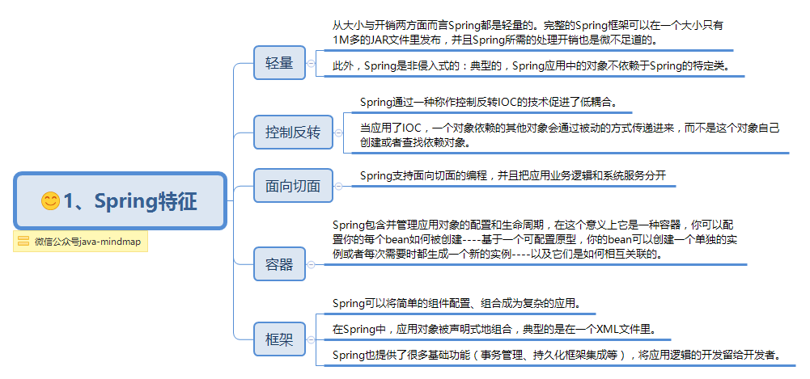
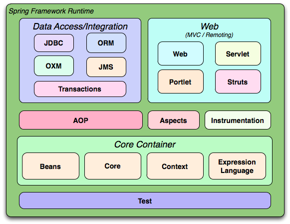
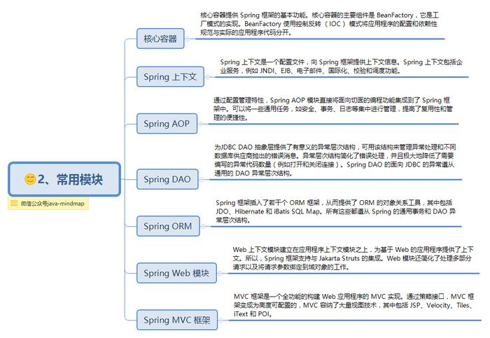
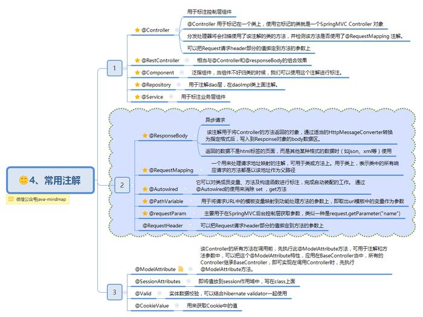
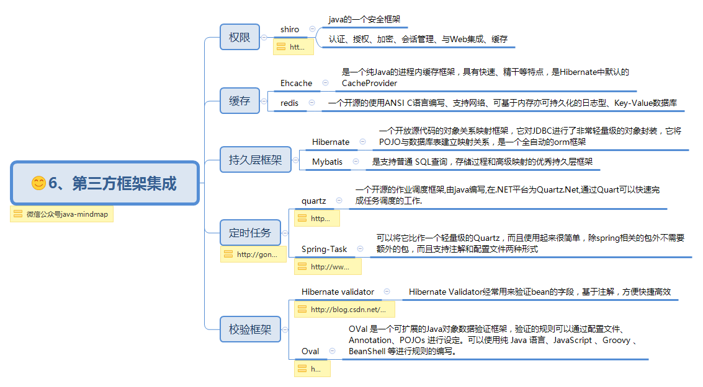
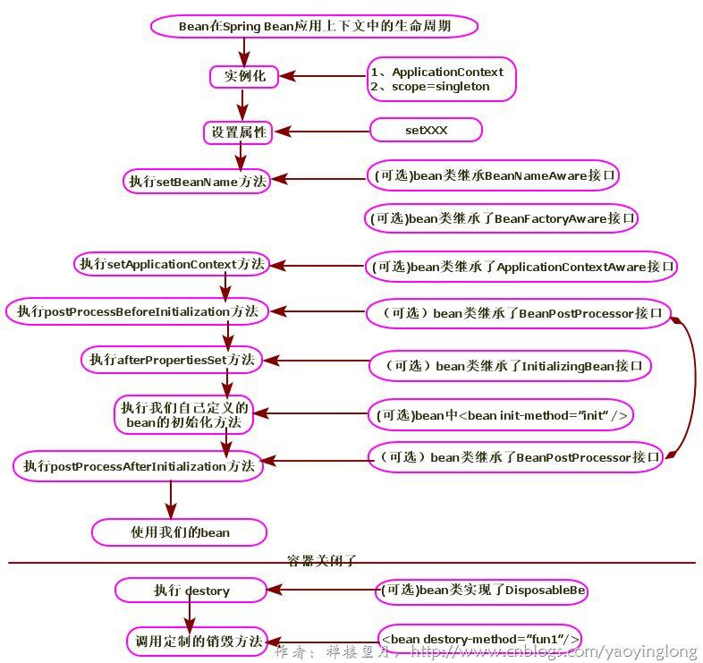
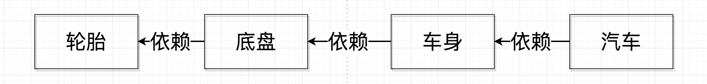
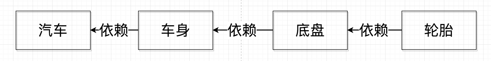
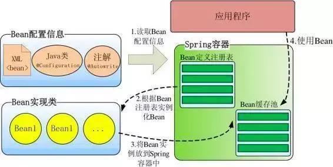

# SSM面试题整合

## Spring

### Spring

#### Spring特征




#### Spring 核心组件




#### Spring 常用模块




#### spring常用注解



#### Spring  第三方结合



#### Spring注入方式

1，构造器注入

```java
/*带参数，方便利用构造器进行注入*/
public CatDaoImpl(String message){
    this. message = message;
}
```

-

```xml
<bean id="CatDaoImpl" class="com.CatDaoImpl">
    <constructor-arg value=" message "></constructor-arg>
</bean>
```

2，setter 方 法注入

```java
public class Id {
    private int id;
    public int getId() { return id; }
    public void setId(int id) { this.id = id; }
}
```

-

```xml
<bean id="id" class="com.id "> 
    <property name="id" value="123"></property> 
</bean>
```

3，静态工厂注入

```java
public class DaoFactory { //静态工厂
    public static final FactoryDao getStaticFactoryDaoImpl(){
        return new StaticFacotryDaoImpl();
    }
}
public class SpringAction {
    private FactoryDao staticFactoryDao; //注入对象
    //注入对象的 set 方法
    public void setStaticFactoryDao(FactoryDao staticFactoryDao) {
        this.staticFactoryDao = staticFactoryDao;
    }
}
```

-

```xml
//factory-method="getStaticFactoryDaoImpl"指定调用哪个工厂方法
<bean name="springAction" class=" SpringAction" >
    <!--使用静态工厂的方法注入对象,对应下面的配置文件-->
    <property name="staticFactoryDao" ref="staticFactoryDao"></property>
</bean>
<!--此处获取对象的方式是从工厂类中获取静态方法-->
<bean name="staticFactoryDao" class="DaoFactory"
      factory-method="getStaticFactoryDaoImpl">
</bean>
```

4，实例工厂

```java
public class DaoFactory { //实例工厂
    public FactoryDao getFactoryDaoImpl(){
        return new FactoryDaoImpl();
    }
}
public class SpringAction {
    private FactoryDao factoryDao; //注入对象
    public void setFactoryDao(FactoryDao factoryDao) {
        this.factoryDao = factoryDao;
    }
}
```

--

```xml
<bean name="springAction" class="SpringAction">
    <!--使用实例工厂的方法注入对象,对应下面的配置文件-->
    <property name="factoryDao" ref="factoryDao"></property>
</bean>
<!--此处获取对象的方式是从工厂类中获取实例方法-->
<bean name="daoFactory" class="com.DaoFactory"></bean>
<bean name="factoryDao" factory-bean="daoFactor
```


#### spring用到了哪些设计模式

- 工厂模式：spring通过BeanFactory，ApplicationContext来创建bean对象
- 代理模式：Spring Aop 功能实现
- 单例模式：Bean的作用域一般都是单例的
- 模板方法模式：Spring 中 `jdbcTemplate`、`hibernateTemplate` 等以 Template 结尾的对数据库操作的类，它们就使用到了模板模式。
- 包装器设计模式：我们的项目需要连接多个数据库，而且不同的客户在每次访问中根据需要会去访问不同的数据库。这种模式让我们可以根据客户的需求能够动态切换不同的数据源。
- 观察者模式：Spring 事件驱动模型就是观察者模式很经典的一个应用。
- 适配器模式：Spring AOP 的增强或通知(Advice)使用到了适配器模式、spring MVC 中也是用到了适配器模式适配`Controller`。


#### 5 种 种 不同方式的自动装配

Spring 装配包括手动装配和自动装配，手动装配是有基于 xml 装配、构造方法、setter 方法等
自动装配有五种自动装配的方式，可以用来指导 Spring 容器用自动装配方式来进行依赖注入。
1. no：默认的方式是不进行自动装配，通过显式设置 ref 属性来进行装配。
2. byName：通过参数名 自动装配，Spring 容器在配置文件中发现 bean 的 autowire 属性被设
置成 byname，之后容器试图匹配、装配和该 bean 的属性具有相同名字的 bean。
3. byType：通过参数类型自动装配，Spring 容器在配置文件中发现 bean 的 autowire 属性被
设置成byType，之后容器试图匹配、装配和该bean的属性具有相同类型的bean。如果有多
个 bean 符合条件，则抛出错误。
4. constructor：这个方式类似于 byType， 但是要提供给构造器参数，如果没有确定的带参数
的构造器参数类型，将会抛出异常。
5. autodetect：首先尝试使用 constructor 来自动装配，如果无法工作，则使用 byType方式。


### Bean

#### spring bean 作用域

- singleton：单例
- propotype：每次请求都会创建一个新的bean
- request：每一个请求域
- response：只会在当前请求的response生效
- application：整个应用内有效
- session：仅在当前 HTTP session 内有效
- global-session：全局session作用域

```xml
<bean id="userDao" class="com.ioc.UserDaoImpl" scope="作用域"/>
```


#### Bean的生命周期

1，实例化

实例化一个 Bean，也就是我们常说的 new。

2，依赖注入

按照 Spring 上下文对实例化的 Bean 进行配置，也就是 IOC 注入。

3，setBeanName 实现

如果这个 Bean 已经实现了 BeanNameAware 接口，会调用它实现的 

```
setBeanName(String)
```

此处传递的就是 Spring 配置文件中 Bean 的 id 值

4，BeanFactoryAware 实现,

如果这个 Bean 已经实现了 BeanFactoryAware 接口，会调用它实现的 setBeanFactory

setBeanFactory(BeanFactory)传递的是 Spring 工厂自身

> 可以用这个方式来获取其它 Bean，只需在 Spring 配置文件中配置一个普通的 Bean 就可以

5，ApplicationContextAware 实 现

如果这个 Bean 已经实现了 ApplicationContextAware 接口，会调用setApplicationContext(ApplicationContext)方法，传入 Spring 上下文

> 同样这个方式也可以实现步骤 4 的内容，但比 4 更好，因为 ApplicationContext 是 BeanFactory 的子接口，有更多的实现方法

6，postProcessBeforeInitialization 接口实现 - 初始化预处理

如果这个 Bean 关联了 BeanPostProcessor 接口，将会调用

```java
postProcessBeforeInitialization(Object obj, String s)
```

BeanPostProcessor 经常被用作是 Bean 内容的更改，并且由于这个是在 Bean 初始化结束时调用那个的方法，也可以被应用于内存或缓存技术。

7，init-method

如果 Bean 在 Spring 配置文件中配置了 init-method 属性会自动调用其配置的初始化方法。

8，postProcessAfterInitialization

如果这个 Bean 关联了 BeanPostProcessor 接口，将会调用

```
postProcessAfterInitialization(Object obj, String s)
```

注：以上工作完成以后就可以应用这个 Bean 了，那这个 Bean 是一个 Singleton 的，所以一般情况下我们调用同一个 id 的 Bean 会是在内容地址相同的实例，当然在 Spring 配置文件中也可以配置非 Singleton

9，Destroy 过期自动清理阶段

当 Bean 不再需要时，会经过清理阶段，如果 Bean 实现了 DisposableBean 这个接口，会调用那个其实现的 destroy()方法；

10，destroy-method 自配置清理

最后，如果这个 Bean 的 Spring 配置中配置了 destroy-method 属性，会自动调用其配置的销毁方法。

11，bean 标签有两个重要的属性（init-method 和 destroy-method）。

用它们你可以自己定制,初始化和注销方法。它们也有相应的注解（@PostConstruct 和@PreDestroy）
<bean id="" class="" init-method="初始化方法" destroy-method="销毁方法">




####  Spring 中的单例 bean 的线程安全问题

回答：存在安全问题

- 当多个线程操作同一个对象的时候，对这个对象的全局变量的写操作会存在线程安全问题。
- 但是，一般情况下，我们常用的 `Controller`、`Service`、`Dao` 这些 Bean 是无状态的。无状态的 Bean 不能保存数据，因此是线程安全的。

解决

- 既然可能是由全局变量引起的，那么就可以将全局设置为局部，通过方法来传递参数
- jdk提供了java.lang.ThreadLocal,它为多线程并发提供了新思路。 

> 当使用ThreadLocal维护变量时，ThreadLocal为每个使用该变量的线程提供独立的变量副本，所以每一个线程都可以独立地改变自己的副本，而不会影响其它线程所对应的副本

--使用

```java
private ThreadLocal contentTL = new ThreadLocal(); 
//private String content；使用contentTL代替content; 
```

- 改变 Bean 的作用域为 “prototype”：每次请求都会创建一个新的 bean 实例，自然不会存在线程安全问题。


#### @Component 和 @Bean 的区别

- 作用对象不同@Component作用于类，@Bean作用于方法

- `@Component`通常是通过类路径扫描来自动侦测以及自动装配到Spring容器中
- `@Bean` 注解通常是我们在标有该注解的方法中定义产生这个 bean
- `@Bean` 注解比 `Component` 注解的自定义性更强，而且很多地方我们只能通过 `@Bean` 注解来注册bean。比如当我们引用第三方库中的类需要装配到 `Spring`容器时，则只能通过 `@Bean`来实现。


#### 类声明为Spring的 bean 的注解

- @Component
- @Repository：对应持久层即 Dao 层，主要用于数据库相关操作。
- @Service
- @Controller


### AOP与IOC

> 需要自己看看其源码解读

ioc：控制反转

本应该程序中手动创建的对象的控制权，转交给Spring框架来管理

每当我们需要一个对象的时候，只需要将其配置好，就可以直接引用，不用去管对象的底层实现

同时需要理解一个**"依赖倒置"**的思想

> 例如：我们需要一个东西，这个东西由一层一层的组件构成，需要A，A由B组成，B由C组成，创建好A后突然说要改C的属性，这个时候就得重新来过
>
> 将其颠倒
>
> C依赖B，B依赖A，我们只需要改动C就可以了，不需要动其他的

例如



颠倒



代码实现就是

```java
//简单版
public class A{
	private B b;
	public void A(B b){this.b = b}
}
public class B{
	private C c;
	public void A(C c){this.c = c}
}
```

AOP：面向切面编程

- 将共同调用的逻辑或责任（例如事务处理、日志管理、权限控制等）封装起来，便于减少系统的重复代码，降低模块间的耦合度，并有利于未来的可拓展性和可维护性。
- **Spring AOP就是基于动态代理的**


#### IOC原理：待补充（在阿里面1中提到）

Spring 启动时读取应用程序提供的 Bean 配置信息，并在 Spring 容器中生成一份相应的 Bean 配置注册表，然后根据这张注册表实例化 Bean，装配好 Bean 之间的依赖关系，为上层应用提供准备就绪的运行环境。其中 Bean 缓存池为 HashMap 实现



#### Spring Aop 与 Aspect Aop的区别

- spring是运行时增强，aspect是编译时增强
-  Spring AOP 基于代理(Proxying)，而 AspectJ 基于字节码操作(Bytecode Manipulation)。

> 没懂

- AspectJ 相比于 Spring AOP 功能更加强大，但是 Spring AOP 相对来说更简单，


#### 自己动手实现aop（2种方式就）


### spring事务

- 编程式事务：编写代码
- 声明式事务：基于aop技术，配置文件中配置
  - 基于xml的声明式事务
  - 基础注解的声明式事务


#### spring事务的隔离级别

- ```java
  TransactionDefinition.ISOLATION_DEFAULT
  //默认隔离级别
  ```

- ```java
  TransactionDefinition.ISOLATION_READ_UNCOMMITTED
  //读未提交数据
  //可能会导致脏读、幻读或不可重复读
  ```

- ```java
  TransactionDefinition.ISOLATION_READ_COMMITTED
  //读已经提交数据
  //防止脏读
  ```

- ```java
  TransactionDefinition.ISOLATION_REPEATABLE_READ
  //重复读取，即在数据读出来之后加锁
  //解决了脏读、不可重复读的问题
  ```

- ```java
  TransactionDefinition.ISOLATION_SERIALIZABLE
  //最高的隔离级别，完全服从ACID的隔离级别
  ```


#### spring事务的传播行为


#### @Transactional

- 在`@Transactional`注解中如果不配置`rollbackFor`属性,那么事务只会在遇到`RuntimeException`的时候才会回滚

- 加上`rollbackFor=Exception.class`,可以让事务在遇到非运行时异常时也回滚。


## springmvc

### 对springmvc的了解

> 待补充

### springmvc的工作原理

1，Hrrp请求

2，Dispatcherservlet 接收请求，查询多个HandlerMapping，找到处理请求的Controller

3，DispatcherServlet 请求提交到对应的Controller

4，Controller 调用业务逻辑层之后返回处理结果（ModelAndView）

5，DispatcherServlet 查询 ViewResoler 视图解析器，找到 ModelAndView 指定的视图

6，视图解析器 解析视图反馈给客户端


### @RestController 与 @Controller的区别

@Controller

- 直接返回页面，属于那种比较传统的springmvc的项目（前后不分离）

@RestController

- 返回json或者xml形式数据
- 由@Controller和@ResponseBody组成

> `@ResponseBody` 注解的作用是将 `Controller` 的方法返回的对象通过适当的转换器转换为指定的格式之后，写入到HTTP 响应(Response)对象的 body 中，通常用来返回 JSON 或者 XML 数据。


```java
@Target({ElementType.TYPE})//表明是接口
@Retention(RetentionPolicy.RUNTIME)
@Documented
@Controller
@ResponseBody
public @interface RestController {}

@Target//表明注解的作用目标
@Retention//作用是定义被它所注解的注解保留多久
@Documented//只是用来做标识
```


# mybatis

## 什么是Mybatis

对象关系映射的持久层框架，内部封装JDBC，使得我们的开发重点只关注SQL语句本身


## 优点

1，SQL编写很灵活：动态SQL，标签

2，对象字段关系映射，开发方便

3，与Spring很好的集成

4，与各种数据库兼容


## 缺点

1，SQL的工程量大

2，性能要求高


## 工作原理

读取MyBatis配置文件：mybatis-config.xml为MyBatis的全局配置文件，配置了MyBatis的运行环境等信息，例如数据库连接信息。

加载映射文件。映射文件即SQL映射文件，该文件中配置了操作数据库的SQL语句，需要在MyBatis配置文件mybatis-config.xml中加载。mybatis-config.xml文件可以加载多个映射文件，每个文件对应数据库中的一张表。

构造会话工厂：通过MyBatis的环境等配置信息构建会话工厂SqlSessionFactory。

创建会话对象：由会话工厂创建SqlSession对象，该对象中包含了执行SQL语句的所有方法。

Executor执行器：MyBatis底层定义了一个Executor 接口来操作数据库，它将根据SqlSession传递的参数动态地生成需要执行的SQL语句，同时负责查询缓存的维护。

MappedStatement 对象：在Executor接口的执行方法中有一个MappedStatement类型的参数，该参数是对映射信息的封装，用于存储要映射的SQL语句的id、参数等信息。

输入参数映射：输入参数类型可以是Map、List等集合类型，也可以是基本数据类型和POJO类型。输入参数映射过程类似于 JDBC对preparedStatement对象设置参数的过程。

输出结果映射：输出结果类型可以是Map、List等集合类型，也可以是基本数据类型和POJO类型。输出结果映射过程类似于 JDBC对结果集的解析过程。


## 与Hibernate的区别

1，Mybatis需要自己编写SQL，而Hibernate对象映射能力强，数据库无关性好，可以节约很多代码

2，Mybatis灵活


## #{}和${}的区别

- `${}`是 Properties 文件中的变量占位符，它可以用于标签属性值和 sql 内部，属于静态文本替换
- `#{}`是 sql 的参数占位符，MyBatis 会将 sql 中的`#{}`替换为?号，在 sql 执行前会使用 PreparedStatement 的参数设置方法，按序给 sql 的?号占位符设置参数值


## Xml 映射文件中，除了常见的标签之外，还有哪些标签

- <resultMap>
- <sql>
- <include>
- 动态sql使用的标签


## 当实体类中的属性名和表中的字段名不一样，怎么办？

1，XML文件中使用SQL标签映射

2，使用 ResultMap 映射


## Dao的工作原理

Dao接口的工作原理是JDK动态代理，Mybatis运行时会使用JDK动态代理为Dao接口生成代理proxy对象，代理对象proxy会拦 截接口方法，转而执行MappedStatement所代表的sql，然后将sql执行结果返回。


## Mybatis是如何进行分页的？分页插件的原理是什么？

Mybatis使用RowBounds对象进行分页，它是针对ResultSet结果集执行的内存分页，而非物理分页，可以在sql内直接书写带有物理分页的参数来完成物理分页功能，也可以使用分页插件来完成物理分页。 分页插件的基本原理是使用Mybatis提供的插件接口，实现自定义插件，在插件的拦截方法内拦截待执行的sql，然后重写sql，根据dialect方言，添加对应的物理分页语句和物理分页参数。


## Mybatis是如何将sql执行结果封装为目标对象并返回的？都有哪些映射形式？

第一种是使用标签，逐一定义列名和对象属性名之间的映射关系。第二 种是使用sql列的别名功能，将列别名书写为对象属性名，比如T_NAME AS NAME，对象属性名一般是name，小写，但是列名不区分大小写，Mybatis会忽略列名大小 写，智能找到与之对应对象属性名，你甚至可以写成T_NAME AS NaMe，Mybatis一样可以正常工作。

有了列名与属性名的映射关系后，Mybatis通过反射创建对象，同时使用反射给对象的属性逐一赋值并返回，那些找不到映射关系的属性，是无法完成赋值的。


## 在mapper中如何传递多个参数?

dao 方法中传入两个参数，在xml文件中使用#{0},或者直接使用参数的名称#{name},或者使用几个foreach


## Mybatis动态sql有什么用？执行原理？有哪些动态 sql？

Mybatis动态sql可以在Xml映射文件内，以标签的形式编写动态sql，执行原理是根 据表达式的值完成逻辑判断并动态拼接sql的功能。

Mybatis提供了9种动态sql标签 ：trim | where | set | foreach | if | choose| when | otherwise | bind。


### xml映射文件与之对应的dao接口的工作原理

在mabatis中，

每一个<select>、<insert>、<update>、<delete>，都会被解析为一个mappedStatement对象，

dao中的方法是可以重载的，唯一要注意的是id是不能重复的

> Mybatis 的 Dao 接口可以有多个重载方法，但是多个接口对应的映射必须只有一个，否则启动会报错。


### MyBatis 的分页原理

MyBatis 使用 RowBounds 对象进行分页，它是针对 ResultSet 结果集执行的内存分页，而非物理分页，可以在 sql 内直接书写带有物理分页的参数来完成物理分页功能，也可以使用分页插件来完成物理分页。

分页插件的基本原理是使用 MyBatis 提供的插件接口，实现自定义插件，在插件的拦截方法内拦截待执行的 sql，然后重写 sql，根据 dialect 方言，添加对应的物理分页语句和物理分页参数。


### 动态sql的原理

使用 OGNL 从 sql 参数对象中计算表达式的值，根据表达式的值动态拼接 sql，以此来完成动态 sql 的功能。


### sql执行结果封装

首先确定列名和对象属性之间的关系

1，使用<resultMap>,直接定义列名与属性名之间的关系

2，使用 sql 列的别名功能，将列别名书写为对象属性名，MyBatis 会忽略列名大小写，智能找到与之对应对象属性名，

有了列名与属性名的映射关系后，MyBatis 通过反射创建对象，同时使用反射给对象的属性逐一赋值并返回，那些找不到映射关系的属性，是无法完成赋值的。


### MyBatis延迟加载?其原理？

MyBatis 仅支持 association 关联对象和 collection 关联集合对象的延迟加载，可以配置是否启用延迟加载 

```
lazyLoadingEnabled=true|false
```

其原理是

它的原理是，使用` CGLIB` 创建目标对象的代理对象，当调用目标方法时，进入拦截器方法，比如调用 `a.getB().getName()`，拦截器 `invoke()`方法发现 `a.getB()`是 null 值，那么就会单独发送事先保存好的查询关联 B 对象的 sql，把 B 查询上来，然后调用 a.setB(b)，于是 a 的对象 b 属性就有值了，接着完成 `a.getB().getName()`方法的调用。这就是延迟加载的基本原理。


### MyBatis 的 Xml 映射文件中，不同的 Xml 映射文件，id 是否可以重复

- 不同的 Xml 映射文件，如果配置了 namespace，那么 id 可以重复；

- 如果没有配置 namespace，那么 id 不能重复；毕竟 namespace 不是必须的，只是最佳实践而已。


### MyBatis 中如何执行批处理？

使用 BatchExecutor 完成批处理。


## MyBatis 一对多、多对多

一对一 使用标签<association>

多对多 使用标签<collection>


### MyBatis 都有哪些 Executor 执行器？它们之间的区别是什么？

MyBatis 有三种基本的 Executor 执行器，**`SimpleExecutor`、`ReuseExecutor`、`BatchExecutor`。**

**`SimpleExecutor`：**每执行一次 update 或 select，就开启一个 Statement 对象，用完立刻关闭 Statement 对象。

**`ReuseExecutor`：**执行 update 或 select，以 sql 作为 key 查找 Statement 对象，存在就使用，不存在就创建，用完后，不关闭 Statement 对象，而是放置于 Map<String, Statement>内，供下一次使用。简言之，就是重复使用 Statement 对象。

**`BatchExecutor`：**执行 update（没有 select，JDBC 批处理不支持 select），将所有 sql 都添加到批处理中（addBatch()），等待统一执行（executeBatch()），它缓存了多个 Statement 对象，每个 Statement 对象都是 addBatch()完毕后，等待逐一执行 executeBatch()批处理。与 JDBC 批处理相同。

作用范围：Executor 的这些特点，都严格限制在 SqlSession 生命周期范围内。


### 简述 MyBatis 的 Xml 映射文件和 MyBatis 内部数据结构之间的映射关系

- mybatis将所有的xml配置信息都封装到all-in-one重量级对象Configuration内部。
- 在 Xml 映射文件中，`<parameterMap>`标签会被解析为 `ParameterMap` 对象，其每个子元素会被解析为 ParameterMapping 对象。
- `<resultMap>`标签会被解析为 `ResultMap` 对象，其每个子元素会被解析为 `ResultMapping` 对象。
- 每一个`<select>、<insert>、<update>、<delete>`标签均会被解析为 `MappedStatement` 对象，标签内的 sql 会被解析为 BoundSql 对象。


## springboot

### springboot自动装配

