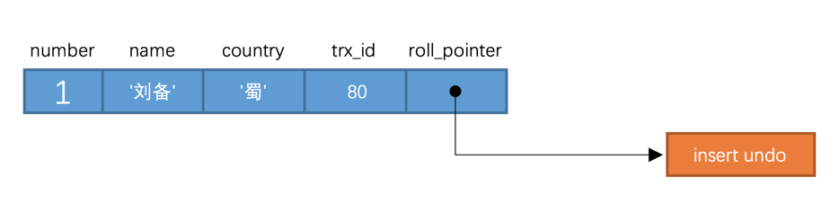

# MVCC

## 什么是mvcc？

MVCC，全称Multi-Version Concurrency Control，即多版本并发控制。

MVCC是一种并发控制的方法，一般在数据库管理系统中，实现对数据库的并发访问，在编程语言中实现事务内存。

多版本并发控制
MVCC是一种并发控制的方法，一般在数据库管理系统中，实现对数据库的并发访问每次修改都会在版本链中记录。
SELECT可以去版本链中拿记录，这就实现了读-写，写-读的并发执行，提升了系统的性能，读写不影响

> 可以回答说
>
> 是一个多版本法控制协议


## MVCC能解决什么问题？

读不加锁，读写不冲突，并发性能好

> 简单来说就是用来解决读写冲突的，读写操作并发执行


## MVCC是如何处理事务的隔离性的？


## MVCC是的实现方式

MVCC是通过保存数据在某个时间点的快照来实现的. 

不同存储引擎的MVCC实现是不同的,典型的有乐观并发控制和悲观并发控制.


针对InnoDb的mvcc的实现


### InnoDB实现MVCC的3个基础点

**隐式字段**

DB_ROW_ID是数据库默认为该行记录生成的唯一隐式主键；DB_TRX_ID是当前操作该记录的事务ID；
 DB_ROLL_PTR是一个回滚指针，用于配合undo日志，指向上一个旧版本；


**undo log**

不同事务或者相同事务的对同一记录的修改，会导致该记录的undo log成为 一条记录版本线性表，既链表，undo log的链首就是最新的旧记录，链尾就是最早的旧记录

**ReadView**

已提交读和可重复读的区别就在于它们生成ReadView的策略不同

**已提交读隔离级别下的事务在每次查询的开始都会生成一个独立的ReadView,而可重复读隔离级别则在第一次读的时候生成一个ReadView，之后的读都复用之前的ReadView**。

ReadView中主要就是有个列表来存储我们系统中当前活跃着的读写事务，也就是begin了还未提交的事务。通过这个列表来判断记录的某个版本是否对当前事务可见


### 隐藏列

InnoDb的聚集索引包含两个隐含列

- trx_id：每一次事务对索引记录修改时，会将事务ID赋值给 trx_id

> 也就是事务ID
>
> 有在对表中的记录做改动时（执行INSERT、DELETE、UPDATE这些语句时）才会为事务分配事务id，否则在一个只读事务中的事务id值都默认为0

- roll_pointer：对聚簇索引记录进行改动时，都会把旧的版本写入到 undo日志 中，然后这个隐藏列就相当于一个指针，可以通过它来找到该记录修改前的信息

> 这里就额可以直接回答说InnoDb的mvcc实现主要就是靠两个隐藏列，一个保存事务ID，一个是指向undo log日志文件记录的指针信息的回滚指针



实际上insert undo只在事务回滚时起作用，当事务提交后，该类型的undo日志就没用了，它占用的Undo Log Segment也会被系统回收

> 也就是该undo日志占用的Undo页面链表要么被重用，要么被释放

虽然真正的insert undo日志占用的存储空间被释放了，但是roll_pointer的值并不会被清除，roll_pointer属性占用7个字节，第一个比特位就标记着它指向的undo日志的类型，如果该比特位的值为1时，就代表着它指向的undo日志类型为insert undo。


> 可以回答：那个存放在undo log 的日志信息不会一直存在，因为在事务提交后就会删除，但是那个回滚指针不会清除


这里也就涉及到


### 版本链

每次对记录进行改动，都会记录一条 undo日志 ，每条 undo日志 也都有一个 roll_pointer 属性，可以将这些 undo日志 都连起来，串成一个链表

>  INSERT 操作对应的 undo日志 没有该属性，因为该记录并没有更早的版本


对该记录每次更新后，都会将旧值放到一条 undo日志 中，就算是该记录的一个旧版本，随着更新次数的增多，所有的版本都会被 roll_pointer 属性连接成一个链表，我们把这个链表称之为 版本链 ，版本链的头节点就是当前记录最新的值。

另外，每个版本中还包含生成该版本时对应的 事务id 


> 答到这里可以说，
>
> 这里同样也存在问题，那就是在版本链中不知道哪个事务是当前事务可见的，万一这个事务修改了但是没有提交，另一个事务过来读取又怎么知道这个undo log 是否是当前事务的，这也就引出了ReadView


### ReadView

通过隐藏列和版本链，MySQL可以将数据恢复到指定版本；但是具体要恢复到哪个版本，则需要根据ReadView来确定。

所谓ReadView，是指事务（记做事务A）在某一时刻给整个事务系统（trx_sys）打快照，之后再进行读操作时，会将读取到的数据中的

事务id与trx_sys快照比较，从而判断数据对该ReadView是否可见，即对事务A是否可见。


对于使用 READ UNCOMMITTED 隔离级别的事务来说，由于可以读到未提交事务修改过的记录，所以直接读取记录的最新版本就好了；

对于使用 SERIALIZABLE 隔离级别的事务来说，设计 InnoDB 的大叔规定使用加锁的方式来访问记录；

对于使用 READ COMMITTED 和 REPEATABLE READ 隔离级别的事务来说，都必须保证读到已经提交了的事务修改过的记录，也就是说假如另一个事务已经修改了记录但是尚未提交，是不能直接读取最新版本的记录的，核心问题就是：需要判断一下版本链中的哪个版本是当前事务可见的。

为此，设计 InnoDB 的大叔提出了一个 ReadView 的概念

四个字段

- m_ids：表示在生成 ReadView 时当前系统中活跃的读写事务的 事务id 列表
- min_trx_id：表示在生成 ReadView 时当前系统中活跃的读写事务中最小的 事务id ，也就是 m_ids 中的最小值
- max_trx_id：表示生成 ReadView 时系统中应该分配给下一个事务的 id 值

> 注意max_trx_id并不是m_ids中的最大值，事务id是递增分配的。比方说现在有id为1，2，3这三个事务，之后id为3的事务提交了。那么一个新的读事务在生成ReadView时，m_ids就包括1和2，min_trx_id的值就是1，max_trx_id的值就是4

- creator_trx_id：表示生成该 ReadView 的事务的 事务id


**有了这个 ReadView ，这样在访问某条记录时，只需要按照下边的步骤判断记录的某个版本是否可见**


1. 如果被访问版本的 trx_id 属性值与 ReadView 中的 creator_trx_id 值相同，意味着当前事务在访问它自己修改过的记录，所以该版本可以被当前事务访问。
2. 如果被访问版本的 trx_id 属性值小于 ReadView 中的 min_trx_id 值，表明生成该版本的事务在当前事务生成 ReadView 前已经提交，所以该版本可以被当前事务访问。
3. 如果被访问版本的 trx_id 属性值大于 ReadView 中的 max_trx_id 值，表明生成该版本的事务在当前事务生成 ReadView 后才开启，所以该版本不可以被当前事务访问。
4. 如果被访问版本的 trx_id 属性值在 ReadView 的 min_trx_id 和 max_trx_id 之间，那就需要判断一下trx_id 属性值是不是在 m_ids 列表中，如果在，说明创建 ReadView 时生成该版本的事务还是活跃的，该版本不可以被访问；如果不在，说明创建 ReadView 时生成该版本的事务已经被提交，该版本可以被访问。


如果某个版本的数据对当前事务不可见的话，那就顺着版本链找到下一个版本的数据，继续按照上边的步骤判断可见性，依此类推，直到版本链中的最后一个版本。如果最后一个版本也不可见的话，那么就意味着该条记录对该事务完全不可见，查询结果就不包含该记录，事务返回空

> 可以回答：同过这样一步步顺着版本链查找，判断是否对当前事务可见


**这里也要注意，READ COMMITTED 和 REPEATABLE READ 生成ReadView的时机不同**

- READ COMMITTED —— 每次读取数据前都生成一个ReadView
- REPEATABLE READ —— 在第一次读取数据时生成一个ReadView


## 4，快照读/当前读

快照读：读取的是快照版本，也就是历史版本

当前读：读取的是最新版本

> 普通的SELECT就是快照读，
>
> 而UPDATE、DELETE、INSERT、SELECT ...  LOCK IN SHARE MODE、SELECT ... FOR UPDATE是当前读。


## 5，读锁

### 锁定读

在一个事务中，标准的SELECT语句是不会加锁，但是有两种情况例外。SELECT ... LOCK IN SHARE MODE 和 SELECT ... FOR UPDATE。

```mysql
SELECT ... LOCK IN SHARE MODE
# 给记录假设共享锁，这样一来的话，其它事务只能读不能修改，直到当前事务提交
```


```mysql
SELECT ... FOR UPDATE
# 给索引记录加锁，这种情况下跟UPDATE的加锁情况是一样的
```

　　

### 一致性非锁定读（❤）

[consistent read](https://dev.mysql.com/doc/refman/5.7/en/glossary.html#glos_consistent_read) （一致性读），InnoDB用多版本来提供查询数据库在某个时间点的快照。

如果隔离级别是REPEATABLE READ，那么在同一个事务中的所有一致性读都读的是事务中第一个这样的读读到的快照；

如果是READ COMMITTED，那么一个事务中的每一个一致性读都会读到它自己刷新的快照版本。

Consistent read（一致性读）是READ COMMITTED和REPEATABLE READ隔离级别下普通SELECT语句默认的模式。

一致性读不会给它所访问的表加任何形式的锁，因此其它事务可以同时并发的修改它们。