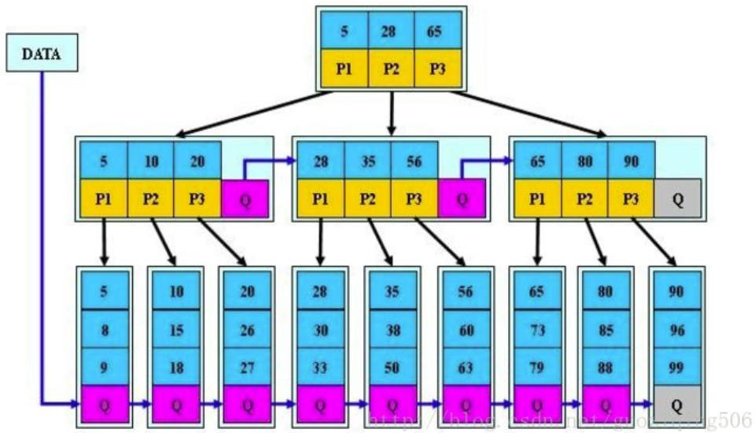
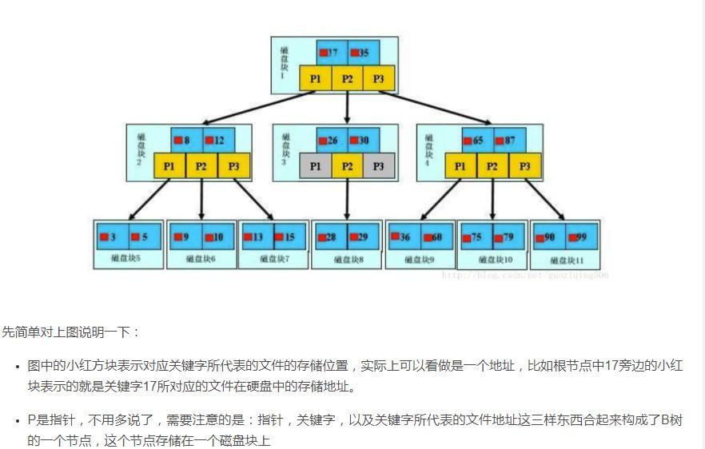

# MySql高级

## 一，逻辑架构

### 1，逻辑架构层

#### 连接层

最上层是一些客户端和连接服务，包含本地 sock 通信和大多数基于客户端/服务端工具实现的类似于 tcp/ip 的通信。主要完成一些类似于连接处理、授权认证、及相关的安全方案。在该层上引入了线程池的概念，为通过认证安全接入的客户端提供线程。同样在该层上可以实现基于 SSL 的安全链接。服务器也会为安全接入的每个客户端验证它所具有的操作权限。

#### 服务层

| Management Serveices &Utilities | 系统管理和控制工具                                           |
| ------------------------------- | ------------------------------------------------------------ |
| SQLInterface:                   | SQL 接口。接受用户的 SQL 命令，并且返回用户需要查询的结果。比如 select from<br/>就是调用 SQLInterface |
| Parser                          | 解析器。 SQL 命令传递到解析器的时候会被解析器验证和解析      |
| Optimizer                       | 查询优化器。 SQL 语句在查询之前会使用查询优化器对查询进行优化，比如有<br/>where 条件时，优化器来决定先投影还是先过滤 |
| Cache 和 Buffer                 | 查询缓存。如果查询缓存有命中的查询结果，查询语句就可以直接去查询缓存中取<br/>数据。这个缓存机制是由一系列小缓存组成的。比如表缓存，记录缓存，key 缓存，<br/>权限缓存等 |

#### 引擎层

存储引擎层，存储引擎真正的负责了 MySQL 中数据的存储和提取，服务器通过 API 与存储引擎进行通信。不同的存储引擎具有的功能不同，这样我们可以根据自己的实际需要进行选取

#### 存储层

数据存储层，主要是将数据存储在运行于裸设备的文件系统之上，并完成与存储引擎的交互。


### 2，show profile

利用 show profile 可以查看 sql 的执行周期！

#### 开启profile

```yml
showvariables like'%profiling%' #查看是否开启

set profiling=1 # 开启
```

#### 使用 profile

执行 命令，可以查看最近的几次查询。

```
show prifiles 
```

根据 Query_ID,可以进一步执行来查看 sql 的具体执行步骤。

```
 show profile cpu,block io for query Query_id 
```

#### Mysql的查询流程

查询流程大致是： 

1. `mysql `客户端通过协议与 `mysql `服务器建连接，发送查询语句
2. 先检查查询缓存，如果命中，直接返回结果， 否则进行语句解析,也就是说，在解析查询之前，服务器会先访问查询缓存(query cache)——它存储 SELECT 语句以及相应的查询结果集。
3. 如果某个查询结果已经位于缓存中，服务器就不会再对查询进行解析、优化、以及执行。它仅仅将缓存中的结果返回给用户即可，这将大大提高系统的性能
4. 接下来是语法解析器和预处理
5. 首先 `mysql `通过关键字将 SQL 语句进行解析，并生成一颗对应的“解析树”
6. `mysql `解析器将使用 `mysql `语法规则验证和解析查询；
7. 预处理器则根据一些` mysql `规则进一步检查解析数是否合法。
8. 查询优化器当解析树被认为是合法的了，并且由优化器将其转化成执行计划。一条查询可以有很多种执行方式，最后都返回相同的结果。优化器的作用就是找到这其中最好的执行计划
9. 然后，`mysql` 默认使用的 BTREE 索引，并且一个大致方向是:无论怎么折腾` sql`，至少在目前来说，`mysql `最多只用到表中的一个索引


> 额外注意：`MySql 8.0` 不再支持查询缓存
>
> 尽管MySQL查询缓存旨在提高性能，但它具有严重的可伸缩性问题，并且很容易成为严重的瓶颈
>
> 有一些限制：
>
> 1. 查询必须逐字节匹配（查询缓存避免解析）
> 2. 使用非确定性功能将导致查询不被缓存（包括临时表，用户变量，RAND（），NOW（）和UDF）。
> 3. 查询缓存被设计为不提供过时的结果。**对基础表的任何修改都会导致这些表的所有缓存无效。**
> 4. 对于是否可以将缓存用于`InnoDB`，存在一些限制（为了尊重MVCC；当您打开事务时，“缓存”可能无法在您期望的视图中表示数据。）


#### SQL的执行顺序

手写是从select开始的

而机读是从From开始的

#### 查看所有的数据库引擎

```
show engines
```

#### 查看默认的数据库引擎

```
show variables like '%storage_engine%' 
```


## 二，优化工具

1，`show processlist`：查看所有连接的SESSION状态

```
+----+------+-----------------+------------+---------+------+-------+------------------+
| Id | User | Host            | db         | Command | Time | State | Info             |
+----+------+-----------------+------------+---------+------+-------+------------------+
| 23 | root | localhost:10031 | test       | Query   |    0 | NULL  | show processlist |
| 24 | root | localhost:10045 | system_ssm | Sleep   |    4 |       | NULL             |
+----+------+-----------------+------------+---------+------+-------+------------------+
```

2，explain

3，show index

4，slow-log：慢查询日志


# 三，索引优化分析

## 什么是索引

分类：hash索引，B+索引

现在我要找一个数，若在p2范围，那么就会进入中间部门，再次判断，若又在p2，则在p2中查找

创建索引

```mysql
CREATE INDEX idx_name ON table_name(column_list);
```

查看索引

```mysql
SHOW INDEX FROM inx_test;
```

删除索引

```mysql
DROP INDEX idx_id ON inx_test;
```

对比

1、B+树的层级更少：相较于B树B+每个非叶子节点存储的关键字数更多，树的层级更少所以查询数据更快

2、B+树查询速度更稳定：B+所有关键字数据地址都存在叶子节点上，所以每次查找的次数都相同所以查询速度要比B树更稳定;

3、B+树天然具备排序功能		

4，B树相对于B+树的优点是，如果经常访问的数据离根节点很近，而B树的非叶子节点本身存有关键字其数据的地址，所以这种数据检索的时候会要比B+树快。


## 创建索引原则

> 使用索引的时候需要注意什么？

1，为经常需要排序、分组和联合操作的字段建立索引
2，不是说什么字段都要去创建索引，我们也知道，索引的创建也有弊端，应该选择常作为查询条件的字段建立索引，过多的索引也增加了索引维护的成本
3，同时，一个表中也不能有太多的索引，需要限制索引的数目

> https://blog.csdn.net/lxw1844912514/article/details/100028789?utm_medium=distribute.pc_relevant.none-task-blog-2~default~baidujs_title~default-0.no_search_link&spm=1001.2101.3001.4242
>
>
> https://blog.csdn.net/weixin_39960319/article/details/113195079

4，索引值不能太长，就失去了索引的意义，匹配索引和检索全表的操作时间一样，那索引就毫无意义
5，要考虑索引失效的情况，最左前缀匹配原则

## 索引失效案例

1，索引列参与了计算

2，使用了操作函数

3，like右边加%

4，varchar类型没有加单引号

5，order by

6，or

7，is null 和 is not null

8，！= 和 <>

9，范围查找会失效

10，对于多列索引，不是使用第一部分，则不是使用索引


## 最佳左前缀法则

即：如果索引引用了多项，那么查询需要满足从最左侧开始并且不能跳过索引中的列

例子

```
SELECT * FROM A WHERE age = "12" AND gender="1"；
```

这样就不会使用索引，因为左侧最先执行的name没有被查询

```
SELECT * FROM A WHERE name = "tu" AND gender="1"；
```

--这样同样会失效，因为跳过了一个列

```
SELECT * FROM A WHERE name = "tu" AND age = 12 AND gender="1;
```

--这样就满足全值匹配，key_len也最大


## 优点

> 为什么要建立索引？

 提高数据检索的效率，降低数据库的IO成本。 

通过索引列对数据进行排序，降低数据排序的成本，降低了CPU的消耗。


## 缺点

虽然索引大大提高了查询速度，同时却会降低更新表的速度，如对表进行INSERT、UPDATE和DELETE。

因为 更新表时，MySQL不仅要保存数据，还要保存一下索引文件每次更新添加了索引列的字段，都会调整因为 更新所带来的键值变化后的索引信息。

实际上索引也是一张表，该表保存了主键与索引字段，并指向实体表的记录，所以索引列也是要占用空间的。

插入、更新、删除需要维护索引，带来额外的开销 

索引过多，修改表的时候重构索引性能差 


## 索引分类

两大类：聚集索引/非聚集索引

### 聚集索引

#### 如何判断是否为聚集索引

> https://www.5axxw.com/wenku/ox/1100175x.html

数据行的物理顺序与列值（一般是主键的那一列）的逻辑顺序相同，一个表中只能拥有一个聚集索引

innodb使用的是聚集索引
InnoDB聚集索引的叶子节点存储行记录，因此， InnoDB必须要有，且只有一个聚集索引： 
（1）如果表定义了聚集索引ID，则ID就是聚集索引； 
（2）如果表没有定义，则第一个not NULL unique列是聚集索引； 
（3）否则，InnoDB会创建一个隐藏的row-id作为聚集索引； 

所以聚集索引查询非常快，直接定位行记录。


### 非聚集索引

普通索引、主键索引、唯一索引、复合索引


普通索引：即一个索引只包含单个列，一个表可以有多个单列索引

```sql
CREATE TABLE customer (
    id INT ( 10 ) UNSIGNED AUTO_INCREMENT,
    customer_no VARCHAR ( 200 ),
    customer_name VARCHAR ( 200 ),
    PRIMARYKEY ( id ),
    KEY ( customer_name ) 
);

CREATE INDEX idx_customer_name ON customer(customer_name);
```

唯一索引：索引列的值必须唯一，但允许有空值

```sql
CREATE TABLE customer (
    id INT ( 10 ) UNSIGNED AUTO_INCREMENT,
    customer_no VARCHAR ( 200 ),
    customer_name VARCHAR ( 200 ),
    PRIMARYKEY ( id ),
    KEY ( customer_name ),
    UNIQUE ( customer_no ) 
);

CREATE UNIQUE INDEX idx_customer_no ON customer(customer_no);
```

主键索引：设定为主键后数据库会自动建立索引，innodb为聚簇索引 

```sql
CREATE TABLE customer ( 
    id INT ( 10 ) UNSIGNED AUTO_INCREMENT, 
    customer_no VARCHAR ( 200 ), 
    customer_name VARCHAR ( 200 ), 
    PRIMARYKEY ( id ) 
);

ALTER TABLE customer add PRIMARY KEY customer(customer_no);
ALTER TABLE customer drop PRIMARYKEY;
```

复合索引：即一个索引包含多个列

```sql
CREATE TABLE customer (
    id INT ( 10 ) UNSIGNED AUTO_INCREMENT,
    customer_no VARCHAR ( 20 ),
    customer_name VARCHAR ( 20 )
);
CREATE INDEX idx_no_name ON customer(customer_no,customer_name);
```


### 唯一索引与主键索引的区别

（1）主键是一种约束，唯一索引是一种索引，两者在本质上是不同的。

（2）主键创建后一定包含一个唯一性索引，唯一性索引并不一定就是主键。

（3）唯一性索引列允许空值，而主键列不允许为空值。

（4）主键可以被其他表引用为外键，而唯一索引不能。

（5）一个表最多只能创建一个主键，但可以创建多个唯一索引。

（6）主键更适合那些不容易更改的唯一标识，如自动递增列、身份证号等。

（7）在RBO模式下，主键的执行计划优先级要高于唯一索引。 两者可以提高查询的速度。

约束主要有：主键约束、外键约束、非空约束、检查约束（bentwen and ，大于、小于、等于、不等于）、唯一约束


### 复合索引使用需要注意什么

涉及的知识点：

1，覆盖索引的实现

2，什么是覆盖索引

覆盖索引指的是在一次查询中，如果一个索引包含或者说覆盖所有需要查询的字段的值，我们就称之为覆盖索引，而不再需要回表查询

3，解决什么问题

[https://blog.csdn.net/lida776537387/article/details/105377731?utm_medium=distribute.pc_relevant.none-task-blog-2%7Edefault%7ECTRLIST%7Edefault-1.no_search_link&depth_1-utm_source=distribute.pc_relevant.none-task-blog-2%7Edefault%7ECTRLIST%7Edefault-1.no_search_link](https://blog.csdn.net/lida776537387/article/details/105377731?utm_medium=distribute.pc_relevant.none-task-blog-2~default~CTRLIST~default-1.no_search_link&depth_1-utm_source=distribute.pc_relevant.none-task-blog-2~default~CTRLIST~default-1.no_search_link)


### 回表查询

> https://blog.csdn.net/qq_42000661/article/details/108536954

回表查询就是指，在普通的索引存储的是主键值，在插叙普通索引时，会先找到索引对应的主键值，在回表通过主键值查询到对应的行记录，这样就多了一层IO开销。


## 适合索引的情况

主键自动建立唯一索引

**频繁作为查询条件的字段应该创建索引**

查询中与其它表关联的字段，外键关系建立索引

单键/组合索引的选择问题， 组合索引性价比更高

查询中排序的字段，排序字段若通过索引去访问将大大提高排序速度

查询中统计或者分组字段


## 不适合索引的情况

表记录太少

经常增删改的表或者字段

要考虑到索引失效的情况，Where 条件里用不到的字段不创建索引

过滤性不好的不适合建索引


## 索引底层

### B+树

#### 什么是B+树？

为了减少磁盘读取次数，决定了树的高度不能高，所以必须是先B-Tree；

以页为单位读取使得一次 I/O 就能完全载入一个节点，且相邻的节点也能够被预先载入；所以数据放在叶子节点，本质上是一个Page页；

为了支持范围查询以及关联关系， 页中数据需要有序，且页的尾部节点指向下个页的头部；




#### 为什么B+树成为主要的SQL数据库的索引实现？

1、 B+树的磁盘读写代价更低：B+树的内部节点并没有指向关键字具体信息的指针，因此其内部节点相对B树更小，如果把所有同一内部节点的关键字存放在同一盘块中，那么盘块所能容纳的关键字数量也越多，一次性读入内存的需要查找的关键字也就越多，相对IO读写次数就降低了。

2、B+树的查询效率更加稳定：由于非终结点并不是最终指向文件内容的结点，而只是叶子结点中关键字的索引。所以任何关键字的查找必须走一条从根结点到叶子结点的路。所有关键字查询的路径长度相同，导致每一个数据的查询效率相当。

3、由于B+树的数据都存储在叶子结点中，分支结点均为索引，方便扫库，只需要扫一遍叶子结点即可，但是B树因为其分支结点同样存储着数据，我们要找到具体的数据，需要进行一次中序遍历按序来扫，所以B+树更加适合在区间查询的情况，所以通常B+树用于数据库索引。


数据库索引采用B+树的主要原因是：B树在提高了IO性能的同时并没有解决元素遍历的我效率低下的问题，正是为了解决这个问题，B+树应用而生。B+树只需要去遍历叶子节点就可以实现整棵树的遍历。而且在数据库中基于范围的查询是非常频繁的，而B树不支持这样的操作或者说效率太低。


#### 和红黑树的区别


#### 与B树的区别

1，内部节点中，关键字的个数与其子树的个数相同，不像 B 树种，子树的个数总比关键字个数多 1 个。

首先回答结构相关

B+树的内部结单比B树多了一个关键字用来指向叶子结点

2，B+树所有指向文件的关键字及其指针都在叶子节点中，不像 B 树，有的指向文件的关键字是在内部节点中。

换句话说，B+树中，内部节点仅仅起到索引的作用，B+在搜索过程中，如果查询和内部节点的关键字一致，那么搜索过程不停止，而是继续向下搜索。

3，B+树的磁盘读写代价更低

B+树的内部结点并没有指向关键字具体信息的指针。因此其内部结点相对 B 树更小。如果把所有同一内部结点的关键字存放在同一盘块中，那么盘块所能容纳的关键字数量也越多。

一次性读入内存中的需要查找的关键字也就越多。相对来说 IO 读写次数也就降低了。

4、B+tree 的查询效率更加稳定

5，B 树在元素遍历的时候效率较低


### B树




#### 检索方式

从根节点开始，对结点的关键字进行二分查找，命中则结束，否则继续查询关键字所属范围内的儿子结点，知道查找所有的儿子结点。


#### 作用

B 树大多用在磁盘上用于查找磁盘的地址。因为磁盘会有大量的数据，有可能没有办法一次将需要的所有数据加入到内存中，所以只能逐一加载磁盘页，每个磁盘页就对应一个节点，而对于 B 树来说，B 树很好的将树的高度降低了，这样就会减少 IO 查询次数，虽然一次加载到内存的数据变多了，但速度绝对快于 AVL 或是红黑树的


#### 与红黑树的区别

最大的区别就是树的深度较高，在磁盘 I/O 方面的表现不如 B 树。

要获取磁盘上数据，必须先通过磁盘移动臂移动到数据所在的柱面，然后找到指定盘面，接着旋转盘面找到数据所在的磁道，最后对数据进行读写。磁盘 IO 代价主要花费在查找所需的柱面上，树的深度过大会造成磁盘 IO 频繁读写。根据磁盘查找存取的次数往往由树的高度所决定。

所以，在大规模数据存储的时候，红黑树往往出现由于树的深度过大而造成磁盘 IO 读写过于频繁，进而导致效率低下。在这方面，B 树表现相对优异，B 树可以有多个子女，从几十到上千，可以降低树的高度。


### Hash索引

等值查询效率高，不能排序，不能进行范围查询


### 索引优化

前缀索引，特别是TEXT和BLOG类型的字段，只检索前面几个字符，提高检索速度 

尽量使用数据量少的索引，索引值过长查询速度会受到影响 

选择合适的索引列顺序 

内容变动少，且查询频繁，可以建立多几个索引 

内容变动频繁，谨慎创建索引 

根据业务创建适合的索引类型，比如某个字段常用来做查询条件，则为这个字段建立索引提高查询速度 

组合索引选择业务查询最相关的字段


## 三，Explain 性能分析

使用 EXPLAIN 关键字可以模拟优化器执行 SQL 查询语句，从而知道 MySQL 是如何处理你的 SQL 语句的。分析你的查询语句或是表结构的性能瓶颈

用法： Explain+SQL 语句


准备数据

```sql
CREATE TABLE t1 ( id INT ( 10 ) AUTO_INCREMENT, content VARCHAR ( 100 ) NULL, PRIMARY KEY ( id ) );
CREATE TABLE t2 ( id INT ( 10 ) AUTO_INCREMENT, content VARCHAR ( 100 ) NULL, PRIMARY KEY ( id ) );
CREATE TABLE t3 ( id INT ( 10 ) AUTO_INCREMENT, content VARCHAR ( 100 ) NULL, PRIMARY KEY ( id ) );
CREATE TABLE t4 ( id INT ( 10 ) AUTO_INCREMENT, content VARCHAR ( 100 ) NULL, PRIMARY KEY ( id ) );
INSERT INTO t1 ( content )
VALUES
	( CONCAT( 't1_', FLOOR( 1+ RAND( ) * 1000 ) ) );
INSERT INTO t2 ( content )
VALUES
	( CONCAT( 't2_', FLOOR( 1+ RAND( ) * 1000 ) ) );
INSERT INTO t3 ( content )
VALUES
	( CONCAT( 't3_', FLOOR( 1+ RAND( ) * 1000 ) ) );
INSERT INTO t4 ( content )
VALUES
	( CONCAT( 't4_', FLOOR( 1+ RAND( ) * 1000 ) ) );
```


执行

```
EXPLAIN SELECT * from t1,t2,t3 WHERE t1.id=t2.id AND t2.id=t3.id;	
```

得到

| id   | select_type | table | type    | possible_keys | key     | key_len | ref       | rows | Extra |
| ---- | ----------- | ----- | ------- | ------------- | ------- | ------- | --------- | ---- | ----- |
| 1    | SIMPLE      | t1    | PRIMARY |               |         |         |           | 1    |       |
| 1    | SIMPLE      | t2    | PRIMARY | PRIMARY       | PRIMARY | 4       | ssm.t1.id | 1    |       |
| 1    | SIMPLE      | t3    | PRIMARY | PRIMARY       | PRIMARY | 4       | ssm.t1.id | 1    |       |


### 1，id

1，`id` 相同，执行顺序由上至下

2，`id` 不同，id 不同，如果是子查询，id 的序号会递增，id 值越大优先级越高，越先被执行

**注意：id 号每个号码，表示一趟独立的查询。一个 sql 的查询趟数越少越好**

> 例子：id为 1  2  3 ，也就是说这个sql进行了3趟独立的查询


### 2，select_type

`select_type` : 代表查询的类型，主要是用于区别普通查询、联合查询、子查询等的复杂查询

`select_type`:  对应的属性可以百度

| SIMPLE  | 单表查询                                                   |
| ------- | ---------------------------------------------------------- |
| PRIMARY | 查询中若包含任何复杂的子部分，最外层查询则被标记为 Primary |

```
SELECT * from (SELECT t1.content FROM t1) a;
```

| select_type        |                                                      |
| ------------------ | ---------------------------------------------------- |
| DEPENDENT SUBQUERY | 在 SELECT 或 WHERE 列表中包含了子查询,子查询基于外层 |

```
EXPLAIN SELECT t2.id from  t2 
WHERE t2.id<br> 
IN (SELECT t3.id FROM t3 WHERE t3.content = 'PfkHFe');
```


| select_type          |                                              |
| -------------------- | -------------------------------------------- |
| UNCACHEABLE SUBQUREY | 当使用了@@来引用系统变量的时候，不会使用缓存 |

```
EXPLAIN SELECT * from  t3 WHERE id=(SELECT id FROM t2 WHERE t2.id=@@sort_buffer_size)
```


| select_type |                                                              |
| ----------- | ------------------------------------------------------------ |
| UNION       | 若第二个 SELECT 出现在 UNION 之后，则被标记为 UNION          |
| DERIVED     | 若 UNION 包含在 FROM 子句的子查询中,外层 SELECT 将被标记为：DERIVED |


| select_type  |                              |
| ------------ | ---------------------------- |
| UNION RESULT | 从 UNION 表获取结果的 SELECT |


### 3，table

这个数据是基于哪张表的


### 4，type

type 是查询的访问类型，结果值从最好到最坏依次是：

```
system > const > eq_ref > ref > fulltext 
> ref_or_null > index_merge > unique_subquery 
> index_subquery > range > index > all
```

> 一般来说，得保证查询至少达到 range 级别，最好能达到 ref


`system`：表只有一行记录（等于系统表） ，这是 `const` 类型的特列，平时不会出现，这个也可以忽略不计


`const`：表示通过索引一次就找到了,`const` 用于比较 `primary key` 或者 unique 索引。

因为只匹配一行数据，所以很快 如将主键置于 where  列表中，MySQL 就能将该查询转换为一个常量

```sql
EXPLAIN SELECT * FROM t1 where t1.id = 1;
```


`eq_ref`：唯一性索引扫描，对于每个索引键，表中只有一条记录与之匹配。常见于主键或唯一索引扫描。

```sql
EXPLAIN	SELECT* from t1 ,t2 where t1.id = t2.id;
-- 这里就会先全部扫描t1表，然后去找t2表，刚好t2表只有一条记录与查到的t1表中的数据对应
```


`ref`：非唯一性索引扫描，返回匹配某个单独值的所有行。本质上也是一种索引访问，它返回所有匹配某个单独值的行，然而，它可能会找到多个符合条件的行，所以他应该属于查找和扫描的混合体。


`range`：只检索给定范围的行,使用一个索引来选择行。

```mysql
EXPLAIN SELECT * FROM table_name WHERE id IN (1,10);
```

`index`：出现index是sql使用了索引但是没用通过索引进行过滤，一般是使用了覆盖索引或者是利用索引进行了排序分组。


`all`：将遍历全表以找到匹配的行。


`index_merge`：在查询过程中需要多个索引组合使用，通常出现在有 or 的关键字的 sql 中。


`ref_or_null`：对于某个字段既需要关联条件，也需要 null 值得情况下。查询优化器会选择用 ref_or_null 连接查询


`index_subquery`：利用索引来关联子查询，不再全表扫描


`unique_subquery`：该联接类型类似于 index_subquery。 子查询中的唯一索引。


### 5，possible_keys

显示可能应用在这张表中的索引，一个或多个。查询涉及到的字段上若存在索引，则该索引将被列出，但不一定被查询实际使用。

### 6，key

实际使用的索引。如果为NULL，则没有使用索引

### 7，key_len

表示索引中使用的字节数，可通过该列计算查询中使用的索引的长度。 key_len 字段能够帮你检查是否充分的 利用上了索引。ken_len 越长，说明索引使用的越充分。


计算

先看索引上字段的类型+长度比如  

```
int=4; varchar(20)=20;char(20)=20 
```

如果是 `varchar` 或者 char 这种字符串字段，视字符集要乘不同的值，比如 `utf-8` 要乘 3,`GBK` 要乘 2，

`varchar `这种动态字符串要加 2 个字节 

允许为空的字段要加 1 个字节 

第一组：`key_len`=age 的字节长度+name 的字节长度=4+1 +(20*3+2)=5+62=67 

第二组：`key_len`=age 的字节长度=4+1=5


### 8，ref

显示索引的哪一列被使用了，如果可能的话，是一个常数。哪些列或常量被用于查找索引列上的值

### 9，rows

rows 列显示 MySQL 认为它执行查询时必须检查的行数。越少越好


### 10，Extra

其他的额外重要的信息

| Extra          | 信息                                                         |
| -------------- | ------------------------------------------------------------ |
| Using filesort | 说明 mysql 会对数据使用一个外部的索引排序，而不是按照表内的索引顺序进行读取。<br>MySQL 中无法利用索引 完成的排序操作称为“文件排序”。<br/>查询时间会边长，属于不好的信息 |

--

| Extra           | 信息                                                         |
| --------------- | ------------------------------------------------------------ |
| Using temporary | 使了用临时表保存中间结果,MySQL 在对查询结果排序时使用临时表。<br/>常见于排序 order by 和分组查询 group by<br/>查询时间会边长，属于不好的信息 |

--

| Extra       | 信息                                                         |
| ----------- | ------------------------------------------------------------ |
| Using index | Using index 代表表示相应的 select 操作中使用了覆盖索引(Covering Index)，避免访问了表的数据行，效率不错！<br/>如果同时出现 using where，表明索引被用来执行索引键值的查找;如果没有同时出现 using where，表明索引只是<br/>用来读取数据而非利用索引执行查找。 |

> 问题：什么是覆盖索引
>
> 解释一： 就是select的数据列只用从索引中就能够取得，不必从数据表中读取，换句话说查询列要被所使用的索引覆盖
>
> 解释二： 索引是高效找到行的一个方法，当能通过检索索引就可以读取想要的数据，那就不需要再到数据表中读取行了。如果一个索引包含了（或覆盖了）满足查询语句中字段与条件的数据就叫做覆盖索引
>
> 解释三：是非聚集组合索引的一种形式，它包括在查询里的Select、Join和Where子句用到的所有列（即建立索引的字段正好是覆盖查询语句[select子句]与查询条件[Where子句]中所涉及的字段，也即，索引包含了查询正在查找的所有数据）
>
> 不是所有类型的索引都可以成为覆盖索引。覆盖索引必须要存储索引的列，而哈希索引、空间索引和全文索引等都不存储索引列的值，所以MySQL只能使用B-Tree索引做覆盖索引当发起一个被索引覆盖的查询(也叫作索引覆盖查询)时，在EXPLAIN的Extra列可以看到“Using index”的信息

--

| Extra       | 信息                  |
| ----------- | --------------------- |
| Using where | 表明使用了 where 过滤 |

--

| Extra             | 信息           |
| ----------------- | -------------- |
| Using join buffer | 使用了连接缓存 |

 --

--

| Extra                        | 信息                                                         |
| ---------------------------- | ------------------------------------------------------------ |
| select table soptimized away | 在没有 GROUPBY 子句的情况下，基于索引优化 MIN/MAX 操作或者对于 MyISAM 存储引擎优化 COUNT(*)操<br/>作，不必等到执行阶段再进行计算，查询执行计划生成的阶段即完成优化 |


## 单表优化案例

```SQL
SELECT id,author_id FROM article WHERE category_id = 1 AND comments > 1 ORDER BY views DESC LIMIT 1
```


没有索引的情况下，查询的`type`是`all`，并且`Extra`也提示`using filesort`

优化一：给3个条件添加索引，`type`变为`group`，`Extra`不变，但是若修改条件comments=1，则`type`变为`ref`

> 原因：索引在范围条件内不生效，不推荐
>
> Mysql无法利用索引再对后面的views进行检索，即range类型查询字段后面的索引无效


## 两表优化案例

```sql
select * FROM class LEFT JOIN book ON class.id = book.id
```


没有索引，就会将讲个表都查询一边，也就是`type`为`all`	

优化：左连接给右表加索引，有链接给左表加索引


## 索引优化失败案例

### 1，全值匹配

```
数据库字段索引：name，age，gender
```

通过命令来查看执行的顺序，这里的测试顺序为name，age，gender

```
show index from "表名"
```

所谓全值匹配就是索引绑定的列都需要用到，而且要满足

#### 最佳左前缀法则

```
即：如果索引引用了多项，那么查询需要满足从最左侧开始并且不能跳过索引中的列
```

例子

```sql
SELECT * FROM A WHERE age = "12" AND gender="1"；
--这样就不会使用索引，因为左侧最先执行的name没有被查询
```

--

```sql
SELECT * FROM A WHERE name = "tu" AND gender="1"；
--这样同样会失效，因为跳过了一个列
```

--

```sql
SELECT * FROM A WHERE name = "tu" AND age = 12 AND gender="1;
--这样就满足全值匹配，key_len也最大
```

额外注意：
全值匹配和顺序无关，只要匹配值都在就可以满足全值匹配，Mysql自己会进行排序处理

### 2，少操作索引列

```
数据库字段索引：name，age，gender
```

当在索引列进行一些操作（计算，函数，类型转换）时，会导致索引失效并转向全盘扫描

例子

```sql
SELECT * FROM A WHERE name = "tu"；
--这个会使用到索引
```

--

```sql
SELECT * FROM A WHERE left(name,2) = "tu"；
--这样就会导致全盘扫描，索引失效
```

### 3，范围之后全失效

```
数据库字段索引：name，age，gender
```

当使用索引列中查找一个范围时，之后的索引列就不会生效

例子

```sql
SELECT * FROM A WHERE name="tu" AND age >= 12 AND gender="1";
--这样，age之后的字段就不会生效，而且ref也变为了range
```

值得注意的是，如果查询表的顺序是c1,c2,c3

那么

```sql
SELECT * FROM A WHERE c1="1" AND c3 > 3 AND c2="2";
--这个时候满足全值匹配，mysql会排序查询顺序，尽管这么写，范围查找还是会留在最后，虽然说有范围之后全失效的说法，但是根据查询顺序，这个范围查询排在了最后，所以不会影响索引使用
```


### 4，尽量使用覆盖索引

```
数据库字段索引：name，age，gender
```

在我们使用索引的时候，尽量需要什么查什么，减少使用select *

例子

```sql
SELECT name,age,gender FROM A WHERE name="tu" AND age = 12 AND gender="1";
--这种情况下，就会出现Using index

SELECT * FROM A WHERE name="tu" AND age = 12 AND gender="1";
--这种情况下，只会有Using where
```

当然也有好处

```sql
SELECT name,age,gender FROM A WHERE name="tu" AND age > 12 AND gender="1";
--原本使用范围后会导致type为range，但是使用覆盖索引，就依然是ref，不变的是范围后索引无效
```

### 5，!=或者<>都会失效

当查询条件中有不等于时，索引也会不生效，从而导致全盘扫描

### 6，is null 和 is not null

查询条件有is null 和 is not null时，同样也会生效，两者也有不同

```
is null：type等等都是null
------
is not null：type为all，显示要使用某个索引，但是没有使用
```

### 7，like右边加%

当使用like时，也就相当于是使用了范围查找

推荐使用右边加%的方式，这样就会使用索引，不然就会因为范围查找而使得索引失效

例子

```sql
SELECT * FROM A WHERE name LIKE "%tu%";
SELECT * FROM A WHERE name LIKE "%tu";
--这样就会使索引失效


SELECT * FROM A WHERE name LIKE "tu%";
--但是这种方式就不会使索引失效，并且type为range
```

当然也有必须要使用两个%的时候，这个时候就需要使用覆盖索引

```sql
SELECT name FROM A WHERE name LIKE "%tu%";
--这样也会使索引生效，并且type为index，还有Using index提示
--唯一要注意的是不要超过覆盖索引的范围
--例子
--索引为name，age
--但是使用的范围时name，age，gender，。。。这就超出了
```

### 8，少用or

使用or也会使得索引失效

### 9，不加单引会失效

 varchar类型的数据查找，若在查找时没有加单引号，虽然数据能查出来，但是不会使用索引

### 10，order by

```sql
SELECT * FROM A WHERE c1="1" AND c3 = 3 order by c2;
--orderby的作用是排序，索引的作用就是排序和查找，所以这里不会用到c2索引，只有1个用到了
```

为什么是一个

原因是c2这一层已近全部排序了

```sql
SELECT * FROM A WHERE c1="1"  order by c3；
--这样的情况，也只会用到一个索引，并且还会产生Using filesort
```


## 查询优化

### 1，小表驱动大表

优化原则：小表驱动大表，即小的数据集驱动大的数据集

```sql
--存在两个表：A和B

--当A的数据集大于B时，使用IN
select * FROM A WHERE id in (SELECT * FROM B)
--这样就会先执行查询B表，用B来驱动A表

--当A的数据集小于B时，使用EXISTS
SELECT * FROM A WHERE EXISTS (SELECT 1 FROM B WHERE B.id = A.id)
--这样就会先查询A表，再去查询A.id是否等于B.id
--讲主查询的结果放到子查询中去验证，根据验证结果，来决定主查询的数据结果是否保留
--EXISTS只返回TRUE或者FALSE
```


### 2，Order By 优化

order-by使用index的情况：

1，索引最前列

2，使用where子句和Order By子句条件组合满足索引最左前列


> 如果都不在索引数列上，filesort有两种算法：双路排序和单路排序
>
> 双路：扫描2次盘得数据
>
> 单路：扫描1次盘得数据
>

3，但是如果单路一次不够，那么就需要设置数据库的参数

​	1，增大sort_buffer_size

​	2，增大max_length_for_sort_data

4，where 高于 haveing ，能写在where限定的条件下就不要去写having了

### 3，Group By 优化


> 和Order By 一致的优化方式


## 慢查询日志

### 1，概念

`MySql`的慢查询日志是用来记录MySQL中响应时间超过阈值（long_query_time）的语句，默认为10秒

> 默认情况下没有开启，如果不是调优需要，一般不开启

查看开启情况

```Mysql
SHOW VARIABLES LIKE '%slow_query_time';
-- 上面这个没有结果，不晓得是不是写错了（可能是版本）
	
SHOW VARIABLES LIKE 'slow_query%';
+---------------------+-----------------------------------------------------------------+
| Variable_name       | Value                                                            
+---------------------+-----------------------------------------------------------------+
| slow_query_log      | OFF                                                               
| slow_query_log_file | C:\ProgramData\MySQL\MySQLServer5.5\Data\DESKTOP-FQFPVAP-slow.log 
+---------------------+-----------------------------------------------------------------+

slow_query_log_file：慢查询日志存放的位置（一般设置为MYSQL数据存放的位置）
slow_query_log ：慢查询开启的状态
```

--

```mysql
-- long_query_time 查询经过多少秒才记录
SHOW VARIABLES LIKE 'long_query_time';
+-----------------+-----------+
| Variable_name   | Value     |
+-----------------+-----------+
| long_query_time | 10.000000 |
+-----------------+-----------+
```


开启/设置阙值时间

```mysql
set global slow_query_time = 1;
-- 修改了后需要重新连接和新开会话（这个写法也错误了）

set long_query_time = 1;
```

日志存放地址

```
/var/lib/mysql/表名-slow.log文件
```


查看慢查询`sql`的数量

```mysql
show global status like '%Slow_queries%'

+---------------+-------+
| Variable_name | Value |
+---------------+-------+
| Slow_queries  | 0     |
+---------------+-------+
```


### 2，`msqldumpslow` 性能分析工具


> s：是order的顺序
> al： 平均锁定时间
> ar： 平均返回记录时间
> at： 平均查询时间（默认）
> c： 计数
> l ：锁定时间
> r ：返回记录
> t ：查询时间


得到返回记录最多的10个sql

```
msqldumpslow -s r -t 10 /var/lib/mysql/tutu-slow.log文件
```


## 批量数据脚本

> 方法，存储过程
>
> 方法产生随机数据
>
> 存储过程调用方法，执行插入

创建函数时可能会出现

```
This function has none of DETERMINISTIC....
```

是因为开启了慢查询日志，我们需要为function指定一个参数

```
set blobal log_bin_function_creators = 1;
```

1，创建表

```mysql
CREATE TABLE `dept` (
`id` INT(11) NOT NULL AUTO_INCREMENT,
`deptName` VARCHAR(30) DEFAULT NULL,
`address` VARCHAR(40) DEFAULT NULL,
ceo INT NULL ,
PRIMARY KEY (`id`)
) ENGINE=INNODB AUTO_INCREMENT=1 DEFAULT CHARSET=utf8;


CREATE TABLE `emp` (
`id` INT(11) NOT NULL AUTO_INCREMENT,
`empno` INT NOT NULL ,
`name` VARCHAR(20) DEFAULT NULL,
`age` INT(3) DEFAULT NULL,
`deptId` INT(11) DEFAULT NULL,
PRIMARY KEY (`id`)
#CONSTRAINT `fk_dept_id` FOREIGN KEY (`deptId`) REFERENCES `t_dept` (`id`)
) ENGINE=INNODB AUTO_INCREMENT=1 DEFAULT CHARSET=utf8;
```

2，创建函数

```mysql
DELIMITER $$
CREATE FUNCTION rand_string(n INT) RETURNS VARCHAR(255)
BEGIN
DECLARE chars_str VARCHAR(100) DEFAULT 'abcdefghijklmnopqrstuvwxyzABCDEFJHIJKLMNOPQRSTUVWXYZ';
DECLARE return_str VARCHAR(255) DEFAULT '';
DECLARE i INT DEFAULT 0;
WHILE i < n DO
SET return_str =CONCAT(return_str,SUBSTRING(chars_str,FLOOR(1+RAND()*52),1));
SET i = i + 1;
END WHILE;
RETURN return_str;
END $$
```

--

```mysql
#用于随机产生多少到多少的编号
DELIMITER $$
CREATE FUNCTION rand_num (from_num INT ,to_num INT) RETURNS INT(11)
BEGIN
DECLARE i INT DEFAULT 0;
SET i = FLOOR(from_num +RAND()*(to_num -from_num+1)) ;
RETURN i;
END$$
```


3，创建存储过程

```mysql
#执行存储过程， 往 dept 表添加随机数据
DELIMITER $$
CREATE PROCEDURE `insert_dept`( max_num INT )
BEGIN
DECLARE i INT DEFAULT 0;
SET autocommit = 0;
REPEAT
SET i = i + 1;
INSERT INTO dept ( deptname,address,ceo ) VALUES (rand_string(8),rand_string(10),rand_num(1,500000));
UNTIL i = max_num
END REPEAT;
COMMIT;
END$$


DELIMITER $$
CREATE PROCEDURE insert_emp( START INT , max_num INT )
BEGIN
DECLARE i INT DEFAULT 0;
#set autocommit =0 把 autocommit 设置成 0
SET autocommit = 0;
REPEAT
SET i = i + 1;
INSERT INTO emp (empno, NAME ,age ,deptid ) VALUES ((START+i) ,rand_string(6) ,
rand_num(30,50),rand_num(1,10000));
UNTIL i = max_num
END REPEAT;
COMMIT;
END$$
```


4，调用

```mysql
CALL insert_dept(10000);

CALL insert_emp(100000,500000);
```

## show profile

> 在使用慢查询日志找出SQL，以及通过explain分析无果后需要更加精细的排查，所以就有了show profile

show profile ：是`mysql`提供的可以用来分析当前会话中语句执行的资源消耗情况，用于SQL调优

查看

```mysql
show variables like 'profiling'
```

开启

```mysql
set profiling = on
```

查看结果

```mysql
show profiles
```

诊断

```mysql
show profile cpu,block io for query
```

几种常见的问题

1，converting HEAP to MyISAM : 查询结果太大，内存不够用

2，Creating tmp table ： 创建了临时表

> 临时表会copy主表中的数据，临时表的创建和删除都会消耗时间

3，Copying to tmp table on disk ：内存中的临时表复制到磁盘

4，locked


## 全局查询日志

> 只能在测试环境下使用


开启

```mysql
set blobal general_log = 1 //开启全局查询，记录所有的sql语句

set global log_output = 'table' //以表的形式输出显示
```


查询

```mysql
select * from mysql.general_log
```


## 锁机制

### 1，概念

锁：是计算机协调多个进程或线程并发访问资源的机制


### 2，分类

对数据的操作的类型分：

（1）读锁（共享锁）：针对同一数据，多个读操作可以同时进行而相互不会影响

读锁是共享的，可以通过lock in share mode实现，这时候只能读不能写

如何使用

```sql
SELECT * FROM table WHERE id=1 LOCK IN SHARE MODE
# 释锁:COMMIT/ROLLBACK
```

（2）写锁（排它锁）：当前读写操作没有完成，他会阻断其他写锁的操作

写锁是排他的，它会阻塞其他的写锁和读锁。从颗粒度来区分，可以分为表锁和行锁两种

使用

```sql
DELETE/ UPDATE/ INSERT -- 加锁
SELECT * FROM table WHERE ... FOR UPDATE -- 加锁
COMMIT/ROLLBACK -- 释锁
```

对数据的操作的粒度分：

（1）表锁

表示对当前操作的整张表加锁，同样也是排他锁

（2）行锁

行级锁是一种排他锁，防止其他事务修改此行

（3）页锁

页级锁是 MySQL 中锁定粒度介于行级锁和表级锁中间的一种锁。表级锁速度快，但冲突多，行级冲突少，但速度慢。所以取了折衷的页级，一次锁定相邻的一组记录。BDB 支持页级锁


###  3，表锁

查看锁的有无

```mysql
show open tables；
```

手动上锁

```mysql
lock  table 表名 read # 读锁
locak table 表名 write # 写锁
```

手动解锁

```mysql
unlock  tables;
```


加读锁的现象：

1，可以读已经锁了的表

2，不能写入数据到锁了的表

3，当前用户不能读其他的表，其他用户可以读其他的表

4，其他用户不能写已经锁了的表，会阻塞，需要当前用户将表解锁


加写锁的现象：

1，当前用户可以读已经锁了的表

2，当前用户可以写入数据到锁了的表

3，当前用户不能读其他的表，其他用户可以读其他的表

3，其他用户不能读已经锁了的表，会阻塞


总结：读锁会阻塞写，但不阻塞读。写锁会把读和写都阻塞。

> 值得注意的是：mysql也有缓存机制，不要被欺骗，以为上了锁还能读


优化

```mysql
show status like 'table%'
# 可以知道表的锁的情况，便于优化
```

两个变量：

Table_locks_immediate：产生表锁定的次数，锁的查询次数

Table_locks_waited：产生表级锁定争用而发生的等待次数（数值高说明有严重的表级锁争用情况）

> `MyIsam`的读写调度是写优先，所以不适合做以写为主表的引擎


### 4，行锁

特点：偏向`InnoDB`存储引擎，开销大，加锁慢，会出现死锁，锁定粒度小，发生锁冲突的概率低，并发度高

> `InnoDB`和`MyISAM`的不同：
>
> 一，支持事务
>
> 二，采取了行级锁


额外知识：查看当前数据库的事务隔离级别

```mysql
show  variables like 'tx_isolation';
```

`Mysql`显示

| Variable_name | Value                   |
| ------------- | ----------------------- |
| tx_isolation  | REPEATABLE-READ=>事务级 |

案例

将事务开启为手动提交；

现象：

1，当当前用户修改时，可以马上查看到改变，此时没提交，其他用户就查不到改变

2，当当前用户修改了，没有提交，其他用户去修改当前行时，会阻塞

3，当当前用户修改了第一行数据，没有提交，不影响其他用户去修改其他行，不会阻塞

4，当当前用户修改数据出错，导致索引失效，当前用户看数据修改成功了，但当其他用户去修改时就会产生死锁，因为索引失效，行锁变表锁

**间隙锁**

当使用范围查找时，并请求共享或排他锁时，InnoDB会将符合条件的所有数据加锁，对于键值在条件范围内但是不存在的数据，叫 “间隙”

而InnoDB同样也会对其加锁

其他用户访问时，就会阻塞


那么如何锁定一行

```mysql
>mysql begin;

>mysql select * from table where index = 8 for update; # 这样就锁住了这一行，其他用户无法修改

# 之后就可以在下面进行一系列的操作，最后提交，释放锁

>mysql commit;
```


如何查看分析锁状态

```mysql
show status like 'innodb_row_lock%'
```


```
innodb_row_lock_current_waits:	当前正在等待的锁定的数量
*innodb_row_lock_time		 :	从系统启动到现在的锁定总时间
*innodb_row_lock_time_avg	 : 	每次等待所花的平均时间	
innodb_row_lock_time_max	 :  从系统启动到现在等待最久的一次时间
*innodb_row_lock_waits		 :  从系统启动到现在总共等待的次数
```


### 5，两阶段锁协议

第一阶段：获得封锁，将需要的资源锁资源获取，不允许释放资源

第二阶段：释放封锁，开始释放任何数据上的任何类型锁


### 6，死锁

#### 如何预防死锁

> 数据库不适合预防，应该交给代码逻辑做

一次封锁：一次性将所需要的所有数据都全部加锁（其利与弊在字节跳动第二期中提到）

顺序封锁：预先对数据对象规定一个封锁顺序，事务必须按照这个顺序实施封锁


### 7，next-key锁

定一个范围，并且锁定记录本身。对于行的查询，都是采用该方法，主要目的是解决幻读的问题

InnoDB对于行的查询都是采用了Next-Key Lock的算法


### 8，GAP锁（解决幻读）

在索引记录的间隙上加锁，禁止插入，GAP锁的目的，是为了防止同一事务的两次当前读，这样就避免了幻读


## 主从复制

### 1，原则

（1）每个slave只有一个master

（2）每个slave只能有唯一的服务ID

（3）每个master有多个slave


### 2，配置

（1）mysql版本要一致

----主数据库（my.ini）----

（2）配置主服务器ID

```
server-id = 1;
```

（3）启动二进制日志

```
log-bin=本地路径/mysqlbin
```

（4）启动报错日志

```
log-err=本地路径/mysqlerr
```

（5）配置根目录

```
basedir="自己本地路径"
```

（6）配置临时目录

```
tmpdir="路径"
```

（7）配置主机支持读写

```
read-only = 0
```

（8）设置不要复制的数据库

```
binlog-igonre-db = mysql
```

（9）设置需要复制的数据库

```
binlog-do-db = mysql
```


------从数据库（my.cnf）----

（10）配置主服务器ID

```
server-id = 2;
```

（11）二进制日志

```
log-bin=本地路径/mysqlbin
```


> 1，修改后需要将数据库重启	
>
> 2，关闭防火墙


（12)主服务器授权

```mysql
GRANT REPLICATION SLAVE ON *.* TO 'tutu' @ '从数据库IP' IDENTIFIED BY '密码'
# 刷新
flush privileges
# 查看状态，同时记录下File和Position的值
show master status
```


（13）从服务器授权

```mysql
CHANGE MASTER TO MASTER_HOST = '主机IP',
MASTER_USER ='用户名',
MASTER_PASSWORD='密码',
MASTER_LOG_FILE='FILE的名字',
MASTER_LOG_POS=Position数字

# 启动复制功能
start slave
```


（14）查看状态

```mysql
show slave status /G

# 这两个参数要是Yes
# Slave_IO_Running: Yes
# Slave_SQL_Running: Yes
```


> 当开启主从复制后，主服务器进行CRUD后，Position的值会改变，所以就需要关闭主从复制，重新配置

```
stop slave
```


# 并发策略

## 数据库事务的一致性并发问题

一致性并发问题
也就是事务中隔离级别中的问题
1，丢失修改
2，脏读数据
3，重复度
4，幻影读

> https://pdai.tech/md/interview/x-interview.html#81-原理和sql


## 乐观锁

### 实现方式

#### version

使用版本号时，可以在数据初始化时指定一个版本号，每次对数据的更新操作都对版本号执行+1操作
version类型为int就够了，保守点用long，建议用long不出错
version = version +1 是原子化操作

#### 时间戳

你不能从web服务器取得时间，要以数据库服务器时间为准
version类型为DATETIME
version = now()
now()精度百万分之一秒，但仍然可能重复，只是概率极小

#### id

前两种方式，如果用ORM，都要写 raw 的代码。而且数据库改一行就要算一次当前时间或者version+1
如果直接生成id，就可以避免数据库的运算和raw麻烦的写法。

（1）用guid
guid基本不会重复，也可以基于时间+随机生成，但是太长了

（2）用事务id
version类型为long
事务id是自增的，一般来说要用乐观锁的地方都是有事务的。但如果有跨多个事务的话要取多次。

（3）用公共自增id:
mysql 的uuid_short函数

select uuid_short()
一台服务不够了分片的
select ((uuid_short() - 98069822578884610) << 8) | (@@server_id & 255)

postgre的Sequence序列
SELECT nextval('request_post_seq')

（4）snowflake:
好像没有必要，version 一般是hidden字段，就算上面的version的自增被看到，也只是知道request post之类的次数，应该也没什么用。有时候需要把version给前端，用户改了数据把version提上来，version和当前数据库一样才能改数据。这种乐观锁用时间戳就好了。如果非要用公共自增又不放心，那把version对称加密下就好了。


### 悲观锁

#### 实现方式

```
select ... for update
```

假设商品的state为1，被下单都就被修改为2，这个时候如果一个线程还没有修改，另一个线程修改成了2，这样就会下单两次

```mysql
set autocommit=0;
begin;
# 1.查询出商品信息
select status from t_goods where id=1 for update;
# 2.根据商品信息生成订单
insert into t_orders (id,goods_id) values (null,1);
# 3.修改商品status为2
update t_goods set status=2;
# 4.提交事务
commit;
```

注意：

简单的锁住太过粗暴，连“读任务”也无法并行，任务执行过程本质上是串行的。 于是出现了共享锁与排他锁


## 大表优化

> 来自   [MySQL大表优化方案_码农 - SegmentFault 思否](https://segmentfault.com/a/1190000006158186)

1，字段优化

2，索引优化

3，SQL语句优化

4，选择合适的引擎

5，系统调优

6，硬件升级

7，合理运用缓存

8，表分区

9，垂直拆分

10，水平拆分

