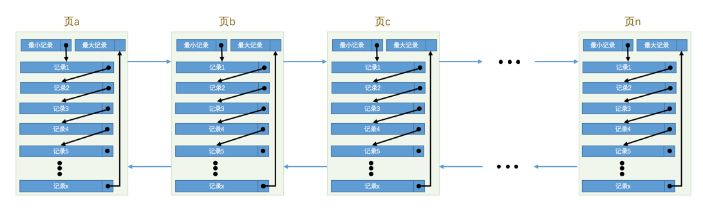
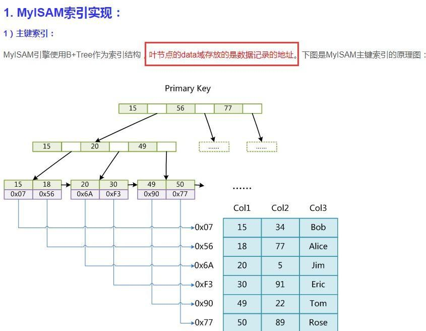

# 存储引擎

> 相关笔记来源《Mysql是怎么样运行的》

页是 MySQL 中磁盘和内存交互的基本单位，也是 MySQL 是管理存储空间的基本单位

## InnoDb

- 底层是B+树：非叶子节点只有键值，叶子节点包含完整数据
- InnoDB 是一个将表中的数据存储到磁盘上的存储引擎
- InnoDB 读取磁盘的方式：将数据划分为若干个页，以页作为磁盘和内存之间交互的基本单位，InnoDB中页的大小一般为 16 KB

> 也就是在一般情况下，一次最少从磁盘中读取16KB的内容到内存中，一次最少把内存中的16KB内容刷新到磁盘中


### InnoDB行格式：待补充

我们平时是以记录为单位来向表中插入数据的，这些记录在磁盘上的存放方式也被称为 行格式 或者 记录格式 。

 InnoDB 存储引擎的到现在为止设计了4种不同类型的 行格式 ，

分别是 Compact 、 Redundant 、Dynamic 和 Compressed 行格式


指定行格式：

```mysql
CREATE TABLE 表名 (列的信息) ROW_FORMAT=行格式名称
ALTER TABLE 表名 ROW_FORMAT=行格式名称
```


### InnoDB数据页结构

 InnoDB 数据页的7个组成部分，各个数据页可以组成一个 **双向链表** ，而每个数据页中的记录会按照主键值从小到大的顺序组成一个 **单向链表** ，每个数据页都会为存储在它里边儿的记录生成一个**页目录** ，在通过主键查找某条记录的时候可以在 页目录 中使用**二分法**快速定位到对应的槽，然后再遍历该槽对应分组中的记录即可快速找到指定的记录



其中页a、页b、页c ... 页n 这些页可以不在物理结构上相连，只要通过双向链表相关联即可


### 查找流程

#### 在一个页中的查找

假设目前表中的记录比较少，所有的记录都可以被存放到一个页中，在查找记录的时候可以根据搜索条件的不同

分为两种情况

- 以主键为搜索条件

可以在 页目录 中使用二分法快速定位到对应的槽，然后再遍历该槽对应分组中的记录即可快速找到指定的记录

- 以其他列作为搜索条件

在数据页中并没有对非主键列建立所谓的 页目录 ，所以我们无法通过二分法快速定位相应的 槽 。这种情况下只能从 最小记录 开始依次遍历单链表中的每条记录，然后对比每条记录是不是符合搜索条件。

> 很显然，这种查找的效率是非常低的


#### 在很多页中查找

两步：

1. 定位到记录所在的页。

2. 从所在的页内中查找相应的记录。

在没有索引的情况下，不论是根据主键列或者其他列的值进行查找，由于我们并不能快速的定位到记录所在的
页，所以只能从第一个页沿着双向链表一直往下找，在每一个页中根据我们刚刚唠叨过的查找方式去查找指定的
记录。因为要遍历所有的数据页，所以这种方式显然是超级耗时的，如果一个表有一亿条记录，使用这种方式去
查找记录那要等到猴年马月才能等到查找结果。

因此，索引出台


### 聚簇索引

我们上边介绍的 B+ 树本身就是一个目录，或者说本身就是一个索引。它有两个特点：
1. 使用记录主键值的大小进行记录和页的排序，这包括三个方面的含义：
1. 页内的记录是按照主键的大小顺序排成一个单向链表。
2. 各个存放用户记录的页也是根据页中用户记录的主键大小顺序排成一个双向链表。
3. 存放目录项记录的页分为不同的层次，在同一层次中的页也是根据页中目录项记录的主键大小顺序排成
    一个双向链表。
2. B+ 树的叶子节点存储的是完整的用户记录

> 所谓完整的用户记录，就是指这个记录中存储了所有列的值（包括隐藏列）


我们把具有这两种特性的 B+ 树称为 聚簇索引 ，所有完整的用户记录都存放在这个 聚簇索引 的叶子节点处。

这种 聚簇索引 并不需要我们在 MySQL 语句中显式的使用 INDEX 语句去创建（后边会介绍索引相关的语句），
InnoDB 存储引擎会自动的为我们创建聚簇索引。

另外有趣的一点是，在 InnoDB 存储引擎中， 聚簇索引 就是数		据的存储方式（所有的用户记录都存储在了 叶子节点 ），也就是所谓的索引即数据，数据即索引。


### 为什么使用 B+ 树，而不使用 AVL 或者红黑树


## MyIsam

特征

不支持事务
读取操作的速度很快
是因为B+树的原因
不支持外键
它没有提供对数据库事务的支持
不支持行锁，因此当 INSERT(插入)或 UPDATE(更新)数据时即写操作需要锁定整个表，效率便会低一些


### 索引实现




## Memory


## Archive


## Fedrated


## 面试题

### Innodb 引擎为什么采用的是 B+ 树的索引

> 回答这个问题也要联想到B树和B+树的区别

- B+树只有叶子节点存放数据，而其他节点只存放索引，而 B 树每个节点都有 Data 域，所以相同大小的节点 B+树包含的索引比 B 树的索引更多
- 还有就是 B+树的叶子节点是通过链表连接的，所以找到下限后能很快进行区间查询，比 B树中序遍历快
- 减少随机io，B+树在叶子结点才会找到数据，而B树在非叶子结点就能找到
- B+树相对于B树，每个节点存储了更多的键值（key）和数据（data），并且每个节点拥有更多的子节点。基于这个特性，B+树查找数据读取磁盘的次数将会很少，数据的查找效率也会比二叉查找树高很多

> 简单回答
>
> 1，B+树只有叶子节点存放数据，所以能存更多的索引，对表进行全表扫描，只需要遍历叶子节点就可以 了，不需要遍历整棵B+树
>
> 2，减少随机io，B+树在叶子结点才会找到数据，而B树在非叶子结点就能找到
>
> 3，B+树的叶子节点是通过链表连接的，全表扫描速度更快


### InnoDb与MyIsam的区别


### InnoDb与MyIsam索引上的区别
