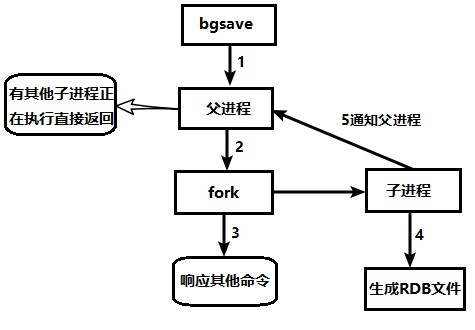
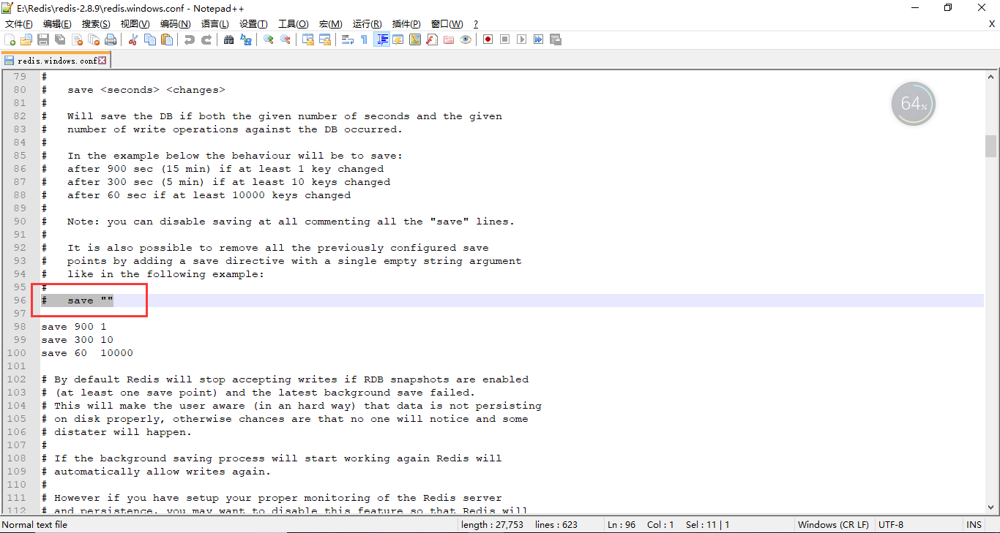
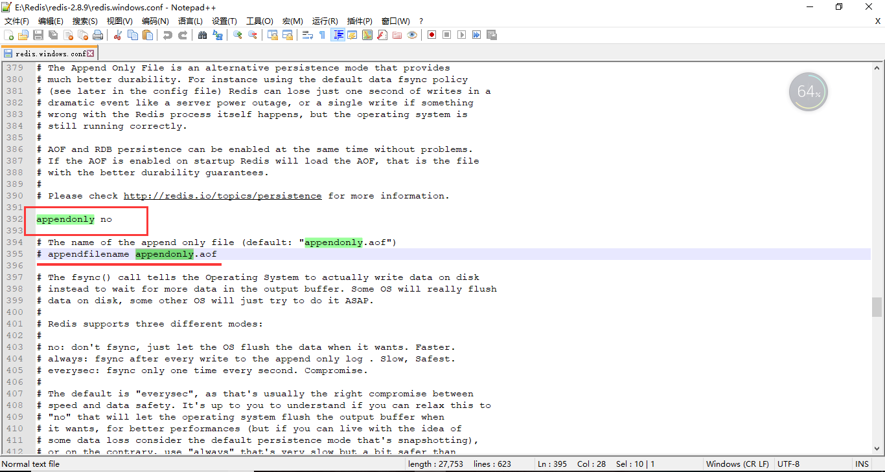

# Redis持久化

## 为什么要持久化？

Redis是个基于内存的数据库。那服务一旦宕机，内存中的数据将全部丢失。
通常的解决方案是从后端数据库恢复这些数据，但后端数据库有性能瓶颈，如果是大数据量的恢复，

1、会对数据库带来巨大的压力
2、数据库的性能不如Redis。导致程序响应慢。

所以对Redis来说，实现数据的持久化，避免从后端数据库中恢复数据，是至关重要的。


## 两者方式的区别

安全方面：

RDB可能会有丢失最后一次持久化操作的数据，AOF在everysec模式下可能会也会有丢失数据的问题

备份方面：

RDB在宕机后可以直接复制dump.rdb直接恢复，AOF在宕机后重新加载aof文件，效率低

磁盘方面：

RDB可以使用压缩算法对数据压缩，节约磁盘空间，AOF相比之下磁盘使用的更多

阻塞方面：

RBD在恢复数据时，会阻塞其他操作。AOF在no-appendfsync-on-rewrite开启时，不会阻塞，但是有数据丢失的问题。不开启时在重写操作时会有阻塞问题

稳定方面：

AOF每次读写都同步的话，有一定的性能压力。RDB在Fork的时候，内存中的数据被克隆了一份，大致2倍的膨胀性需要考虑


## RDB

在指定的时间间隔内将内存中的数据集快照写入磁盘， 也就是行话讲的Snapshot快照，它恢复时是将快照文件直接读到内存里

Redis会单独创建（fork）一个子进程来进行持久化，会先将数据写入到 一个临时文件中，待持久化过程都结束了，再用这个临时文件替换上次持久化好的文件。 整个过程中，主进程是不进行任何IO操作的，这就确保了极高的性能 如果需要进行大规模数据的恢复，且对于数据恢复的完整性不是非常敏感，那RDB方式要比AOF方式更加的高效。

RDB的缺点：最后一次持久化后的数据可能丢失

> 前10个数据持久化了，后面才进行5个为达到持久化的条件，此时Redis出问题了，这5个就丢失了


### forkchi

Fork的作用是复制一个与当前进程一样的进程。新进程的所有数据（变量、环境变量、程序计数器等） 数值都和原进程一致，但是是一个全新的进程，并作为原进程的子进程

在Linux程序中，fork()会产生一个和父进程完全相同的子进程，但子进程在此后多会exec系统调用，出于效率考虑，Linux中引入了“**写时复制技术**”

> 也就是先复制原数据进临时文件，然后在将其持久化

**一般情况父进程和子进程会共用同一段物理内存**，只有进程空间的各段的内容要发生变化时，才会将父进程的内容复制一份给子进程。


### 持久化流程




### dump.rdb

RDB持久化文件


### 配置

```java
save 900 1 		// 代表900秒内有一个key改变就持久化
save 300 10     // 代表300秒内有10个key改变就持久化
save 60  10000  // 代表60秒内有10000个key就持久化
```


#### save

save时只管保存，其它不管，全部阻塞（这样其他操作就无法进行）。手动保存。

> 默认是1分钟内改了1万次，或5分钟内改了10次，或15分钟内改了1次

> 不建议

关闭方式是：不设置或者传入空字符串

将其关闭也就意味着关闭了RDB




#### bgsave

**Redis**会在后台异步进行快照操作， **快照同时还可以响应客户端请求。**

> 可以通过lastsave 命令获取最后一次成功执行快照的时间
>
> Redis进程执行fork操作创建子进程，RDB持久化过程由子 进程负责，完成后自动结束。阻塞只发生在fork阶段（创建子线程阶段），一般时间很短


具体流程如下：

- redis客户端执行bgsave命令或者自动触发bgsave命令；
- 主进程判断当前是否已经存在正在执行的子进程，如果存在，那么主进程直接返回；
- 如果不存在正在执行的子进程，那么就fork一个新的子进程进行持久化数据，fork过程是阻塞的，fork操作完成后主进程即可执行其他操作；
- 子进程先将数据写入到临时的rdb文件中，待快照数据写入完成后再原子替换旧的rdb文件；
- 同时发送信号给主进程，通知主进程rdb持久化完成，主进程更新相关的统计信息（info Persitence下的rdb_*相关选项）。


### flushall

执行flushall命令，也会产生dump.rdb文件，但里面是空的，无意义


### stop-writes-on-bgsave-error

当Redis无法写入磁盘的话，直接关掉Redis的写操作。

> 推荐yes.


### rdbcompression 

对于存储到磁盘中的快照，可以设置是否进行压缩存储。

如果是的话，redis会采用LZF算法进行压缩。

如果你不想消耗CPU来进行压缩的话，可以设置为关闭此功能。

> 推荐yes.


### **rdbchecksum** 

在存储快照后，还可以让redis使用CRC64算法来进行数据校验，

但是这样做会增加大约10%的性能消耗，如果希望获取到最大的性能提升，可以关闭此功能

> 推荐yes.


### 备份

备份很简单，就是复制dump.rdb文件，在其失效后可以在运行redis的时候指定拷贝文件


### RDB优势

RDB文件是某个时间节点的快照，所以适合大规模的数据恢复

> 暂停其他的操作

对数据完整性和一致性要求不高更适合使用

> 在Redis崩溃时可能会造成数据的丢失

LZF算法进行压缩，节省磁盘空间

恢复速度快

> 直接运行拷贝的文件就可以恢复


### RBD劣势

RDB方式实时性不够，无法做到秒级的持久化

Fork的时候，内存中的数据被克隆了一份，大致2倍的膨胀性需要考虑，并且fork进程是重量级的，会阻塞主线程

虽然Redis在fork时使用了**写时拷贝技术**,但是如果数据庞大时还是比较消耗性能。

在备份周期在一定间隔时间做一次备份，所以如果Redis意外down掉的话，就会丢失最后一次快照后的所有修改。


**由于生产环境中我们为Redis开辟的内存区域都比较大（例如6GB），那么将内存中的数据同步到硬盘的过程可能就会持续比较长的时间，而实际情况是这段时间Redis服务一般都会收到数据写操作请求。那么如何保证数据一致性呢**？


RDB中的核心思路是Copy-on-Write，来保证在进行快照操作的这段时间，需要压缩写入磁盘上的数据在内存中不会发生变化。在正常的快照操作中，一方面Redis主进程会fork一个新的快照进程专门来做这个事情，这样保证了Redis服务不会停止对客户端包括写请求在内的任何响应。另一方面这段时间发生的数据变化会以副本的方式存放在另一个新的内存区域，待快照操作结束后才会同步到原来的内存区域。

举个例子：如果主线程对这些数据也都是读操作（例如图中的键值对 A），那么，主线程和 bgsave 子进程相互不影响。但是，如果主线程要修改一块数据（例如图中的键值对 C），那么，这块数据就会被复制一份，生成该数据的副本。然后，bgsave 子进程会把这个副本数据写入 RDB 文件，而在这个过程中，主线程仍然可以直接修改原来的数据。


**在进行快照操作的这段时间，如果发生服务崩溃怎么办**？

很简单，在没有将数据全部写入到磁盘前，这次快照操作都不算成功。如果出现了服务崩溃的情况，将以上一次完整的RDB快照文件作为恢复内存数据的参考。也就是说，在快照操作过程中不能影响上一次的备份数据。Redis服务会在磁盘上创建一个临时文件进行数据操作，待操作成功后才会用这个临时文件替换掉上一次的备份。


**可以每秒做一次快照吗**？

对于快照来说，所谓“连拍”就是指连续地做快照。这样一来，快照的间隔时间变得很短，即使某一时刻发生宕机了，因为上一时刻快照刚执行，丢失的数据也不会太多。但是，这其中的快照间隔时间就很关键了。

如下图所示，我们先在 T0 时刻做了一次快照，然后又在 T0+t 时刻做了一次快照，在这期间，数据块 5 和 9 被修改了。如果在 t 这段时间内，机器宕机了，那么，只能按照 T0 时刻的快照进行恢复。此时，数据块 5 和 9 的修改值因为没有快照记录，就无法恢复了


所以，要想尽可能恢复数据，t 值就要尽可能小，t 越小，就越像“连拍”。那么，t 值可以小到什么程度呢，比如说是不是可以每秒做一次快照？毕竟，每次快照都是由 bgsave 子进程在后台执行，也不会阻塞主线程。

这种想法其实是错误的。虽然 bgsave 执行时不阻塞主线程，但是，**如果频繁地执行全量快照，也会带来两方面的开销**：

- 一方面，频繁将全量数据写入磁盘，会给磁盘带来很大压力，多个快照竞争有限的磁盘带宽，前一个快照还没有做完，后一个又开始做了，容易造成恶性循环。
- 另一方面，bgsave 子进程需要通过 fork 操作从主线程创建出来。虽然，子进程在创建后不会再阻塞主线程，但是，fork 这个创建过程本身会阻塞主线程，而且主线程的内存越大，阻塞时间越长。如果频繁 fork 出 bgsave 子进程，这就会频繁**阻塞主线程**了。

那么，有什么其他好方法吗？此时，我们可以做增量快照，就是指做了一次全量快照后，后续的快照只对修改的数据进行快照记录，这样可以避免每次全量快照的开销。这个比较好理解。

但是它需要我们使用额外的元数据信息去记录哪些数据被修改了，这会带来额外的**空间开销问题**。那么，还有什么方法既能利用 RDB 的快速恢复，又能以较小的开销做到尽量少丢数据呢？4.0版本中引入的RDB和AOF的混合方式。


针对RDB不适合实时持久化的问题，Redis提供了AOF持久化方式来解决


## AOF

**（Append Only File）**

以**日志**的形式来记录每个写操作（增量保存），将Redis执行过的所有写指令记录下来(**读操作不记录**)， **只许追加文件但不可以改写文件**，redis启动之初会读取该文件重新构建数据，

换言之，redis 重启的话就根据日志文件的内容将写指令从前到后执行一次以完成数据的恢复工作


### 持久化流程

（1）客户端的请求写命令会被append追加到AOF缓冲区内；

（2）AOF缓冲区根据AOF持久化策略[always,everysec,no]将操作sync同步到磁盘的AOF文件中；

（3）AOF文件大小超过重写策略或手动重写时，会对AOF文件rewrite重写，压缩AOF文件容量；

（4）Redis服务重启时，会重新load加载AOF文件中的写操作达到数据恢复的目的；


### 配置

默认是不开启的

> 这里要注意，当RDB和AOF同时开启时，系统默认读取AOF（ appendonly.aof文件）中的数据




### 恢复

如遇到AOF文件损坏，

### AOF同步频率

```
appendfsync always
```

始终同步，每次Redis的写入都会立刻记入日志；性能较差但数据完整性比较好

```
appendfsync everysec
```

每秒同步，每秒记入日志一次，如果宕机，本秒的数据可能丢失。

```
appendfsync no
```

redis不主动进行同步，把同步时机交给操作系统。


### Rewrite压缩

AOF采用文件追加方式，文件会越来越大。为避免出现此种情况，新增了重写机制, 当AOF文件的大小超过所设定的阈值时，Redis就会启动AOF文件的内容压缩， 只保留可以恢复数据的最小指令集

> 可以使用命令bgrewriteaof


重写原理

AOF文件持续增长而过大时，会fork出一条新进程来将文件重写(也是先写临时文件最后再rename)，redis4.0版本后的重写，是指上就是把rdb 的快照，以二级制的形式附在新的aof头部，作为已有的历史数据，替换掉原来的流水账操作。


```
no-appendfsync-on-rewrite=yes 
```

不写入aof文件只写入缓存，用户请求不会阻塞，但是在这段时间如果宕机会丢失这段时间的缓存数据。

```
no-appendfsync-on-rewrite=no
```

 还是会把数据往磁盘里刷，但是遇到重写操作，可能会发生阻塞

> Redis会记录上次重写时的AOF大小，
>
> 默认配置是当AOF文件大小是上次rewrite后大小的一倍且文件大于64M时触发


我们可以设置Redis什么时候重写

auto-aof-rewrite-percentage：设置重写的基准值，文件达到100%时开始重写（文件是原来重写后文件的2倍时触发）

auto-aof-rewrite-min-size：设置重写的基准值，最小文件64MB。达到这个值开始重写。


### 优势

备份机制更稳健，丢失数据概率更低。

可读的日志文本，通过操作AOF稳健，可以处理误操作。


### 劣势

比起RDB占用更多的磁盘空间。

恢复备份速度要慢。

每次读写都同步的话，有一定的性能压力。

存在个别Bug，造成恢复不能。


## 两者的选用

官方推荐两个都启用。

如果对数据不敏感，可以选单独用RDB。

不建议单独用 AOF，因为可能会出现Bug。

如果只是做纯内存缓存，可以都不用


## Redis持久化有哪些方式呢？为什么我们需要重点学RDB和AOF？

从严格意义上说，Redis服务提供四种持久化存储方案：RDB、AOF、虚拟内存（VM）和 DISKSTORE。

虚拟内存（VM）方式，从Redis Version 2.4开始就被官方明确表示不再建议使用，Version 3.2版本中更找不到关于虚拟内存（VM）的任何配置范例，Redis的主要作者Salvatore Sanfilippo还专门写了一篇论文，来反思Redis对虚拟内存（VM）存储技术的支持问题。


至于DISKSTORE方式，是从Redis Version 2.8版本开始提出的一个存储设想，到目前为止Redis官方也没有在任何stable版本中明确建议使用这用方式。在Version 3.2版本中同样找不到对于这种存储方式的明确支持。从网络上能够收集到的各种资料来看，DISKSTORE方式和RDB方式还有着一些千丝万缕的联系，不过各位读者也知道，除了官方文档以外网络资料很多就是大抄。


最关键的是目前官方文档上能够看到的Redis对持久化存储的支持明确的就只有两种方案（https://redis.io/topics/persistence）：RDB和AOF。