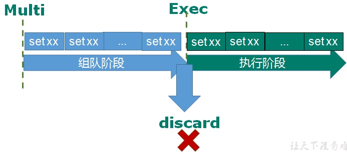

# 事务

Redis事务是一个单独的隔离操作：

- 事务中的所有命令都会序列化、按顺序地执行。
- 事务在执行的过程中，不会被其他客户端发送来的命令请求所打断。

Multi

> 开启事务，输入的命令进入命令队列中，但不会执行

Exec

> 将命令队列中的命令顺序执行

discard

> 停止

- 如果执行阶段某个命令报出了错误，则只有报错的命令不会被执行，而其他的命令都会执行，不会回滚。
- 组队中某个命令出现了报告错误，执行时整个的所有队列都会被取消

## 悲观锁

**悲观锁(Pessimistic Lock)**, 顾名思义，就是很悲观，每次去拿数据的时候都认为别人会修改，所以每次在拿数据的时候都会上锁，这样别人想拿这个数据就会block直到它拿到锁。**传统的关系型数据库里边就用到了很多这种锁机制**，比如**行锁**，**表锁**等，**读锁**，**写锁**等，都是在做操作之前先上锁。

> **传统的关系型数据库里边就用到了很多这种锁机制**，比如**行锁**，**表锁**等，**读锁**，**写锁**等，都是在做操作之前先上锁。

## 

## 乐观锁

**乐观锁(Optimistic Lock),** 顾名思义，就是很乐观，每次去拿数据的时候都认为别人不会修改，所以不会上锁，但是在更新的时候会判断一下在此期间别人有没有去更新这个数据，可以使用版本号等机制。

> **乐观锁适用于多读的应用类型，这样可以提高吞吐量**。
>
> Redis就是利用这种check-and-set机制实现事务的。

### WATCH key

在执行multi之前，先执行watch key1 [key2],可以监视一个(或多个) key ，

如果在事务执行之前这个(或这些) key 被其他命令所改动，那么事务将被打断。

### unwatch	

取消 WATCH 命令对所有 key 的监视

## Redis事务三特性

- 单独的隔离操作 
  - 事务中的所有命令都会序列化、按顺序地执行。事务在执行的过程中，不会被其他客户端发送来的命令请求所打断

- 没有隔离级别的概念 
  - 队列中的命令没有提交之前都不会实际被执行，因为事务提交前任何指令都不会被实际执行

- 不保证原子性 
  - 事务中如果有一条命令执行失败，其后的命令仍然会被执行，没有回滚 