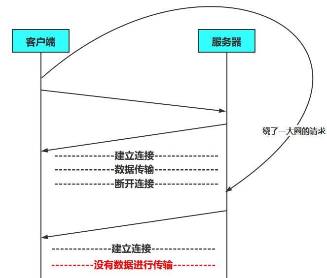

# 从输入URL到结果返回

## 一，输入URL

首先是理解URL，了解其组成

可以把URL分割成几个部分：协议、网络地址、资源路径

> **传送协议**： URL包含协议部分，是浏览器和www万维网之间的沟通方式，它会告诉浏览器正确在网路上找到资源位置
>
> 最常见的网络传输协议的是HTTP协议（超文本传输协议）（ https则是进行加密的网络传输）；其他也还有ftp 、file、 https、mailto 、git 等。还有自定义的协议（私有协议），例如tencent。不同协议有不同的通讯内容格式。
>
> **网络地址**： 指示该连接网络上哪一台计算机，可以是域名或者IP地址，可以包括端口号；
>
> **资源路径**： 指示从服务器上获取哪一项资源。

例如：  http://www.tutu.com/a

- 协议部分：http
- 网络地址：www.tutu.com
- 资源路径：/a

## 二，URL解析

我们输入的其实是域名，不是真正的地址，所以需要有解析的操作，解析成真实的地址，也就是IP地址

> **IP 地址**：IP 协议为互联网上的每一个网络和每一台主机分配的一个逻辑地址。IP 地址如同门牌号码，通过 IP 地址才能确定一台主机位置。服务器本质也是一台主机，想要访问某个服务器，必须先知道它的 IP 地址。
>
> **域名 DN（domain name ）**：域名是为了识别主机名称和组织机构名称的一种具有分层的名称。 IP 地址由四个数字组成，中间用点号连接，在使用过程中难记忆且易输错，所以用我们熟悉的字母和数字组合来代替纯数字的 IP 地址
>
> **计算机域名系统 DNS （ Domain Name System or Domain Name Service）**
>
> 它是由域名解析器和域名服务器组成的。 域名服务器是指保存有该网络中所有主机的域名和对应IP地址，并具有将域名转换为IP地址功能的服务器。 
>
> 每个域名都对应一个或多个提供相同服务的服务器的 IP 地址，只有知道服务器 IP 地址才能建立连接，所以需要通过 DNS 把域名解析成一个 IP 地址。

具体是怎么解析呢？

首先是 查询浏览器的DNS缓存，看看以前访问过没

再查询 系统中的DNS缓存，维护一张域名与IP地址对应表

再去看本机的HOST文件，里面有 ip 与 域名的映射

接着就会去查询DNS本地的缓存，没有则会把域名发送给本地区域服务器，看能不能找到，找不得则发起一个==迭代的DNS请求==

这里就涉及一个==DNS的迭代查询和递归查询==

> **递归查询**：客户端与服务器之间属于递归查询，即当客户机想DNS服务器发出请求后，若DNS服务器本身不能解析，会向另一个DNS服务器发出查询请求，最后将结果转交给客户端的过程。 服务器必须回答目标IP与域名的映射关系。
>
> **迭代查询**：DNS服务器之间属于迭代查询。服务器接收到一次迭代查询回复一次结果，这个结果不一定死目标IP与域名的映射关系，也可以是其他DNS服务器的地址。

## 三，请求

知道ip地址之后，就需要请求访问了

由于TCP/IP模型分四层，所以在发送数据时，每层都要对其进行封装

> 接收端则反之一步步解除封装，最终拿到HTTP数据

应用层 = 》 HTTP数据

传输层 = 》TCP 首部

网络层 = 》 IP首部

链路层 = 》以太网首部

这里涉及TCP头部封装后的数据报文格式如下

> 这里也涉及
>
> **TCP怎么保证通讯的可靠机制的？**

解读头部

- 源端口：源端口的作用是标识==报文的发送地址==【2字节】
- 目的端口：指明==接收方==的==应用程序端口==【2字节】

> TCP报头中的 源端口号 和 目的端口号 同 IP数据报 中的 源IP 与 目的IP **唯一确定**一条TCP连接

- 序号：是TCP==可靠传输的关键部分==【4字节】
  - 首部中的序列号字段是指本报文字段所发送的数据的第一个字节的序号
  - 比如：一个报文的序号字段为301，携带的数据有100，也就是说最后一个报文的序号为400，显然下一个报文的序号得从401开始
  - 这个字段的名称也称为“报文段序号”

> 在一个TCP连接中传送的字节流中的每一个字节都要按顺序编号，整个要传送的字节流的起始序号必须在连接建立时设置。

- 确认号：期望收到对方的下一个报文段的第一个数据自己的序号【4位】
  - 确认号只有当ACK标志为1时，才有效。比如建立连接时，SYN报文的ACK标志为0

> 比如：
>
> A收到B的字段，序号为501，数据长度为200，也就是接收了序号到700为止的数据
>
> 所以，A期望下一个报文序号为701，于是A将发送给B的确认报文段中把确认号置为701
>
> 同时
>
> 如果确认号=N，证明N-1千的数据都被正确接收

- 数据偏移：指出TCP报文的数据距离TCP报文段的起始处有多远【4位】
  - 实际上就是指出TCP报文段的首部长度
  - 因为首部有长度不确定的选项字段，因此数据偏移字段是必要的

> 数据偏移为4位，能表示到15，也就是最大值为60字节，也就是TCP首部的最大长度，选项长度不能超过40字节《计算机网络 第7版》

- 保留：保留今后使用，但**目前应都位0**【6位】

- 控制位：用来说明本报文段的性质 =》URG、ACK、PSH、RST、SYN、FIN

  - URG 紧急：当URG=1时，表明紧急指针字段有效。告诉系统**此报文段中有紧急数据**
  - ACK  确认：**当ACK=1时，确认号字段才有效，ACK=0，确认号无效**。TCP规定，在连接建立后所有报文的传输都必须把ACK置1
  - PSH 推送 ：当两个应用进程进行交互式通信时，有时在一端的应用进程希望在键入一个命令后立即就能收到对方的响应，这时候就将PSH=1，接收方收到PSH=1的消息时，会尽快的交付接收应用程序，而不是等到整个缓存都填满了后再交付、

  > 很少使用推送

  - RST 复位：当RST=1，表明TCP连接中出现严重差错，**必须释放连接，然后再重新建立连接**
  - SYN 同步：在连接建立时用来同步序号。当SYN=1，ACK=0，表明是连接请求报文，若同意连接，则响应报文中应该使SYN=1，ACK=1
  - FIN：终止，用来释放连接。当FIN=1，表明此报文的发送方的数据已经发送完毕，并且要求释放

- 窗口：**滑动窗口**大小，用来告知发送端**接受端的缓存大小**，以此控制发送端发送数据的速率，从而达到流量控制。窗口大小时一个16bits字段，因而窗口大小最大为65535。窗口值告诉对方，从本报文的段首部中的确认号算起，接收方目前允许对方发送的数据量。之所以有这个限制，是应为接收方的数据缓存空间是有限的。

  - 总之，窗口值作为接收方让发送端设置其发送窗口的依据

- 校验和：奇偶校验，此校验和是对整个的 TCP 报文段，包括 TCP 头部和 TCP 数据，以 16 位字进行计算所得。由发送端计算和存储，并由接收端进行验证
- 紧急指针：只有当 **URG 标志置 1 时紧急指针才有效**。紧急指针是一个正的偏移量，和顺序号字段中的值相加表示紧急数据最后一个字节的序号。 TCP 的紧急方式是发送端向另一端发送紧急数据的一种方式
  - 值得注意的是，窗口值为0也可以发送紧急数据

- **选项和填充**：最常见的可选字段是最长报文大小，又称为MSS（Maximum Segment Size），每个连接方通常都在通信的第一个报文段（为建立连接而设置SYN标志为1的那个段）中指明这个选项，它表示本端所能接受的最大报文段的长度。选项长度不一定是32位的整数倍，所以要加填充位，即在这个字段中加入额外的零，==以保证TCP头是32的整数倍==

- 数据部分： TCP 报文段中的数据部分是可选的。**在一个连接建立和一个连接终止时，双方交换的报文段仅有 TCP 首部**。如果一方没有数据要发送，也使用没有任何数据的首部来确认收到的数据。在处理超时的许多情况中，也会发送不带任何数据的报文段

要发送的内容准备好了，现在可以连接了

### 1，TCP连接

要想请求资源，HTTP协议首先是要求建立连接，也就是TCP的三次握手，需要在客户和服务端之间交换三个TCP报文段

第一次握手：客户端首先胡创建==传输控制模块TCB== ，然后发送`SYN=1，初始序号：seq=X`的数据包给服务端，此时，客户端进入`SYN-SENT（同步已发送）`状态

> TCP规定。SYN数据报不能携带数据，但是消耗一个序号

第二次握手：服务端收到请求报文后，如果同意连接，则向客户端发送给确认报文`SYN=1,ACK=1，确认号：ack=X+1`的数据包，同时为自己选择一个初始序号`seq=Y`，发送之后服务端进入`SYN-RCVD（同步收到）`状态

> 这个报文也不能携带数据，也消耗一个序号

第三次握手：客户端收到确认后，也要给服务端确认。客户端返回`ACK=Y+1，确认号：ack=Y+1`数据包，序号为`X+1`，这个时候客户端进入`ESTABLISHED`状态,此时，TCP连接以及建立，当服务端收到确认后，也进入`ESTABLISHED`状态

> TCP规定。ACK报文可以携带数据，但是如果不携带数据则不消耗序号，也就是说下一个序号还是`X+1`
>

额外注意

（1）服务端第一次接收客户端的SYN报文时，返回的报文可以拆分成2个，先是`ACK=1,ack=x+1`，再是`SYN=1,seq=Y`，这样也就是 "4次握手"

（2）**握手过程中传送的包里不包含数据**，三次握手完毕后，客户端与服务器才正式开始传送数据。理想状态下，TCP连接一旦建立，在通信双方中的任何一方主动关闭连接之前，TCP 连接都将被一直保持下去。

提问

**为什么不是两次握手呢？**

> 明明服务端已经接收了请求，并且发送了确认报文以及SYN同步报文，为什么这个时候还不能发消息呢？

这主要是为了防止已经失效的连接请求报文段突然又传送到了服务端，而产生错误 --《计算机网络 谢希仁》

为了解决“网络中存在延迟的重复分组”的问题  --《计算机网络》 

> 这是为了**避免服务器建立无用连接**（客户端服务器建立连接后，却不传输数据）
>
> 如果只进行两次握手，如果客户端向服务器第一次发送的建立连接的请求因为某原因，**兜兜转转绕了一大圈才到达服务器**。这期间客户端因为未收到服务器的响应，就会再次发送连接请求，这时服务器收到了，向客户端发送连接请求后，连接便建立了。然后数据传输完毕后，释放连接。**这时刚刚兜兜转转一大圈的建立连接的请求到了服务器**，服务器收到后再次向客户端发送请求，发送后又建立了连接，但是建立连接后客户端没有再理会服务器，客户端与服务器之间没有传输数据，此时服务器的资源就会被浪费

提问

为什么不能是四次握手呢？

> 我参考的资料中是这么解释的：[从输入URL到浏览器显示页面的流程 - Nyima's Blog (gitee.io)](https://nyimac.gitee.io/2020/12/10/URL访问服务器流程/#三、建立TCP连接)
>

**因为通信不可能100%可靠**（红军蓝军约定）， 而上面的三次握手已经做好了通信的准备工作， **再增加握手， 并不能显著提高可靠性**，所以只需要三次握手就足够了

这里简单介绍一下**红军蓝军约定**

> 红军和蓝军都想消灭一波敌人，但是单凭他们一个军队的力量都不足以消灭这波敌人，因此他们想到了一起合作，于是红军向蓝军发了一封电报，内容是约定好早上8点一起向敌军进攻，由于他们不确定蓝军是否一定能收到电报, 所以只有收到蓝军的回复之后才会进行进攻，而蓝军也是同样的想法，因为他们不确定红军一定能收到自己的回复而在约定好的时间发动进攻，所以他们只有收到红军的回复后才发动进攻….
>
> 问怎样才能保证这次战役一定胜利呢？答案是不可能的，因为**双方都对于自己发出的消息对方是否一定接收得到存在质疑**，所以，这样的通信将一直进行下去，结果将是使胜利的几率一直接近100%，但是却永远达不到100%。

另一个简单回答

我们都知道，请求资源中TCP连接比较消耗资源，按道理次数应该更少，避免浪费

**如果四次，那么就造成了浪费，因为在三次结束之后，就已经可以保证A可以给B发信息，A可以收到B的信息； B可以给A发信息，B可以收到A的信息**

### 2，HTTP请求

在建立好连接之后，就可以发送HTTP请求了

> HTTP超文本协议：在浏览器和服务器之间的请求和响应的交互，必须按照规定的格式和遵循一定的规则。这些格式和规定就是超文本传输协议 HTTP

请求报文结构如下

> 有人提到过这一步下还有一个查询MAC地址的操作，即，ARP协议

我们知道，网络层使用的IP地址，但是在实际网络的链路上传送数据帧时，最终还是必须使用该网络的硬件地址

ARP协议的作用，就是为了从网络层使用的IP地址，解析出在数据链路层使用的硬件地址

那么问题来了：为什么不直接使用MAC地址，而是使用抽象的IP？

> 全世界有着各种各样的网络，他们使用不用的硬件技术。要想使得这些异构网络能互相通信，就必须进行非常复杂的硬件地址转换工作，因此由用户主机来完成这样的事是不可能的。但是IP编址就不一样了，连接互联网的主机都有一个唯一的IP，他们的通信非常简单。而调用ARP的复杂过程由计算机软件自动完成，用户来说不可见
>
> 《计算机网络 第7版》

以上，都是属于计算机网络层面的知识

### 3，服务器处理请求

服务器端收到请求后的由web服务器（准确说应该是http服务器）处理请求

web服务器解析用户请求，知道了需 要调度哪些资源文件，再通过相应的这些资源文件处理用户请求和参数，并调用数据库信息，最后将结果通过web服务器返回给浏览器客户端。

> 我想，很多时候都是使用的TomCat作为web服务器
>
> 或者：Apache、Nginx、LLS

他们会接收请求，并且将其投送到特定的应用

以常用的`Spring Web`为例

Spring MVC 中的 DispatcherServlet 充当了 Web 应用中的 Serlvet，负责将任务分配给对应的Controller，并将最终视图返回给 Web 容器

> 这里就不涉及MVC的处理请求过程了

### 4，服务器响应请求

服务器处理完请求后，就会发送响应结果

同时附带对应的状态码

## 四，关闭

### 1，关闭TCP连接

关闭TCP连接，也就是所谓的四次挥手

关闭之前，先阐述两者的状态，都是处于 `ESTABLISHED`状态

第一次挥手：客户端发送 `FIN = 1,seq = u`的连接释放报文段，此后客户端停止发送数据，主动关闭TCP连接。并进入`FIN-WAIT-1（终止等待1）状态`	

> 在FIN报文之前发送出去的数据，如果没有收到对应的ack确认报文，客户端依然会重发这些数据
>
> seq=u：u等于前面已经传送过来的数据的最后一个字节的序号加1
>
> TCP规定，FIN报文段即使不携带数据，也要消耗一个序号

第二次挥手：服务器收到`连接释放FIN报文`后，发送一个  `ACK = 1`给对方并且带上自己的序列号`seq = v`。此时，**服务端就进入了CLOSE-WAIT**（关闭等待）状态。TCP服务器通知高层的应用进程，客户端向服务器的方向就释放了，这时候处于半关闭状态，即客户端已经没有数据要发送了，**但是服务器若发送数据，客户端依然要接受**。这个状态还要持续一段时间，也就是整个CLOSE-WAIT状态持续的时间

客户端收到后，进入**FIN-WAIT-2**（终止等待2）状态，等待服务器发送连接释放报文（在这之前还需要接受服务器发送的最后的数据）

第三次挥手：在服务器器已经没有消息发送给客户端时，这个时候就会同时TCP释放连接。服务器必须发送`FIN=1释放报文`，以及确认号必须是上次发送过的确认号`ack=u+1`用来关闭服务器到客户端的数据传送，也就是通知客户端，可以真正地释放连接了。由于在半关闭状态，服务器很可能又发送了一些数据，假定此时的序列号为seq=w，此时，**服务器就进入了LAST-ACK**（最后确认）状态，等待客户端的确认

第四次挥手：客户端收到消息后，必须发送确认报文，ACK=1，确认号ack= w+1，自己的序号为 seq = u+1（因为上一个FIN报文是u），客户端进入`TIME-WAIT(时间等待)状态`。

此时，服务端收到客户端的确认报文，就会进入`CLOSE` 状态，撤销TCB后，就结束了这次的TCP连接

但是，此时TCP连接没有断开，客户端**必须经过时间等待计时器（Time-Wait timer）设置的时间2MSL后**，且客户端撤销相应的TCB后，才进入CLOSED状态，也就是结束了此次TCP连接

> 时间MSL叫做最长报文寿命（Maximum Segment Lifetime），RFC 793建议是设置为2分钟，报文在网络上存在的最长时间，超过这个时间报文将被丢弃
>
> TCP允许不同的实现可以根据具体情况使用更小的MSL值
>
> 所以 2MSL 就是 4分钟，4分钟后，客户端才会进入 CLOSE 状态

提问

**为什么必须要等待2MSL呢？**

> 一，**保证客户端发送的最后一个ACK报文能够到达服务器**，因为这个ACK报文可能丢失。服务器在发送 ACK-FIN 报文后，一定时间后依旧没有收到确认报文，服务器就会超时重传这个 ACK-FIN 报文，如果客户端在这个2MSL时间内收到了这个重传的ACK-FIN请求报文。这时就重传一次确认，重新启动2MSL计时器。最后，都进入 CLOSE 状态
>
> 如果不等这个2MSL，发送 ACK 报文之后，就释放了。那么就有可能收不到 重传的 ACK-FIN 报文，也就不会发送确认报文，这样服务器就进入不了 CLOSE 状态
>
> 二，防止类似与三次握手中提到了的**已经失效的连接请求报文段**出现在本连接中。客户端发送完最后一个确认报文后，在这个2MSL时间中，就可以**使本连接持续的时间内所产生的所有报文段都从网络中消失**（最长生存MSL）。**这样新的连接中不会出现旧连接的请求报文**

## 五，浏览器加载

这一步就是浏览器的加载，解析，渲染

- 解析html，生成dom树
- 解析css，生成cssom树
- 将dom树和cssom树合并，生成渲染树
- 遍历渲染树，开始布局和计算
- 绘制渲染树，显示到屏幕

