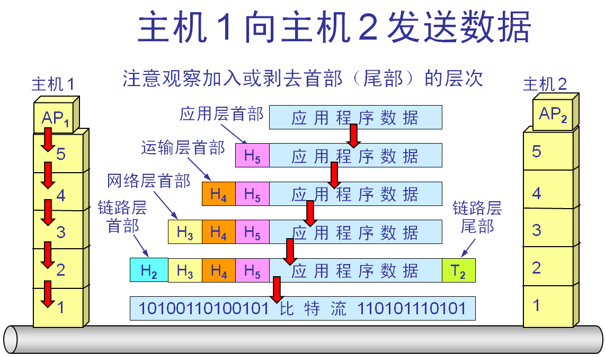
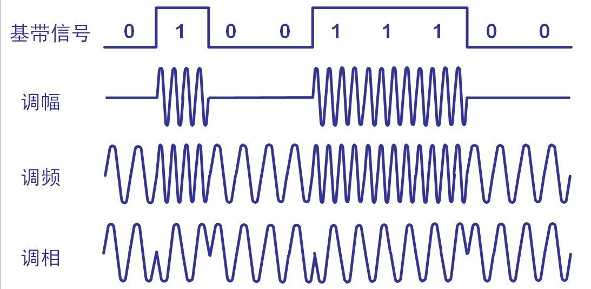
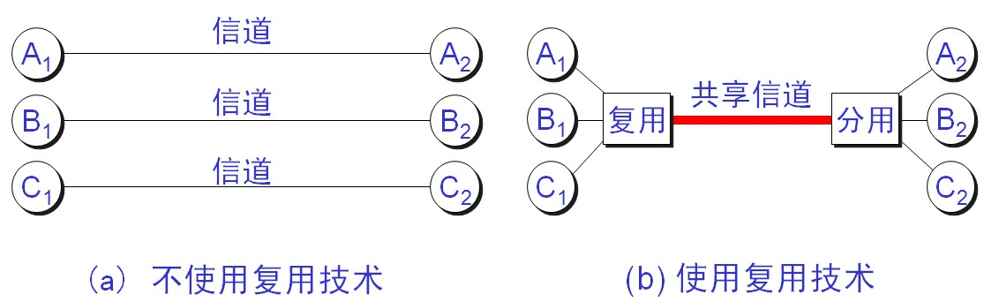

# 计算机网络面试补充

## 5层协议




## 二元制调制方法




## 信道复用




频分复用 FDM(Frequency Division Multiplexing)

用户在分配到一定的频带后，在通信过程中自始至终都占用这个频带。

频分复用的所有用户在同样的时间占用不同的带宽资源（请注意，这里的“带宽”是频率带宽而不是数据的发送速率）。


时分复用TDM(Time Division Multiplexing)

码分复用 CDM(Code Division Multiplexing)

> [网络基础(1) - 计算机网络基础部分梳理 | Java 全栈知识体系 (pdai.tech)](https://pdai.tech/md/develop/protocol/dev-protocol-network-basic.html#21-物理层的基本概念)


## 幂等性

幂等的 HTTP 方法，同样的请求被执行一次与连续执行多次的效果是一样的，服务器的状态也是一样的。换句话说就是，幂等方法不应该具有副作用(统计用途除外)。

所有的安全方法也都是幂等的。

在正确实现的条件下，GET，HEAD，PUT 和 DELETE 等方法都是幂等的，而 POST 方法不是。

GET /pageX HTTP/1.1 是幂等的，连续调用多次，客户端接收到的结果都是一样的:

```text
GET /pageX HTTP/1.1
GET /pageX HTTP/1.1
GET /pageX HTTP/1.1
GET /pageX HTTP/1.1
```

POST /add_row HTTP/1.1 不是幂等的，如果调用多次，就会增加多行记录:

```text
POST /add_row HTTP/1.1   -> Adds a 1nd row
POST /add_row HTTP/1.1   -> Adds a 2nd row
POST /add_row HTTP/1.1   -> Adds a 3rd row
```

DELETE /idX/delete HTTP/1.1 是幂等的，即便不同的请求接收到的状态码不一样:

```text
DELETE /idX/delete HTTP/1.1   -> Returns 200 if idX exists
DELETE /idX/delete HTTP/1.1   -> Returns 404 as it just got deleted
DELETE /idX/delete HTTP/1.1   -> Returns 404
```


## HTTP状态码

状态码分类


| 100  | Continue            | 继续，客户端应继续其请求                                     |
| ---- | ------------------- | ------------------------------------------------------------ |
| 101  | Switching Protocols | 切换协议。服务器根据客户端的请求切换协议。只能切换到更高级的协议，例如，切换到HTTP的新版本协议 |


| 200  | OK                            | 请求成功。一般用于GET与POST请求                              |
| ---- | ----------------------------- | ------------------------------------------------------------ |
| 201  | Created                       | 已创建。成功请求并创建了新的资源                             |
| 202  | Accepted                      | 已接受。已经接受请求，但未处理完成                           |
| 203  | Non-Authoritative Information | 非授权信息。请求成功。但返回的meta信息不在原始的服务器，而是一个副本 |
| 204  | No Content                    | 无内容。服务器成功处理，但未返回内容。在未更新网页的情况下，可确保浏览器继续显示当前文档 |
| 205  | Reset Content                 | 重置内容。服务器处理成功，用户终端（例如：浏览器）应重置文档视图。可通过此返回码清除浏览器的表单域 |
| 206  | Partial Content               | 部分内容。服务器成功处理了部分GET请求                        |


| 300  | Multiple Choices   | 多种选择。请求的资源可包括多个位置，相应可返回一个资源特征与地址的列表用于用户终端（例如：浏览器）选择 |
| ---- | ------------------ | ------------------------------------------------------------ |
| 301  | Moved Permanently  | 永久移动。请求的资源已被永久的移动到新URI，返回信息会包括新的URI，浏览器会自动定向到新URI。今后任何新的请求都应使用新的URI代替 |
| 302  | Found              | 临时移动。与301类似。但资源只是临时被移动。客户端应继续使用原有URI |
| 303  | See Other          | 查看其它地址。与301类似。使用GET和POST请求查看               |
| 304  | Not Modified       | 未修改。所请求的资源未修改，服务器返回此状态码时，不会返回任何资源。客户端通常会缓存访问过的资源，通过提供一个头信息指出客户端希望只返回在指定日期之后修改的资源 |
| 305  | Use Proxy          | 使用代理。所请求的资源必须通过代理访问                       |
| 306  | Unused             | 已经被废弃的HTTP状态码                                       |
| 307  | Temporary Redirect | 临时重定向。与302类似。使用GET请求重定向                     |


| 400  | Bad Request                     | 客户端请求的语法错误，服务器无法理解                         |
| ---- | ------------------------------- | ------------------------------------------------------------ |
| 401  | Unauthorized                    | 请求要求用户的身份认证                                       |
| 402  | Payment Required                | 保留，将来使用                                               |
| 403  | Forbidden                       | 服务器理解请求客户端的请求，但是拒绝执行此请求               |
| 404  | Not Found                       | 服务器无法根据客户端的请求找到资源（网页）。通过此代码，网站设计人员可设置"您所请求的资源无法找到"的个性页面 |
| 405  | Method Not Allowed              | 客户端请求中的方法被禁止                                     |
| 406  | Not Acceptable                  | 服务器无法根据客户端请求的内容特性完成请求                   |
| 407  | Proxy Authentication Required   | 请求要求代理的身份认证，与401类似，但请求者应当使用代理进行授权 |
| 408  | Request Time-out                | 服务器等待客户端发送的请求时间过长，超时                     |
| 409  | Conflict                        | 服务器完成客户端的 PUT 请求时可能返回此代码，服务器处理请求时发生了冲突 |
| 410  | Gone                            | 客户端请求的资源已经不存在。410不同于404，如果资源以前有现在被永久删除了可使用410代码，网站设计人员可通过301代码指定资源的新位置 |
| 411  | Length Required                 | 服务器无法处理客户端发送的不带Content-Length的请求信息       |
| 412  | Precondition Failed             | 客户端请求信息的先决条件错误                                 |
| 413  | Request Entity Too Large        | 由于请求的实体过大，服务器无法处理，因此拒绝请求。为防止客户端的连续请求，服务器可能会关闭连接。如果只是服务器暂时无法处理，则会包含一个Retry-After的响应信息 |
| 414  | Request-URI Too Large           | 请求的URI过长（URI通常为网址），服务器无法处理               |
| 415  | Unsupported Media Type          | 服务器无法处理请求附带的媒体格式                             |
| 416  | Requested range not satisfiable | 客户端请求的范围无效                                         |
| 417  | Expectation Failed              | 服务器无法满足Expect的请求头信息                             |


| 500  | Internal Server Error      | 服务器内部错误，无法完成请求                                 |
| ---- | -------------------------- | ------------------------------------------------------------ |
| 501  | Not Implemented            | 服务器不支持请求的功能，无法完成请求                         |
| 502  | Bad Gateway                | 作为网关或者代理工作的服务器尝试执行请求时，从远程服务器接收到了一个无效的响应 |
| 503  | Service Unavailable        | 由于超载或系统维护，服务器暂时的无法处理客户端的请求。延时的长度可包含在服务器的Retry-After头信息中 |
| 504  | Gateway Time-out           | 充当网关或代理的服务器，未及时从远端服务器获取请求           |
| 505  | HTTP Version not supported | 服务器不支持请求的HTTP协议的版本，无法完成处理               |