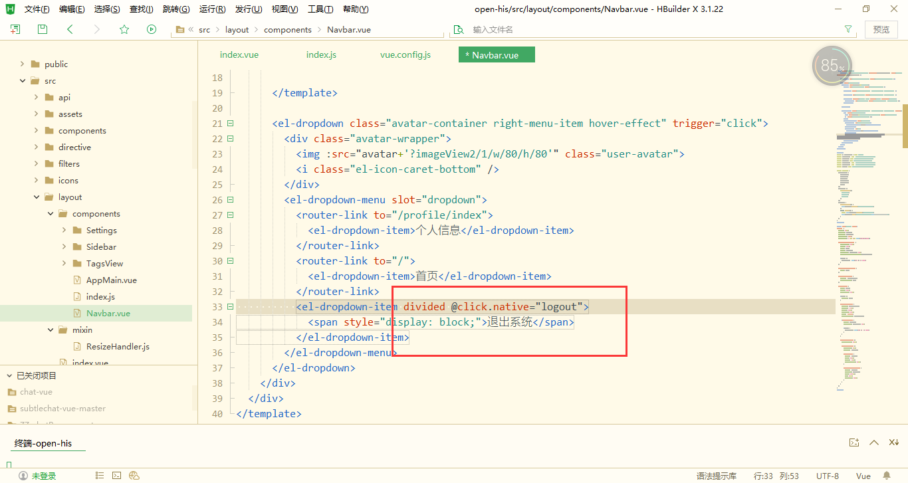
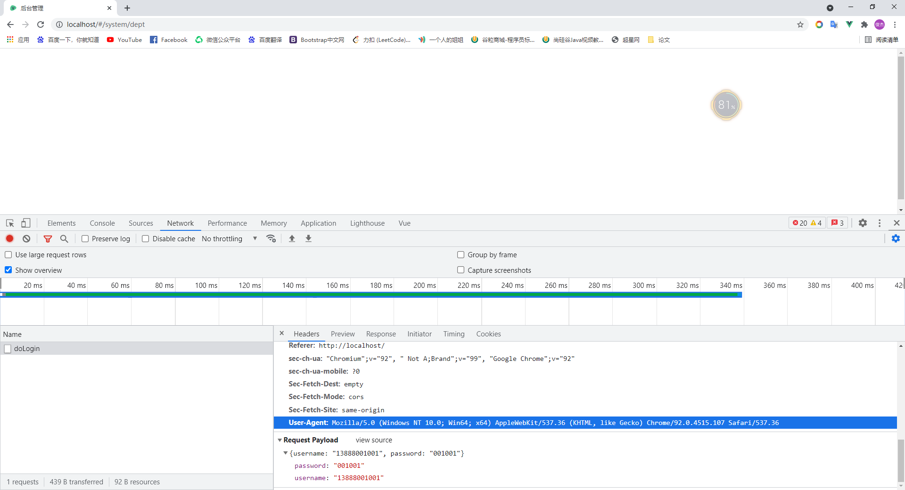

# Open-His医疗项目

## 项目架构

```
his-commons
	constants//存放系统常量
```

## 项目启动


## 数据库

### 科室


### 排班信息

主要就是操作2个表：用户表和排班表

1，需要用户属于那个科室（部门）

2，需要用户是否参排班（scheduling_flag）

> scheduling_flag 是否为0

3，操作排班表，将排班信息和用户信息整体封装，返回给前端

> 排班表封装了 用户id，科室id，排班时间


### 挂号

主要操作几个表：

挂号项目表（sys_registered_item）：存放挂号信息（挂号名称，费用等）是个基础表

排班表

挂号表（his_registration）：存放与挂号操作有关的信息（类似于一种订单）


### 接诊

主要操作几个表：

挂号信息表（his_registration）

> 也就是涉及到：
>
> 查找那些待就诊状态的挂号信息
>
> 接诊就是 修改挂号信息为 接诊中，并且添加接诊的用户id，即医生（谁给他接诊）

病例历史表（his_care_history）

> 一个病人可能有多个病例表，保存病例后存入病例历史表中

药用处方表（his_care_order）

> 给病人开的处方药表订单，是一个总表

开诊细表（his_care_order_item）

> 给病人开的处方药表，是一个附表，记录了处方药表订单汇中详细的处方药信息，即开了哪些药


### 检查

主要操作

检查项目表（sys_check_item）

> 也即是 医院可以提供哪些检查项目

检查结果表（his_check_result）

> 也就是和检查相关的所有信息

药用处方表（his_care_order）、开诊细表（his_care_order_item）

> 原因是只有开了 检查处方，才会生成检查表信息，查询时也是查询处方表中哪些是检查


## 遇到问题

```java
public class ShiroLoginFilter extends FormAuthenticationFilter {
    /**
     * 在访问controller前判断是否登录，返回json，不进行重定向。
     * @param request
     * @param response
     * @return true-继续往下执行，false-该filter过滤器已经处理，不继续执行其他过滤器
     * @throws Exception
     */
    @Override
    protected boolean onAccessDenied(ServletRequest request, ServletResponse response) throws Exception {
        HttpServletResponse httpServletResponse = (HttpServletResponse) response;
        httpServletResponse.setCharacterEncoding("UTF-8");
        httpServletResponse.setContentType("application/json");
        Result result = Result.fail();
        result.put("code", HttpStatus.UNAUTHORIZED);
        result.put("msg", "登录认证失效，请重新登录!");
        //import com.alibaba.fastjson.JSON;
        // 这样的写入，前端使用什么去接收呢？
        httpServletResponse.getWriter().write(JSON.toJSON(result).toString());
        return false;
    }

}
```

--

```java
/**
 * 认证
 * @param token
 * @return
 * @throws AuthenticationException
 */
@Override
protected AuthenticationInfo doGetAuthenticationInfo(AuthenticationToken token) throws AuthenticationException {
    // 为什么这样就能获取到手机号码
    String phone = token.getPrincipal().toString();
    return null;
}
```

回答：
在登录的时候会调用Login方法

```
subject.login(token);
```

这个方法就是从这个token中获取的用户名信息，这里的用户名是使用的手机号，所以能获取到手机号码

--

```java
/**
 * 这个方法是做什么用的？
 * @return
 */
@Override
public String getName() {
    // getSimpleName （）得到当前类的简写名称
    return this.getClass().getSimpleName();
}
```

--

```java
@NoArgsConstructor
注解在类上，为类提供一个无参的构造方法。
@AllArgsConstructor
使用后添加一个构造函数，该构造函数含有所有已声明字段属性参数
```

--

BaseDto有什么作用？

因为前端使用的是vue+element-ui，所以很多分页数据前端会给我们分好，后端需要知道的就是当前页和页数，就能实现分页查询，继承了BaseDto就能带有这些属性

--

这里的logout是哪里的logout



系统自带的logout

--

在DictDataServiceImpl中

使用了updateById，但是原文中使用的update，不晓得的有没有冲突

```java
@Override
public int update(DictDataDto dictDataDto) {
    DictData dictData=new DictData();
    BeanUtil.copyProperties(dictDataDto,dictData);
    //设置修改人
    dictData.setUpdateBy(dictDataDto.getSimpleUser().getUserName());
    return this.dictDataMapper.updateById(dictData);

}
```

----


在OperLogDto中的EqualsAndHashCode，使用文档的callSuper为true，但是程序报错，需要把callSuper除掉，

不知道会不会给程序带来影响

> 回答：应该是idea的问题，之后便自己消失了
>
> 补充：应该是需要其继承一个父类，才会不报错，因为这个注解的作用也就是可以调用父类的方法

```java
/**
 * 日志管理传输对象
 * @author 涂涂
 */
@Data
@EqualsAndHashCode
@AllArgsConstructor
@NoArgsConstructor
public class OperLogDto {
```

-----


登录的controller中，User-Agent 这个请求头是谁发送出来的

```java
/**
 * 得到用户的登陆信息
 * @param request
 * @return
 */
private LoginInfo createLoginInfo(HttpServletRequest request) {
    LoginInfo loginInfo=new LoginInfo();
    final UserAgent userAgent = UserAgent.parseUserAgentString(request.getHeader("User-Agent"));
    final String ip = IpUtils.getIpAddr(request);
    String address = AddressUtils.getRealAddressByIP(ip);
    loginInfo.setIpAddr(ip);
    loginInfo.setLoginLocation(address);
    // 获取客户端操作系统
    String os = userAgent.getOperatingSystem().getName();
    // 获取客户端浏览器
    String browser = userAgent.getBrowser().getName();
    loginInfo.setOs(os);
    loginInfo.setBrowser(browser);
    loginInfo.setLoginTime(DateUtil.date());
    loginInfo.setLoginType(Constants.LOGIN_TYPE_SYSTEM);
    return loginInfo;
}
```

回答：



-----


问题出现在roleserviceImpl中

```java
@Override
public void saveRoleUser(Long userId, Long[] roleIds) {
    //根据用户ID先删除 sys_role_menu 里面原来的数据
    this.roleMapper.deleteRoleUserByUserIds(Arrays.asList(userId));
    /**
     * 这里为啥不使用mybatis中的foreach，而是再外面用代码嵌套for循环执行
     */
    for (Long roleId : roleIds) {
        this.roleMapper.saveRoleUser(userId,roleId);
    }
}
```

-----


在Dubbo中一直没能识别出提供者

原因是使用了错误的注解，服务没有暴露出去

```java
import org.apache.dubbo.config.annotation.Service;
@Service
public class ProducterServiceImpl implements ProducterService{}
```

-----

netflix的使用

首先是暴露服务，这样才会被消费者发现

```java
import org.apache.dubbo.config.annotation.Service;
@Service
```

再开启Dubbo服务

```java
@EnableDubbo
```

再使用

```java
@Reference
private PatientService patientService;


// 并在调用的controller方法内声明
@HystrixCommand
```


----


解决非幂等操作的重试问题（62集）

```java
/**
 *  * methods = {@Method(name = "addProducter",retries = 0)
 *  * 代表当前类里面的addProducter这个主就去只调一次，不重试
 */
@Service(methods = {@Method(name = "addProducter",retries = 0)})
public class ProducterServiceImpl implements ProducterService{}
```

----


这里是对什么进行匹配？

在 `ProviderServiceImpl ` 中

```java
qw.and(StringUtils.isNotBlank(providerDto.getContactTel()), new Consumer<QueryWrapper<Provider>>() {
    @Override //(tel like ? or mobile like ?)
    public void accept(QueryWrapper<Provider> providerQueryWrapper) {
        providerQueryWrapper.like(Provider.COL_CONTACT_TEL,providerDto.getContactTel())
                .or().like(Provider.COL_CONTACT_MOBILE,providerDto.getContactTel());
    }
});
```

-----


解决iworkid过大的问题（在雪花算法的工具类中）

```java
// 这里注销掉有什么作用？
workId = NetUtil.ipv4ToLong(NetUtil.getLocalhostStr());
log.info("当前机器的工作ID为:" + workId);
```


问题：很多地方都是需要 SimpleUser 这个对象的，那么前端是怎么获取当前user，并传到后台去的呢？


问题：在	PurchaseServiceImpl 类中，@Transactional 没有设置rollback属性


问题：QueryWrapper的使用


问题：前台中对字典的翻译


问题：解决org.apache.shiro.session.UnknownSessionException: There is no session with id的问题

```java
@Bean
public DefaultWebSessionManager defaultWebSessionManager(RedisSessionDAO redisSessionDao) {
    DefaultWebSessionManager defaultWebSessionManager = new DefaultWebSessionManager();
    defaultWebSessionManager.setSessionDAO(redisSessionDao);
    Cookie cookie = new SimpleCookie("Work");
    defaultWebSessionManager.setSessionIdCookie(cookie);
    return defaultWebSessionManager;
}
```


问题

```java
public SchedulingDto(
    Long userId, Long deptId, String subsectionType, Map<String,String> map) 
{
    this.userId = userId;
    this.subsectionType = subsectionType;
    this.record = map;
    this.deptId=deptId;
}
```

以及

```java
public class SchedulingFormDto extends BaseDto {
    private SimpleUser simpleUser;

    private String beginDate;

    private List<SchedulingData> data;

    /**
     * 封装一个内部类的用意是什么？满足前端数据需要
     */
    @Data
    public static class SchedulingData implements Serializable {
        private Long userId;
        private Long deptId;
        private String subsectionType; //上午 下午  晚上
        //星期的值班值
        private Collection<String> schedulingType;
    }

}

```


问题：排班信息的3个传输类，怎么个使用的法，前端又怎么去封装传递数据


问题：使用了json忽略这些字段，那么前端是怎么封装呢？

回答：这样json就可以不用带这个参数

```java
@TableField(value = "password")
@JsonIgnore
private String password;
```


问题：继承baseController的原因是什么

```java
@DefaultProperties(defaultFallback = "fallback")
public class PatientController extends BaseController {
	// 处理全局调用异常
}
```

--

问题：再单独查询中

都是根据id进行查询，前端这么写是为什么？

```typescript
const deptId = row.deptId || this.ids
```


问题：//    @HystrixCommand的使用


## 分页查询

后端

1，接收一个Dto传输类，通过其携带的参数进行查询

返回的是封装好的DataGridVo对象，只包括两个属性，针对element-ui的分页插件

```java
public class DataGridVo implements Serializable {
    //数据数量
    private Long total;
	//表格数据
    private List<?> data;
}
```

以 科室 为例

```java
@GetMapping("listDeptForPage")
public Result listDeptForPage(DeptDto deptDto) {
    DataGridVo gridView = this.deptService.listPage(deptDto);
    return Result.success("查询成功", gridView.getData(), gridView.getTotal());
}
```

2，通过mybatis查询对象QueryWrapper以及分页对象Page进行条件分页查询

利用QueryWrapper中的方法，实现sql语句的拼接

有属性值的就查询，没有的就不查询

```java
public DataGridVo listPage(DeptDto deptDto) {
        /**
         * 这里也就是为什么Dto要继承BaseDto的原因
         */
        Page<Dept> page=new Page<>(deptDto.getPageNum(), deptDto.getPageSize());
        // 查询对象
        QueryWrapper<Dept> qw=new QueryWrapper<>();
        // 科室名称
        qw.like(StringUtils.isNotBlank(deptDto.getDeptName()), Dept.COL_DEPT_NAME, deptDto.getDeptName());
        // 科室状态
        qw.eq(StringUtils.isNotBlank(deptDto.getStatus()), Dept.COL_STATUS, deptDto.getStatus());
        // 开始时间
        qw.ge(deptDto.getBeginTime()!=null, Dept.COL_CREATE_TIME,deptDto.getBeginTime());
        // 结束时间
        qw.le(deptDto.getEndTime()!=null,Dept.COL_CREATE_TIME,deptDto.getEndTime());
        // 根据order_num排序
        qw.orderByAsc(Dept.COL_ORDER_NUM);
        this.deptMapper.selectPage(page,qw);
        return new DataGridVo(page.getTotal(),page.getRecords());
    }
```

前端

基本上封装了查询参数

```javascript
// 科室表格数据
deptTableList: [],
// 查询参数
queryParams: {
    pageNum: 1,
    pageSize: 10,
    deptName: undefined,
    status: undefined
},
```

再给服务器发送消息

```typescript
// addDateRange 方法是封装开始日期和结束日期
// dateRange 是时间范围
listDeptForPage(this.addDateRange(this.queryParams, this.dateRange)).then(res => {
    this.deptTableList = res.data
    this.total = res.total
    this.loading = false// 关闭遮罩
})
```

同时也设计到分页插件的使用

```html
<el-pagination
      v-show="total>0"
      :current-page="queryParams.pageNum"
      :page-sizes="[5, 10, 20, 30]"
      :page-size="queryParams.pageSize"
      layout="total, sizes, prev, pager, next, jumper"
      :total="total"
      @size-change="handleSizeChange"
      @current-change="handleCurrentChange"
/>
```

以及其方法

```typescript
// 分页pageSize变化时触发
handleSizeChange(val) {
    this.queryParams.pageSize = val
    // 重新查询
    this.getDeptList()
},
// 点击上一页  下一页，跳转到哪一页面时触发
handleCurrentChange(val) {
    this.queryParams.pageNum = val
    // 重新查询
    this.getDeptList()
},
```


## 缓存

这里的缓存很简单，其实就是使用Redis，存放常用的信息，比如字典


## 日志管理

1，自定义`Log`注解

```java
// 在commons包下
@Target({ ElementType.PARAMETER, ElementType.METHOD })
@Retention(RetentionPolicy.RUNTIME)
@Documented	
public @interface Log {}
```

2，编写切面类`OperLogAspect`

```java
@Aspect
@Component
@Log4j2
public class OperLogAspect {
    @Autowired
    private OperLogService operLogService;
	/**
     * 切入点：用自动以注解修饰的都视为切入点
     */
    @Pointcut("@annotation(com.tutu.commons.aspectj.annotation.Log)")
    public void logPointCut(){}

    /**
     * 处理完之后执行
     */
    @AfterReturning(pointcut = "logPointCut()",returning = "jsonResult")
    public void doAfterReturning(JoinPoint joinPoint,Object jsonResult){
        // 封装了一系列的操作
        handleLog(joinPoint, null, jsonResult);
    }

    /**
     * 出现异常后执行
     */
    @AfterThrowing(value = "logPointCut()", throwing = "e")
    public void doAfterThrowing(JoinPoint joinPoint, Exception e)
    {
        handleLog(joinPoint, e, null);
    }
}
```

3，可能会需要一个Servlet的工具类，用来获取request中携带的信息

```java
public class ServletUtils {
    /**
     * 获取request
     */
    public static HttpServletRequest getRequest()
    {
        return getRequestAttributes().getRequest();
    }

    /**
     * 获取response
     */
    public static HttpServletResponse getResponse()
    {
        return getRequestAttributes().getResponse();
    }

    /**
     * 获取方法的请求上下文
     * @return
     */
    public static ServletRequestAttributes getRequestAttributes()
    {
        RequestAttributes attributes = RequestContextHolder.getRequestAttributes();
        return (ServletRequestAttributes) attributes;
    }

}
```

4，在对应的Controller上添加自定义的Log注解

```java
@Log(title = "删除用户登录日志",businessType = BusinessType.DELETE)
```


## 操作日志管理

操作日志一般用到切面编程

1，自定义注解

```java
@Target({ ElementType.PARAMETER, ElementType.METHOD })
@Retention(RetentionPolicy.RUNTIME)
@Documented
public @interface Log
{
    /**
     * 模块 
     */
    public String title() default "";

    /**
     * 功能
     */
    public BusinessType businessType() default BusinessType.OTHER;

    /**
     * 操作人类别
     */
    public OperatorType operatorType() default OperatorType.MANAGE;

    /**
     * 是否保存请求的参数
     */
    public boolean isSaveRequestData() default true;
}
```

2，枚举 操作状态

```java
public enum BusinessStatus
{
    /**
     * 成功
     */
    SUCCESS,

    /**
     * 失败
     */
    FAIL,
}
```

3，枚举 业务类型

```java
public enum BusinessType
{
    /**
     * 其它
     */
    OTHER,

    /**
     * 新增
     */
    INSERT,

    /**
     * 修改
     */
    UPDATE,

    /**
     * 删除
     */
    DELETE,

    /**
     * 授权
     */
    GRANT,

    /**
     * 导出
     */
    EXPORT,

    /**
     * 导入
     */
    IMPORT,

    /**
     * 强退
     */
    FORCE,

    /**
     * 生成代码
     */
    GENCODE,
    
    /**
     * 清空数据
     */
    CLEAN,
}
```

3，创建ServletUtils工具类

```JAVA
/**
 * 客户端工具类
 * @author 涂涂
 */
public class ServletUtils {
    /**
     * 获取request
     */
    public static HttpServletRequest getRequest()
    {
        return getRequestAttributes().getRequest();
    }

    /**
     * 获取response
     */
    public static HttpServletResponse getResponse()
    {
        return getRequestAttributes().getResponse();
    }

    /**
     * 获取方法的请求上下文
     * @return
     */
    public static ServletRequestAttributes getRequestAttributes()
    {
        RequestAttributes attributes = RequestContextHolder.getRequestAttributes();
        return (ServletRequestAttributes) attributes;
    }
}
```

4，创建OperLogAspect切面类用来记录操作日志

```java
@Aspect
@Component
@Log4j2
public class OperLogAspect {
    @Autowired
    private OperLogService operLogService;

    /**
     * 切入点：用自动以注解修饰的都视为切入点
     */
    @Pointcut("@annotation(com.tutu.commons.aspectj.annotation.Log)")
    public void logPointCut(){}

    /**
     * 处理完之后执行
     * @param joinPoint
     * @param jsonResult
     */
    @AfterReturning(pointcut = "logPointCut()",returning = "jsonResult")
    public void doAfterReturning(JoinPoint joinPoint,Object jsonResult){
        handleLog(joinPoint, null, jsonResult);
    }

    /**
     * 出现异常后执行
     * @param joinPoint 切点
     * @param e 异常
     */
    @AfterThrowing(value = "logPointCut()", throwing = "e")
    public void doAfterThrowing(JoinPoint joinPoint, Exception e)
    {
        handleLog(joinPoint, e, null);
    }


    /**
     * 是否存在注解，如果存在就获取
     */
    private Log getAnnotationLog(JoinPoint joinPoint) throws Exception
    {
        Signature signature = joinPoint.getSignature();
        MethodSignature methodSignature = (MethodSignature) signature;
        Method method = methodSignature.getMethod();

        if (method != null)
        {
            return method.getAnnotation(Log.class);
        }
        return null;
    }
    /**
     * 获取注解中对方法的描述信息 用于Controller层注解
     *
     * @param log 日志
     * @param operLog 操作日志
     * @throws Exception
     */
    public void getControllerMethodDescription(JoinPoint joinPoint, Log log, OperLog operLog) throws Exception
    {
        // 设置action动作
        operLog.setBusinessType(String.valueOf(log.businessType().ordinal()));
        // 设置标题
        operLog.setTitle(log.title());
        // 设置操作人类别
        operLog.setOperatorType(log.operatorType().ordinal());
        // 是否需要保存request，参数和值
        if (log.isSaveRequestData())
        {
            // 获取参数的信息，传入到数据库中。
            setRequestValue(joinPoint, operLog);
        }
    }
    /**
     * 获取请求的参数，放到log中
     *
     * @param operLog 操作日志
     * @throws Exception 异常
     */
    private void setRequestValue(JoinPoint joinPoint, OperLog operLog) throws Exception
    {
        String requestMethod = operLog.getRequestMethod();
        if (HttpMethod.PUT.name().equals(requestMethod) || HttpMethod.POST.name().equals(requestMethod))
        {
            String params = argsArrayToString(joinPoint.getArgs());
            operLog.setOperParam(StringUtils.substring(params, 0, 2000));
        }
        else
        {
            Map<?, ?> paramsMap = (Map<?, ?>) ServletUtils.getRequest().getAttribute(HandlerMapping.URI_TEMPLATE_VARIABLES_ATTRIBUTE);
            operLog.setOperParam(StringUtils.substring(paramsMap.toString(), 0, 2000));
        }
    }

    /**
     * 参数拼装
     */
    private String argsArrayToString(Object[] paramsArray)
    {
        String params = "";
        if (paramsArray != null && paramsArray.length > 0)
        {
            for (int i = 0; i < paramsArray.length; i++)
            {
                if (!isFilterObject(paramsArray[i]))
                {
                    Object jsonObj = JSON.toJSON(paramsArray[i]);
                    params += jsonObj.toString() + " ";
                }
            }
        }
        return params.trim();
    }

    /**
     * 判断是否需要过滤的对象。
     *
     * @param o 对象信息。
     * @return 如果是需要过滤的对象，则返回true；否则返回false。
     */
    public boolean isFilterObject(final Object o)
    {
        return o instanceof MultipartFile || o instanceof HttpServletRequest
                || o instanceof HttpServletResponse;
    }
	// 开始方法
    // 加 final 是防止方法内修改对象信息
    protected void handleLog(final JoinPoint joinPoint, final Exception e, Object jsonResult)
    {
        try
        {
            // 获得注解
            Log controllerLog = getAnnotationLog(joinPoint);
            if (controllerLog == null)
            {
                return;
            }

            // 获取当前的用户
            User loginUser = ShiroSecurityUtils.getCurrentUser();

            // *========数据库日志=========*//
            OperLog operLog = new OperLog();
            operLog.setStatus(String.valueOf(BusinessStatus.SUCCESS.ordinal()));
            // 请求的地址
            String ip = IpUtils.getIpAddr(ServletUtils.getRequest());
            operLog.setOperIp(ip);
            String address = AddressUtils.getRealAddressByIP(ip);
            operLog.setOperLocation(address);
            // 返回参数
            operLog.setJsonResult(JSON.toJSONString(jsonResult));

            operLog.setOperUrl(ServletUtils.getRequest().getRequestURI());
            if (loginUser != null)
            {
                operLog.setOperName(loginUser.getUserName());
            }

            if (e != null)
            {
                operLog.setStatus(String.valueOf(BusinessStatus.FAIL.ordinal()));
                operLog.setErrorMsg(StringUtils.substring(e.getMessage(), 0, 2000));
            }
            // 设置方法名称
            String className = joinPoint.getTarget().getClass().getName();
            String methodName = joinPoint.getSignature().getName();
            operLog.setMethod(className + "." + methodName + "()");
            // 设置请求方式
            operLog.setRequestMethod(ServletUtils.getRequest().getMethod());
            // 处理设置注解上的参数
            getControllerMethodDescription(joinPoint, controllerLog, operLog);
            //设置操作时间
            operLog.setOperTime(new Date());
            // 保存数据库
            operLogService.insertOperLog(operLog);
        }
        catch (Exception exp)
        {
            // 记录本地异常日志
            log.error("==前置通知异常==");
            log.error("异常信息:{}", exp.getMessage());
            exp.printStackTrace();
        }
    }
}
```

5，然后就可以在方法上使用注解

```java
@Log(title = "修改字典数据",businessType = BusinessType.UPDATE)
```


## 安全登录逻辑


## 添加操作

项目中对于表的添加，大多是使用一个前后端得传输对象`Dto`，再进过后端的处理，转换为真正的实体类

大部分使用的是`Beanutils`中的拷贝

```java
Dept dept=new Dept();
BeanUtil.copyProperties(deptDto,dept);
// 在将一些没有的字段setter
```

这样便完成了封装，就可以使用mybatis直接操纵数据库了


## 角色与权限

不同的角色，可以进行的操作时不同的，所见的菜单也是不同的，没有相关操作权限的角色是不可以

1，菜单表

除了基础的属性外，有2个字段代表着父子关系，1个字段代表是目录还是菜单

```java
parent_id 
// 0 代表着顶层父类
// 对应着菜单表的menu_id，parent_id == menu_id 说明是父子关系    
    
parent_ids
// 这个字段仅仅是象征意义，没有实际的用途
menu_type
// M 为 目录
// C 为 菜单
```

查询语句为

```sql
SELECT menu_id,parent_id,parent_ids,menu_name,menu_type,percode,path,remark,status,create_time,update_time,create_by,update_by 
FROM 
sys_menu 
```

2，角色表

角色表本身没有什么特殊的地方，需要注意的是，使用了中间表，sys_role_menu

中间表包括2个字段

```java
role_id // 对应角色的主键
menu_id // 对应菜单的主键
```

3，操作方式

其实给角色分配权限的方式很简单，就是获取需要添加的权限，以及对应的角色，通过中间表来表明其对应关系

```xml
<insert id="saveRoleMenu">
	insert  into sys_role_menu(role_id, menu_id) values(#{roleId},#{menuId})
</insert>
```

对于权限（menu）/ 角色 （role）的删除，需要对中间表进行操作，然后在删除对应的表字段


## Dubbo服务调用


## 采购入库

stock_purchase是单据主表

|--stock_purchase_item 单据详情表

stock_inventory_log 入库详情


1，未提交---相当于新添加一的一个单据

2，待审核--由未提交状态或者审核失败状态---提单审核之后进入待审核状态

3，审核通过--管理员审核之后确定通过之后的状态---可以入库了

4，审核失败--管理员认为单据有问题，失败---用户可以再重新编辑再提交审核

5，作废--管理员认为没必要采购，所以作废，或者用户提交订单之后发现录错，可以直接作废


这里没有使用activity，那么是否可以用activity代替这样的审核方式呢