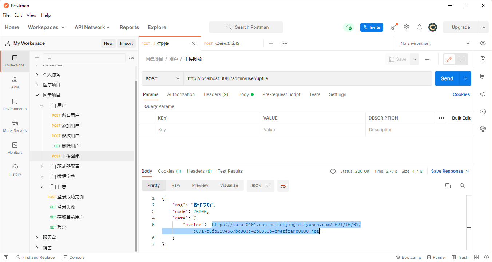
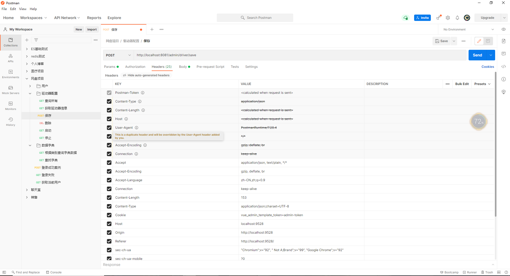
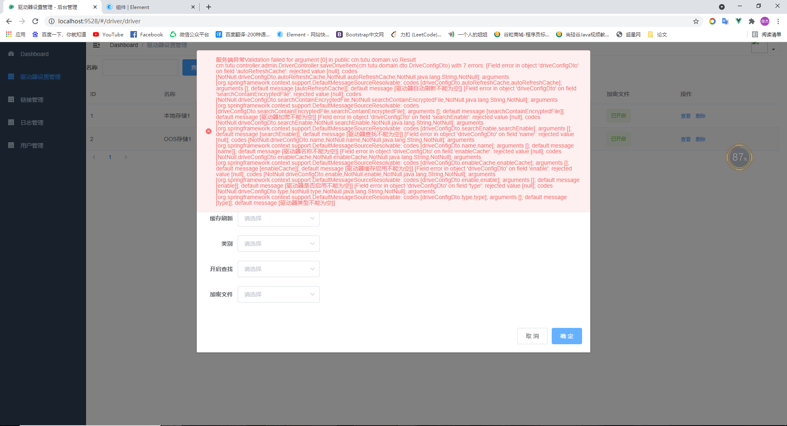

# 共享网盘开发日志

## 1，`Shiro`安全登录功能开发

> 开发中遇到  `@RequestBody`  失效的现象，并且如何  `json字符串`  和实体类字段大小写不一致都不会识别出来
>
> 解决办法：
>
> 在实体元素字段中添加
>
> ```java
> @JsonProperty("json字符串")
> private Integer userId;
> ```

基本的安全登录已经完成

主要是前端的设置比较麻烦

1，在`requesrt.js`中设置请求携带token

2，在`model/user.js`中设置请求方法， 并利用getter设置全局的变量：name，avatar，token

3，如果有必要，可以去`permissnion.js`中设置拦截

现在还差角色的管理，以及针对用户的增删改查

-----

这里考虑到后面会很多次用到shiro中的相关方法，可以写一下工具类，方便获取

`ShiroSecurityUtils`

-----

**发现问题1：**

发现前端有Bug

logout不会跳转到首页面

以及，后端重启后，所有请求会失效

-----


设计用户表

```mysql
CREATE TABLE user(
	`user_id` int PRIMARY KEY auto_increment NOT NULL COMMENT '用户id',
	`user_name` VARCHAR(10) NOT NULL COMMENT '用户名',
	`pass_word` VARCHAR(10) NOT NULL COMMENT '密码',
	`avater` VARCHAR(255)  COMMENT '图像',
	`gmt_create` datetime COMMENT '创建时间',
	`gmt_update` datetime COMMENT '更新时间'
)
```

发现自己不知道时间该怎么存

发现：datetime =》 2020-08-07 10:03:56

图片就可以使用 阿里云的 OOS 存

```mysql
INSERT INTO 
user(user_name,pass_word,avater,gmt_create) 
VALUES 
('root','root','https://tutu-0101.oss-cn-beijing.aliyuncs.com/tutus/2020/06/21/avter.jpg','2020-08-07 10:03:56');
```

角色就不必了

> 反悔了，试一试角色吧

-----

在处理用户时，发现有个功能需要使用到图像上传

### 额外：用户图像处理

-----

整合oos

```xml
<!-- 图片上传 SDK 阿里云oss -->
<dependency>
	<groupId>com.aliyun.oss</groupId>
	<artifactId>aliyun-sdk-oss</artifactId>
	<version>2.8.3</version>
</dependency>
```


编写 Utils 方便使用配置问价中需要的几个常量

通过阿里云的文档，通过oss实例进行文件的上传





------

**发现异常1**

我发现查询用户数据时，更新时间一直查不到，看一看控制台打印的sql语句，但是又查到了，传过来的时候就变成null了

经过排除发现

是映射出现了错误，映射更新语句的字段写错了

`gmtUpdate`写错`gmtUpdte`

-----


## 3，驱动器的增删改查

> 遇到问题：后端没有异常处理，不能将异常信息返回给前端
>
> 这里的异常包括：
>
> 1，重复启动/停止驱动器配置的异常
>
> 2，查询为空，数据不存在的异常

--

> 由于shiro安全登录没有完全完成，所以放了所有的拦截
>
> 前端也没有把请求url写死，而是使用自带的登录逻辑，所以我必须设置一个跨域

--

> 在处理驱动器的时候，需要使用到数据库中的字典
>
> 因此还需要专门有个controller去处理数据字典，这就开始第4步的开发

-----

**发现异常1**

```
2021-09-26 17:25:15.873  WARN 15208 --- [nio-8081-exec-8] .w.s.m.s.DefaultHandlerExceptionResolver : 
Resolved [org.springframework.http.converter.HttpMessageNotReadableException: I/O error while reading input message; 
nested exception is org.apache.catalina.connector.ClientAbortException: 
java.io.EOFException: Unexpected EOF read on the socket]
```

**处理**

PostMan 请求通过，但是前后端出错，Get请求又没有问题，Json也没有问题，就去看 请求




加上一些请求头之后，发现原本可以的请求变的不行了，那就去找VUE前端的问题

```javascript
before: require('./mock/mock-server.js') // vue.config.js
```

将其删除，登录失败

使用自己的方法，同时在`permission.js`文件中，不去判断token，直接放行，这样就解决了登录问题

同时也解决了我的post请求问题

-----

**发现异常2**

在处理字段的时候，没有做空值判断，导致数据库中没数据

> 因为自己设置数据库字段都是可以为空的，方便开发

**处理**

第七步处理

-----

**发现异常3**

发现分页插件总是返回total为0，但是数据查询到了

**处理**

说明分页插件没有搞好，需要配置

```java
@Configuration
public class MybatisPlusConfig {
    @Bean
    public PaginationInterceptor paginationInterceptor(){
        return new PaginationInterceptor();
    }
}
```

-----

**发现异常4**：前端的异常，bug，就是切换页的时候，如果输入框中有东西，会带着一起查，小BUG

-----


## 4，字典数据类型的增删改查

> 开发字典的同时，觉得得有日志一点点的记录，开启了第5步

-----

安全问题

> 在查询数据字典的时候，使用了迭代器，不知道会不会有安全的问题，笔记如果有其他线程的修改就会导致失败

-----

性能问题

> 同样也是在查询数据字典的时候，都是使用copyProperties进行的复制，会有性能问题吗？

与此同时，出现了异常

```
com.fasterxml.jackson.databind.exc.InvalidDefinitionException: 
No serializer found for class cm.tutu.domain.dto.DictDataDto and no properties discovered to create BeanSerializer
(to avoid exception, disable SerializationFeature.FAIL_ON_EMPTY_BEANS) (through reference chain: cm.tutu.domain.vo.Result["data"]->java.util.ArrayList[0])
```

解决办法

```
@JsonIgnoreProperties(value = {"hibernateLazyInitializer"})
```

问题是能执行了，但是赋值失败，所以我还是换个方式吧

```java
// 记录原来的方法，方便以后查阅
public List<DictDataDto> findByType(String dictType) {
    QueryWrapper<DictData> queryWrapper = new QueryWrapper<>();
    queryWrapper.eq(DictData.DICT_TYPE,dictType);
    List<DictData> data = dictDataMapper.selectList(queryWrapper);
    /**
         * 不知道迭代器是否会有安全问题
         */
    Iterator<DictData> iterator = data.iterator();
    List<DictDataDto> list = new ArrayList<>();
    while (iterator.hasNext()){
        DictData dict = iterator.next();
        DictDataDto dictDataDto = new DictDataDto();
        /**
             * 以及这里会不会有性能问题
             */
        BeanUtil.copyProperties(dict,dictDataDto);
        list.add(dictDataDto);
    }
    return list;
}
```

--

最终解决：原来是自己没有加@Data


## 5，日志管理开发

1，自定义注解`Log`

2，定义操作功能枚举 `BusinessType`

3，操作状态枚举`BusinessStatus`

4，创建 `ServletUtils` 客户端工具类，去获取Request，Response，方便后面记录请求信息

5，创建切面类 `OperLogAspect`

> 参照了一些别人切面类的写法
>
> 1，通过反射获取注解

6，考虑到要获取和使用IP，因此需要一个IP工具类 `IPUtil`

7，了解了ip，那么就可以知道请求的地址在那里，所以需要一个地址的工具类`AddressUtils`,这些需要第三方的支持，所以要手动写个`HttpUtils`去给第三方发送相关的请求

8，最后就可以在controller上 使用@Log 注解，就能完成日志的记录

基本完成


## 6，全局异常处理

使用这个异常处理类就好了

我这里是拦截所有的异常，针对不同的异常可以写不同的方法

```java
@ControllerAdvice
public class myExceptionHandler {
    /**
     * 拦截处理所有异常
     * @param e
     * @return
     */
    @ExceptionHandler(value = Exception.class)
    @ResponseBody
    public Result ErrorHandler(Exception e) {
        return Result.fail("服务端异常"+e.getMessage());
    }
}
```


## 7，引入字段非空判断

使用以下注解修饰字段

```
import javax.validation.constraints.NotNull;
```

在对应的控制器上加入 @Validated

```
public Result saveDriveItem(@RequestBody @Validated DriveConfigDto driveConfigDto) {}
```

测试使用失效，不知道错在哪里

发现

> @NotNull，不会检测长度为0的字符串

所以先数据库搞个默认值

在设置默认值的时候，发现，数据库有些字段是不能为空的，但是一样也插入进去了，估计前端传过来的字符串有问题

hhh，结果又可以了，@NotNull 生效了



最后配上一个异常处理

```java
@ExceptionHandler(value = MethodArgumentNotValidException.class)
@ResponseBody
public Result MethodArgumentNotValidExceptionHandler(Exception e) {
    return Result.fail("字段异常");
}
```


## 8，存储策略

很烦，在编写驱动器的代码的时候没有考虑到一些驱动器需要一些存储策略信息，不然根本加载不出来，使用不了驱动器

所以新增加实体“存储策略（Storage strategy）”

但是想了想，数据库里不可能存这样的字段

有些不会有，有些有，那么有些字段就是多余的，这样只会完成功能，面向业务开发

我就想

我可不可以，使用一个HashMap来存放这些信息，信息的key值用数据库的字典存放（又或者专门搞个表，用类似key-value的形式，用主外键联系是属于哪个驱动的）

试一试！

在前后端处理HashMap这个字段的时候出现了异常，json 的格式错误

```
Caused by: com.fasterxml.jackson.core.io.JsonEOFException: Unexpected end-of-input in field name
```

测试之后，发现是自己之前测试驱动器异常时对请求头进行了修改

其中就有`Content-Length` 这个请求头

-----

再次改变主意，应该使用List保存Storage strategy实体，在进行数据库处理

------

**异常1**

要处理list信息，sql连接url要加上

```
allowMultiQueries=true
```

-----

处理完更新的操作后，一时间不知道怎么去搞 添加操作

我得先添加 驱动，然后 再去查驱动，得到驱动id，在用这个id，添加 存储策略，不知道这样会不会显得多余

网上查了一些，说是

> MP官方在执行insert之后会将主键回填到我们的实体类中，如图，通过get方法就可以拿到主键

试一试

确实可以

-----

当集合中只有一个时，没有异常

```json
{
    "id":"",
    "enable":"1",
    "name":"阿里云OOS21",
    "enableCache":"1",
    "autoRefreshCache":"1",
    "type":"1",
    "searchEnable":"1",
    "searchContainEncryptedFile":"1",
    "storageStrategyList":[
        {
            "strategyKey":"bucketName",
            "strategyValue":"das"
        },
    ]    
}
```

但是

这样的就是错误的

```json
{
    "id":"",
    "enable":"1",
    "name":"阿里云OOS21",
    "enableCache":"1",
    "autoRefreshCache":"1",
    "type":"1",
    "searchEnable":"1",
    "searchContainEncryptedFile":"1",
    "storageStrategyList":[
        {
            "strategyKey":"bucketName",
            "strategyValue":"das"
        },
        {
            "strategyKey":"accessKeyId",
            "strategyValue":"das"
        }
    ]    
}
```

救命，SQL不会写了，Mybatis不熟悉

更新语句

```mysql
update storage_strategy SET strategy_key = ?, strategy_value = ?, gmt_update = now() WHERE driver_id = ? and strategy_id = ?;
```

原来又是`json`问题


### 额外：开启事务

由于涉及到两个表的改查，不能一个成功，一个失败，所以需要使用事务

```java
@SpringBootApplication
@MapperScan(basePackages = "cm.tutu.mapper")
@EnableTransactionManagement
public class TTFileApplication {
    public static void main(String[] args) {
        SpringApplication.run(TTFileApplication.class, args);
    }
}
```

再使用 `@Transactional`修饰方法

-----

存在问题：前端代码又臭又长

------

由于驱动器类型我只有两种，所以策略也只有两种

说实话。写的时候就一直在意，这些东西都是写死的，因为我知道会有这些配置信息，没法通过后端去调控，按道理应该写一个对于存储策略的管理

但是我对其他的驱动又不了解，就仅仅知道阿里云


### 阿里云策略

第九步完成

### 本地策略

我的想法是

通过内网穿透，这样就能共享本地的文件

对于本地策略的测试，我是想的通过内网穿透暴露的地址，来访问我的项目，之前一直有测试问题

因为shiro拦截了，我不知道怎么去携带token

索性就开放了这个请求


## 9，阿里云的相关操作

### 未完成：测试连接

测试的时候报错

```xml
2021-10-03 15:21:41.918  WARN 21956 --- [nio-8081-exec-3] com.aliyun.oss                           : 
[Server]
Unable to execute HTTP request: 
The bucket you are attempting to access must be addressed using the specified endpoint. 
Please send all future requests to this endpoint.
<!--
您试图访问的存储桶必须使用指定的端点寻址。
请将所有未来请求发送到此终结点。
-->
[ErrorCode]: AccessDenied
[RequestId]: 61595A055C8CDB323049AA40
[HostId]: test.oss-cn-beijing.aliyuncs.com

[ResponseError]:
<?xml version="1.0" encoding="UTF-8"?>
<Error>
  <Code>AccessDenied</Code>
  <Message>The bucket you are attempting to access must be addressed using the specified endpoint. Please send all future requests to this endpoint.</Message>
  <RequestId>61595A055C8CDB323049AA40</RequestId>
  <HostId>test.oss-cn-beijing.aliyuncs.com</HostId>
  <Bucket>test</Bucket>
  <Endpoint>oss-cn-hangzhou.aliyuncs.com</Endpoint>
</Error>

```

追踪代码的时候发现，参数都没问题，程序也自然返回

但是

```
boolean exist = ossClient.doesBucketExist(bucketName);
```

这个代码总是执行返回为TRUE

删除之后，

在输入重复的bucket之后，报错

```
com.aliyun.oss.OSSException: The requested bucket name is not available. The bucket namespace is shared by all users of the system. Please select a different name and try again.

请求的bucket名称不可用。bucket命名空间由系统的所有用户共享。请选择其他名称，然后重试。
```

那我就只能前端就控制好，这个Bucket，自己已经创建好了的


### 额外：设置只读

```
public void testAccessControl(){
        // 创建OSSClient实例。
        OSS ossClient = new OSSClientBuilder().build(endpoint, accessKeyId, accessKeySecret);

        // [前提条件是该 Bucket 已存在] 设置访问权限 PublicRead 设置为公共读
        ossClient.setBucketAcl(bucketName, CannedAccessControlList.PublicRead);

        // 关闭OSSClient。
        ossClient.shutdown();
    }
```


### 额外：创建 Bucket 并设置权限

```
public void testExist(){
        // 创建OSSClient实例。
        OSS ossClient = new OSSClientBuilder().build(endpoint, accessKeyId, accessKeySecret);

        // 判断 Bucket 是否存在
        boolean exist = ossClient.doesBucketExist(bucketName);
        System.out.println("exist = " + exist);

        // 关闭OSSClient。
        ossClient.shutdown();
    }
```


## 

## 10，文件获取

对于自己的代码

感觉有时候不会去考虑代码重复的问题，写的很多代码不会自己提取

首先测试的是阿里云的文件访问

通过阿里云的 `ListObjectsV2Result`，以及其相关的api，获取阿里云oss中的文件目录

一些文件信息可以完成封装，但是还要一个直链的url，没有封装，需要后面加上


### 额外：直链URL

生成直链url需要一个地址，这个地址就是项目的地址，然后重定向转发到对应的下载地址

分成两种处理

**一个处理阿里云的**

阿里云没有存入数据库这个说法，因此都是去网获取信息

针对的处理方式是

在访问获取文件的同时，会记录其url，这个就是指的  直链url，通过这个url，这个访问本地的方法，然后重定向到对应的下载地址

**一个处理本地的**


## 11，前台文件展示开发


前台和后端管理分2个项目，也就是说，一共有3个项目，2前端，1后端

前台访问的地址需要区别开来，并设置跨域