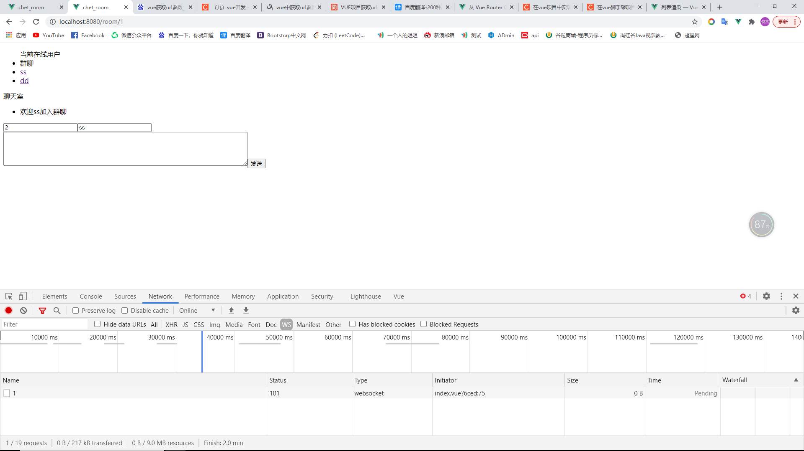

# 聊天室

## 前台

一，使用vuecl创建项目


二，下载axios并配置好

在`UI`在选择依赖，下载axiso

或者使用npm安装依赖

不过都需要在mian.js文件中配置axios

```
import axios from 'axios'
Vue.prototype.$ajax= axios
```

但是如果我使用api的方式就不需要配置这个

只需要用哪个api就在哪个地方调用就可以

```
import userApi from '@/api/user.js'
```

先在utils中配置request文件，设置全局axios的请求

再去创建api文件以及需要的api接口，在js接口文件中导入request文件

需要什么api方法就执行什么方法（这里遇到错错误，有种写法vue识别不了）

```
export default {
  login(data) { 
    return request({
      url: `/user/doLogin`,
      method: 'post',
      data
    })
  }
}
```

然后就在页面引入使用就可以了，还有一个跨域的问题

我只是关闭了withCredentials

```
const service = axios.create({
  withCredentials: false, 
})
```


三，随便访问时发现vue访问地址中出现#号

```
const router = createRouter({
  history: createWebHistory(),
  routes
})
createWebHashHistory ： 启动HASH
createWebHistory: 启动 history模式
```

或者

```
const router = new VueRouter({
  mode: 'history',
  routes
})
```


四，vue设置跨域

```
Access to XMLHttpRequest at 'http://localhost:8085/user/doLogin' from origin 'http://localhost:8080' has been blocked by CORS policy: Response to preflight request doesn't pass access control check: No 'Access-Control-Allow-Origin' header is present on the requested resource.
```

在springboot解决跨域问题

使用

```
@CrossOrigin
```


五，登录界面以及登录逻辑编写

直接调用后台，返回一个用户信息

需要在前台保存，以便整个项目的全局使用

在main.js中加入store，这样就可以全局调用store了

```typescript
import store from './store'
new Vue({
  store,
}).$mount('#app')	
```

在store配置

```typescript
export default new Vuex.Store({
  state: {
    userInfo: JSON.parse(sessionStorage.getItem("userInfo"))
  },
  mutations: {
    // 类似于set方法
    SET_USERINFO: (state,userInfo) =>{
      state.userInfo = userInfo
      sessionStorage.setItem("userInfo",JSON.stringify(userInfo))
    },
    REMOVE_USERINFO:(state) =>{
      state.userInfo = {}
      sessionStorage.setItem("userInfo",JSON.stringify(''))
    }
  },
  getter: {
    // 类似于get方法
    getUser: state =>{
      return state.userInfo
    }
  },
  modules: {
  }
})
```

然后就可以直接全局使用了

```
this.$store.getters.getUser.uid
```


## 异常

```
The remote endpoint was in state [TEXT_FULL_WRITING] which is an invalid state for called method
```

这个是多个线程共享session 报错

websocket推送数据的方法有：

    session.getBasicRemote().sendText(message);  //同步发送
    session.getAsyncRemote().sendText(message); //异步发送


也就是说我页面刷新后，又重新发出请求，但是session使用的是同一个，多个线程间报错

也许是前端保存session的方式不对

也许是后，都需要排查

我想，既然是多个线程争session，那么就控制访问

```
synchronized (session){
	session.getAsyncRemote().sendText(message);
}
```

我想着，只要不存在服务器session就可以了，只要刷新就要重新登录，但是这样太不现实了，刷新就没额，所以还是需要放在session中，那么就要从后台入手	

后台一开始想的是，在我要存放一个session信息的时候，如果之前有存过，那么就移除前面的，然后在添加新的

也不对

同步请求就没什么问题


## 后端

用ConcurrentHashMap存放session，防止并发访问问题

在线用户一直移除不了

在实现点击用户一对一聊天时，我通过获取url的参数来知道是我和谁去聊天，但是只会变动一次，因为页面只是请求了一次，点了之后无论我去点谁，都不会去切换用户

> 就如现在
>
> 我点了ss，能进去
>
> 但是再点其他的就不会动了



解决办法是对路由对象进行监听，如果url发生了改变，那么就改变我的聊天对象‘

```typescript
watch:{
    '$route' (){
    	this.ChatWith = this.$route.params.uid
    }
}
```


## 日志

登录-聊天实现（10天）

1对一聊天（2天）

反思

作为自己的第一个项目，很多地方都有不熟悉的地方，以前看视频的债还给了我，我应该强调动手能力，多去自己做，而不是看着视频cv